# I. 緣起目的

依新版 `m-skill-2tech-children-adv-game-dev` 美術性測試規格，重新整理本輪 rendered visual QA 報告。

本報告不再以「單張截圖 3 點」為單位，而是以「遊戲畫面」為最小審查單位：同一畫面先列出手機直向、桌機 `1024x768`、寬桌機 `1800x800` 三種截圖，再提出至少 10 個批評點，並依 `Must Fix`、`Should Fix`、`Accept` 分組。只有 `Must Fix` 與 `Should Fix` 進入修訂分析並建立 `問題#N`。

# II. 參考準備

- 截圖資料夾：`.codex/log/20260531-restart-qa/`
- Manifest：`.codex/log/20260531-restart-qa/visual-shot-manifest.json`
- 必測 viewport：
  - 手機直向 `390x844`
  - 桌機 `1024x768`
  - 寬桌機 `1800x800`
- Manifest 內本次採用截圖數：54。
- 本次遊戲畫面數：18。
- 最低批評點數：`18 * 10 = 180`。
- 本報告批評點數：`K001-K180`，共 180 點。
- Horizontal overflow：manifest 未回報。
- 美術來源：既有 repo PNG 資產；本輪未要求 GPT / GPT-5.5 重新生圖。

# III. 內容程序

## 遊戲畫面#1：公主房間

### (A) 現有截圖

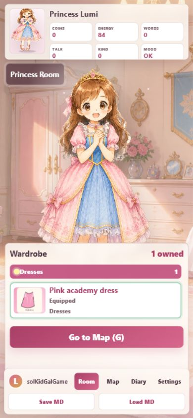

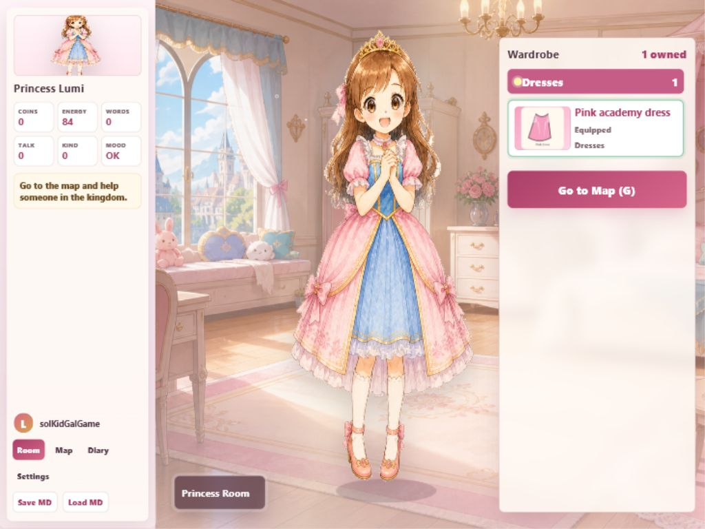

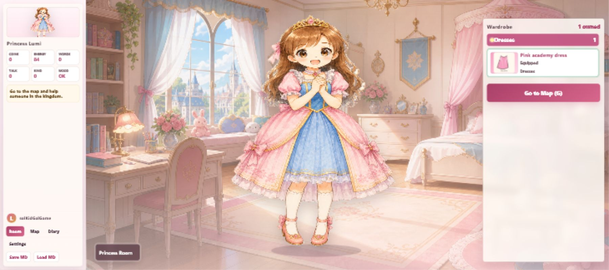

### (B) 檢討批評

- **Must Fix**
  - 無。
- **Should Fix**
  - 無。
- **Accept**
  - `K001` 第一眼是公主房間與生活基地，不像一般網站首頁。
  - `K002` 手機、桌機、寬桌機都保留角色與家具的主舞台感。
  - `K003` HUD 沒有壓住房間主視覺，兒童可理解目前所在位置。
  - `K004` 房間色調、角色與家具可接受，沒有明顯畫風斷裂。
  - `K005` 寬桌機沒有被拉成空洞橫幅，仍有完整場景構圖。
  - `K006` 手機直向沒有重要元素被裁掉或擠出畫面。
  - `K007` 出門與換裝語境能回到主循環，不像孤立頁面。
  - `K008` 角色比例在三種尺寸中維持穩定。
  - `K009` 文字與操作提示可讀，沒有橫向 overflow。
  - `K010` 可作為 Room / Wardrobe 後續擴充基準。

### (C) 修訂分析

無非 Accept 問題。

### (D) 畫面小結

- 建議接受問題：0 個
- 完成改善問題：0 個
- 尚待處理問題：0 個

## 遊戲畫面#2：大地圖

### (A) 現有截圖

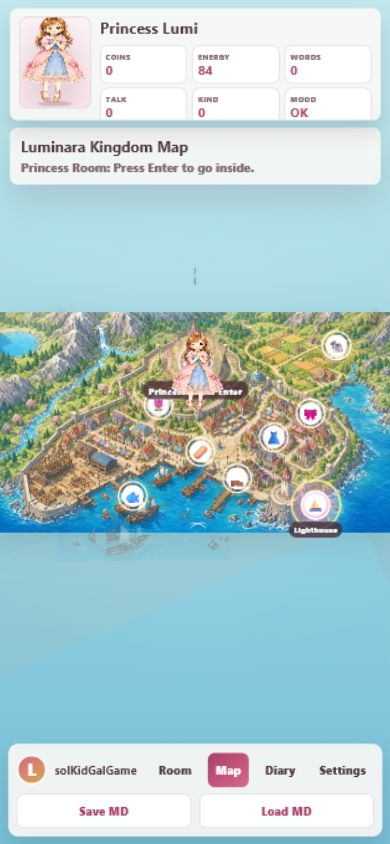

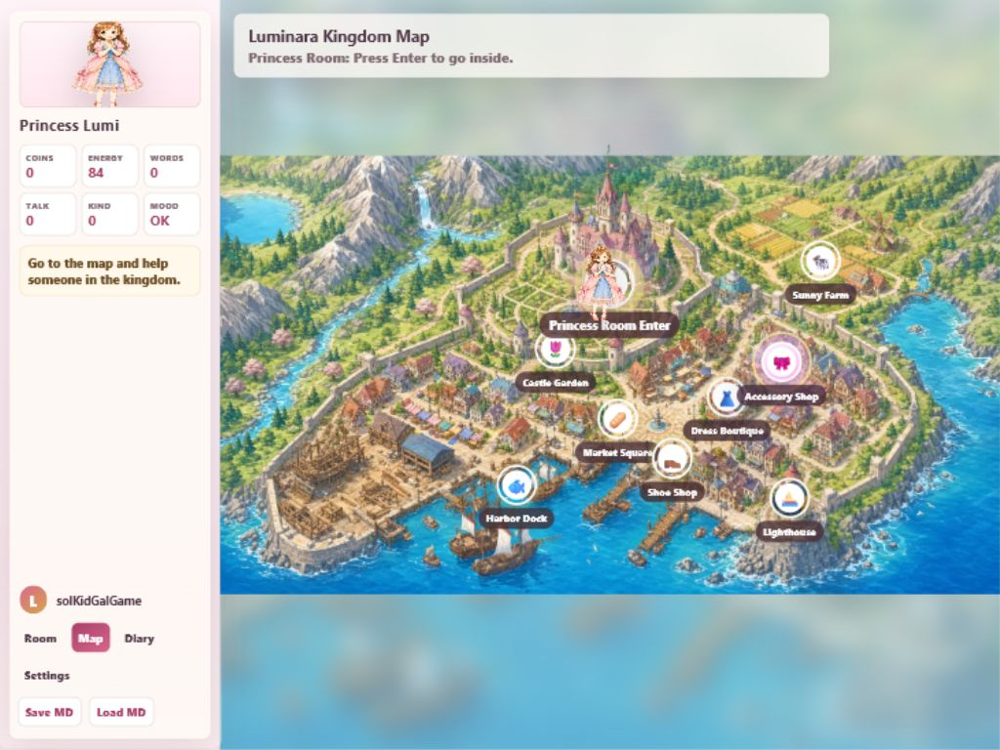

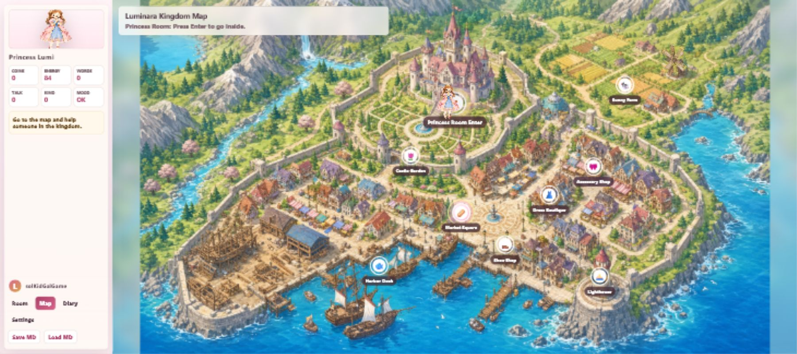

### (B) 檢討批評

- **Must Fix**
  - `K011` 先前幾何地圖 regression 會讓第一眼變成 placeholder diagram；目前截圖已還原為手繪地圖，需保留為已完成改善項。
- **Should Fix**
  - `K012` 手機直向仍是 landscape map plate 塞進 portrait stage，垂直方向有明顯空背景。
  - `K013` 手機第一眼焦點容易被空白區稀釋，地圖本體不如桌機完整。
- **Accept**
  - `K014` 桌機地圖已回到手繪 PNG，符合兒童 MAP ADV 方向。
  - `K015` 寬桌機能完整呈現地圖與地點分布。
  - `K016` 玩家 icon 與 hotspot 在桌機、寬桌機可辨識。
  - `K017` 地圖沒有 debug route 或網頁式節點清單感。
  - `K018` 地點 icon 與背景關係可接受。
  - `K019` 地圖生命感圖層沒有破壞主圖。
  - `K020` 目前可玩，但手機構圖不是美術完成狀態。

### (C) 修訂分析

**問題#1：幾何地圖 regression**

- 分類：Must Fix
- 影響尺寸：手機直向 / 桌機 `1024x768` / 寬桌機 `1800x800`
- 解決規劃：還原上一版既有手繪 `assets/kingdom-map.png`，並在 `index.html` 加 query string，避免快取繼續顯示幾何圖。
- 前後比較：

  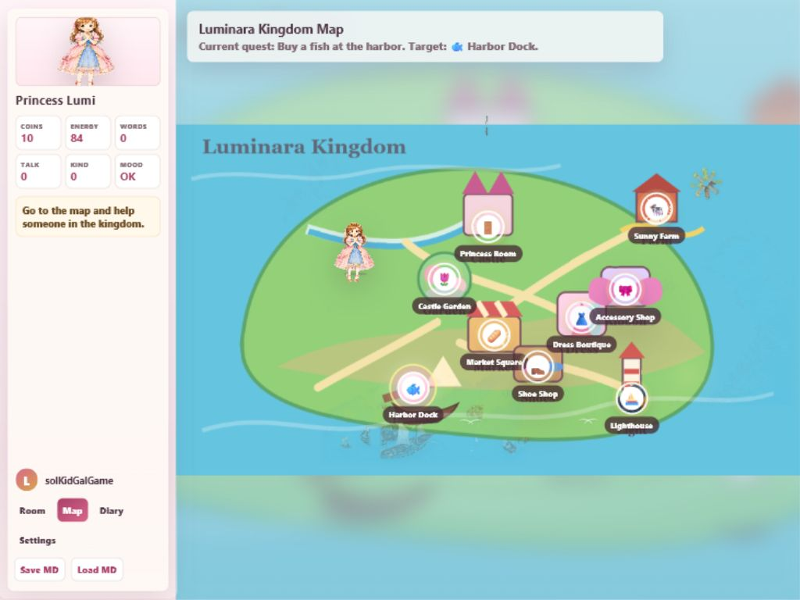

  
- 修訂結論：修訂完成。

**問題#2：手機直向大地圖構圖留白**

- 分類：Should Fix
- 影響尺寸：手機直向
- 解決規劃：已嘗試上對齊地圖與降低 mobile map stage 高度；判定條件是不能壓到 HUD、不能增加空白錯色區、不能造成 hotspot 錯位。
- 前後比較：

  

  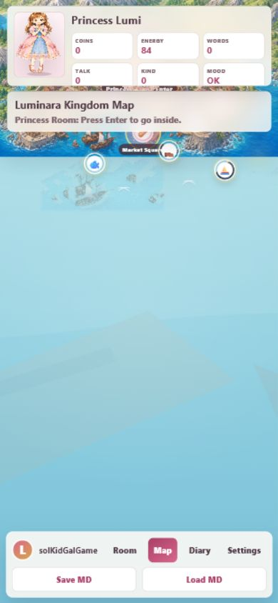

  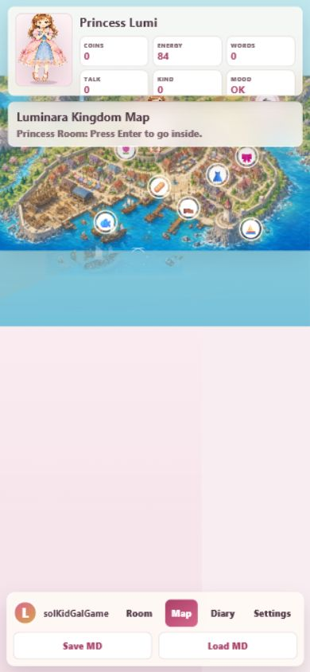
- 修訂結論：修訂失敗，已回退；需後續製作 portrait-native map plate 並重設座標。

### (D) 畫面小結

- 建議接受問題：0 個
- 完成改善問題：1 個
- 尚待處理問題：1 個

## 遊戲畫面#3：日記本

### (A) 現有截圖

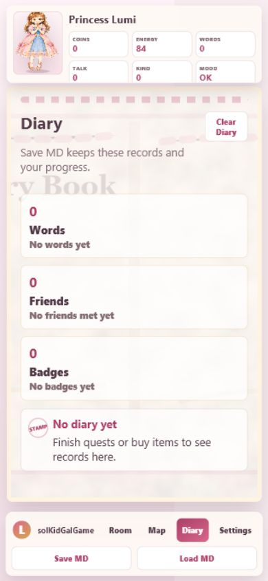

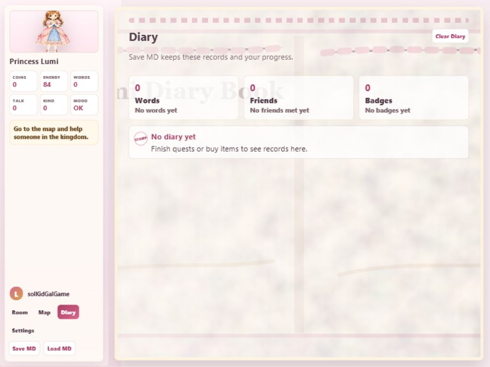

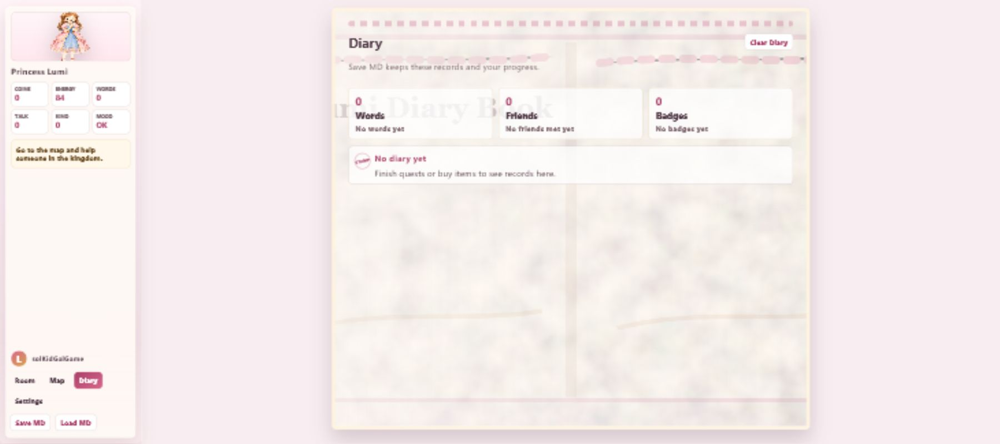

### (B) 檢討批評

- **Must Fix**
  - 無。
- **Should Fix**
  - 無。
- **Accept**
  - `K021` 日記本語意成立，不像後台資料列表。
  - `K022` 手機文字密度可讀，未見關鍵文字溢出。
  - `K023` 桌機尺寸保留遊戲紀錄感，沒有變成 dashboard。
  - `K024` 寬桌機沒有過度拉寬成空表格。
  - `K025` Diary 與任務、購買、學習事件的連結可理解。
  - `K026` 視覺層級比一般 modal 更接近日記 overlay。
  - `K027` 背景與面板沒有互相干擾。
  - `K028` 返回流程不突兀。
  - `K029` 沒有遮住或破壞主遊戲狀態。
  - `K030` 可作為系統功能不破壞沉浸感的合格畫面。

### (C) 修訂分析

無非 Accept 問題。

### (D) 畫面小結

- 建議接受問題：0 個
- 完成改善問題：0 個
- 尚待處理問題：0 個

## 遊戲畫面#4：設定

### (A) 現有截圖

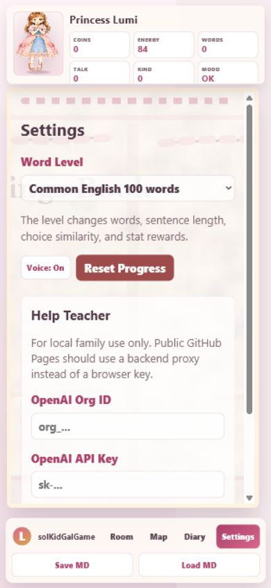

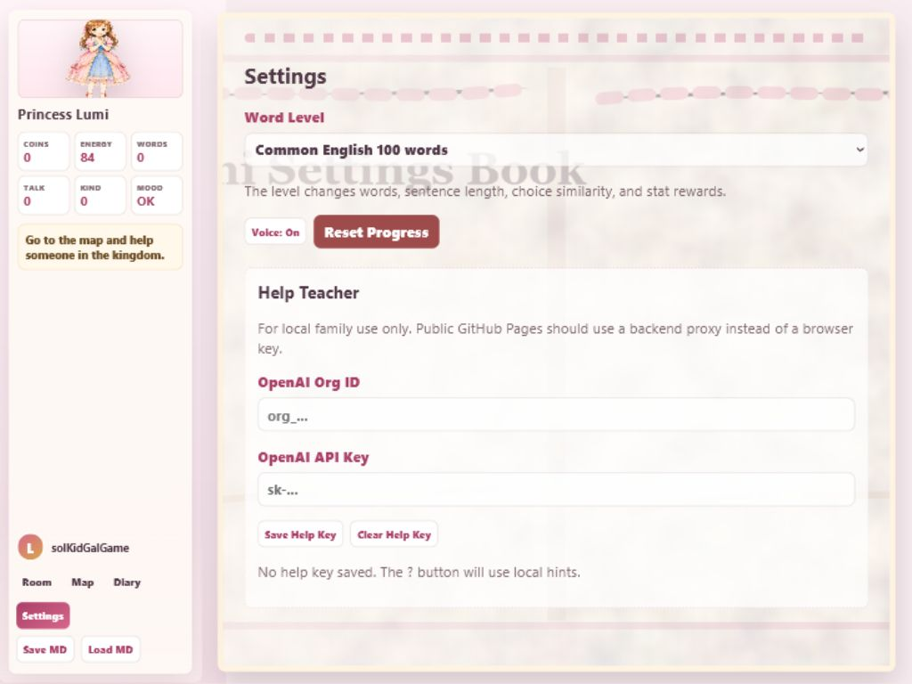

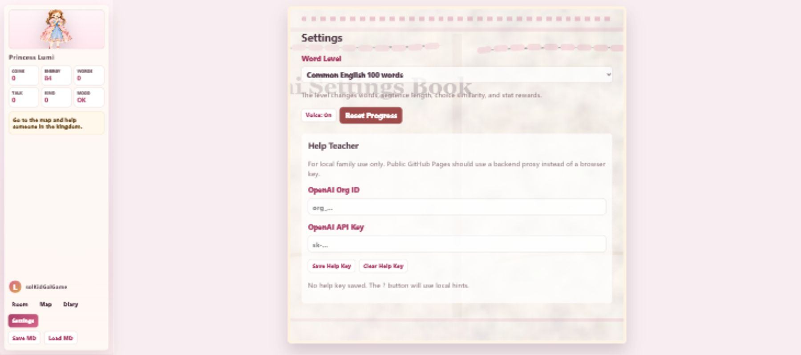

### (B) 檢討批評

- **Must Fix**
  - 無。
- **Should Fix**
  - 無。
- **Accept**
  - `K031` Settings 收在遊戲 overlay 中，未變成外部網站設定頁。
  - `K032` 手機直向控制項可讀，沒有橫向溢出。
  - `K033` 桌機尺寸欄位排列穩定。
  - `K034` 寬桌機沒有散成後台管理介面。
  - `K035` OpenAI Help 等系統設定沒有蓋過遊戲主體。
  - `K036` 返回與切換語意清楚。
  - `K037` 面板色彩與遊戲 UI 可接受。
  - `K038` 沒有普通表單主導整個畫面的突兀感。
  - `K039` 字體大小與行距對手機仍可讀。
  - `K040` 目前不需進入美術修訂。

### (C) 修訂分析

無非 Accept 問題。

### (D) 畫面小結

- 建議接受問題：0 個
- 完成改善問題：0 個
- 尚待處理問題：0 個

## 遊戲畫面#5：大地圖靠近農場

### (A) 現有截圖

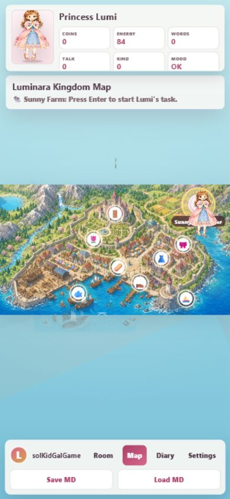

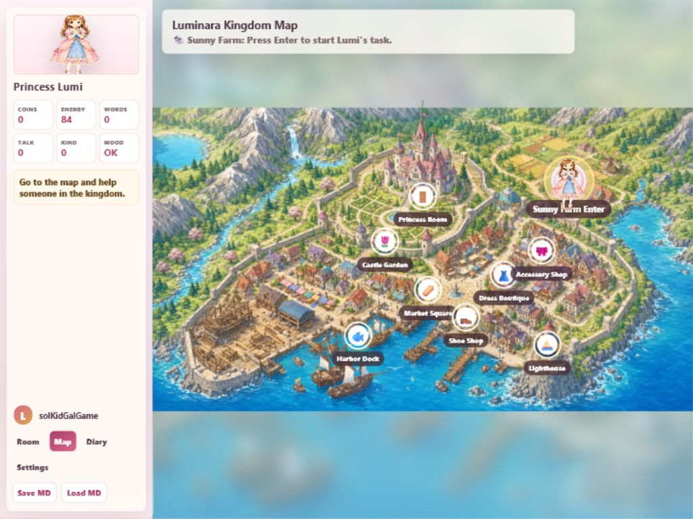

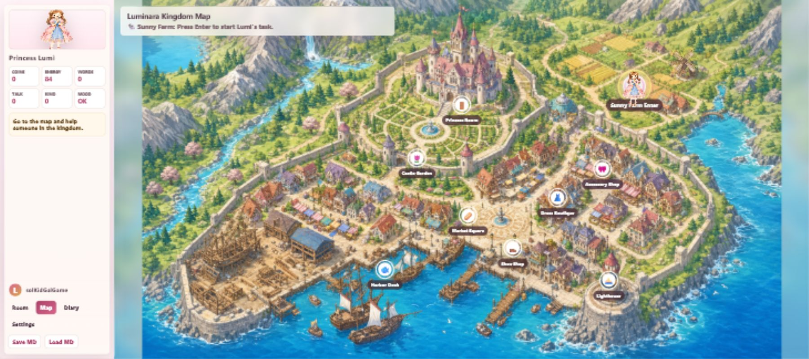

### (B) 檢討批評

- **Must Fix**
  - `K041` 先前靠近 hotspot 後 Enter / Space 進入不穩，會讓焦點提示看得到但操作無效；目前已修正。
- **Should Fix**
  - 無。
- **Accept**
  - `K042` 靠近農場後可辨識目前焦點。
  - `K043` 手機仍受大地圖 portrait 留白影響，但 hotspot 狀態本身可讀。
  - `K044` 桌機地圖互動提示不像網頁連結清單。
  - `K045` 寬桌機下玩家位置、農場與地點關係清楚。
  - `K046` 提示卡沒有過度遮擋地圖。
  - `K047` hotspot icon 與手繪地圖整合可接受。
  - `K048` focus 狀態對兒童玩家足夠明確。
  - `K049` 不會誤導成無法互動的裝飾圖。
  - `K050` 可用於驗證地圖探索規則一致性。

### (C) 修訂分析

**問題#3：hotspot 焦點提示與 Enter 進入不一致**

- 分類：Must Fix
- 影響尺寸：手機直向 / 桌機 `1024x768` / 寬桌機 `1800x800`
- 解決規劃：讓 nearby card 顯示狀態與鍵盤 Enter / Space fallback 一致，避免玩家靠近地點後看得到提示卻進不去。
- 前後比較：

  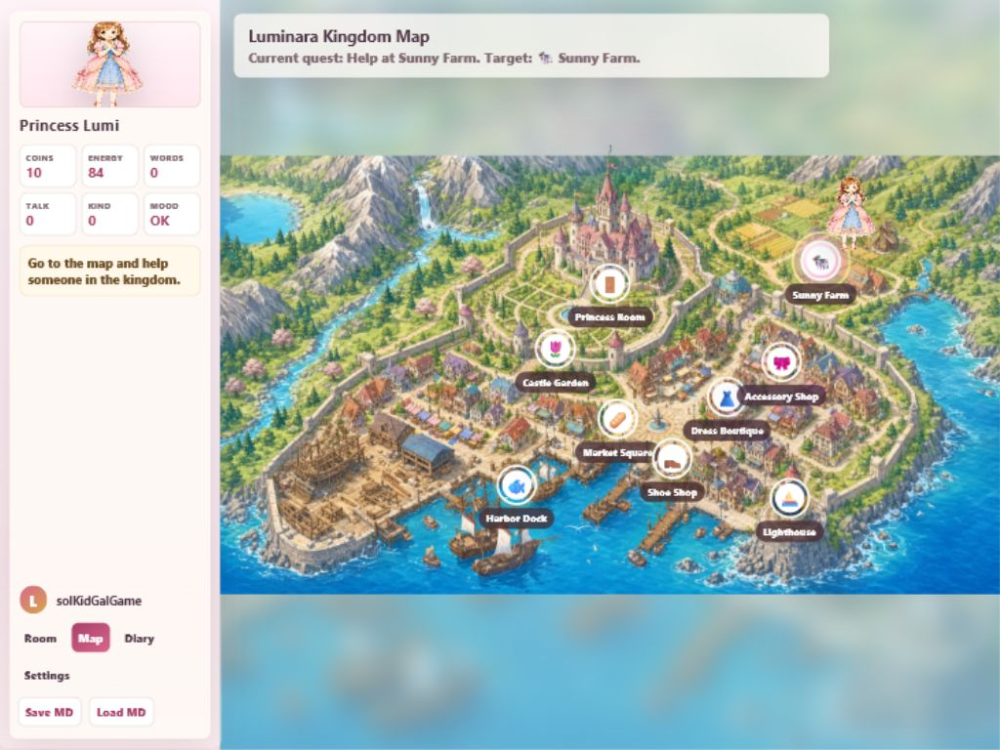

  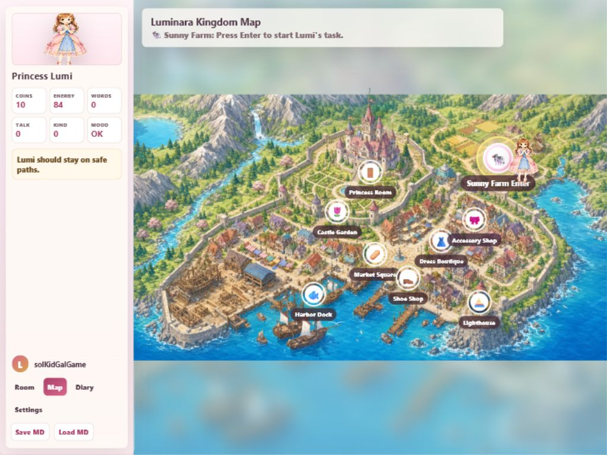

  
- 修訂結論：修訂完成。

### (D) 畫面小結

- 建議接受問題：0 個
- 完成改善問題：1 個
- 尚待處理問題：0 個

## 遊戲畫面#6：花園任務

### (A) 現有截圖

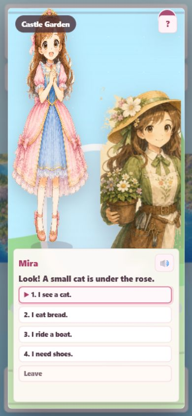

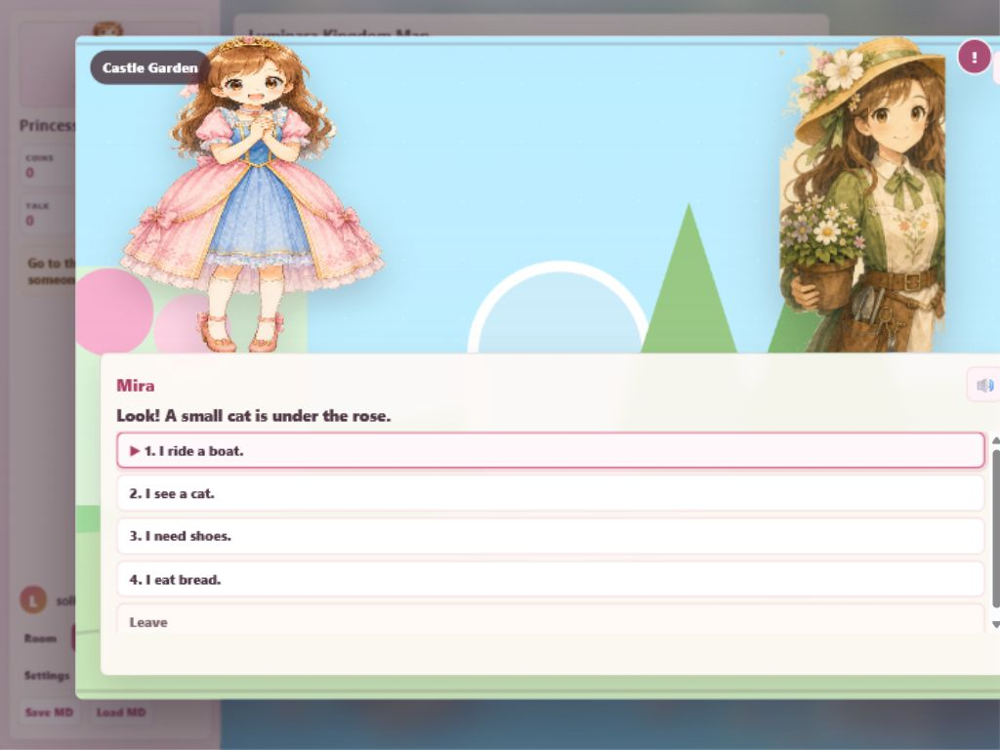

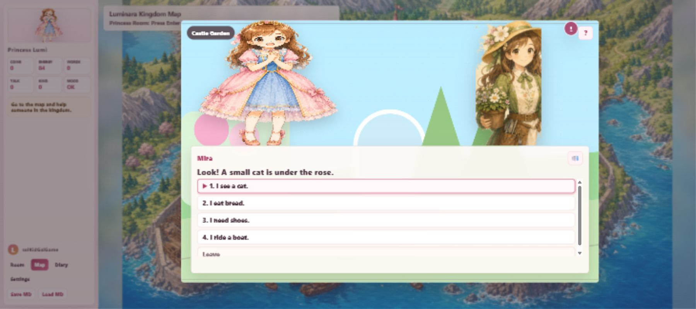

### (B) 檢討批評

- **Must Fix**
  - 無。
- **Should Fix**
  - 無。
- **Accept**
  - `K051` 花園背景、角色與對話框形成 ADV 場景。
  - `K052` 手機選項可見，沒有被底部 UI 切掉。
  - `K053` 桌機尺寸角色比例自然。
  - `K054` 寬桌機對話框沒有吃掉整個舞台。
  - `K055` 四個選項與 Leave 語意清楚。
  - `K056` 場景不像純問答網站。
  - `K057` 背景與題目語境一致。
  - `K058` 角色沒有明顯髒邊或裁切。
  - `K059` 手機可完成答題流程。
  - `K060` 不需本輪美術修訂。

### (C) 修訂分析

無非 Accept 問題。

### (D) 畫面小結

- 建議接受問題：0 個
- 完成改善問題：0 個
- 尚待處理問題：0 個

## 遊戲畫面#7：市場 / 麵包店任務

### (A) 現有截圖

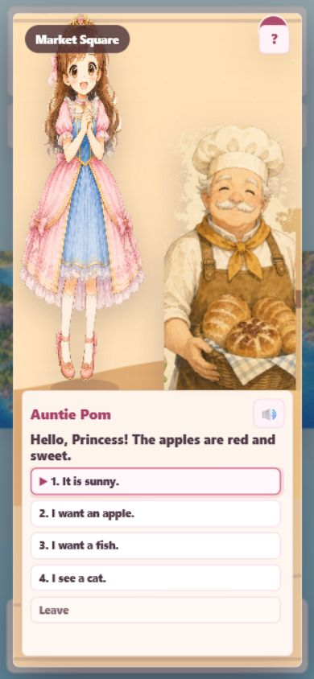

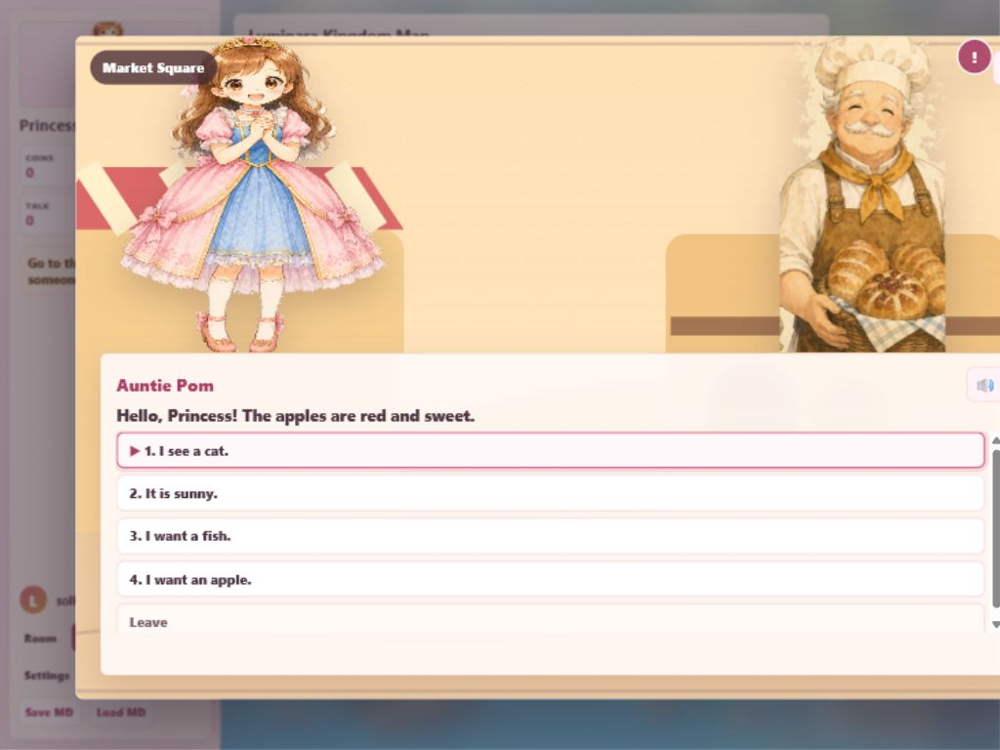

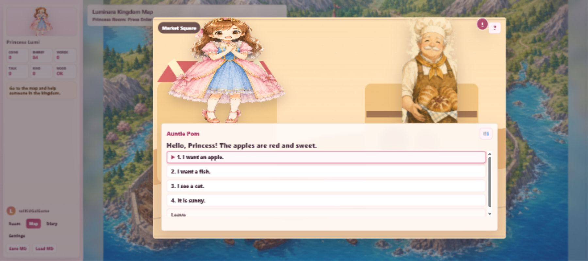

### (B) 檢討批評

- **Must Fix**
  - 無。
- **Should Fix**
  - 無。
- **Accept**
  - `K061` 市場 / 麵包店語境與 `Auntie Pom` 任務吻合。
  - `K062` 手機畫面能看出是在任務對話，不是單純選擇題。
  - `K063` 桌機選項和對話框比例合適。
  - `K064` 寬桌機沒有變成空洞橫向背景。
  - `K065` 四個選項短，兒童容易閱讀。
  - `K066` Leave 指令可辨識。
  - `K067` 角色與 UI 沒有互相遮臉或遮文字。
  - `K068` 場景板雖偏靜態，但不阻斷遊戲感。
  - `K069` 色調與其他任務畫面一致。
  - `K070` 不需本輪修訂。

### (C) 修訂分析

無非 Accept 問題。

### (D) 畫面小結

- 建議接受問題：0 個
- 完成改善問題：0 個
- 尚待處理問題：0 個

## 遊戲畫面#8：港口任務

### (A) 現有截圖

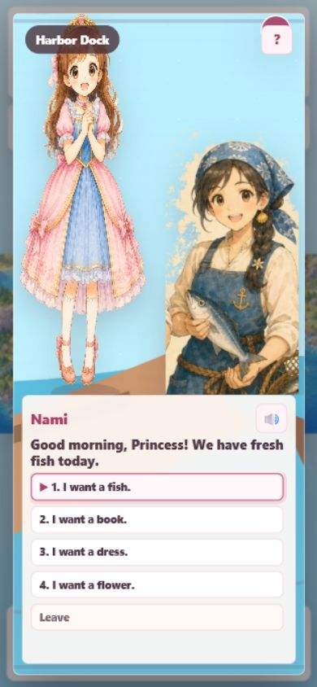

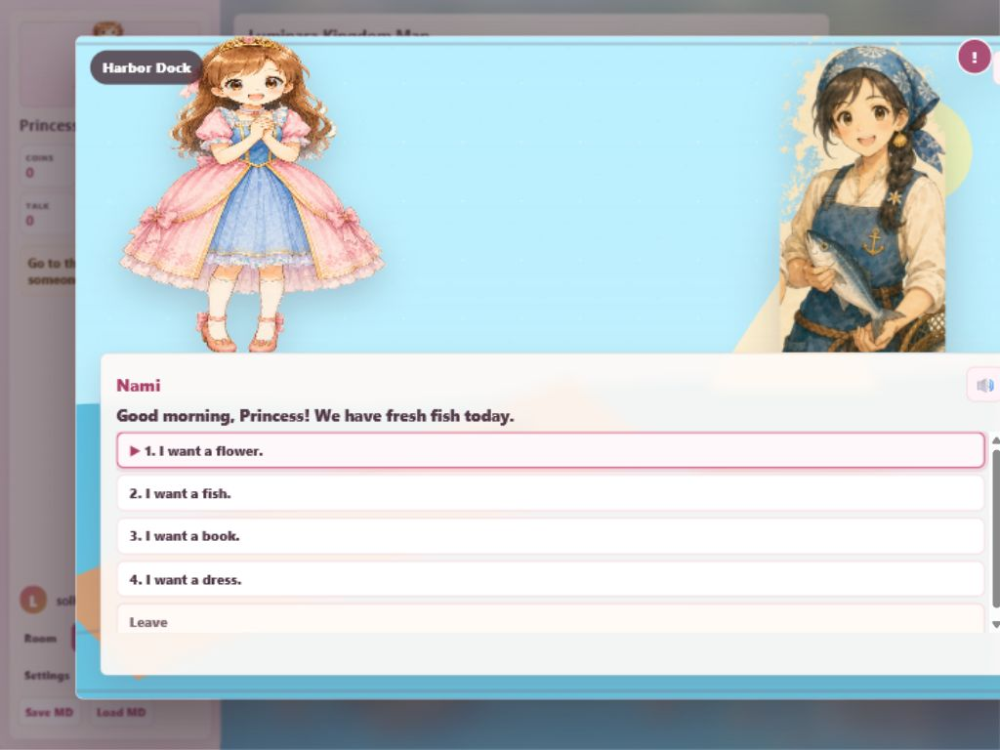

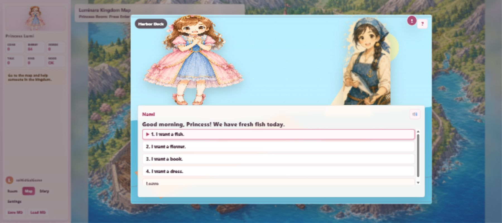

### (B) 檢討批評

- **Must Fix**
  - 無。
- **Should Fix**
  - 無。
- **Accept**
  - `K071` 港口背景支撐買魚任務。
  - `K072` 手機上對話框與選項仍可操作。
  - `K073` 桌機角色與場景比例可接受。
  - `K074` 寬桌機下背景不搶走操作焦點。
  - `K075` 選項不過長，兒童可快速判斷。
  - `K076` UI 不像普通表單。
  - `K077` 角色沒有明顯漂浮或髒邊。
  - `K078` 場景與其他任務畫面一致。
  - `K079` Leave / Back 流程可理解。
  - `K080` 不需本輪美術修訂。

### (C) 修訂分析

無非 Accept 問題。

### (D) 畫面小結

- 建議接受問題：0 個
- 完成改善問題：0 個
- 尚待處理問題：0 個

## 遊戲畫面#9：服裝店任務

### (A) 現有截圖

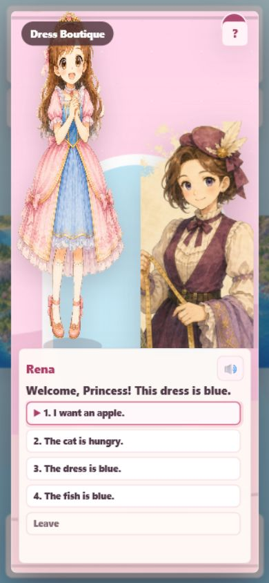

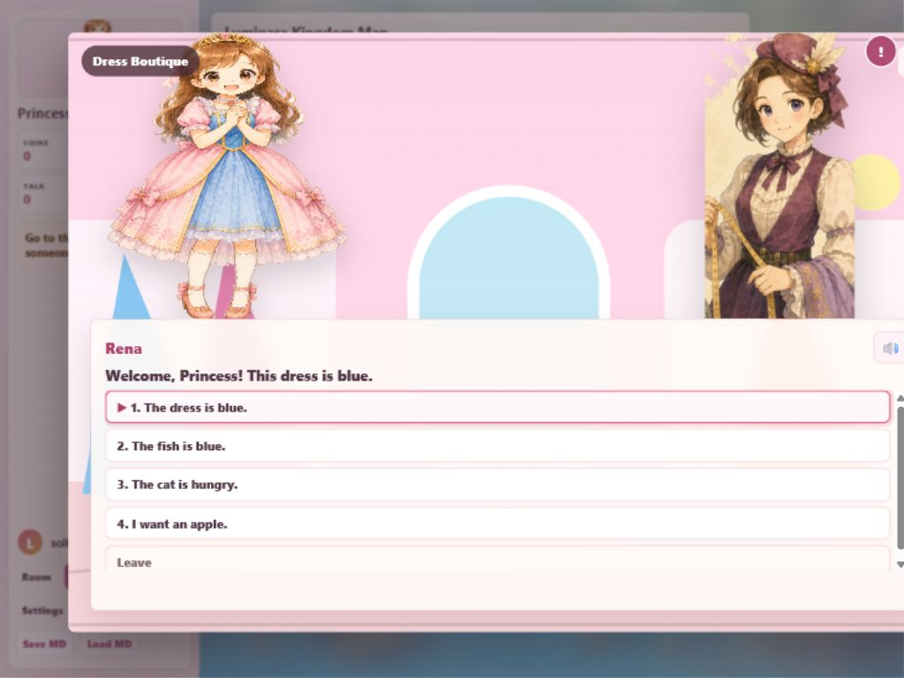

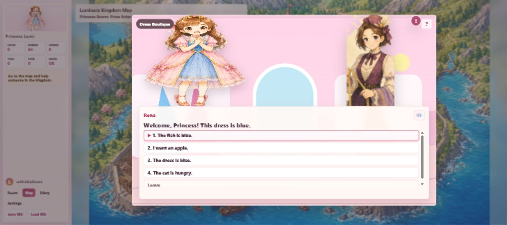

### (B) 檢討批評

- **Must Fix**
  - 無。
- **Should Fix**
  - 無。
- **Accept**
  - `K081` 服裝店任務與後續 shop loop 一致。
  - `K082` 手機選項可讀，沒有被底部遮住。
  - `K083` 桌機畫面有 ADV 對話感。
  - `K084` 寬桌機沒有過度拉散 UI。
  - `K085` 角色與背景層級自然。
  - `K086` 題目與藍色洋裝語境清楚。
  - `K087` 選項短且低挫折。
  - `K088` 沒有 dashboard 或表單感。
  - `K089` 圖像與 shop 商品方向銜接合理。
  - `K090` 不需本輪修訂。

### (C) 修訂分析

無非 Accept 問題。

### (D) 畫面小結

- 建議接受問題：0 個
- 完成改善問題：0 個
- 尚待處理問題：0 個

## 遊戲畫面#10：鞋店任務

### (A) 現有截圖

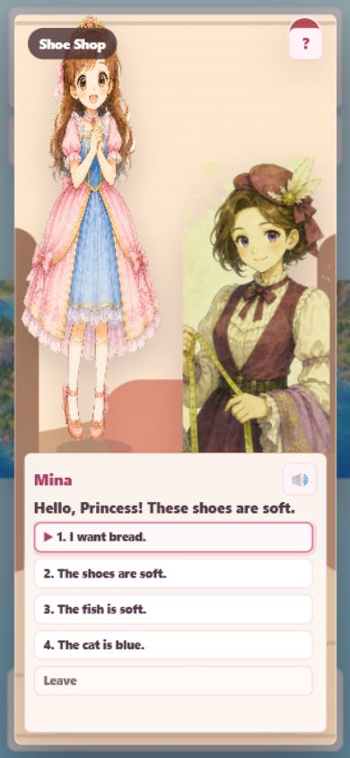

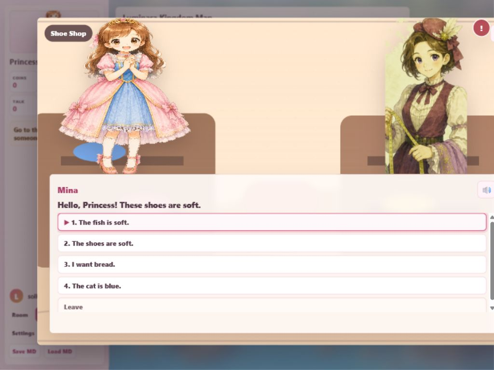

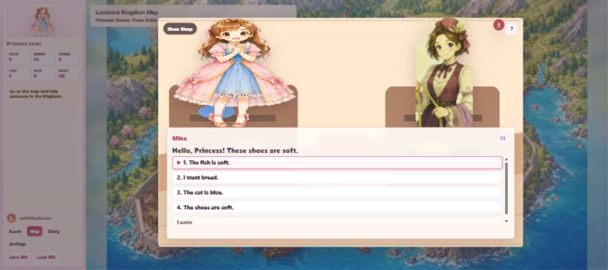

### (B) 檢討批評

- **Must Fix**
  - 無。
- **Should Fix**
  - 無。
- **Accept**
  - `K091` 鞋店畫面主題清楚。
  - `K092` 手機上任務答案可讀。
  - `K093` 桌機對話框不壓迫角色。
  - `K094` 寬桌機仍維持焦點。
  - `K095` 選項語句短且符合學習目標。
  - `K096` 店內語境和商品類型一致。
  - `K097` 角色比例可接受。
  - `K098` 沒有明顯裁切或遮擋。
  - `K099` 操作規則與其他任務一致。
  - `K100` 不需本輪修訂。

### (C) 修訂分析

無非 Accept 問題。

### (D) 畫面小結

- 建議接受問題：0 個
- 完成改善問題：0 個
- 尚待處理問題：0 個

## 遊戲畫面#11：飾品店任務

### (A) 現有截圖

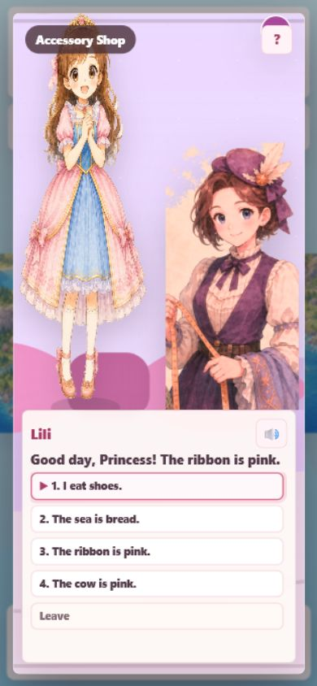

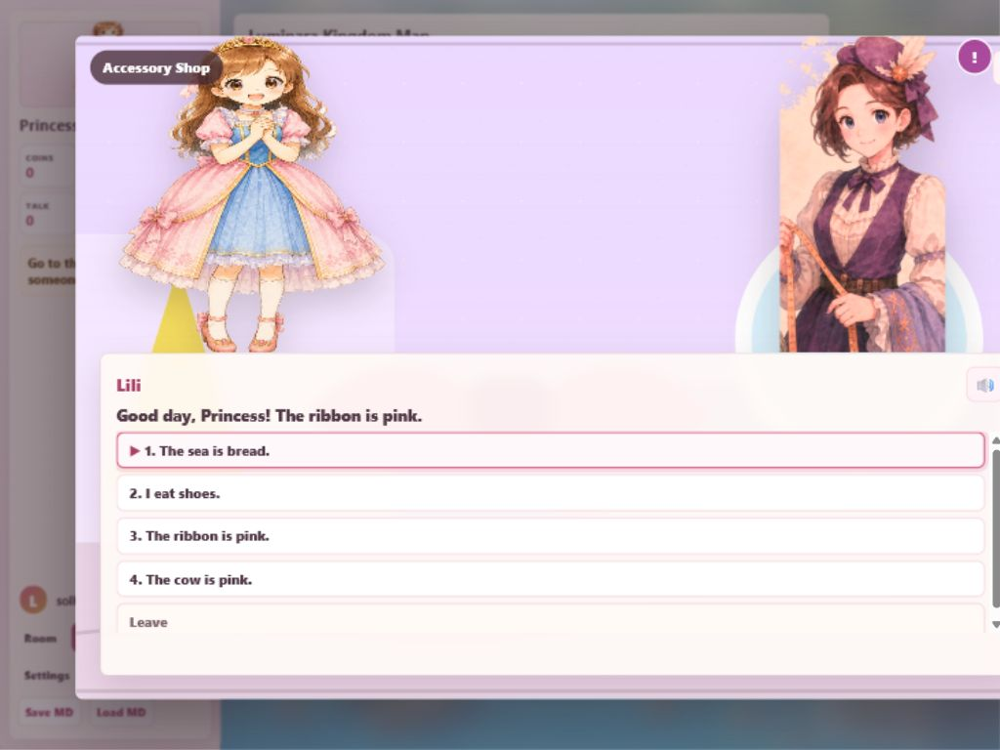

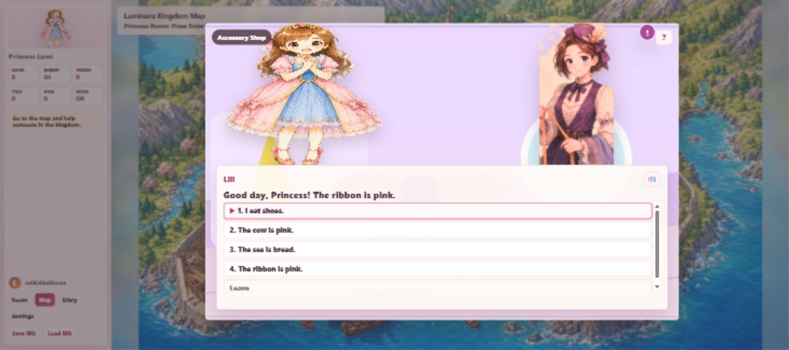

### (B) 檢討批評

- **Must Fix**
  - 無。
- **Should Fix**
  - 無。
- **Accept**
  - `K101` 飾品店任務符合 party ribbon 語境。
  - `K102` 手機對話框與選項可讀。
  - `K103` 桌機畫面沒有表單感。
  - `K104` 寬桌機畫面仍像 ADV。
  - `K105` 背景、角色與 UI 層級清楚。
  - `K106` 選項短且低挫折。
  - `K107` Leave 指令自然。
  - `K108` 沒有素材來源誤報問題。
  - `K109` 不影響後續 shop reward 判斷。
  - `K110` 不需本輪修訂。

### (C) 修訂分析

無非 Accept 問題。

### (D) 畫面小結

- 建議接受問題：0 個
- 完成改善問題：0 個
- 尚待處理問題：0 個

## 遊戲畫面#12：農場任務

### (A) 現有截圖

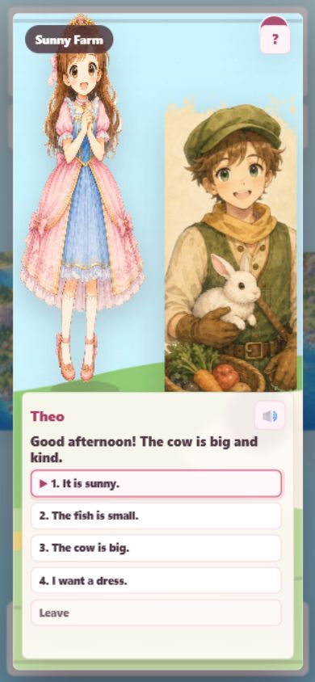

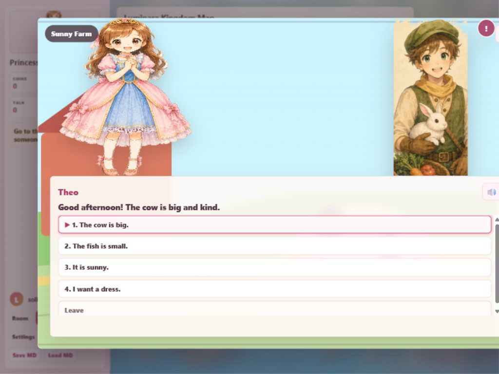

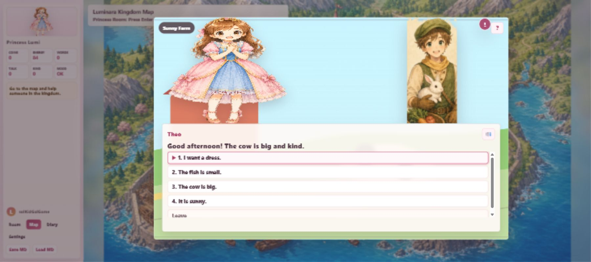

### (B) 檢討批評

- **Must Fix**
  - 無。
- **Should Fix**
  - 無。
- **Accept**
  - `K111` 農場背景與 cow / farm 任務一致。
  - `K112` 手機畫面可完成答題。
  - `K113` 桌機角色和對話框比例自然。
  - `K114` 寬桌機背景沒有讓操作焦點消失。
  - `K115` 選項簡短且兒童可理解。
  - `K116` 場景不像一般 quiz page。
  - `K117` 沒有重要角色被切掉。
  - `K118` UI 與其他任務一致。
  - `K119` 色彩與兒童向風格可接受。
  - `K120` 不需本輪修訂。

### (C) 修訂分析

無非 Accept 問題。

### (D) 畫面小結

- 建議接受問題：0 個
- 完成改善問題：0 個
- 尚待處理問題：0 個

## 遊戲畫面#13：燈塔任務

### (A) 現有截圖

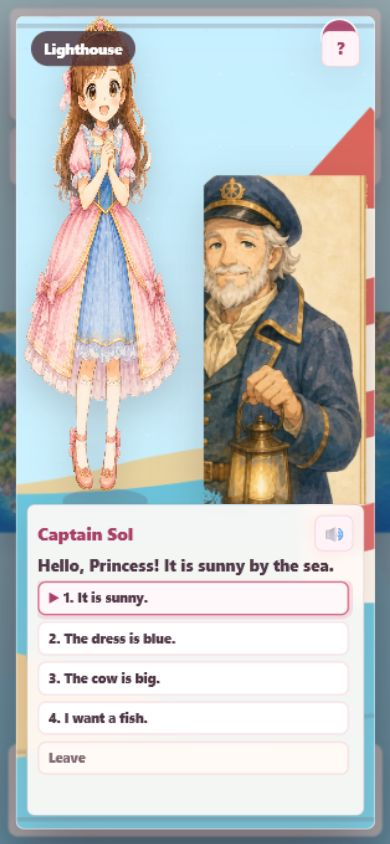

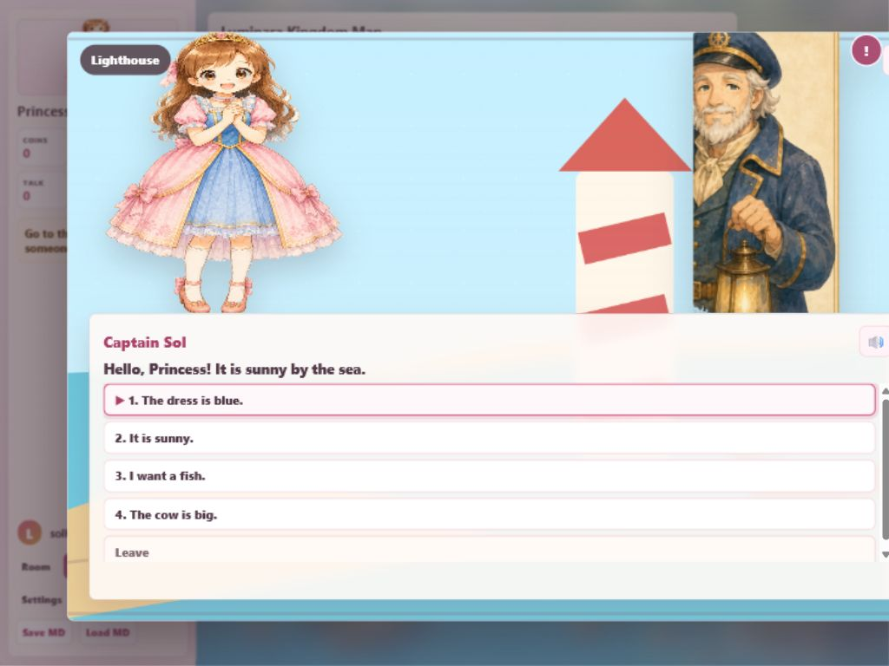

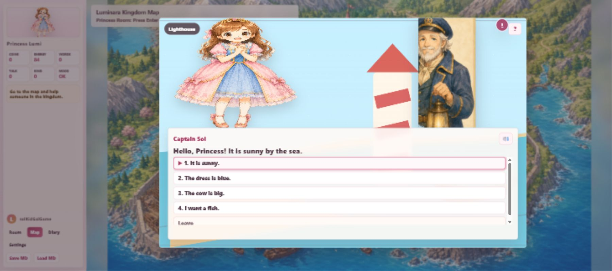

### (B) 檢討批評

- **Must Fix**
  - 無。
- **Should Fix**
  - 無。
- **Accept**
  - `K121` 燈塔場景辨識清楚。
  - `K122` 手機選項與對話框可讀。
  - `K123` 桌機畫面有穩定焦點。
  - `K124` 寬桌機沒有過度空曠。
  - `K125` sea weather 任務與背景一致。
  - `K126` 對話框不過度遮擋舞台。
  - `K127` 操作提示與 Leave 清楚。
  - `K128` 角色、背景、UI 畫風可接受。
  - `K129` 不像 web modal 疊素材。
  - `K130` 不需本輪修訂。

### (C) 修訂分析

無非 Accept 問題。

### (D) 畫面小結

- 建議接受問題：0 個
- 完成改善問題：0 個
- 尚待處理問題：0 個

## 遊戲畫面#14：市場 / 麵包店商店

### (A) 現有截圖

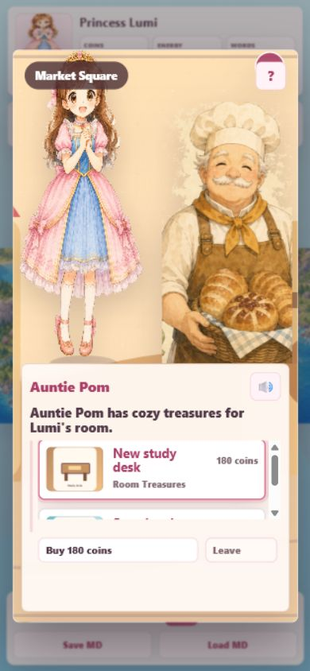

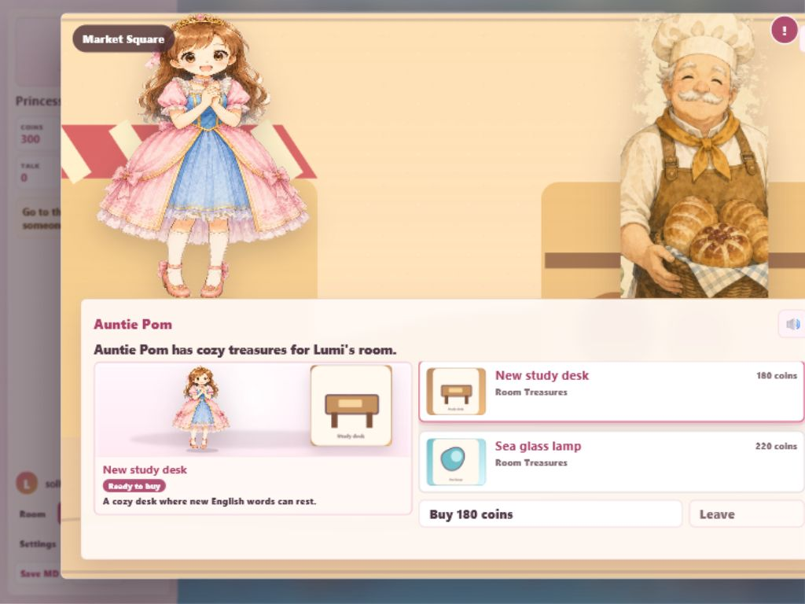

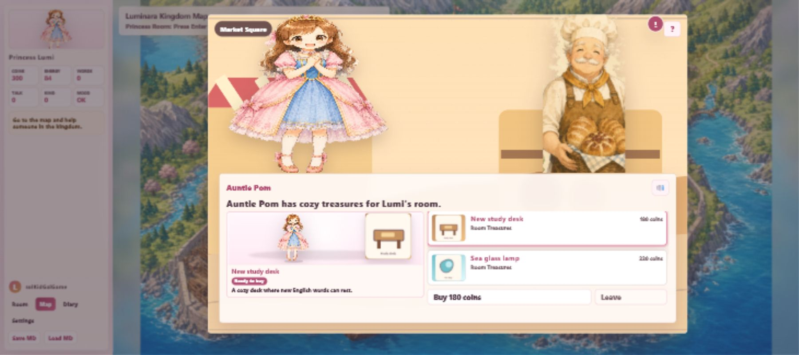

### (B) 檢討批評

- **Must Fix**
  - `K131` 先前商品 preview 顯示 `Need 70 more coins`，但指令仍顯示 `Buy 180 coins`，視覺命令互相矛盾；目前已修正。
- **Should Fix**
  - `K132` 市場 room item 的獎勵演出仍偏功能性，後續可更像「買了房間會變可愛」。
- **Accept**
  - `K133` 手機商店不是 grid 表單。
  - `K134` 桌機價格、商品與指令可讀。
  - `K135` 寬桌機沒有變成資料表。
  - `K136` 商品預覽有實際 PNG，不是色塊。
  - `K137` coins 不足狀態修正後語意一致。
  - `K138` 店員 / 商店場景仍在 ADV 語境中。
  - `K139` Leave 指令清楚。
  - `K140` 可用於主循環 Shop reward 驗證。

### (C) 修訂分析

**問題#4：商店金額不足文案與購買指令矛盾**

- 分類：Must Fix
- 影響尺寸：手機直向 / 桌機 `1024x768` / 寬桌機 `1800x800`
- 解決規劃：無法購買時，指令改顯示 `Need X more coins`，與 preview 狀態一致。
- 前後比較：

  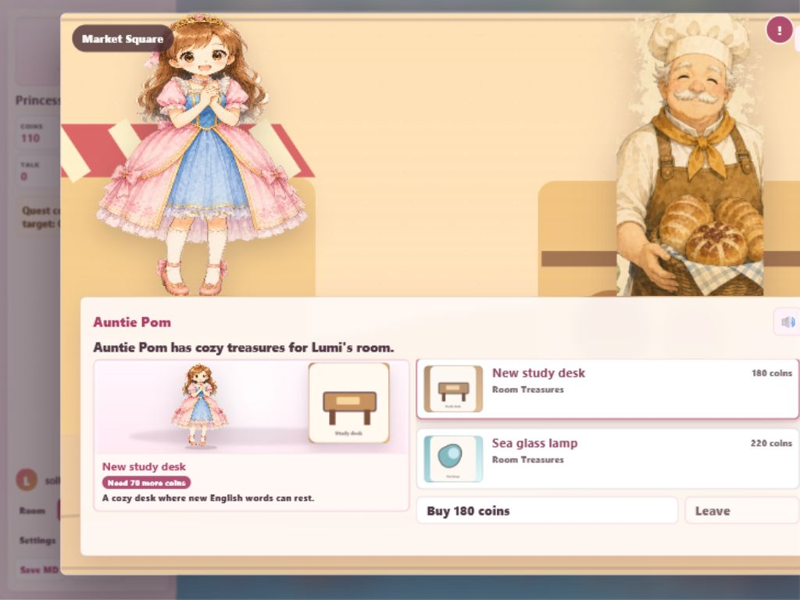

  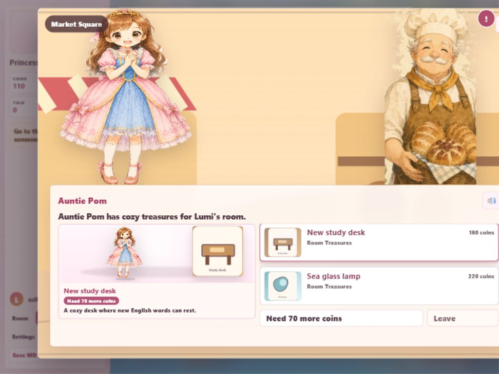
- 修訂結論：修訂完成。

**問題#5：商店獎勵演出與商品吸引力不足**

- 分類：Should Fix
- 影響尺寸：手機直向 / 桌機 `1024x768` / 寬桌機 `1800x800`
- 解決規劃：後續應補強商品想像力、試穿變化、購買動畫與角色穿戴效果；本輪不做高 blast-radius 美術重作。
- 前後比較：

  

  
- 修訂結論：尚待處理。

### (D) 畫面小結

- 建議接受問題：0 個
- 完成改善問題：1 個
- 尚待處理問題：1 個

## 遊戲畫面#15：服裝店商店

### (A) 現有截圖

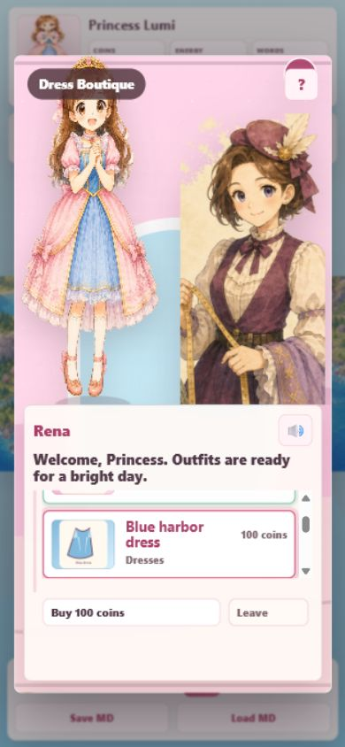

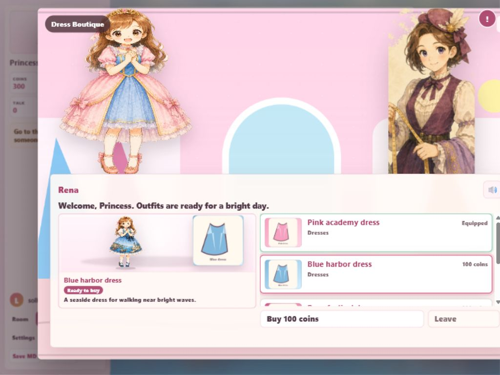

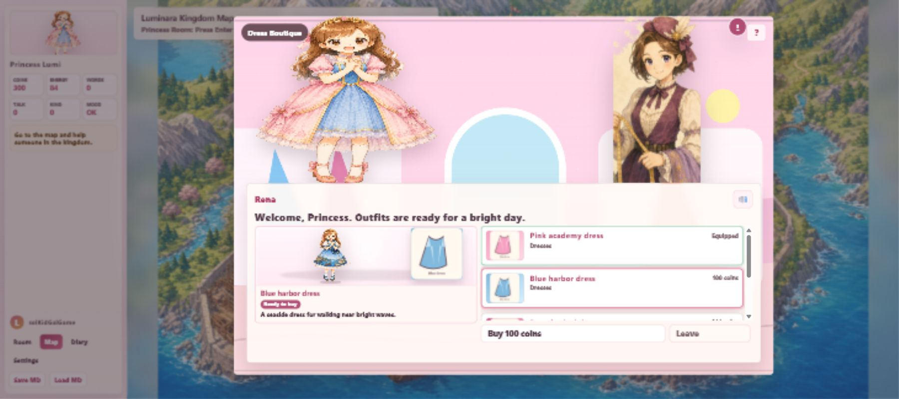

### (B) 檢討批評

- **Must Fix**
  - 無。
- **Should Fix**
  - `K141` 服裝試穿結果還可以更明顯，讓兒童更直覺感到「買了會變漂亮」。
  - `K142` 購買成功的舞台演出與情緒回饋仍可更強。
- **Accept**
  - `K143` 手機商品預覽可辨識。
  - `K144` 桌機狀態文字與價格清楚。
  - `K145` 寬桌機仍保持商店場景而非表格。
  - `K146` 商品使用實際 PNG。
  - `K147` Owned / Equipped / Buy 狀態可讀。
  - `K148` 公主試穿方向成立。
  - `K149` Leave 指令清楚。
  - `K150` 可玩性不受阻斷。

### (C) 修訂分析

沿用 [問題#5](#問題5)：商店獎勵演出與商品吸引力不足。

### (D) 畫面小結

- 建議接受問題：0 個
- 完成改善問題：0 個
- 尚待處理問題：1 個

## 遊戲畫面#16：鞋店商店

### (A) 現有截圖

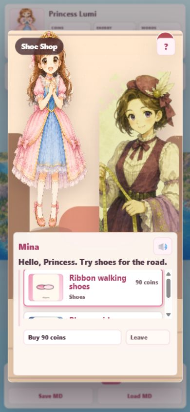

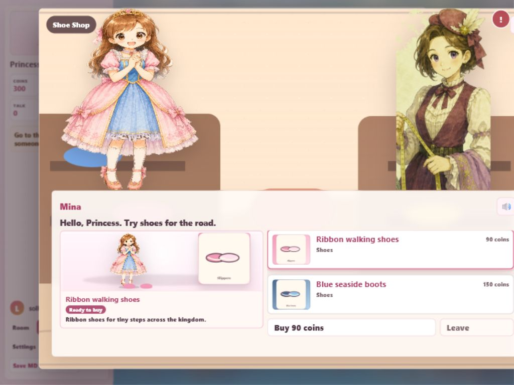

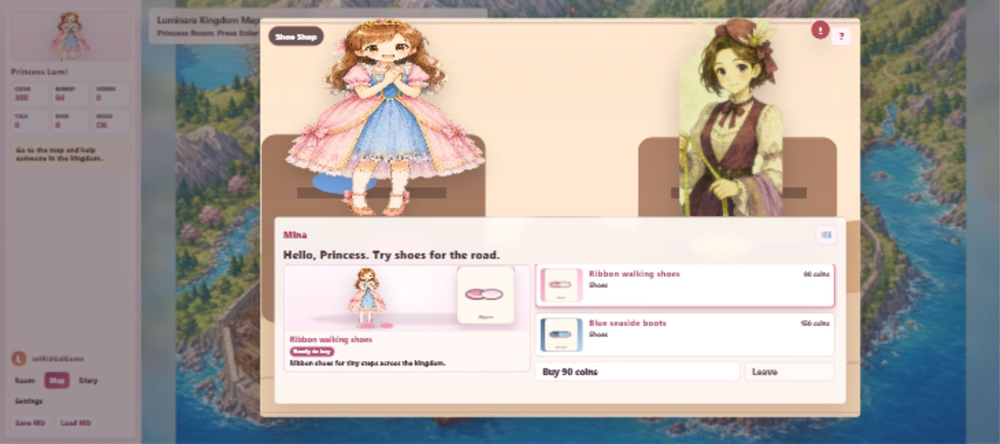

### (B) 檢討批評

- **Must Fix**
  - 無。
- **Should Fix**
  - `K151` 鞋子試穿的角色變化可更直觀。
  - `K152` 鞋店購買後回饋可更像獎勵事件。
- **Accept**
  - `K153` 手機價格與指令可讀。
  - `K154` 桌機商品分類清楚。
  - `K155` 寬桌機畫面沒有資料列感。
  - `K156` 商品圖不是 placeholder 色塊。
  - `K157` Buy / Need / Leave 語意清楚。
  - `K158` 商店和任務主循環銜接合理。
  - `K159` UI 沒有壓住角色。
  - `K160` 可完成購買與離開流程。

### (C) 修訂分析

沿用 [問題#5](#問題5)：商店獎勵演出與商品吸引力不足。

### (D) 畫面小結

- 建議接受問題：0 個
- 完成改善問題：0 個
- 尚待處理問題：1 個

## 遊戲畫面#17：飾品店商店

### (A) 現有截圖

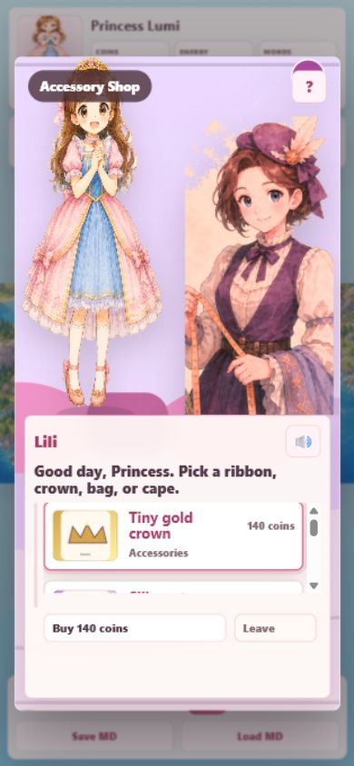

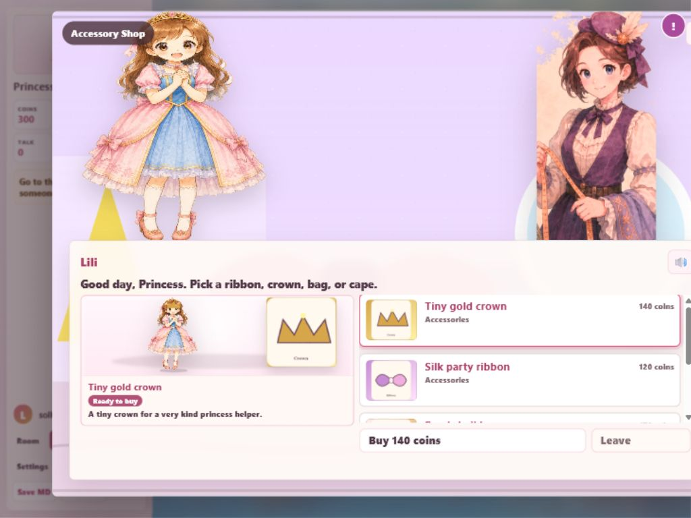

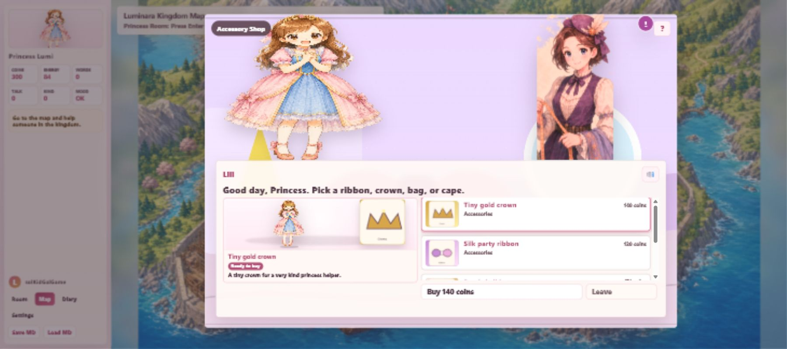

### (B) 檢討批評

- **Must Fix**
  - 無。
- **Should Fix**
  - `K161` 飾品穿戴效果可更直觀，讓兒童理解買了會變可愛。
  - `K162` 飾品商品的情緒價值可再加強。
- **Accept**
  - `K163` 手機商店可讀且可操作。
  - `K164` 桌機商品、價格與狀態清楚。
  - `K165` 寬桌機未變成後台商品列表。
  - `K166` 商品圖使用實際 PNG。
  - `K167` Owned / Equipped 狀態語意可理解。
  - `K168` Leave 指令位置清楚。
  - `K169` 店鋪場景仍屬 ADV 語境。
  - `K170` 可玩性不受阻斷。

### (C) 修訂分析

沿用 [問題#5](#問題5)：商店獎勵演出與商品吸引力不足。

### (D) 畫面小結

- 建議接受問題：0 個
- 完成改善問題：0 個
- 尚待處理問題：1 個

## 遊戲畫面#18：燈塔提示互動

### (A) 現有截圖

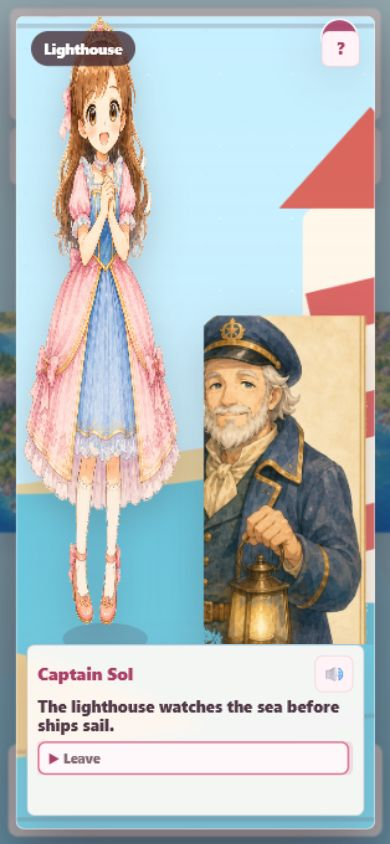

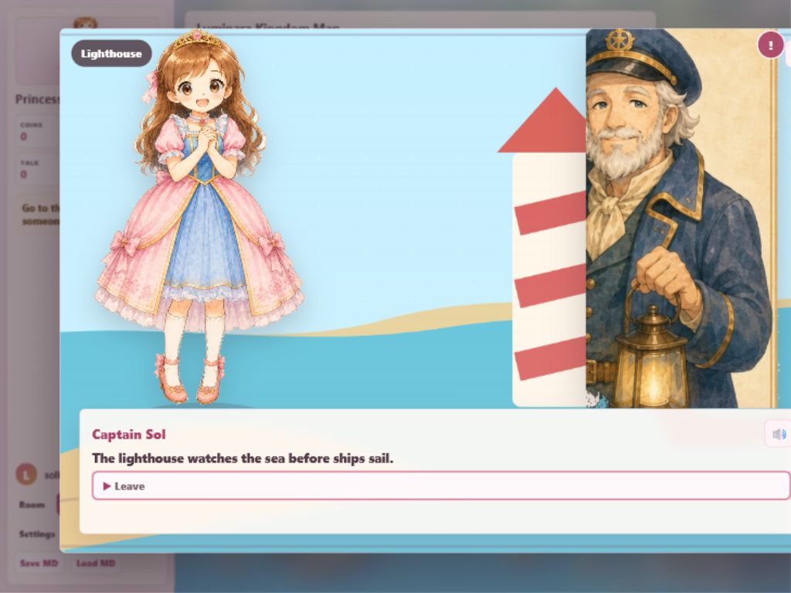

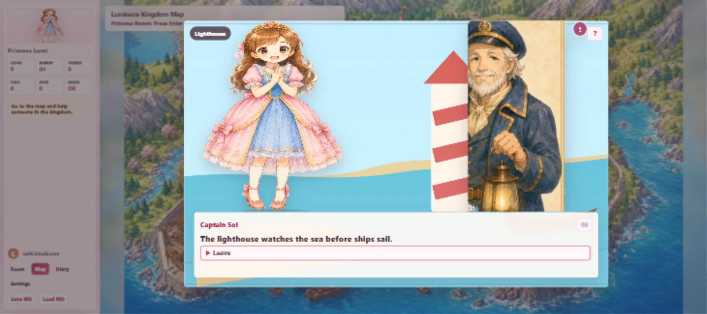

### (B) 檢討批評

- **Must Fix**
  - 無。
- **Should Fix**
  - 無。
- **Accept**
  - `K171` 非任務提示仍維持 ADV 對話形式。
  - `K172` 手機提示文字可讀。
  - `K173` 桌機尺寸下背景與提示比例自然。
  - `K174` 寬桌機沒有讓提示漂浮失焦。
  - `K175` Lighthouse 背景與提示語境一致。
  - `K176` Leave / 返回流程清楚。
  - `K177` 沒有普通 alert 或網頁 toast 感。
  - `K178` UI 沒有遮擋關鍵場景。
  - `K179` 可作為非任務互動的合格基準。
  - `K180` 不需本輪修訂。

### (C) 修訂分析

無非 Accept 問題。

### (D) 畫面小結

- 建議接受問題：0 個
- 完成改善問題：0 個
- 尚待處理問題：0 個

# IV. 備註紀錄

## 問題處理統計

全部 5 個視覺問題 / 判定：

- **建議接受問題**：0 個
- **完成改善問題**：3 個
  - [問題#1 幾何地圖 regression](#問題1幾何地圖-regression)：已還原手繪地圖。
  - [問題#3 hotspot 焦點提示與 Enter 進入不一致](#問題3hotspot-焦點提示與-enter-進入不一致)：已修正 nearby card 顯示與鍵盤進入 fallback。
  - [問題#4 商店金額不足文案與購買指令矛盾](#問題4商店金額不足文案與購買指令矛盾)：已修正為 `Need X more coins`。
- **尚待處理問題**：2 個
  - [問題#2 手機直向大地圖構圖留白](#問題2手機直向大地圖構圖留白)：CSS 微調嘗試失敗且已回退，需後續製作 portrait-native map plate。
  - [問題#5 商店獎勵演出與商品吸引力不足](#問題5商店獎勵演出與商品吸引力不足)：可玩但尚未達到完整獎勵感，需後續加強試穿、購買動畫與角色穿戴效果。

## SKILL Gate 檢查

- 遊戲畫面數：18。
- 最低批評點數：`18 * 10 = 180`。
- 本報告批評點數：`K001-K180`，共 180 點。
- 三類問題統計：`0 + 3 + 2 = 5`，等於全部問題數。
- 每個 `問題#N` 只歸入一個狀態分類。
- 尚有 2 個尚待處理問題，因此不可宣稱全量美術修訂完成。
