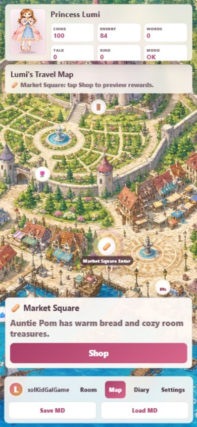
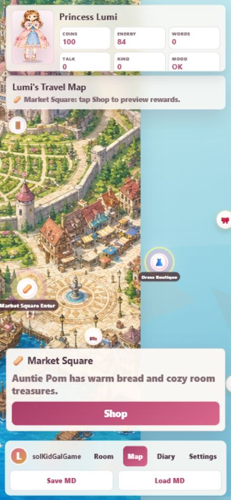
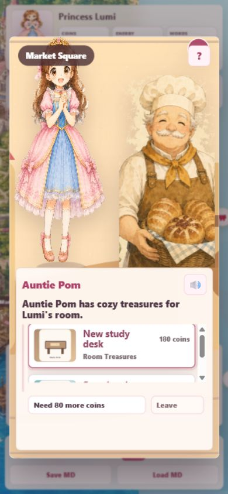

# 20260531-125406 手機 Travel Map 驗證

# I. 緣起目的

本輪依使用者決策，將目的地選擇從手機卡片清單 / MIS 選單感，改為手機直向優先的可拖拉地圖與可點選地標 preview。同時確認不同店家進入 ADV / Shop 時能套用 scene config。

# II. 參考準備

- 驗證工具：Codex in-app Browser / Browser plugin `iab`。
- Viewport：手機直向 `390x844`。
- URL：`http://localhost:4175/#map`。
- 截圖資料夾：`20260531-125406-mobile-travel-map-qa/`。
- Console：`qa-result.json` 記錄 warn / error 數量為 0。

# III. 內容程序

## 手機 Travel Map preview

驗證結果：

- `destinationPanel` 已 hidden，目的地卡片清單不再作為主畫面。
- 手機畫面顯示 `Lumi's Travel Map` 與可點選地標。
- 點 Market Square 後顯示遊戲式 preview，包含地點名、短文案與 `Shop` 指令。

## 手機拖拉地圖

驗證結果：

- in-app Browser 拖拉後，地圖 `panX` 從 `0px` 變成 `-165px`。
- 可視地標會隨拖拉重定位，不是固定清單或靜態截圖。

## Market Shop scene config

驗證結果：

- Market Square 進入後使用 `scene-market`。
- NPC 使用 `npc-market.png`，speaker 為 `Auntie Pom`。
- Shop 顯示 room treasure 商品與 market greeting。

# IV. 備註紀錄

- 本輪只做手機直向 in-app Browser smoke check，不宣稱完整美術性測試完成。
- 已用同一個 in-app Browser 執行 `?selftest=monkey#home`：`passed: true`，`steps: 300`，`errors: []`。
- 目前 Shoe Shop 與 Accessory Shop 已改為不同 NPC class / 背景設定，但 Shoe / Accessory 的正式專屬店員圖仍可後續用 `image_gen` 生成更精準版本。
