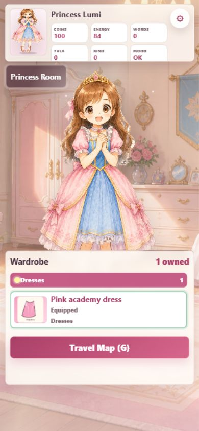
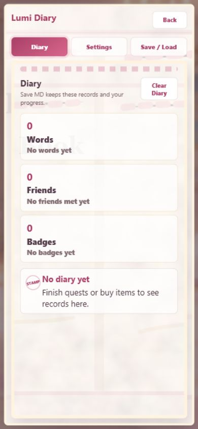
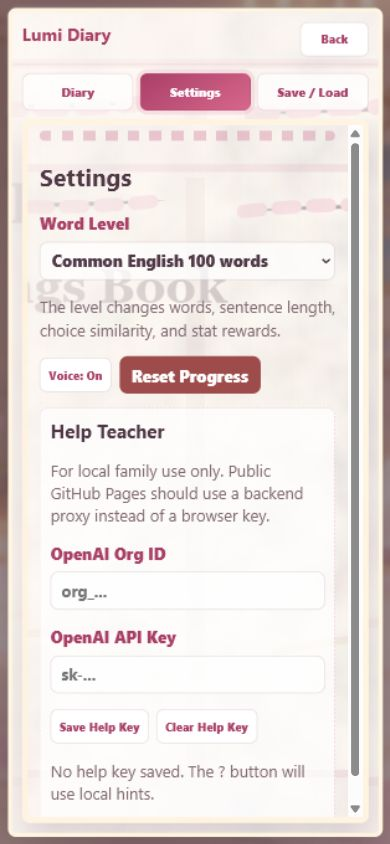
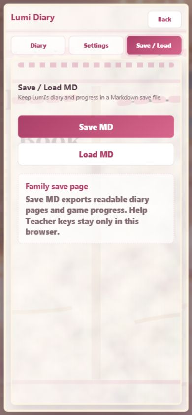

# I. 緣起目的

檢查本輪受影響的手機畫面是否仍像兒童日式 ADV，而不是網站管理面板。主要驗收 viewport 為 390x844 mobile portrait。

# II. 參考準備

- Browser plugin `iab` 已完成 mobile screenshot。
- 修改前圖未能補拍：改檔前未保存 Android baseline；嘗試用 `file://` 開 temp baseline 時被 Browser URL policy 阻擋。修改前證據以使用者 Android 回報與 git diff 中原 `topbar/nav-tabs/save-actions` 常駐結構為準。
- 修改後截圖：
  - `20260531-140659-qa/mobile-home-before-menu.png`
  - `20260531-140659-qa/mobile-diary-menu.png`
  - `20260531-140659-qa/mobile-settings-menu.png`
  - `20260531-140659-qa/mobile-save-menu.png`
  - `20260531-140659-qa/mobile-quest-after-answer.png`
  - `20260531-140659-qa/mobile-shop-menu.png`

# III. 內容程序

## 遊戲畫面#1：Room 主畫面

### (A) 現有截圖

### (B) 檢討批評

**Must Fix**
- 無。

**Should Fix**
- Princess Room 標題 panel 只剩標題，說明文字不明顯；目前可接受，因主操作在 Wardrobe / Travel Map。
- 齒輪靠近狀態格，未來可改成更像日記本書籤的 icon。

**Accept**
- 預設畫面已無底部 Save / Load 系統列。
- Gear 不遮擋主角臉部、衣櫃與 Travel Map。
- Coins / Energy / Words / Talk / Kind / Mood 在第一眼可讀。
- Wardrobe 仍是主要底部操作，不被系統設定取代。
- Travel Map CTA 保持清楚。
- 背景與角色比例未被本輪改動破壞。
- 手機直向沒有文字溢出。
- 觸控目標尺寸足夠。

### (C) 修訂分析

**問題#1**：系統功能原本佔據主畫面焦點

- 分類：Must Fix
- 影響尺寸：手機直向
- 解決規劃：移除 header/topbar 常駐控制列，改成狀態區齒輪 + 書本 overlay；風險是使用者找不到系統功能，因此齒輪保持在 HUD 右上。
- 前後比較：修改前使用者 Android 實測回報 + git diff；修改後見 Room 截圖。
- 修訂結論：修訂完成。

### (D) 畫面小結

- 建議接受問題：2 個
- 完成改善問題：1 個
- 尚待處理問題：0 個

## 遊戲畫面#2：Diary 書本頁

### (A) 現有截圖

### (B) 檢討批評

**Must Fix**
- 無。

**Should Fix**
- 空日記時留白較大，未來可放 sticker 或 Lumi 小插圖。
- Clear Diary 仍偏系統按鈕文案，後續可改成更像撕下日記頁的語氣。

**Accept**
- Diary 位於書本 overlay，不佔主畫面。
- 三個 tab 的層級清楚。
- Back 按鈕容易理解。
- Words / Friends / Badges 分區像收藏摘要。
- Diary 背景使用既有日記本圖片，與 README 方向一致。
- 空狀態文案清楚。
- 手機上沒有橫向溢出。
- overlay 背景保留遊戲畫面模糊感。

### (C) 修訂分析

**問題#2**：Diary 原本是主導覽頁，會把玩家帶離遊戲場景

- 分類：Must Fix
- 影響尺寸：手機直向
- 解決規劃：Diary 改成齒輪書本內的第一頁；保留既有資料 render，不改 diary schema。
- 前後比較：修改前以原 `nav-tabs` 的 `Diary` 常駐按鈕為證據；修改後見 Diary 截圖。
- 修訂結論：修訂完成。

### (D) 畫面小結

- 建議接受問題：2 個
- 完成改善問題：1 個
- 尚待處理問題：0 個

## 遊戲畫面#3：Settings 書本頁

### (A) 現有截圖

### (B) 檢討批評

**Must Fix**
- 無。

**Should Fix**
- OpenAI Help Teacher 表單仍偏家長設定感，後續可折疊。
- 內部捲動條視覺較明顯，但它避免內容壓出螢幕。
- Reset Progress 顏色較強，後續可加確認式家長防誤觸文案。

**Accept**
- Settings 不再常駐主畫面。
- Word Level select 可讀。
- Voice / Reset 觸控大小可接受。
- Help Teacher local key 安全說明仍保留。
- 書本底圖讓設定頁比一般表單更接近遊戲內道具。
- 輸入欄未溢出。
- Tab 切換後 active 狀態明確。

### (C) 修訂分析

**問題#3**：Settings 原本是第一層導覽，破壞遊戲沉浸感

- 分類：Must Fix
- 影響尺寸：手機直向
- 解決規劃：Settings 收進齒輪書本第二頁；維持既有 Word Level / Voice / Help Teacher 邏輯。
- 前後比較：修改前以原 `nav-tabs` 的 `Settings` 常駐按鈕為證據；修改後見 Settings 截圖。
- 修訂結論：修訂完成。

### (D) 畫面小結

- 建議接受問題：3 個
- 完成改善問題：1 個
- 尚待處理問題：0 個

## 遊戲畫面#4：Save / Load 書本頁

### (A) 現有截圖

### (B) 檢討批評

**Must Fix**
- 無。

**Should Fix**
- `Save MD` / `Load MD` 是家長向文案，後續可加中文或更溫和的 family save label。
- Save 頁面目前較簡潔，未來可加入最近存檔提示。

**Accept**
- Save / Load 不再常駐主畫面。
- Save 與 Load 觸控尺寸大。
- 說明清楚標示 Help Teacher key 不匯出。
- 背景延續書本視覺。
- 沒有擋住 Room / Map / ADV 主畫面。
- 版面不溢出。
- 進出可由 Back 控制。
- 和 Diary / Settings 共用一致 tab pattern。

### (C) 修訂分析

**問題#4**：Save MD / Load MD 原本在預設畫面下方造成誤觸與壓迫

- 分類：Must Fix
- 影響尺寸：手機直向
- 解決規劃：把按鈕移入 Save / Load panel，只在 gear menu 內呈現；保留原 id 與事件綁定。
- 前後比較：修改前以使用者 Android 回報與原 `save-actions` 常駐結構為證據；修改後見 Save / Load 截圖。
- 修訂結論：修訂完成。

### (D) 畫面小結

- 建議接受問題：2 個
- 完成改善問題：1 個
- 尚待處理問題：0 個

# IV. 備註紀錄

全部 4 個修訂問題 / 判定：

- **建議接受問題**：9 個，皆為後續 polish，不阻擋本輪 PR。
- **完成改善問題**：4 個：問題#1、問題#2、問題#3、問題#4。
- **尚待處理問題**：0 個。

統計檢查：

- 建議接受問題 + 完成改善問題 + 尚待處理問題 = 13。
- 受影響 4 個主要畫面皆已完成 mobile 截圖與 10 點批評。
