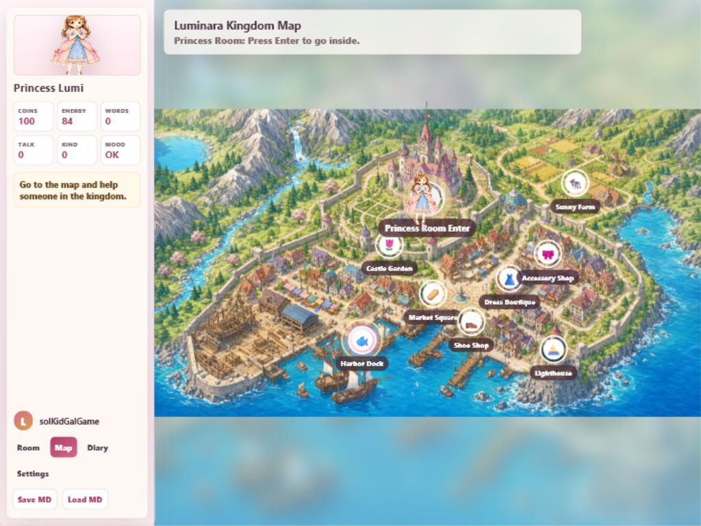

# 20260531 好玩性測試

## Scope

- First impression of Room / Map / reward loop
- Reward motivation through Wardrobe / Shop item art
- Current map art suitability for child-friendly Japanese MAP ADV

## Findings

### 問題#1

**問題說明**：The geometric map was a major fun / motivation blocker. It made the main exploration loop feel like a placeholder diagram instead of a place a child would want to explore.

**解決規劃**：Restore the previous detailed hand-drawn map rather than attempting to polish the geometric map.

**前後比較**：

Before: `20260531-game-qa/desktop-map-restored.png`

After:

**修訂結論**：修訂完成.

## Result

好玩性測試部分通過: the main Map now has a hand-drawn exploration reward again, and Wardrobe item art remains visible. Manual keyboard-only hotspot entry remains a play-flow residual, so the full “child can complete the loop using only movement + Enter” claim is not closed in this pass.
