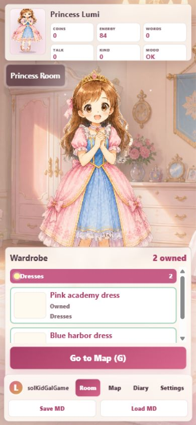
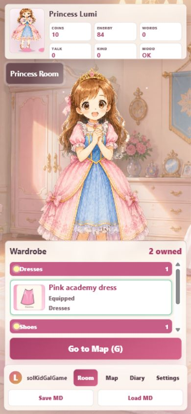
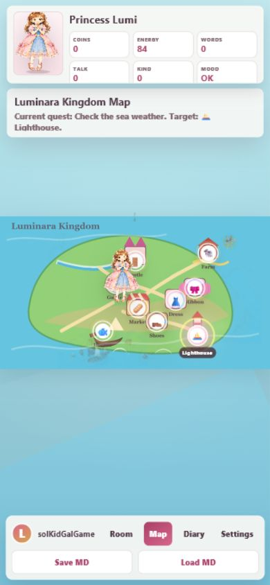
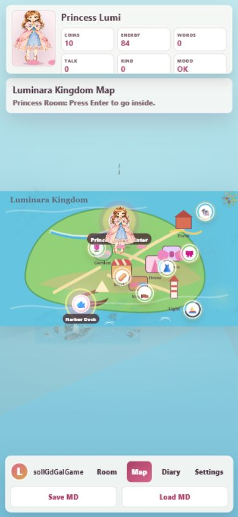
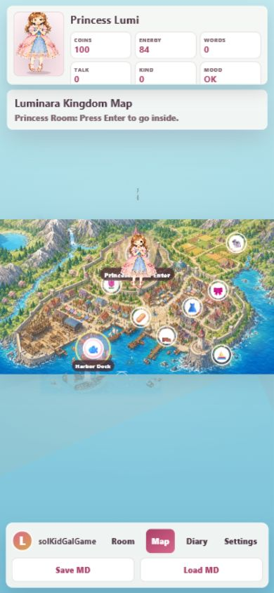
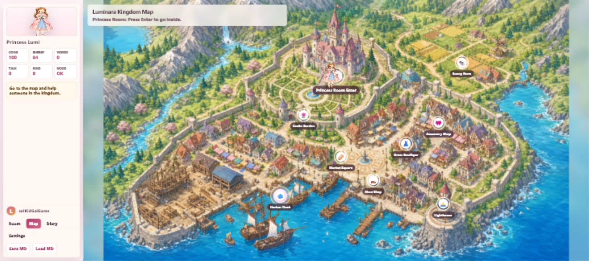

# 20260531 美術性測試

## Scope

- Mobile portrait, desktop `1024x768`, and wide desktop `1800x800`.
- Room, Map, Quest ADV, Shop, Diary, Settings.

## Baseline

- Baseline screenshots saved under `.codex/log/20260531-game-qa/`.
- After screenshots saved under `.codex/log/20260531-game-qa/`.

## Must Fix 1: Wardrobe Item Art Invisible

### Before / After

Before:

After:

- Before: `mobile-room-before.png`, `desktop-room-before.png`.
- Critique:
  - Item preview squares looked blank, so the Wardrobe felt like a list rather than doll-play treasures.
  - Shop / Wardrobe reward motivation was weakened because dresses and shoes were not visually inspectable.
  - DOM inspection showed `background-image: none`; the inline `style` attribute was truncated at `--item-img:url("`.
- Fix:
  - Changed item card inline style to `--item-img:url(assets/items/...)` without double quotes inside the HTML attribute.
- After:
  - `mobile-room-after.png`
  - `mobile-room-chrome-after.png`
- Difference:
  - Before: item preview cards showed pale blank boxes despite item PNG assets existing.
  - After: item card previews show the actual dress / shoes PNG art and the Wardrobe reads as doll-play reward UI.
- Residual:
  - No residual `Must Fix` for this item-preview rendering issue.
- Result: Must Fix resolved. Pink academy dress and owned shoes now render as image previews.

## Must Fix 2: Mobile Map First Read Too Empty

### Before / After

Before:

After:

- Before: `mobile-map-before.png`.
- Critique:
  - The portrait map had a large empty blue field and the playable island read too small.
  - First visual focus was the blank stage, not exploration targets.
  - Enlarging only the image would desync hotspots, so CSS and coordinate metrics needed the same scale.
- Fix:
  - Added mobile map scale to CSS and applied the same `1.34` scale to `mapCoverMetrics()`.
- After:
  - `mobile-map-after.png`
- Difference:
  - Before: the island occupied too little of the portrait screen, so the first read was empty water rather than a playable map.
  - After: the island, princess marker, and hotspots are larger and easier to read on mobile portrait.
- Residual:
  - The current map is still based on a landscape plate; a fully portrait-native map remains a separate design task.
- Result: Must Fix resolved. Mobile map targets are larger and hotspot alignment remains tied to the same metric.

## Should Fix / Accepted Residuals

- Mobile Settings still uses an internal scroll area because Help Teacher fields do not fit above the bottom game menu. This is accepted for this pass because it is navigable, has no horizontal overflow, and preserves the book-style overlay.
- Portrait-native exploration map coordinates remain a larger follow-up already noted in `README.md`.

## Must Fix 3: Geometric Map Regressed From Hand-Drawn Game Art

### Before / After

Before:

After:

Mobile after:

Wide after:

**問題說明**：The working-tree map had regressed to a flat geometric island with simple blocks and labels. It failed the child-friendly Japanese MAP ADV art gate because the first read looked like a placeholder diagram, not a finished hand-drawn exploration scene. Classification: `Must Fix`.

**解決規劃**：Compare the current `assets/kingdom-map.png` with the Git version. If the Git version is the previous hand-drawn map, restore only that asset and preserve unrelated repo changes. Add an image query string in `index.html` so local browser and GitHub Pages caches do not keep showing the rejected map. Retest mobile portrait, desktop `1024x768`, and wide `1800x800`.

**前後比較**：The geometric map showed flat colored land, block buildings, and visible text labels baked into the art. The restored map is the detailed hand-drawn kingdom plate with castle, town, harbor, lighthouse, farms, mountains, water, and roads.

**修訂結論**：修訂完成. The map art is restored to the previous hand-drawn version, and all three required viewports load `assets/kingdom-map.png?v=handdrawn-20260531` from the current `4177` server with no horizontal overflow.

## Updated Residuals

- Manual natural-keyboard hotspot entry remains not fully closed; this is a function/interface residual, not a map-art blocker.

## Browser Evidence

- In-app Browser successfully captured baseline and post-fix mobile screenshots.
- After the original monkey test opened native confirms, in-app Browser tab creation later timed out on `about:blank`; headless Chrome was used only as fallback after recording the Browser/iab failure.
- Headless Chrome screenshots:
  - `desktop-map-chrome-after.png`
  - `wide-map-chrome-after.png`
  - `mobile-room-chrome-after.png`
- Current pass used Browser/iab successfully for the restored map screenshots on `http://127.0.0.1:4177/`.

## Current Statistics

全部 3 問題，處理後如下：
* 完成改善 3 個
* 無改善方案 0 個
* 修訂失敗 0 個
* 未修訂 / 後續工程項 0 個
