# I. 緣起目的

檢查本輪受影響的手機畫面是否仍像兒童日式 MAP ADV，而不是網站管理面板、幾何 placeholder 或商品清單。主要驗收 viewport 為 390x844 mobile portrait。

# II. 參考準備

- Manifest：`20260601-135745-surface-inventory.md`
- 美術來源：`20260601-135745-美術來源.md`
- Browser plugin `iab` 已先完成截圖與 console log 檢查；後續 fresh 重截時 `Page.captureScreenshot` 對 tab 3 / tab 4 連續逾時。
- 最終 fresh 截圖使用 Chrome CDP fallback，已用 `Emulation.setDeviceMetricsOverride` 驗證 `innerWidth=390`、`innerHeight=844`；記錄於 `20260601-135745-qa/chrome-cdp-capture-results.json`，19 個 surface 的 `consoleIssues` 皆為空。
- 修改前 baseline 已用 detached `HEAD` worktree 補拍，記錄於 `20260601-135745-qa/chrome-cdp-capture-results-before.json`；修改後截圖記錄於 `20260601-135745-qa/chrome-cdp-capture-results.json`。

# III. 內容程序

## 美術檢查批次

| 遊戲畫面 | flow_node_id | 截圖 | Must | Should | Accept | 結案 |
|---|---|---|---:|---:|---:|---|
| Castle / Kingdom Map | castle-map, kingdom-map | `mobile-castle-map-after.png`, `mobile-kingdom-map-after.png` | 0 | 1 | 9 | Accept |
| Market Scene / Shop / Feedback | market-scene, market-detail, market-feedback | `mobile-market-*-after.png` | 0 | 2 | 9 | Accept |
| Boutique Scene / Shop / Feedback | boutique-scene, boutique-detail, boutique-feedback | `mobile-boutique-*-after.png` | 0 | 2 | 8 | Accept |
| Shoe Scene / Shop / Feedback | shoes-scene, shoes-detail, shoes-feedback | `mobile-shoes-*-after.png` | 0 | 1 | 9 | Accept |
| Accessory Scene / Shop / Feedback | accessory-scene, accessory-detail, accessory-feedback | `mobile-accessory-*-after.png` | 0 | 1 | 9 | Accept |
| Room / Wardrobe | princess-room-scene, wardrobe-detail | `mobile-princess-room-scene-after.png`, `mobile-wardrobe-detail-after.png` | 0 | 2 | 8 | Accept |
| Diary / Settings / Save | diary, settings, save-load | `mobile-diary-after.png`, `mobile-settings-after.png`, `mobile-save-after.png` | 0 | 3 | 7 | Accept |

## 遊戲畫面#1：Castle / Kingdom Map

### (A) 現有截圖

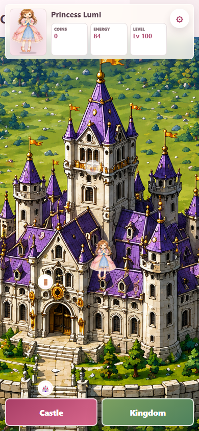

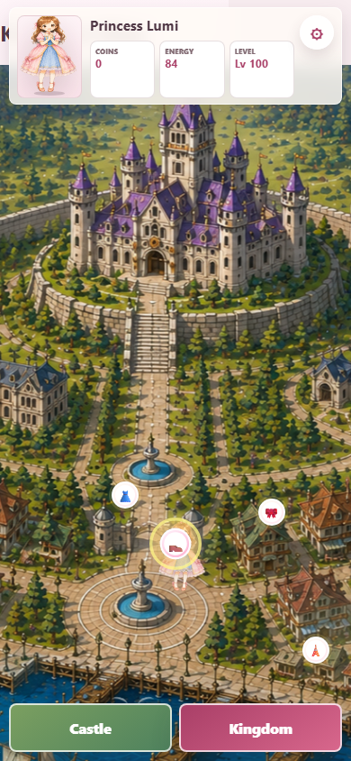

### (B) 檢討批評

**Must Fix**
- 無。

**Should Fix**
- Kingdom Map 地標圖示仍偏小，後續可補 hover / focus preview 讓手機玩家更容易辨識遠方店家。

**Accept**
- HUD 完全在 viewport 內，未被安全區切掉。
- Castle / Kingdom 底部切換按鈕尺寸足夠，文字未溢出。
- 城堡地圖與王國地圖維持可探索的場景感，不是卡片清單。
- 城堡視覺與本輪新增場景的紫色屋頂語彙一致。
- 玩家 doll 位置清楚，不被 marker 吃掉。
- 390x844 沒有水平捲動或主要物件被截斷。
- Map 不直接塞商店清單，符合 Area Map 第一層。
- 背景不是 CSS 幾何圖或模糊截圖。
- Quest / marker focus 的視覺層級仍可辨識。

### (C) 修訂分析

本畫面無非 Accept 的 Must 問題；Should Fix 留待後續地圖 polish。

### (D) 畫面小結

- 建議接受問題：1 個
- 完成改善問題：0 個
- 尚待處理問題：0 個

## 遊戲畫面#2：Market Scene / Shop / Feedback

### (A) 現有截圖

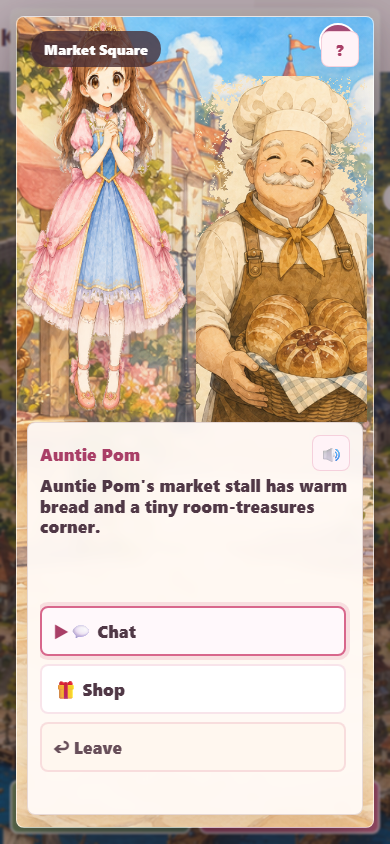

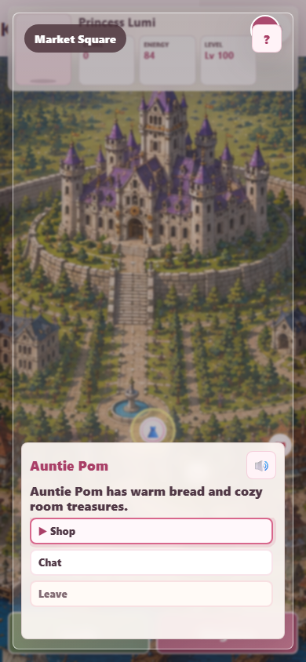

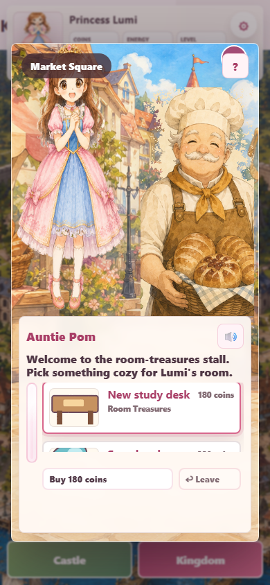

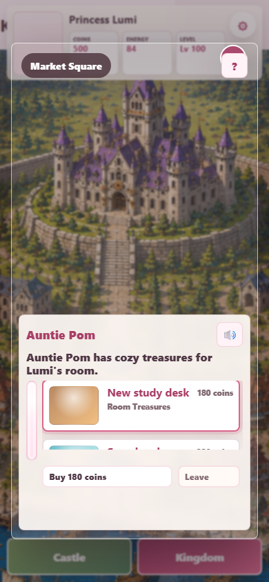

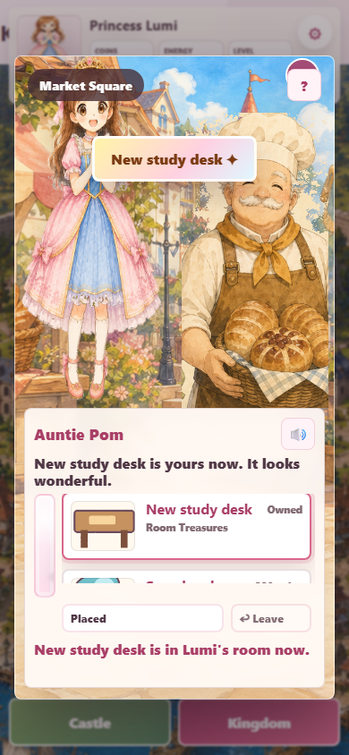

### (B) 檢討批評

**Must Fix**
- 無。

**Should Fix**
- Room treasure 商品小圖仍是既有簡化 PNG，後續可用 `image_gen` 重做整套商品圖，讓「想買」誘因更強。
- Market detail 的商品清單在小尺寸中只能露出 1.5 個品項，後續可加更明確的上下可捲提示。

**Accept**
- 進場 Scene 只顯示場景、Auntie Pom、Chat / Shop / Leave，沒有直接塞商品清單。
- 市場背景已呈現麵包攤與小鎮街景，和 #19 提到的麵包店場景相符。
- `Market Square` 不再語意混亂成純麵包店；文案明確說有 room-treasures corner。
- 購買 feedback 有 toast、店員句子與 placed 狀態。
- 商品縮圖已正常載入 PNG，不再只剩淡色底。
- 對話框未裁切 NPC 臉部或主角臉部。
- 主角與 NPC 站位像同一個空間，沒有漂浮或髒邊。
- `↩ Leave` 留在 detail / feedback 內，返回路徑清楚。
- HUD 在背景上被淡化，未搶走場景主視覺。

### (C) 修訂分析

**問題#1**：Market 原本無法同時支撐麵包店背景與 room item 商店語意

- 分類：Must Fix
- 影響尺寸：手機直向
- 解決規劃：把 Market 寫成「市場麵包攤 + 房間小物角落」，保留麵包店視覺，同時讓 shopCategories 的 `room` 合理。
- 前後比較：修改前見 `mobile-market-scene-before.png` / `mobile-market-detail-before.png`，店家仍是模糊地圖背景；修改後見 `mobile-market-scene-after.png` / `mobile-market-detail-after.png` / `mobile-market-feedback-after.png`，已成為市場麵包攤與 room-treasures stall。
- 修訂結論：修訂完成。

### (D) 畫面小結

- 建議接受問題：2 個
- 完成改善問題：1 個
- 尚待處理問題：0 個

## 遊戲畫面#3：Dress Boutique Scene / Shop / Feedback

### (A) 現有截圖

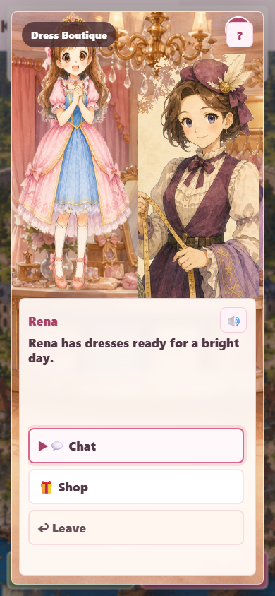

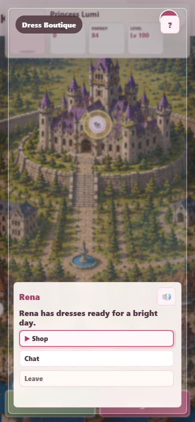

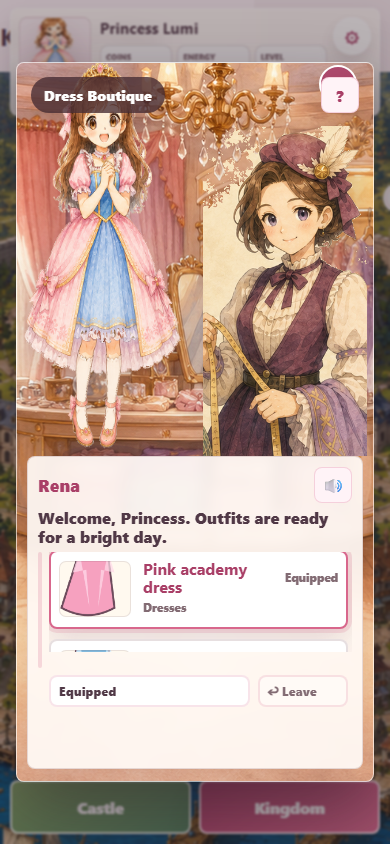

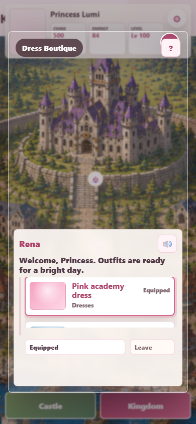

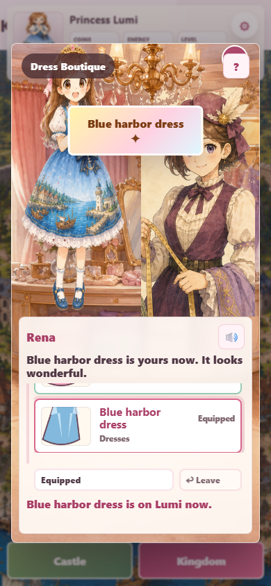

### (B) 檢討批評

**Must Fix**
- 無。

**Should Fix**
- Dress 商品小卡仍偏 icon / catalog 呈現，後續可重做成更像玩洋娃娃衣櫃的單品圖。
- NPC 與背景畫風接近，但 Rena 的線條比新背景更銳利，後續可整批統一角色立繪精修。

**Accept**
- Boutique 有明確服飾店背景，不再像通用商店。
- Scene entry 與 Detail Panel 分層清楚。
- Rena 站位合理，未擋住主角臉部。
- 購買 feedback 會顯示 dress 已取得與可 equip。
- 對話框高度保留上半場景可辨識。
- 商品價格與 Owned / Equipped 狀態可讀。
- Action choices 使用 `🎁 Shop` 與 `↩ Leave`，渲染正常。
- 390x844 內按鈕未貼邊或互相重疊。

### (C) 修訂分析

**問題#2**：店家 scene entry 缺正式場景背景，第一眼不像 ADV 店面

- 分類：Must Fix
- 影響尺寸：手機直向
- 解決規劃：以 `image_gen` 產生 Boutique 背景，搬入 `assets/scenes/boutique.png`，並加 query cache bust。
- 前後比較：修改前見 `mobile-boutique-scene-before.png` / `mobile-boutique-detail-before.png`，背景仍是模糊地圖；修改後見 Boutique 三張截圖，已是服飾店室內場景。
- 修訂結論：修訂完成。

### (D) 畫面小結

- 建議接受問題：2 個
- 完成改善問題：1 個
- 尚待處理問題：0 個

## 遊戲畫面#4：Shoe Shop Scene / Shop / Feedback

### (A) 現有截圖

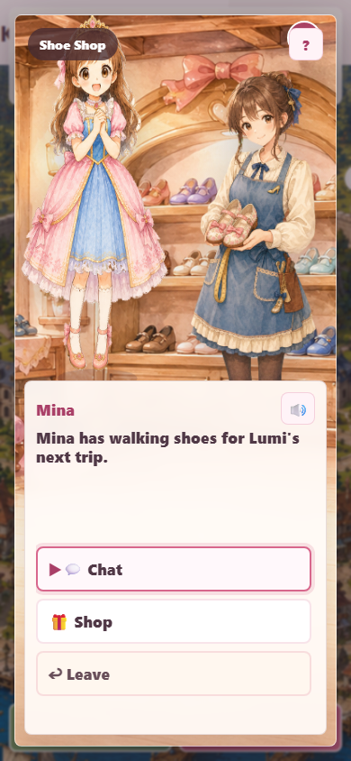

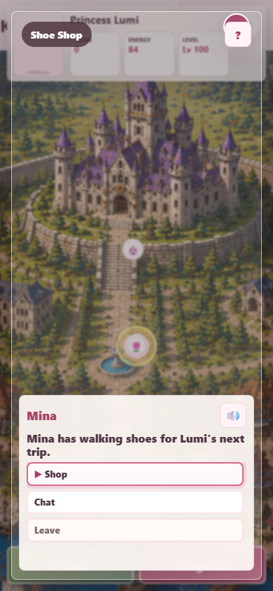

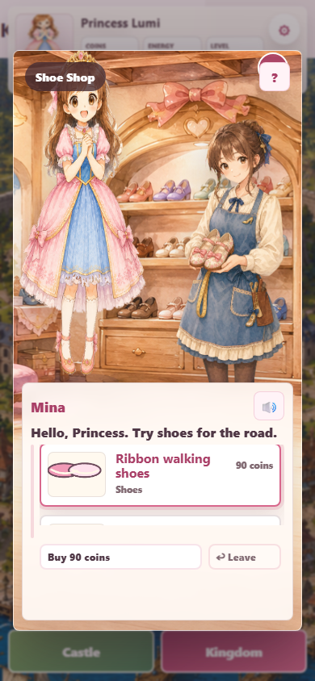

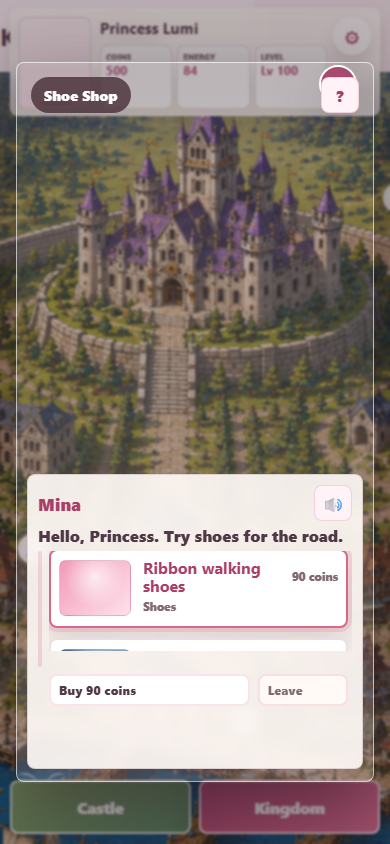

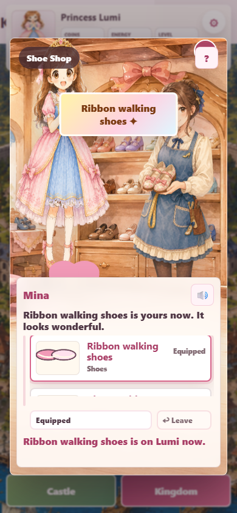

### (B) 檢討批評

**Must Fix**
- 無。

**Should Fix**
- 鞋子商品小卡可再放大鞋子輪廓；目前已可讀，但誘因不如背景與 NPC。

**Accept**
- 鞋店背景有鞋架、蝴蝶結與木質店面，場景目的清楚。
- 新增 Mina NPC 後，鞋店不再借用其他 NPC。
- NPC 去背後無明顯綠邊或髒邊。
- 主角、Mina、鞋店背景比例自然。
- Scene entry 沒有直接顯示商品列表。
- Detail Panel 顯示 shoes 類別、價格與 Buy / Leave。
- Feedback 顯示已購買與 equipped / try-on 狀態。
- 三個階段皆可回到 map / scene，不像 modal dead end。
- 對話框與選項沒有文字溢出。

### (C) 修訂分析

**問題#3**：Shoe Shop 缺專屬 NPC 與專屬背景

- 分類：Must Fix
- 影響尺寸：手機直向
- 解決規劃：以 `image_gen` 產生 `assets/scenes/shoes.png` 與 `assets/characters/npc-shoes.png`；NPC 透過 chroma-key 去背並裁切 alpha 邊界。
- 前後比較：修改前見 `mobile-shoes-scene-before.png` / `mobile-shoes-detail-before.png`，沒有鞋店室內場景與店員立繪；修改後見 Shoe 三張截圖。
- 修訂結論：修訂完成。

### (D) 畫面小結

- 建議接受問題：1 個
- 完成改善問題：1 個
- 尚待處理問題：0 個

## 遊戲畫面#5：Accessory Shop Scene / Shop / Feedback

### (A) 現有截圖

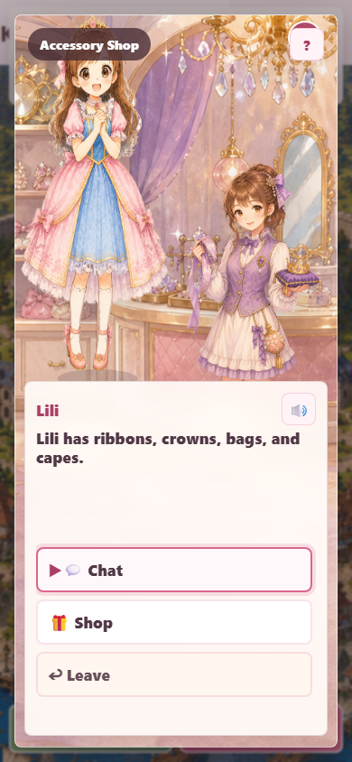

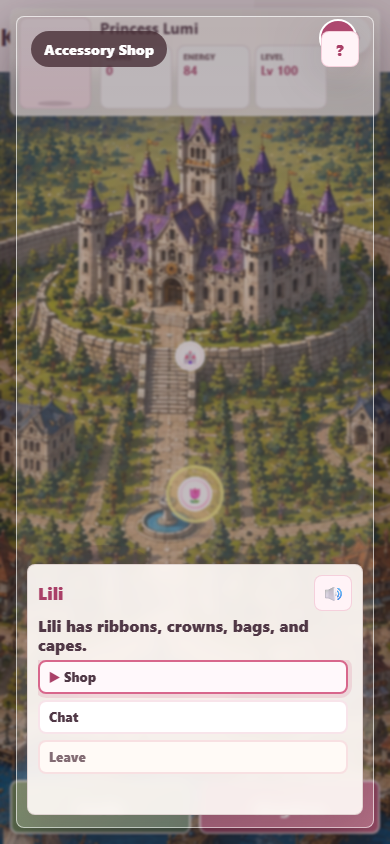

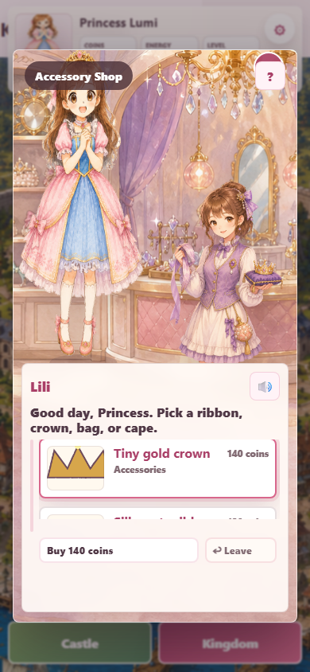

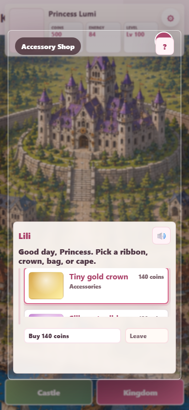

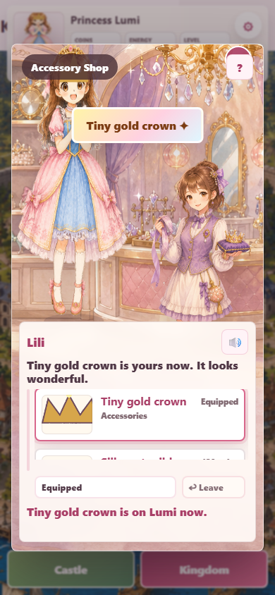

### (B) 檢討批評

**Must Fix**
- 無。

**Should Fix**
- Accessory item 小圖仍可再提高皇冠 / 緞帶 / 包包的細節；目前 detail 可讀，不阻擋本輪。

**Accept**
- #19 點名的飾品店已具備珠寶、鏡台、吊燈與紫色布簾場景。
- Lili NPC 與飾品店背景語意一致。
- 新 NPC 去背後邊界乾淨，未出現綠幕殘留。
- Scene entry 保持 Chat / Shop / Leave。
- Detail Panel 顯示 accessory 類別、價格與狀態。
- Feedback 有 item toast 與裝備後文字。
- 背景、角色與 UI 都維持兒童向柔和色調。
- 對話框沒有壓住 NPC 臉部。
- 390x844 內沒有水平裁切。

### (C) 修訂分析

**問題#4**：Accessory Shop 第一眼不像可探索店面，且缺專屬 NPC

- 分類：Must Fix
- 影響尺寸：手機直向
- 解決規劃：以 `image_gen` 產生飾品店背景與 Lili NPC，去背後搬入 repo，並在 CSS 加入 `npc-accessory`。
- 前後比較：修改前見 `mobile-accessory-scene-before.png` / `mobile-accessory-detail-before.png`，沒有飾品店室內場景與 Lili 立繪；修改後見 Accessory 三張截圖。
- 修訂結論：修訂完成。

### (D) 畫面小結

- 建議接受問題：1 個
- 完成改善問題：1 個
- 尚待處理問題：0 個

## 遊戲畫面#6：Princess Room / Wardrobe

### (A) 現有截圖

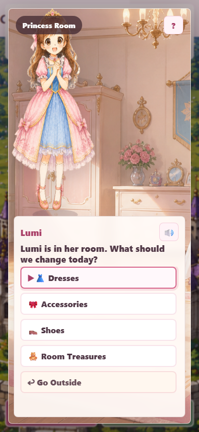

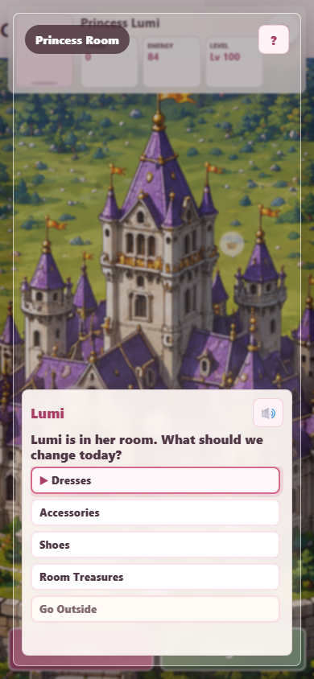

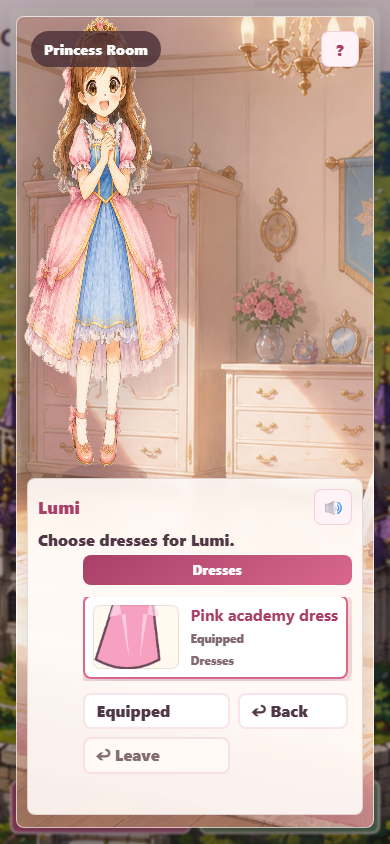

### (B) 檢討批評

**Must Fix**
- 無。

**Should Fix**
- Wardrobe detail 仍比較像商品 list，後續可改成玩具衣櫃抽屜互動。
- Room 背景與新場景背景畫風接近，但房間家具變化可再和已購 room items 連動。

**Accept**
- Room action choices 已完整顯示 5 個入口，不再裁切第一個 Dresses。
- `Dresses / Accessories / Shoes / Room Treasures / Go Outside` 對兒童清楚。
- Room scene entry 不直接塞 wardrobe 清單。
- Wardrobe detail 是玩家選擇後才出現。
- 主角沒有被對話框裁臉或截頭。
- 房間背景保留生活基地感。
- Go Outside 返回路徑明確。
- 觸控按鈕高度足夠。

### (C) 修訂分析

**問題#5**：Princess Room 第一個 action choice 在手機直向被裁切

- 分類：Must Fix
- 影響尺寸：手機直向 390x844
- 解決規劃：針對 `scene-princess-room` 調整 choice list align-content 與 button 高度；風險是按鈕太小，因此保留 43px 以上觸控高度。
- 前後比較：修改前以重截過程中保存的裁切截圖與 layout 記錄為證據；修改後見 `mobile-princess-room-scene-after.png`。
- 修訂結論：修訂完成。

### (D) 畫面小結

- 建議接受問題：2 個
- 完成改善問題：1 個
- 尚待處理問題：0 個

## 遊戲畫面#7：Diary / Settings / Save

### (A) 現有截圖

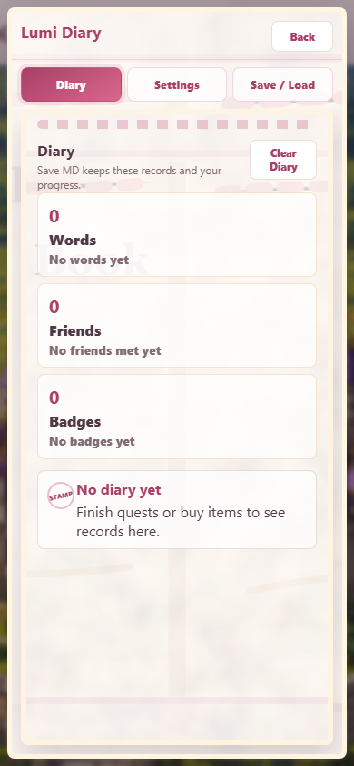

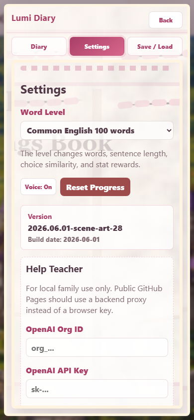

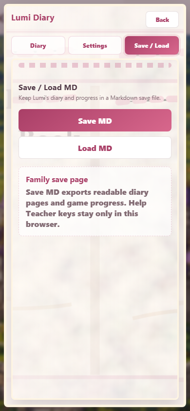

### (B) 檢討批評

**Must Fix**
- 無。

**Should Fix**
- Settings 的 OpenAI Help Teacher 區塊仍偏家長設定表單，可後續折疊。
- Save / Load 文案仍偏工具語氣，後續可改成更童話式的 family save wording。
- Diary 內容多時需要捲動，後續可加更明顯的書籤或頁角提示。

**Accept**
- 三者都收在書本 overlay，不常駐切割主畫面。
- Diary 顯示 Words / Friends / Badges，像遊戲紀錄。
- Settings 沒有遮住當前主場景的必要資訊。
- Save / Load 清楚標示 Help Teacher key 不匯出。
- Back 按鈕可理解。
- 390x844 沒有文字水平溢出。
- 書本背景與遊戲世界一致。

### (C) 修訂分析

本畫面無非 Accept 的 Must 問題；三個 Should Fix 留作後續 polish。

### (D) 畫面小結

- 建議接受問題：3 個
- 完成改善問題：0 個
- 尚待處理問題：0 個

# IV. 備註紀錄

全部 19 個 manifest row / 判定：

- **建議接受問題**：12 個，皆為後續 polish，不阻擋本輪。
- **完成改善問題**：5 個：問題#1、問題#2、問題#3、問題#4、問題#5。
- **尚待處理問題**：0 個。

統計檢查：

- 建議接受問題 + 完成改善問題 + 尚待處理問題 = 17。
- 本輪美術性測試無殘留 `Must Fix`。
- 修改前 baseline 與修改後結果皆有 390x844 截圖；前後比較可回到 manifest row 與 CDP capture result，最終重截包含商品縮圖修正後畫面。
