# solLingoWorld — Princess English Adventure

> 本 README 是本專案的**產品手冊（productReadme）**，從玩家與家長／維護者「實際怎麼用」的角度撰寫。
> 內部設計與架構的單一事實來源為 [docs/design.md](docs/design.md)（formatVersion 3.3）；本檔隨已完成的 dev 項目逐步校準。

陪 Princess Lumi 到不同地點和角色用一句短英文對話，答對拿 coins、日記與學到的單字，再把 coins 換成看得見的髮型、衣服、鞋帽與配件。**學英文與換裝獎勵是同一個正向循環。**

**本手冊四段導覽**：**I. 緣起目的**（這是什麼、如何開始）→ **II. 參考設計**（設計依據與參考，摘要並連結 design.md）→ **III. 內容程序**（詳細玩法與維護者本地端管理模式）→ **IV. 備註說明**（意見反映與修訂紀錄）。

---

# I. 緣起目的

## A. 這是什麼

- 一個給**年幼英文學習者**玩的日式 ADV 風格英文練習遊戲：家庭**自架伺服器**遊玩，玩家用自己的**帳號**登入，進度**保存在伺服器**、換裝置也能繼續玩。
- 主要在**手機瀏覽器直向**遊玩，桌機也可用。
- 形態為「**靜態遊戲殼＋node API 核**」：遊戲畫面仍是無框架的靜態網頁，帳號與存檔由同一台自架伺服器的 API 承接（issue #309 起；設計依據見 [docs/design.md](docs/design.md) spec#7／#8／#23／#24）；正式散佈單位為**容器 image＋helm chart 整包**（issue #311，spec#27）。

> ℹ️ 原 GitHub Pages 免安裝版**不保留**（維護者裁決）——站台已正式關閉下線（issue #311），公開網址不再可玩；遊玩一律走自架伺服器形態。

不做的事：不做 landing page、不做大型課程平台、不做密集 phonics 課程、不做後台商品管理、不做 email／第三方（Google 等）登入、不做公開多租戶營運服務（一家一伺服器、自架自管）。

## B. 快速開始

### (A) 部署（自架伺服器）

**正式路徑：helm 整包（建議）**——前置需求：一台有 Kubernetes 的家庭主機（單節點即可，如 k3s／rancher-desktop／docker-desktop——**需有預設 StorageClass**，上述三者內建都有）、`helm` 與 `kubectl` 指令。一個 chart 就把整套（遊戲網頁＋帳號存檔 API＋線上管理頁＋PostgreSQL 資料庫）裝起來：

1. 取得發行物：chart `sollingoworld` 取自發佈列車隨版本發行的 chart 套件（GitHub Release 附件 `.tgz` 或 OCI registry；正式發行前的驗測可直接用本 repo 的 `deploy/helm/`）；容器 image `ghcr.io/twstellerwhale-ocean2/sollingoworld` 為公開 image、不需登入即可拉取。
2. 準備秘密檔 `secrets.yaml`（**不要**用 `--set` 直接把密碼打在指令上——會留在指令歷史裡）：

   ```yaml
   secrets:
     sessionSecret: "<一段隨機長字串>"   # 例：PowerShell 執行 -join ((48..57)+(97..122) | Get-Random -Count 32 | % {[char]$_})
     adminUsername: "<維護者帳號>"        # 服務第一次啟動會用它建立維護者管理帳號；帳號已存在時不會覆寫
     adminPassword: "<維護者密碼>"
   ```

3. 安裝，然後把 `secrets.yaml` 刪掉（秘密已存入叢集）：

   ```powershell
   helm install luminara <chart 來源> -f secrets.yaml
   ```

4. 確認就緒與取得網址：`kubectl get pods` 全部 Ready 即完成；服務網址為 `http://<主機IP>:30418/`（chart 預設固定 port `30418`，安裝完成訊息也會印出網址）。瀏覽器開網址即可遊玩；線上管理頁在 `/admin/`。

   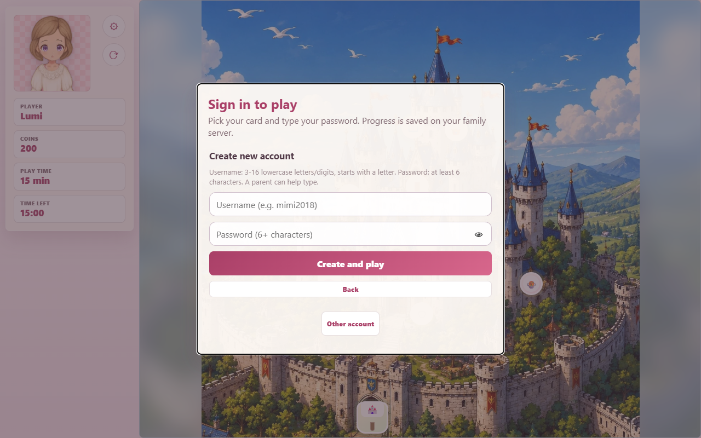

   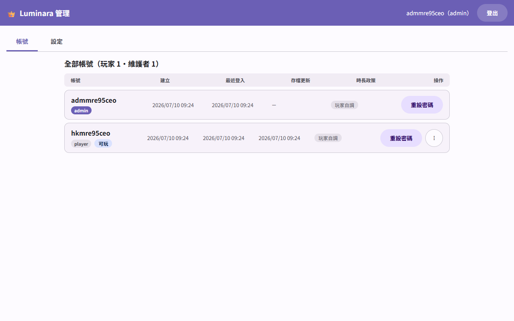
5. **升級**：新版發行後 `helm upgrade luminara <chart 來源>`——**不需要重給秘密**（沿用叢集內既有設定），**玩家帳號、存檔與遊戲設定都會保留**（資料落在持久化儲存 PVC）。想先試跑再升級請用 `helm upgrade --dry-run=server …`（一般 `--dry-run` 讀不到叢集內秘密、會誤報「必填」）。
6. **移除**：`helm uninstall luminara`——資料卷**預設保留**（同名重裝可續用；確定不要資料時再手動刪除 PVC）。
7. **備份與還原**（資料庫 pod 名固定為 `luminara-db-0`，release 名不同時對應調整）：

   ```powershell
   # 備份（PowerShell 7）：
   kubectl exec luminara-db-0 -- pg_dump -U luminara luminara > backup.sql

   # 還原——⚠️ 會以備份內容「整個取代」現有資料，先清空重建再倒回：
   kubectl exec luminara-db-0 -- psql -U luminara -d postgres -c "DROP DATABASE luminara WITH (FORCE);" -c "CREATE DATABASE luminara OWNER luminara;"
   Get-Content backup.sql -Raw | kubectl exec -i luminara-db-0 -- psql -U luminara -d luminara -f -
   ```

   （PowerShell 不支援 `<` 導入，還原一律用上面的 `Get-Content … |` 管線寫法；還原完成後重新整理頁面即可。）原本用 compose 路徑跑的伺服器要改用 helm 時，也是用同一套「compose 版備份 → helm 版還原」把全家進度搬過去。
   另外：**不要手動刪除叢集裡的 `luminara-secrets`**——資料庫實際密碼在首次安裝時已寫進資料卷，這個 Secret 與資料卷同壽命，刪掉重裝會連不上既有資料。
8. **admin 自己忘記密碼**（唯一無法用網頁自救的情況）：`kubectl exec <服務pod> -- npm run reset-password -- <帳號> <新密碼>`。

**開發期路徑：compose＋npm**（開發與輕量試用；不是正式散佈動線）：

1. 啟動資料庫（PostgreSQL，資料落 named volume、重啟不失）：

   ```powershell
   docker compose -f deploy/compose.yaml up -d
   ```

2. 設定環境變數：複製 `sysApi/.env.example` 為 `sysApi/.env`，把 `SESSION_SECRET` 改成一段自己的隨機長字串（`DATABASE_URL` 預設即對應上面的 compose 資料庫）；並設定 `ADMIN_USERNAME` 與 `ADMIN_PASSWORD`——服務**第一次啟動**時會用它建立**維護者管理帳號**，供登入線上管理頁（見 [III.J 線上管理](#j-線上管理維護者)）；帳號已存在時不會覆寫（你在管理頁改過的密碼不會被重啟洗掉）。
3. 啟動遊戲伺服器（同站提供遊戲網頁與 `/api/*` 帳號存檔端點，預設 port `4180`）：

   ```powershell
   cd sysApi
   npm ci
   npm run build
   npm start
   ```

4. 瀏覽器開 `http://<主機IP>:4180/` 即可遊玩；`/healthz` 可作服務健康檢查。備份：`docker exec deploy-db-1 pg_dump -U luminara luminara > backup.sql`；還原（PowerShell 不支援 `<` 導入，用管線；還原前同樣先清空重建，見正式路徑步驟 7 說明）：`Get-Content backup.sql -Raw | docker exec -i deploy-db-1 psql -U luminara luminara`（容器名依 compose 專案目錄推導，換目錄部署時以 `docker ps` 確認）。

兩條路徑共通的注意事項：

- 家庭內網走 HTTP——**請勿把這個服務的 port 轉發到公網**：密碼與登入狀態（含管理帳號）在內網是明文傳輸的，只適合家庭內部使用（chart 留有選配的 Ingress／TLS 欄位，有憑證與網域的維護者可自行啟用）。
- **定期備份你的資料庫**：全家的帳號與進度都存在 PostgreSQL 裡；玩家也可各自在遊戲內匯出 Markdown 備份。
- **線上管理**：瀏覽器開 `http://<主機IP>:<port>/admin/`（helm 路徑預設 port `30418`、開發路徑 `4180`）、以 admin 帳密登入，即可線上管理帳號（孩子忘記密碼在這裡重設、刪除不用的帳號）與執行期遊戲設定（預設遊玩時長、鎖定孩子時長、關閉註冊），儲存即生效、不需重佈——見 [III.J 線上管理](#j-線上管理維護者)。
- **admin 自己忘記密碼**（唯一無法用網頁自救的情況）：開發路徑在伺服器端執行 `cd sysApi && npm run reset-password -- <帳號> <新密碼>`；helm 部署見正式路徑步驟 8（`kubectl exec`）。
- `server.mjs` 仍是**維護者專用 dev 工具**（管理設定工具的寫回），與遊玩用服務無關。

### (B) 遊玩

1. 開啟你家自架伺服器的網址（部署者會告訴你，例如 `http://<主機IP>:4180/`）。
2. 首次使用按「**建立新帳號**」：輸入帳號（小寫英文字母開頭、可含數字，3–16 字）與至少 6 位的密碼——年幼玩家可由家長協助輸入，密碼欄可切換「顯示密碼」避免打錯。這台裝置還沒有任何帳號卡時，登入畫面會直接呈現建立新帳號表單。

   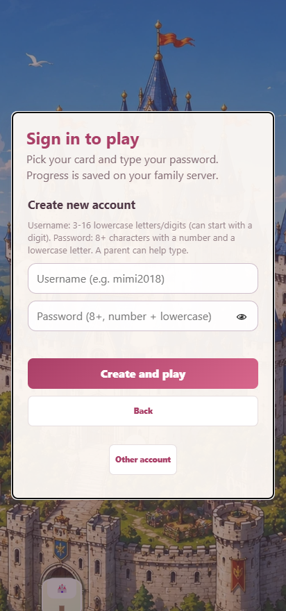

3. 之後每次進入，在登入畫面點自己的**帳號卡**（有公主大頭照、名字與帳號）、輸入密碼即可繼續冒險；**最後登入的帳號**在同一台裝置可直接「Continue」免重輸密碼（也可在卡片上登出）。同一帳號在手機、平板、電腦上進度一致。

   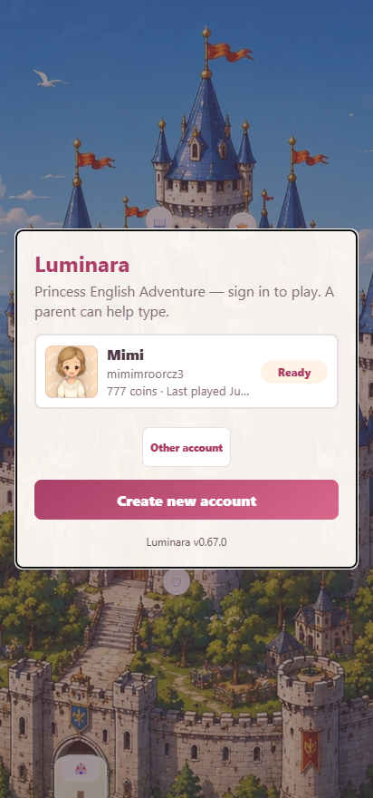

4. 忘記密碼時，請部署的家長／維護者在**線上管理頁**（`/admin/`）幫你重設新密碼（見 [III.J 線上管理](#j-線上管理維護者)），再用新密碼登入即可，進度不受影響。
5. 這台裝置上不需要的帳號卡（例如帳號已被維護者刪除、或借別人裝置玩過）：點開卡片後按「**Remove card from this device**」、再按一次確認即可移除——**只移除這台裝置上的卡片**，伺服器上的帳號與進度完全不受影響，之後重新登入卡片就會回來。

   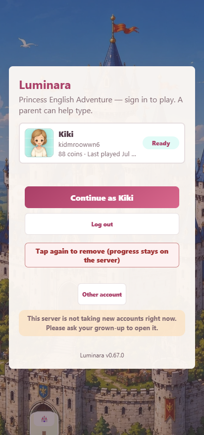
6. 若登入畫面沒有「Create new account」而是顯示「This server is not taking new accounts right now. Please ask your grown-up to open it.」（本伺服器目前不開放新帳號，請找家長開放），代表維護者已關閉註冊——請找部署的家長／維護者開放後再註冊。

### (C) 管理（維護者的兩個工具）

維護者的管理分成兩塊、用途不同（詳細分界見 [III.J 線上管理](#j-線上管理維護者)）：

- **線上管理頁（`/admin/`，隨伺服器提供）**：管「這台伺服器的營運」——帳號（重設密碼、刪除、撤銷登入）與執行期遊戲設定（預設時長、鎖定孩子時長、註冊開關），瀏覽器登入即可、儲存即生效。
- **管理設定工具（需 localhost dev 環境）**：管「作品內容」——衣物對位、場景對話、角色語音指定、新局起始等，編修結果寫回 git 檔案、隨版本發行；**必須在 localhost（或家庭 LAN）以 `node server.mjs` 執行**，正式遊玩端不顯示入口。詳見 [III.I 本地端管理模式（維護者）](#i-本地端管理模式維護者)。

---

# II. 參考設計

> 本章為**設計依據的摘要**，詳細規格以內部設計 SSOT [docs/design.md](docs/design.md) 為準，避免與 III 的操作內容重複；此處只做重點摘要與連結。

## A. 兒童英文等級規劃

- 題目依**地區英文等級分級**、句型由淺到深：**Castle（Dolch）→ Urban（Starters）→ Rural（Movers）→ Wild（Flyers）**。
- 題目貼合場景主體，由場景角色以**第一人稱**直接對公主說話、是貼近生活的對話（不是第三人稱旁白或考試題幹）。
- 看不懂英文時可用中文理解題意，但用中文會影響獎勵（見 [III.D 中文協助與獎勵階梯](#d-中文協助與獎勵階梯)）。
- 規格詳見 [docs/design.md](docs/design.md)。

## B. 場景地圖設計

- 地圖分層為 **World Map → Area Map（Castle／Urban／Rural／Wild）→ 地點／場景 → 對話**，地區間移動一律先回 World Map 再進入。
- 各地點位置**貼合地圖背景藝術元素**（出口在城門或道路、釣魚在河邊、商店在城內），不過度群聚。
- 進入地點後的 ADV 場景背景為完整繪製的 `1024x1024` 童話手繪 WebP，不以上下模糊、延展或 renderer 特例補版撐滿尺寸。
- 規格詳見 [docs/design.md](docs/design.md)。

## C. 換裝分層與美術資產

- 公主立繪採**共用 `body`（neck-down、含永久肌膚安全底著）＋ 每位公主一張 `head`（臉＋預設髮型）** 之分層合成，皆為 `shared-512x768-v1`、`512x768` 透明 WebP；換裝時衣物疊在底著之上、髮型 layer 完全覆蓋預設髮，換裝後舊層不殘留。
- 衣物、鞋帽與配件採**類別級 layer 對位範圍**，同類共用同一範圍、新增商品不必逐件 nudge。
- 各類圖像資產有**標準尺寸與檔重預算**（角色 body／head／NPC 512×768、ADV 場景 1024×1024、地區地圖 1536×1536、世界地圖 1024×1536、衣物單品 layer 兼商店預覽 512×512——單一素材、無另設分離縮圖），素材須為 GPT 產生或手工修圖的童話手繪風格 PNG／WebP，禁止以 SVG／CSS 濾鏡代替。
- 規格詳見 [docs/design.md](docs/design.md) 與 [contract-local/hmiIntf自訂角色尺度與美術規範.md](contract-local/hmiIntf自訂角色尺度與美術規範.md)。

## D. 參考案例

| 參考 | 借用方向 |
|---|---|
| [Khan Academy Kids](https://en.khanacademy.org/kids) | 角色陪伴、短任務、學習足跡 |
| [Duolingo ABC](https://abc.duolingo.com/) | 短回合、低挫折、即時回饋 |
| [Lingokids](https://help.lingokids.com/hc/en-us/articles/23532720590610-Playlearning-Sections) | Playlearning 與兒童可自行操作的導覽 |
| [Toca Boca World](https://www.tocaboca.com/app/world/) | Dress-up、自我表達、角色扮演 |

## E. 成功判定

- 兒童能在短回合、低挫折下完成英文練習並獲得即時回饋。
- 看不懂英文時能用中文理解題意，且獎勵階梯鼓勵先試英文（越早不靠中文答對獎勵越高、用過中文則該題無獎勵）。
- 「答題 → 獲獎勵 → 換裝」可在單次遊玩內成環，外觀有看得見的改變。
- 三位可玩公主可被清楚辨識；Yumi 為深藍髮（舊帶 `sol`／Mary id 之存檔讀取時 fallback 為 `lumi`）；立繪由共用 `body`＋per-character `head` 合成、頸部接縫對位、無黑底、尺寸對位正確，更換衣物或髮型後舊層不殘留、舊存檔 starter 相容項不重複疊圖；素材為童話手繪 raster、不用 SVG 或濾鏡代替。
- ADV NPC、公主紙娃娃、地圖 token 與頭胸照在手機直向與桌機視口皆有清楚角色外框；常態為貼合透明輪廓的描邊與自然陰影，試穿光暈只在試穿狀態出現、關閉後不殘留。
- 不同場景人物與玩家公主各有貼合角色的聲音，公主會唸出所選答案；公開遊玩端角色語音一律自動選用，角色語音指定改由維護者於管理設定工具設定；中英文與角色語音首字清楚、語速約 90%，缺合適 voice 時降級並記錄；關閉 Voice 後靜音、遊戲仍可玩。
- 進度以帳號為單位保存於伺服器並可還原，跨裝置登入一致；首次選角、命名、識別色與背景花紋設定順暢。
- 多人（同裝置或不同裝置）可用各自帳號保留獨立進度；註冊、點帳號卡輸入密碼登入、返回初始選單切換與登出順暢；帳號密碼以業界標準雜湊保存、登入失敗提示不洩漏帳號存在性。
- 既有舊版玩家（本機存檔或 Markdown 匯出檔）可把進度遷移到伺服器帳號，不失進度。
- 連續遊玩達設定時長會結算本回合成果並進入休息，休息結束前無法續玩；遊玩與休息時長可於設定調整、各帳號各自計算。
- 場景互動分為生活聊天（每題 2 選項、加心情並延長可玩時間）、逛店與打工（每題 3 選項、賺 coins）三種，以模組旗標統一宣告、不以商店為特例；對白由場景角色第一人稱對公主發話、選項為公主口語自然的回應。
- 桌機或寬螢幕遊玩時，固定比例畫面置中後露出的留白以該畫面背景的模糊放大版鋪底（僅在內容區外），畫面內容本身維持完整清楚。
- 維護者能以自架伺服器整包（node 服務＋資料庫）部署，並可依內容資料包結構模組化擴充內容而不影響既有功能；場景背景維持完整繪製、無模糊補版。
- 具 Kubernetes 環境的維護者能依本手冊以 `helm install` 一鍵裝起整套、`helm upgrade` 升級**不失**帳號存檔與設定、`helm uninstall` 預設保留資料卷，並能完成資料庫備份與還原；不需查閱程式碼。
- 維護者能以 admin 帳號登入線上管理頁完成帳號管理（清單、線上重設密碼、撤銷登入、刪除帳號）——孩子忘記密碼不再需要伺服器指令；非 admin 一律進不了管理內容。
- 維護者能線上調整執行期遊戲設定（新帳號預設時長、個別帳號時長鎖定、註冊開關），儲存即生效、不需改版重佈；被鎖定時長的帳號在遊戲內看到唯讀時長並標示由維護者管理。

---

# III. 內容程序

## A. 怎麼玩

核心每一輪只需理解一件事：**選地方 → 聽一句 → 選一句英文 → 拿獎勵 → 幫公主變可愛**。

```text
登入帳號（點帳號卡＋密碼；首次先「建立新帳號」）
  → 選角＋命名＋設定視覺主題：新帳號隨機識別色＋背景花紋，可改粉彩色盤／調色器自訂／改花紋
  → Princess Room → Castle Map → World Map → Area Map
  → 進入地點 Scene → 選動作 → 生活聊天 / 打工 / 逛店 / 換裝
  → 回饋（心情 / coins / 日記 / 學到的字 / 換裝）→ 自動存到伺服器 → 再來一輪
```

- **登入帳號**：每次進入遊戲會先到登入畫面。這台裝置玩過的帳號會以**帳號卡**呈現——公主的頭胸部大頭照（以識別色半透明底色鋪底）、最近遊玩時間、coins 與目前可玩／休息狀態，點自己的卡、輸入密碼就進入；也可切換「其他帳號登入」或「建立新帳號」（小寫英文帳號＋至少 6 位密碼，家長可協助輸入）。不同帳號的 coins、日記、學到的字、擁有與穿搭、所在位置都各自獨立、互不混用；進度存在伺服器上，換一台裝置登入同帳號可以接著玩。剛從舊版升級的裝置，登入畫面會出現「Import old local progress」，可把舊的本機帳號一鍵搬到伺服器帳號（若目標帳號已有雲端進度會先警示確認才覆蓋）。輸入錯誤密碼會就地顯示「Username or password is incorrect」、不洩漏帳號是否存在。

  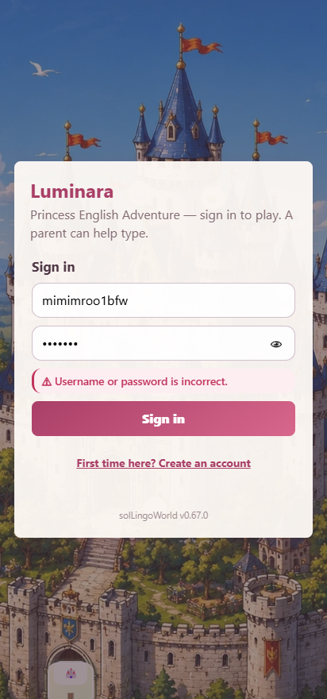

  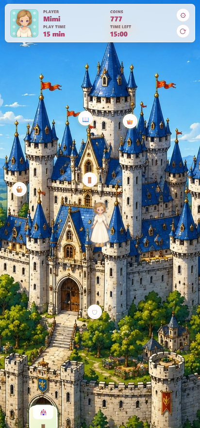
- **選角與命名**：首次進入會先選公主外觀、輸入名字並設定視覺主題——新帳號會先取得一次性隨機識別色與背景花紋（如波浪、泡泡、格紋等），玩家可改從飽和度較低的粉彩色盤選擇、用調色器自訂任一色，或改選背景花紋；之後可再叫出此畫面重選外觀、改名、改色或改花紋（不影響既有進度）。可玩公主 roster 為 Lumi、Yumi、Rosa 三位；既有帶 `sol`（舊名 Mary）角色 id 的舊存檔於讀取時自動 fallback 為預設角色 `lumi`，可無縫升級至三角色 roster。選單、帳號卡與遊戲內人物資訊欄的大頭照卡片皆以該識別色的半透明底色鋪底。
- **地圖導覽**：World Map、Castle Map 與各地區地圖都有可移動的公主（鍵盤方向鍵走動），公主圖示放大後更醒目、清楚可見（不再使用識別色背板）。在 World Map 點選地區（Castle / Urban / Rural / Wild）時，公主會先走到該地點再進入，移動途中再點一次即略過直接進入；進入地區後於地區地圖再選地點。地區間移動一律先回 World Map 再進入。各地點的位置貼合地圖背景（例如出口在城門或道路、釣魚在河邊、商店在城內），不會擠成一團。進入地點後的 ADV 場景背景應是完整 `1024x1024` 童話手繪圖；若上下區域看起來只是模糊或延展補版，應回報為場景美術資產問題，而不是操作或瀏覽器問題。
- **答英文題**：在有 lesson 的地點聽情境句、從選項選出正確英文，答對得獎勵與學習紀錄；題目會貼合該場景主體、依地區英文等級分級（句型由淺到深），且由場景角色以第一人稱直接對公主說話、是貼近生活的對話（不是第三人稱旁白或考試題幹）。題目與每個選項都可分別**撥放英文**或**撥放中文**，但用中文會影響獎勵——見下節 [D. 中文協助與獎勵階梯](#d-中文協助與獎勵階梯)。答對獲得的 coins 會**即時顯示在對話場景畫面上**，不用離開場景就能看到金錢增加。
- **場景互動三模組（生活聊天／逛店／打工）**：生活聊天在每個可互動場景（含商店）預設都能進行，逛店與打工依場景開啟——詳見下節 [B. 場景互動](#b-場景互動生活聊天逛店打工)。
- **商店與換裝**：用 coins 在各地商店（逛店模組）購買外觀，於衣櫃試穿與穿戴；衣服、鞋帽與配件會依類別級對位範圍穿到公主身上，不需要的可退款換回 coins。**公主自己的房間用單一「換裝」按鈕打開右側衣櫃，和商店是同一套多欄貨架面板**——但衣櫃只穿、不買賣：每件衣物的**深粉紅按鈕**按一下穿上、字會變成「脫下」，再按一下就脫下；「換裝」入口按鈕本身與其他場景的按鈕一樣、不特別上色。在**桌機寬螢幕**，衣櫃（換裝與商店）面板會加寬、**一次完整列出所有可選衣物**不需捲動，且面板位於**公主立繪之後**，換裝時公主維持完整可見、不被面板遮擋。**新建帳號的公主以一套得體的入門造型起步**，且一開始只擁有身上所穿的那幾件，其餘髮型、衣服、鞋帽與配件都要靠答題賺 coins 到各地商店購買——讓「學英文→換裝」的成長從第一次遊玩就開始。
- **衣物對位調整（需本機 server）**：衣櫃中每件已擁有的衣物右側另有「**調整**」按鈕，點擊後以全螢幕 overlay 在不離開遊戲的前提下即時調整該單品的**位移、縮放與旋轉**——以五組滑桿（中心 X、中心 Y、寬、高、旋轉 -180°～180°）即時更新 overlay 內的 paper-doll 預覽；確認後按「儲存」將新對位寫回 sidecar，overlay 關閉後遊戲立即套用不需整頁重整；按「取消」丟棄本次調整，遊戲回到原位。此功能需 `node server.mjs` 在本機或家庭 LAN 中執行——寫回端點屬 dev 工具、不在自架正式服務內，故正式遊玩端（自架正式服務）可預覽但儲存會失敗並顯示提示。本功能不提供四角任意變形（warp/corners），對位調整限矩形邊界（left/top/right/bottom）配合旋轉。（2plan 初稿，待 dev／opr 校準。）
- **角色輪廓與陰影**：ADV 場景人物、公主紙娃娃、地圖上的公主圖示與頭胸部大頭照，應以透明角色外框產生清楚描邊與自然陰影，讓人物在複雜背景上仍可辨識。試穿時的亮色光暈只代表「正在試穿」狀態，不是角色常態可讀性的主要來源。
- **切換帳號與登出**：進入遊戲後可用返回初始選單按鈕回到登入／帳號選擇畫面，切換玩家（另一位玩家點自己的帳號卡輸入密碼）或調整公主設定；返回前會先把進度存到伺服器，不會重置進度，也不會解除尚未結束的休息鎖定。登出會撤銷這台裝置的登入狀態，下次需重新輸入密碼。玩家端沒有刪除帳號的功能（帳號管理屬維護者作業，見 [III.J 線上管理](#j-線上管理維護者)）。
- **操作**：支援觸控、滑鼠、方向鍵 / W·S、Enter、Space、數字鍵；場景互動採兩層動線——第一層場景選單用 `Leave` 回地圖，進入任一互動（生活聊天／打工／逛店／退款／換裝／提示）後一律用 `Back` 回到場景選單，可接著選別的互動。

## B. 場景互動：生活聊天、逛店、打工

> 本節為 2plan 初稿，行為細節待 dev／opr 校準。

每個地點用同一套場景模板，以模組旗標統一宣告要開啟的互動（不以商店為特例）：**生活聊天在每個可互動場景（含商店）預設都能進行**（公主自己的房間與城門除外），逛店與打工則依場景選擇性開啟。

- **生活聊天（Chat）**：場景人物會以第一人稱主動向公主寒暄（例如「早安，公主，今天海面很平靜」），公主再從選項中選出合適、口語自然的回應（像真的在聊天、可帶語氣詞，而非教科書例句），**每個可互動場景（含商店）都能聊**。聊天是輕鬆互動，每題只給 **2 個選項**。答對會**提升心情**並在護眼上限內**延長這次的可玩時間**——用意是讓孩子感受到「和人互動是滿足自己的需求（心情變好、想多待一會兒）」，而不是為了換取別人的回饋。聊天不發 coins。
- **逛店（Shop）**：用 coins 購買外觀並換裝（沿用既有商店機制）。
- **打工（Part-Time Job）**：場景人物會以第一人稱向公主提出一個**需要動腦的請求或抉擇**（例如「白花一直賣不完，我該怎麼辦？」、該先做哪件事、東西怎麼安排），公主從 **3 個選項**中選出**經過思考的決策、判斷或建議**來幫忙、賺取 coins——回應是真的在替對方拿主意、做選擇，而不是把對方的指令或眼前正在做的動作覆述一遍。公主答應幫忙時可以先說一句自然的應允語（「好啊，我可以…／沒問題／我來想想」）再接實質的判斷。任務可結合簡易數學或生活常識（例如算庫存、排順序）。打工所得即為勞動報酬。

一句話分流：**聊天回饋心情（精神需求）、打工回饋金幣（勞動所得）**，逛店則是花錢。

在同一個場景裡，做完一種互動會**回到場景選單**（`Back`），可以接著選別的——例如**聊天完再逛店**，不會被迫直接跳出場景；要離開場景回地圖時，在場景選單按 `Leave`。

## C. 可玩公主與換裝

> 本節已於 dev（issue #123）實作；待 opr 終驗。

可玩公主整理為三位可辨識角色：

- **Princess Lumi**：保留既有明亮公主方向。
- **Princess Yumi**：重製為深藍髮、冷色優雅系外觀，降低與其他角色的同質性。
- **Princess Rosa**：棕髮甜美系公主，但不把禮服、皇冠或背景固定進角色底圖。

（原 **Princess Mary**／舊 `sol` 已於 issue #277／#285 自 roster 移除；既有帶 `sol` id 之舊存檔讀取時自動 fallback 為 `lumi`。）

紙娃娃立繪採**共用 `body`（neck-down、含永久肌膚安全底著／粉色居家底層，使角色永不裸露）＋ 每位公主一張 `head`（臉＋預設髮型，承載髮色與識別）** 之分層合成：三位角色共用同一張 `body`、各自一張 `head`，皆為 `shared-512x768-v1`、`512x768` 透明 WebP，與同一套 wardrobe layer 對位。換裝時衣物疊在 `body` 底著之上、髮型 layer 須完全覆蓋 `head` 的預設髮，因此更換衣物或髮型時舊的不會殘留（解決過去 baked-in 底圖換裝後舊髮舊衣仍透出的雙重疊圖）。衣櫃的服裝分類精簡為四類——髮型、整件服裝（outfit）、鞋子與配件（帽子併入配件）；既有舊存檔載入時自動相容。三位公主的大頭照與帳號識別共用同一套頭胸裁切設定，會反映該帳號目前的即時穿搭；地圖上的公主圖示不再套用識別色背板。（美術與對位規格見 [II.C 換裝分層與美術資產](#c-換裝分層與美術資產)。）

## D. 中文協助與獎勵階梯

> 本節已於 dev（issue #73）實作；以下行為以實作為準，待 opr 終驗。

看不懂英文時可以先用中文理解題意再作答；但為了鼓勵先試英文，用不用中文會影響獎勵：

- 答題畫面的**題目**與**每個選項**都有兩個語音鈕：**撥放英文（En）**與**撥放中文（中）**。
- 獎勵階梯（每題各自計算）：
  - 沒按中文、**第一次**就答對 → **全額** coins。
  - 沒按中文、**第二次**才答對 → **半額** coins。
  - **按過中文**，或**第三次（含）以後**才答對 → **沒有** coins。
- 撥放英文不影響獎勵，只有按中文才算使用協助；換到下一題時重新計算。
- 中英文語音使用瀏覽器內建 Web Speech API；不同裝置可用的中文／英文 voice 不一，遊戲會優先選擇相符語言的 voice，缺少時退回可用預設聲音並繼續遊戲。

## E. 遊玩時間與休息（護眼）

> 本項為 2plan 初稿，行為細節待 dev／opr 校準。

為保護兒童視力，連續遊玩會逐步用掉「遊玩時間」：

- 開始遊玩後，遊玩時間會依真實時間逐步減少；用完時會自動結算這一回合的成果（這回合獲得的金錢、答題數與答題正確度）。
- 人物資訊欄會顯示本次可玩時間額度（基礎時長；生活聊天延長時會把多出來的分鐘一起標示出來）與剩餘可玩時間，不只顯示百分比。
- 結算後進入**強制休息**，休息時間結束前無法繼續遊玩，時間到才解鎖；休息／結算畫面可返回初始帳號／公主選單，但選回同一帳號仍維持休息鎖定。
- 每次**遊玩時長**與**休息時長**預設各 15 分鐘，可在設定調整；新帳號的預設值可由維護者於線上管理頁調整。若維護者對這個帳號**鎖定了時長**（家長管控），設定裡的時長欄位會變成唯讀並標示「由維護者管理」——見 [III.J 線上管理](#j-線上管理維護者)。
- 在護眼上限內，**生活聊天答對可延長這次的可玩時間**（最多到護眼上限為止，不會無限延長）。
- 遊玩時間與休息以**各帳號各自計算**，切換帳號各自獨立計時。

## F. 角色聲音

> 本節穩定播放與診斷已於 dev（issue #109）實作；依角色類型指定語音與首字前置留白已於 dev（issue #134）實作並以 `?selftest=voice` 驗證，實機聽感仍待 opr 終驗。issue #246 規劃把「角色語音指定」由玩家設定移入維護者用的管理設定工具（聲音管理頁籤），公開遊玩端改為一律自動選用——本段對應描述為 2plan 初稿，待 dev／opr 校準。

為了讓角色更有臨場感，不同人物會用**貼合自己角色的聲音**說話，而不是全部同一個語調：

- 場景裡的人物（國王、王后、廚娘、騎士⋯）會依各自特性（性別、年齡、性格等）以不同聲音念出對白與開場白。
- 你操作的**公主**在**選定一個選項作答**時，會用公主的聲音把你選的答案唸出來。
- 這些語音沿用畫面上既有的 **Voice 開關**：關閉時所有角色語音都靜音。
- 聲音以瀏覽器內建 Web Speech API 呈現；系統會等待瀏覽器 voice 清單載入後挑選合適 voice，缺對應設定時自動退回預設嗓音，不會出錯或卡住。
- 公開遊玩端的角色語音**一律由系統自動選用**：依各類角色（性別×性格）挑選同性別的合適瀏覽器語音，沒有指定的類型會自動沿用同性別的指定，再不然依語言挑選合適 voice；角色的年齡等差異仍以音高／語速表現。一般玩家／家長不需要也無法在遊戲設定裡逐一挑選語音。
- **角色語音指定改為維護者作業**（issue #246）：要把某類角色（依**性別與性格**）綁定到特定的瀏覽器語音（如 Windows 內建語音），由維護者在本機 dev 環境開啟**管理設定工具**的**聲音管理頁籤**設定；此設定為整台裝置共用（device-wide），正式遊玩端不提供這個入口（見 [III.I 本地端管理模式](#i-本地端管理模式維護者)）。
- 為了讓兒童更容易聽清楚，語音會以**較慢的速度**朗讀（基準約為原本速度的 90%），英文與中文協助都一樣放慢；各角色之間的相對快慢仍會保留。
- 為避免中英文與角色語音第一個字被吃掉，語音在送出前會於**開頭加入少量空白**延後首字，並以集中式 speech manager 管理佇列、重播與停止。
- **離開場景時**（關閉對話、切換場景或返回地圖）會即時停止正在播放的語音；**在場景裡進出子互動或返回場景選單時**，也會即時停止前一段語音、改接當下話題。
- **同一個場景的歡迎詞每次造訪只播一次**：第一次進入場景時角色會打招呼，之後在子互動與場景選單之間往返不會重複播放；離開場景回地圖後再次進入，才會再招呼一次。
- 維護者可用語音診斷紀錄檢查實際採用的 voice、語言、pitch、rate、播放事件、錯誤代碼與 fallback 原因。

## G. 存檔與還原

- 進度（coins、穿搭、日記、位置、所選角色、名字與識別色）會以**目前登入帳號**為單位**自動存到伺服器**：閒置時變更立即寫入、連續操作在約 2 秒內合併寫入，登出與離開頁面時再補存一次；重整或換裝置登入同帳號皆還原到最後保存的進度。設定頁會顯示目前登入的帳號（Signed in as）。
- 兩台裝置同時玩同一帳號時，較新的進度**不會被靜默蓋掉**：偵測到他裝置有較新存檔會先詢問「要載入較新的進度嗎？」。
- 伺服器暫時連不上時遊戲**不會中斷**：畫面會提示同步狀態、你可以繼續玩，恢復連線後自動補存。
- 可於 Save / Load 介面**匯出 Markdown 存檔**作離線備份，也可**匯入**還原（匯入結果會成為目前帳號的伺服器進度）；缺漏或舊格式存檔會自動正規化回安全預設（含舊 `sol` 角色自動升級為 `lumi`）。舊版玩家可用「匯出→新版匯入」或登入畫面的「匯入本機舊進度」完成遷移。

## H. 關於與版本沿革（About）

> 本項為 2plan 初稿，版本沿革回填內容待 dev／opr 校準。

設定選單新增 **About** 頁籤，集中呈現「關於這個作品」的資訊：

- **開啟方式**：點畫面右上角 ⚙ 開啟設定選單，切到 **About** 頁籤。
- **版權宣告**：`carlton0521@gmail.com, copyright reserved, 2026`。
- **授權條款**：本作品採 [PolyForm Noncommercial License 1.0.0](LICENSE)（非商業用途、姓名標示）——可自架自用與非商業散佈，商業使用需另洽。
- **版本沿革**：以中文短主旨列出歷次版本「改了什麼」，方便家長與孩子了解每次更新（預設呈現最近 10 個版本）。
- 原本顯示在 Settings 的版本與建置時間，改併入 About 一併呈現，Settings 不再另列版本卡。

## I. 本地端管理模式（維護者）

> 本節說明「在本地端使用時會開啟的管理模式」。此模式**只在本機 dev 環境出現，正式遊玩端（自架正式服務）不提供任何入口**。

當你把專案跑在**本機（localhost）或家庭 LAN** 的伺服器上時（`node server.mjs`），會多出一個**管理設定工具**（`tool/wardrobe-tuner.html`），供維護者集中調整各項內容組態；正式遊玩端（自架正式服務不含此寫回端點）不會顯示這個入口。

- **開啟方式**：以 `node server.mjs` 啟動本機伺服器後開啟管理設定工具頁；`server.mjs` 預設監聽 `0.0.0.0`，啟動 log 會顯示 LAN IP，**同一家庭區網內的手機或平板可直接以該 IP 開啟**管理設定工具。若需指定監聽位址，可設 `HOST` 環境變數覆寫（例：`HOST=127.0.0.1 node server.mjs`）。
- **可管理什麼**：工具導覽**依 `content-package/` 的內容資料包組織**——頂層為公主、衣物、地圖與場景、聲音、遊戲規則等資料包，地圖與場景再依「世界 → 地區 → 地點／場景 → 對話」分層；各設定（衣物單品與投影對位、**衣物旋轉角度**、地圖座標、場景對話、**角色語音指定**、新局起始等）歸入其所屬資料包節點。新增內容或設定頁時沿資料包結構擴充、不必重排既有動線。
- **儲存需本機伺服器**：衣物對位、旋轉、場景對話等編修按「儲存」後會**寫回 sidecar／資料檔**，因此需要本機或家庭 LAN 的 `node server.mjs`；正式遊玩端（自架正式服務）只能預覽、儲存會失敗並顯示提示。
- **UI 規範**：工具 UI 採 `[hmiIntf通用視覺規範]`（MD3 基座之管理網站規範），主題色沿用遊戲低飽和粉彩識別色系（種子見 `docs/design-visual/`）。（本段為 2plan 初稿，導覽與視覺收斂待 dev 落地校準。）

**擴充內容（給維護者）**：area、角色、可玩公主、衣物與場景背景都是 `content-package/` 下的**模組化內容包**，新增／調整內容時優先只動單一包與少量 registry 設定，不必改核心引擎。可玩公主須共用 `shared-512x768-v1` rig（共用 `body`＋per-character `head` 分層，見 [II.C 換裝分層與美術資產](#c-換裝分層與美術資產)）。新增或重製 wardrobe 素材、ADV 場景背景時須遵守 [II.C](#c-換裝分層與美術資產) 的資產尺寸／檔重預算與童話手繪 bitmap 規則（禁 SVG／濾鏡補足），並以手機直向與桌機視口做視覺 QA；`?selftest=data-audit` 會一併檢查全資產的尺寸與檔重並列出超標清單。細部規則見：

- 內部設計 SSOT：[docs/design.md](docs/design.md)
- 角色尺度與美術契約：[contract-local/hmiIntf自訂角色尺度與美術規範.md](contract-local/hmiIntf自訂角色尺度與美術規範.md)
- 技術選型與契約：[contract-common/](contract-common/)、[contract-local/contract-index.md](contract-local/contract-index.md)
- agent 操作規則：[AGENTS.md](AGENTS.md)

## J. 線上管理（維護者）

> 本節已於 dev（issue #310）實作，截圖為真堆疊端對端實測畫面；待 opr 終驗。

你（部署遊戲的家長／維護者）可以直接用瀏覽器管理這台伺服器——不用開終端機、不用改檔案。開 `http://<主機IP>:4180/admin/`、用 admin 帳密登入（admin 帳號在部署時以 `ADMIN_USERNAME`／`ADMIN_PASSWORD` 環境變數建立；孩子的玩家帳號登入這裡會顯示「此帳號無管理權限」）。

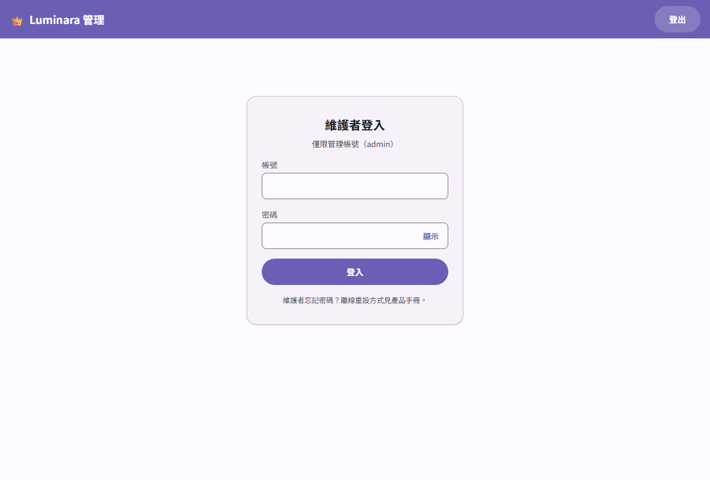

**「帳號」分頁——管理全家的玩家帳號**：

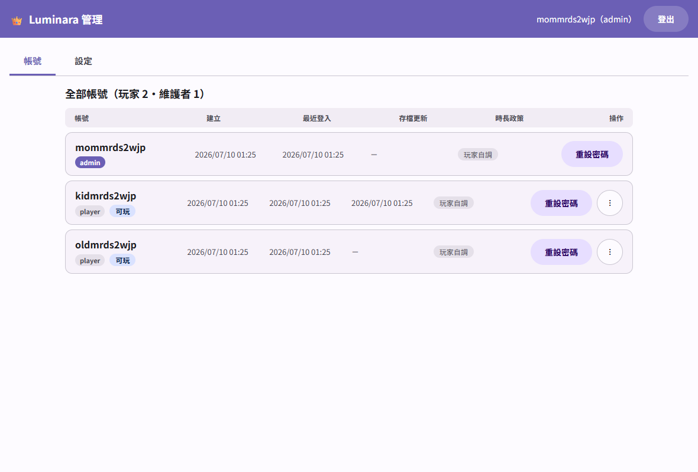

- 看清單：每個帳號的建立時間、最近登入、存檔更新時間與目前「可玩／休息中」狀態，一眼看出誰在玩、誰久沒玩。每列的進階操作收在 `⋮` 選單裡。
- **孩子忘記密碼**：點該帳號的「重設密碼」、輸入新密碼即可（規則同註冊：至少 6 位）；重設後孩子所有裝置需用新密碼重新登入。改**自己（admin）**的密碼也是同一顆按鈕——目前這台不會被登出，其他裝置要用新密碼重登。

  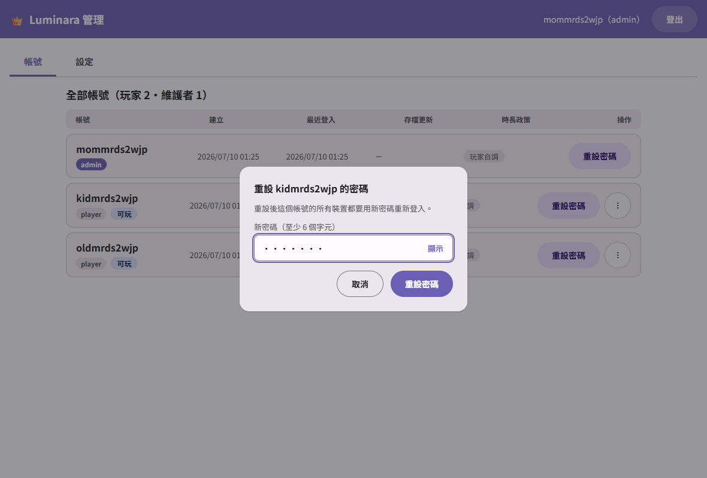

- **時長鎖定（家長管控）**：`⋮` → 「時長覆寫與鎖定」，對單一帳號設定強制的遊玩／休息時長並鎖定，孩子端的時長設定會變唯讀；孩子正在玩時，新時長會隨下一次自動存檔傳到孩子裝置、**從下一個遊玩回合開始生效**（進行中的回合照原時長跑完）。解除鎖定後，孩子原本自己調的時長會恢復、不會被洗掉。此管控是家長管理的輔助（由遊戲程式執行）、不是防駭技術防線。

  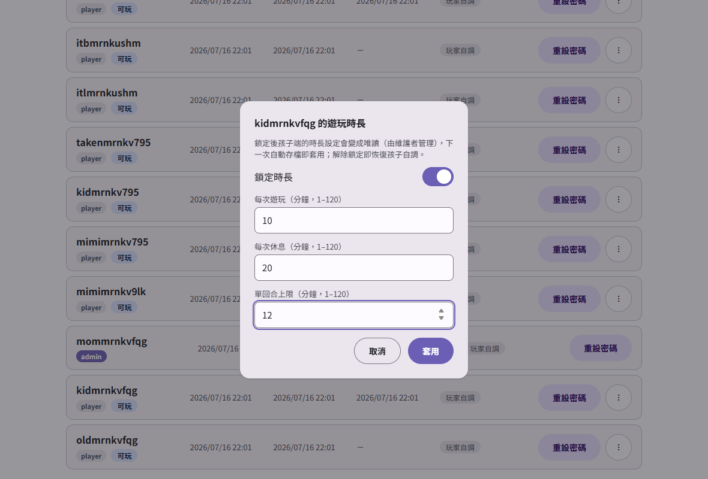

  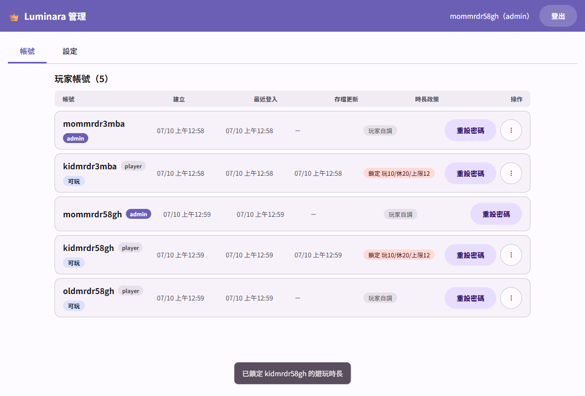

  孩子端看到的樣子（設定欄位唯讀、標示由維護者管理）：

  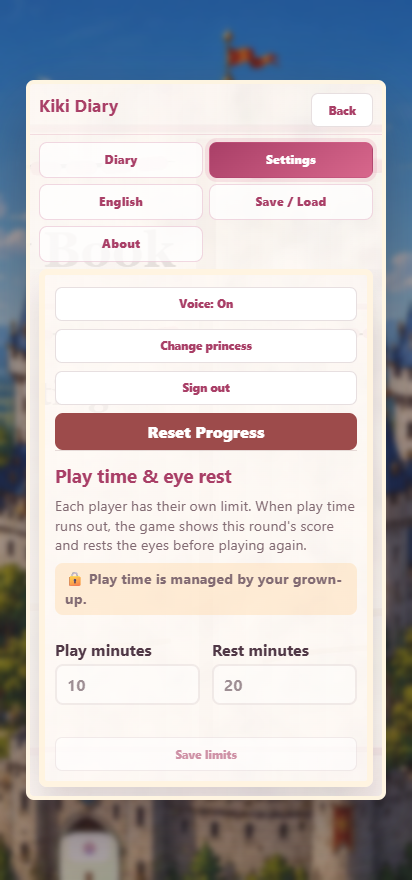

- **撤銷登入**：讓該帳號所有裝置立刻登出（例如平板借人忘了登出）。
- **刪除帳號**：帳號、存檔與登入狀態一併刪除、**無法復原**，會要求二次確認；admin 自己的帳號不能刪（防把自己鎖在門外）。

  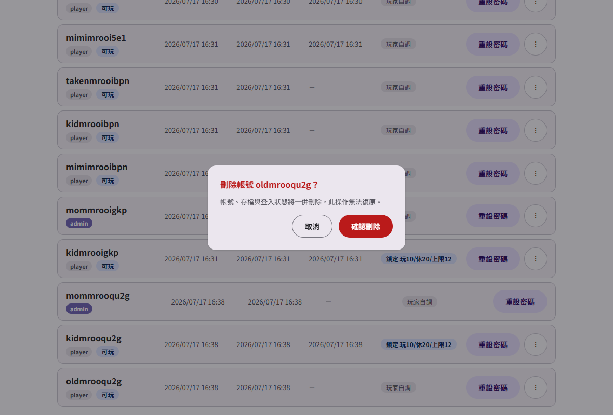

**「設定」分頁——執行期遊戲設定（儲存即生效，不用重新部署）**：

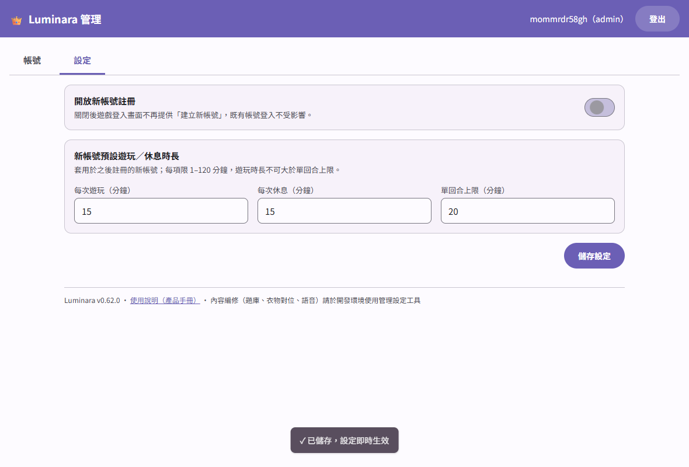

- **開放新帳號註冊**：全家帳號都建好後可以關掉，陌生人拿到網址也無法註冊；關閉後登入畫面不再顯示「Create new account」、改顯示英文說明（含「請找家長」提示），既有帳號不受影響。孩子端看到的畫面：

  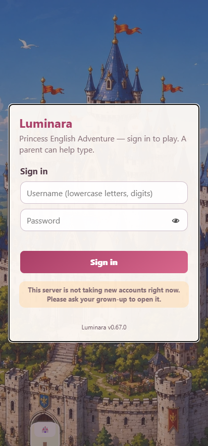

- **新帳號預設遊玩／休息時長**：之後註冊的新帳號一開始就用你設的時長（每項 1–120 分鐘，遊玩時長不可大於單回合上限）。
- **設定沒儲存就想離開？** 切回「帳號」分頁或按「登出」時會先跳出確認框（「留在此頁／放棄變更」），不會默默丟掉你改到一半的設定。分頁也支援鍵盤操作：焦點在分頁上時按 ←／→ 方向鍵即可切換。

  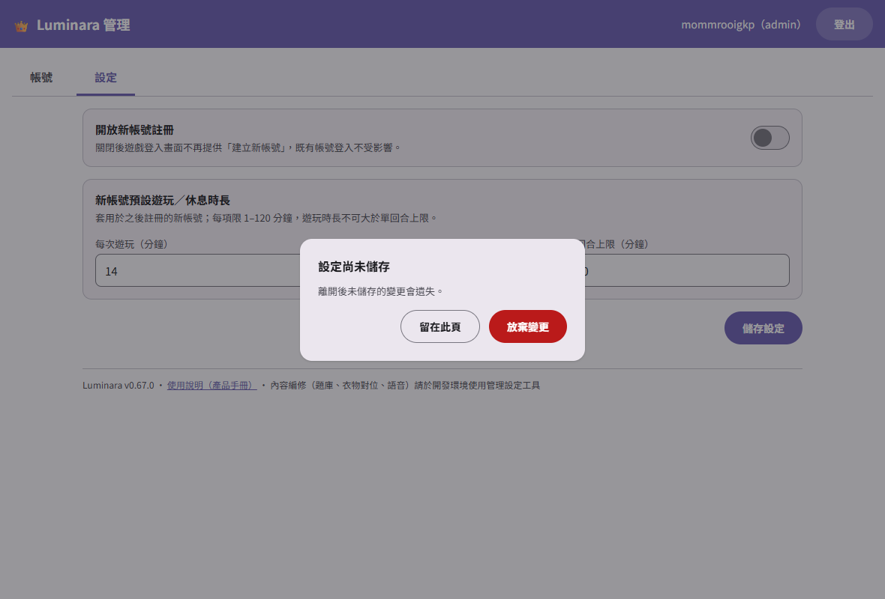
- 這一頁的開關與欄位都要按「**儲存設定**」才寫回（有未儲存的變更時離開會提醒）。

管理頁在手機上也可用（清單自動改為卡片式）：

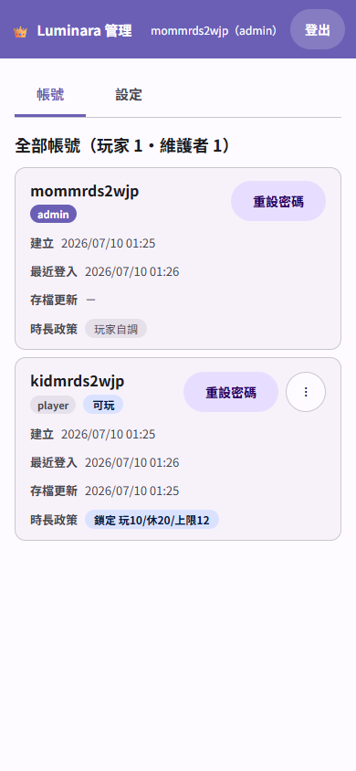

**分界提醒**：這裡管的是「這台伺服器的營運」（帳號與執行期設定）；要改**作品內容**（題庫、衣物對位、角色語音、新局起始）請用 [III.I 本地端管理模式](#i-本地端管理模式維護者) 的管理設定工具（dev 環境、隨版本發行）。（設計期參考稿見 [docs/design-visual/](docs/design-visual/)，以本節實測截圖為準。）

---

# IV. 備註說明

## A. 意見反映（ISSUE 登記）

- 有問題回報、玩法建議或內容修訂需求，請於本專案的 **GitHub Issues** 登記；每則 issue 一個主題，附上重現步驟或期望行為。
- 開發與設計流程以 issue 為單位推進（obj → plan → code），故意見一律走 issue 追蹤，方便對應到後續的設計與變更紀錄。

## B. 修訂紀錄

- 2026-07-14（issue #322）：**改名收斂＋文件升版**，遊戲玩法零變更、玩家無感。repo 遠端改名後全面對齊——方案 codename `solKidGalGame`→`solLingoWorld`，對外發行物 container image 與 helm chart 收斂為**單一名幹 `sollingoworld`**（汰換舊 image `solkidgalgame1`／chart `solkidgalgame` 之不一致；**維護者若曾以舊 `solkidgalgame` 名腳本化拉取 chart／image，請改用 `sollingoworld`**）；遊戲內品牌 `Luminara — Princess English Adventure` 與 helm release／資料庫名 `luminara` 沿用不改。同時把 [docs/design.md](docs/design.md) 由 formatVersion 2.0 完整升 3.3（正典三章四件套、SOP 三錨、四層技術選型綁層宣告、系統模型矯正為單一 sys＋4 mod）。本項已於 dev 完成並全測試驗證（sysApi 單元 52·涵蓋率 91.87%／整合／chartLint／e2e-helm 23 檢核全綠／docLint 0），待 opr 終驗。
- 2026-07-10（issue #320）：發行 image 內建 npm CLI 升級（deploy-only、遊戲行為零變更），修補 base image 隨附 npm 之兩筆 HIGH 依賴漏洞（發佈列車 Trivy 成品掃描攔下後循修復快車道處置）；app 依賴不受影響。
- 2026-07-10（issue #317）：登入畫面帳號卡可「自本裝置移除」（點兩次確認、僅移除本機卡片、伺服器帳號與進度不受影響、重新登入即回復）；線上管理頁分頁支援鍵盤方向鍵切換，未儲存就切分頁或登出改以頁面一致確認框攔下，頁尾顯示實際版號；部署包補 app 容器資源預設與安全性硬化。
- 2026-07-10（issue #311）：**對外發行改制**——正式散佈單位改為「容器 image＋helm chart 整包」：具 Kubernetes 的家庭主機可 `helm install` 一鍵部署整套（遊戲＋API＋管理頁＋資料庫）、`helm upgrade` 升級不失資料（PVC 持久化）、`helm uninstall` 預設保留資料卷；備份還原程序文件化。原 GitHub Pages 公開站（自 #309 起實質不可玩）**正式關閉下線**、README 移除公開網址；compose＋npm 動線降級為開發期路徑。design.md 新增 spec#27、研改 spec#7，並依技術選型四層改制矯正宣告（單一 sys＝techApp遊戲webApp；資料庫升列 techStackPostgres）。本項已於 dev 實作並以本機 k3s 真裝驗證（chartLint 機判＋e2e-helm 22 檢核全綠：安裝→升級資料保全→備份毀損還原實走→uninstall 保留→重裝續用），待 opr 終驗。
- 2026-07-10（issue #310）：設計**維護者線上管理**——新增 `/admin/` 線上管理頁：帳號管理（清單、線上重設密碼、撤銷登入、刪除帳號；孩子忘記密碼不再需要伺服器指令，CLI 降級為 admin 自身忘記密碼之離線後門）與執行期遊戲設定（新帳號預設遊玩／休息時長、個別帳號時長覆寫與鎖定之家長管控、註冊開關），設定存資料庫、儲存即生效不需重佈；admin 帳號由部署環境變數建立，管理 API 一律驗 admin 身分；並收斂 #309 審查後續辦理之伺服器防護三項（速率限制僅計失敗、過期 session 清理、存檔形狀校驗）。新增 design.md spec#25／spec#26、研改 spec#8／#9／#23。本項已於 dev 實作並驗證（sysApi 單元 52＋admin 整合 55 檢核、真堆疊管理 e2e 22 檢核、全套 22 selftest 綠；測試改用專用 `luminara_test` 資料庫不污染營運庫），待 opr 終驗。
- 2026-07-09（issue #309）：**方向轉換**——由「純靜態 GitHub Pages＋瀏覽器本機存檔」轉為「**自架伺服器＋帳號雲端存檔**」：玩家以小寫英文帳號＋至少 6 位密碼註冊登入（家長可協助），進度以帳號為單位存於伺服器（PostgreSQL）、跨裝置還原；遊戲端維持靜態無框架網頁（「靜態遊戲殼＋node API 核」），新增 node API 建置單元承接註冊、登入、session 與存檔；舊存檔可經 Markdown 匯入或登入畫面「匯入本機舊進度」一鍵遷移；玩家端不提供刪除帳號（帳號管理屬維護者，於 #310 提供）。GitHub Pages 免安裝版不保留（維護者裁決）——公開網址自本增量起不再可玩，Pages 於 #311 隨 helm 整包發行正式關閉退場。廢改 design.md spec#7／spec#8、新增 spec#23／spec#24。本項已於 dev 實作並以真堆疊端對端驗證（sysApi 單元 31＋整合 27、全套 22 selftest、跨裝置 e2e 10 檢核全綠），待 opr 終驗。
- 2026-07-03（issue #297）：優化管理設定工具使用體驗（dev-only 維護工具，**不影響公開遊玩端**）。依專業盤點的 20 項問題分四類修正：**工作保護**（未儲存變更離頁警示、寫回成功不再整頁重載、保留工作點）、**回饋一致**（原生 alert/confirm 全面改為 MD3 風格對話框與 snackbar、危險操作紅色系確認）、**編輯效率**（衣物框數值輸入與方向鍵微調、單件還原、套用前變更清單、AI 生成「生成→對照→採納」三步）、**導覽與小螢幕**（深連結記住分頁內工作點、收合導覽可辨識、窄視口導覽浮出式、觸控目標 ≥44px、預覽雙指縮放）；並把工具樣式檔（1596 行）依分頁解體、硬寫色收斂為 MD3 token、移除 structureLint 豁免。設計決策見 [docs/design.md](docs/design.md)（spec#22、solStory#23、sysStory#15、paramToolUxQualityBar、intTest#67–#69）。本項為 2plan 初稿，待 dev／opr 校準。
- 2026-07-03（issue #298）：內部結構重構，**不影響玩法、玩家無感**。把累積成巨石的核心程式 `game-engine/main.js`（4052 行、282 個函式擠在一檔）依關注點拆解為模組——語音、ADV 場景流程、商店／衣櫃、地圖、HUD 渲染、遊玩時鐘、持久化、選單畫面、事件接線各自歸位（沿既有 `game-engine/` 資料夾慣例、不另創架構），`main.js` 收斂為 256 行的組裝與調度；同時把層層補丁疊加的 `styles/mobile.css`（4083 行）內同選擇器重複覆寫全數收斂歸零、依畫面域解體為八個 ≤800 行的分層樣式檔。全程行為零變更：以 40 張手機直向＋桌機雙視口截圖做像素級回歸比對、全部 21 個 selftest 與 tsc 維持綠。並新增**結構守門** `node scripts/structureLint.mjs`（單檔行數上限、CSS 重複規則塊歸零，納入常備守門），防止巨石長回。順帶修復三處既有守門缺陷（兩件 urban hand 配件長邊貼滿重正規化＋等視覺補償對位、monkey 測試誤點 dev 導航鈕、voice 測試套件順序相依）。設計決策見 [docs/design.md](docs/design.md)（模組實作對照、paramStructureQualityBar、intTest#66）。
- 2026-06-25（issue #259）：內部整理，**不影響玩法、玩家無感**。把遊戲「起始狀態」的設定（過去全部擠在同一個 `default-state.js` 物件裡）依語意在**同一個檔案內**整理成三個具名區塊——**公主新局設定**、**起始位置**、**遊戲規則與家長**；對外仍合成同一個 `defaultState`，與 #260 管理設定工具的三個分頁關注點一致。**起始值與舊存檔相容完全不變**。設計決策詳見 [docs/design-issue259.md](docs/design-issue259.md)。本項為 2plan 初稿，待 dev／opr 校準。
- 2026-06-22（issue #246）：設計把「角色語音指定」從玩家設定搬到維護者用的**管理設定工具**（聲音管理頁籤），玩家設定只保留 **Voice On/Off** 總開關，公開遊玩端不再提供語音指定入口、未指定角色類型一律自動依性別與語言挑選。連帶把 spec#2／solCase#12.5 的語音指定位置由「玩家於設定」回修為「維護者於管理設定工具」。設計決策詳見 [docs/design.md](docs/design.md)。本項為 2plan 初稿，待 dev／opr 校準。
- 2026-06-22（issue #252）：修正城堡地圖入口（城門）圖示在公主接近時異常消失。改為**以圖示的中心點是否在可視範圍內來判定**顯示／隱藏，世界／城堡／地區三地圖一致、無城門特例、不動座標，且只會讓更多貼邊圖示顯示、不會讓任何圖示消失。已新增 `?selftest=marker-visibility` 守門並回歸相關 selftest。設計決策詳見 [docs/design-issue252.md](docs/design-issue252.md)。本項為 dev 實作，待 opr 終驗。
- 2026-06-21（issue #210）：設計把衣物改成「一個地區一家服飾店、一家店賣一個資源包」——每個地區只保留一家衣物商店、對應一個可含多類別（含髮型）的資源包，店內仍以類別分頁瀏覽。既有存檔已購買衣物以 id 記錄不受影響。設計決策詳見 [docs/design-issue210.md](docs/design-issue210.md)。本項為 dev 實作，待 opr 終驗。
- 2026-06-20（issue #205）：設計把打工「Work」消失的時機從「答對」改為「**實際賺到 coins**」——答對但沒拿到 coins（中文協助／第三次以上）時 Work 不消失、本週期還能再作答。每場景每週期仍「賺到一次就消失」。已以 `?selftest=job-cycle` 等回歸自測。設計決策詳見 [docs/design-issue205.md](docs/design-issue205.md)。本項為 dev 實作，待 opr 終驗。
- 2026-06-20（issue #196）：設計把每件衣物收斂為**單一一張 `512×512` 圖**，既當投影素材也直接當商店方塊預覽，長邊貼滿、透明 WebP；素材以影像模型重繪並用三層描述詞驅動。設計決策詳見 [docs/design-issue196.md](docs/design-issue196.md)。本項為 2plan 初稿，待 dev／opr 校準。
- 2026-06-20（issue #204）：改善打工與生活聊天題目品質——打工正解一律為經過思考的決策／判斷／建議（非題幹複述），生活聊天維持自然社交回應。已落地四地區 42 道打工複述題改寫、57 個聊天超現實干擾選項改為情境內回應，並新增 data-audit 守門。設計決策見 [docs/design.md](docs/design.md)。本項為 dev 實作，待 opr 終驗。
- 2026-06-20（issue #197）：為各類圖像資產建立**標準尺寸與檔重預算**（`paramAssetStandards`），擴充 `?selftest=data-audit` 對所有圖像資產同時檢查尺寸與檔重，並把 9 張超標地圖／場景重壓縮至預算內。設計決策與 GATE 紀錄詳見 [docs/design-issue197.md](docs/design-issue197.md)。本項為 dev 實作，待 opr 終驗。
- 2026-06-20（issue #199）：已強化角色立繪輪廓辨識——常態可讀性改以貼合 alpha 外框的深色描邊與自然景深陰影，試穿光暈保留為互動狀態提示。設計決策已納入 [docs/design.md](docs/design.md) 與 [contract-local/hmiIntf自訂角色尺度與美術規範.md](contract-local/hmiIntf自訂角色尺度與美術規範.md)。本項為 dev 實作，待 opr 終驗。
- 2026-06-20（issue #195）：已移除「整套穿搭」一鍵換整套商品，回歸逐件單品購買穿戴，確立「單品單層」原則；披風／外套統一單層呈現。設計決策詳見 [docs/design-issue195.md](docs/design-issue195.md)。本項為 dev 實作，待 opr 終驗。
- 2026-06-19（issue #179）：已重繪並替換 16 張上下區域疑似模糊補版的 ADV 場景背景（維持單張 `1024x1024` WebP），並新增 `?selftest=visual-qa` scene-art contact sheet／單場景截取；QA 40/40、0 review warning。設計決策詳見 [docs/design-issue179.md](docs/design-issue179.md)。
- 2026-06-19（issue #181）：把各地區打工報酬差距再收斂為城堡 100／市區 105／鄉村 110／森林 115（最大約 1.15 倍），商店定價維持 #157 不動。詳見 [docs/design-issue181.md](docs/design-issue181.md)。本項為 2plan 初稿，待 dev／opr 校準。
- 2026-06-19（issue #180）：設計讓公主在地圖上永遠顯示在最前面、不被地圖圖示或裝飾元素遮住（但不蓋過操作面板）；涵蓋地區／城堡／世界三地圖。設計決策詳見 [docs/design-issue180.md](docs/design-issue180.md)。本項為 2plan 初稿，待 dev／opr 校準。
- 2026-06-19（issue #178）：已改善鍵盤在地圖上走路手感——由遊戲自管按住方向並以連續移動迴圈推進（不等系統重複延遲）、加快移速，鬆鍵／失焦即停；涵蓋三地圖。已以 `?selftest=map-walk` 等自測。設計決策詳見 [docs/design-issue178.md](docs/design-issue178.md)。
- 2026-06-19（issue #167）：已統一場景對話方塊的選項樣式並讓選購時看得見試穿——選項配色收斂為同一套暗色玻璃樣式、逛店／退款／換裝對話背景更透明。已以相關 visual QA 驗證。設計決策詳見 [docs/design-issue167.md](docs/design-issue167.md)。本項為 dev 實作，待 opr 終驗。
- 2026-06-19（issue #177）：已實作杜絕同一遊玩週期內重複刷錢——每場景打工每週期最多答對賺一次，答對後該場景 Work 於本週期消失、休息後重置；聊天不受限。已以 `?selftest=job-cycle` 自測。設計決策詳見 [docs/design-issue177.md](docs/design-issue177.md)。
- 2026-06-19（issue #176）：修正衣物對位機制——每類別可各自設定投影目標範圍，素材一律等比縮放落進該範圍，任意尺寸素材皆正確對位；強化 Wardrobe Tuner 工具。設計決策詳見 [docs/design-issue176.md](docs/design-issue176.md)。本項為初稿，待 dev／opr 校準。
- 2026-06-19（issue #164）：擴充場景內切換時的語音行為——場景內進出子互動或返回場景選單時即時停止前段語音；同場景歡迎詞每次造訪只播一次。設計決策詳見 [docs/design-issue164.md](docs/design-issue164.md)。本項為 2plan 初稿，待 dev／opr 校準。
- 2026-06-19（issue #168）：已實作 wardrobe 服裝對位與素材規則——依 `wardrobeLayerBoundsByType` 類別級 render bounds 與 `safeBox` 對位，data-audit 檢查 layer type／bounds／alpha safeBox 與素材需為童話手繪 bitmap（禁 SVG）。已以 data-audit 與 wardrobe-detail visual QA 驗證。
- 2026-06-19（issue #163）：已實作預設可玩公主與初始主題修訂（Yumi 深藍髮、原 Sol 對外改名 Mary、新帳號識別色與花紋一次性隨機並保存），角色 base 校準為童話手繪 raster、不用 SVG／濾鏡。已以相關 visual QA 驗證。
- 2026-06-19（issue #161）：地圖公主圖示放大約一倍並移除腳下識別色橢圓背板，圖地分離改倚賴角色深色投影與白描邊。設計決策詳見 [docs/design-issue161.md](docs/design-issue161.md)。本項為 2plan 初稿，待 dev／opr 校準。
- 2026-06-19（issue #166）：設計讓有販售的地點以方形圖示呈現，與一般地點（圓形）、城門（門形）區隔。設計決策詳見 [docs/design-issue166.md](docs/design-issue166.md)。本項為 2plan 初稿，待 dev／opr 校準。
- 2026-06-19（issue #165）：簡化生活聊天完成回饋為僅顯示「+1 mood」，心情加值與護眼時長延長機制不變。詳見 `docs/design-issue165.md`。本項為 2plan 初稿，待 dev／opr 校準。
- 2026-06-19（issue #169）：修正帳號選擇的休息鎖定——休息從「遊玩結束」起算、離開的時間計入休息，帳號卡據實顯示 Rest 剩餘或 Ready 並即時遞減。屬護眼休息邏輯修正。
- 2026-06-18（issue #156）：設計修正離開場景時的語音收束——離開場景即時停止語音、不殘留跨場景（瀏覽器無法淡出時以即時停止作為明確降級）。設計決策詳見 [docs/design-issue156.md](docs/design-issue156.md)。本項為 2plan 初稿，待 dev／opr 校準。
- 2026-06-18（issue #157）：打工報酬與商店定價再平衡——報酬由陡峭階梯改為平緩等差（城堡 50／市區 60／鄉村 70／森林 80），商店定價同步壓平。詳見 `docs/design-issue157.md`。本項為 2plan 初稿，待 dev／opr 校準。
- 2026-06-18（issue #153）：設計修正選角流程與地圖公主可視性——已有其他帳號時創角提供取消／返回路徑，地圖公主可視性提升。設計決策詳見 `docs/design-issue153.md`。本項為 2plan 初稿，待 dev／opr 校準。
- 2026-06-18（issue #155）：設計強化對話自然性——公主回應更口語自然，被拜託幫忙時一律先以自然應允語句開頭再接實質回答。改寫規則詳見 [docs/design-issue155.md](docs/design-issue155.md)。本項為 2plan 初稿，待 dev／opr 校準。
- 2026-06-18（issue #125）：設計重新配置地圖地點位置，對應地圖背景藝術元素且不過度群聚。本項為 2plan 初稿，待 dev／opr 校準。
- 2026-06-18（issue #149）：場景對話全量改寫定調——一律第一人稱、題幹為角色台詞、選項為公主回應；打工每場景 3 題、聊天 2 題。各區英文分級不變（Castle Dolch、Urban Starters、Rural Movers、Wild Flyers）。改寫規則詳見 `docs/design-issue149.md`。本項為 2plan 初稿，待 dev／opr 校準。
- 2026-06-18（issue #143）：統一場景互動的離開動線——第一層場景選單用 `Leave` 回地圖，進入任一互動後一律用 `Back` 回場景選單。本項為 2plan 初稿，待 dev／opr 校準。
- 2026-06-18（issue #134）：改善角色語音——新增可於設定為各角色類型指定瀏覽器語音的音色挑選層（同性別繼承式預設、可逐桶覆蓋），並於送入 Web Speech API 前加入首字前置留白。已於 dev 實作（`?selftest=voice`），待 opr 終驗。
- 2026-06-17（issue #131）：設計強化公主主題顏色應用——識別色改為 8 種低飽和粉彩＋調色器自訂，新增背景花紋，大頭照底色改識別色半透明鋪底。本項為 2plan 初稿，待 dev／opr 校準。
- 2026-06-17（issue #138）：設計對話內容調整——生活聊天改為每個可互動場景（含商店）預設都能進行、每題 2 選項，打工題庫全面稽核切合場景。本項為 2plan 初稿，待 dev／opr 校準。
- 2026-06-17（issue #135）：設計場景對話改版——每場景單一模板、可選擇性開啟聊天／逛店／打工三互動，題庫貼合場景並依地區英文等級分級。本項為 2plan 初稿，待 dev／opr 校準。
- 2026-06-16（issue #109）：已實作 Web Speech API 語音品質改善——約 80% 語速、voice 載入與 `voiceschanged` fallback、語音佇列／replace-last、錯誤碼降級與診斷紀錄。已以 `?selftest=voice` 驗證，待 opr 終驗。
- 2026-06-16（issue #126）：已實作兒童休息與帳號／公主辨識流程修訂——遊玩／休息預設各 15 分鐘、人物資訊欄顯示剩餘可玩時間、休息鎖定不可繞過、共用頭胸大頭照與 profileColor。已以相關 selftest 驗證。
- 2026-06-16（issue #123）：依使用者提供 PNG 重製可玩公主 base，轉透明 WebP 對位到 `shared-512x768-v1`，選角畫面直接裁切 base 頭胸特寫。待 opr 終驗。
- 2026-06-15（issue #110）：設定選單新增 About 頁籤，集中呈現版權宣告與歷次版本中文短主旨（預設最近 10 版），版本與建置時間併入 About。本項為 2plan 初稿，待 dev／opr 校準。
- 2026-06-15（issue #99）：統一各地圖的公主頭像顯示與控制——三地圖皆有可見可移動的公主，World Map 點選地點後先走過去再進入。本項為 2plan 初稿，待 dev／opr 校準。
- 2026-06-15（issue #100）：答題獎勵統一收斂為只發 coins，移除附帶屬性獎勵與答對後「選擇獎勵」導購捷徑。本項為 2plan 初稿，待 dev／opr 校準。
- 2026-06-14（issue #102）：語音整體放慢為原本速度的約 3/4，讓兒童更容易聽辨，各角色相對語速差異維持。本項為 2plan 初稿，待 dev／opr 校準。
- 2026-06-14（issue #93）：設計新增角色差異化配音——不同場景人物依特性以各自聲音念對白與開場，公主作答時以其聲音唸出所選選項；沿用既有 Voice 開關。本項為 2plan 初稿，待 dev／opr 校準。
- 2026-06-14（issue #106）：移除既有 Help 提示功能與 OpenAI 設定入口；英文練習改由地點內的 Practice 動作直接開始。
- 2026-06-14（issue #73）：新增中文協助與獎勵階梯——題目與各選項可撥放英文或中文，未用中文且越早答對獎勵越高，用過中文或第三次以後答對則該題無獎勵。已於 dev 實作（四地區全雙語、`?selftest=chinese-reward`），待 opr 終驗。
- 2026-06-13（issue #88）：導入 2tech 設計方法論——新增內部設計 SSOT [docs/design.md](docs/design.md) 與 [scripts/docLint.ps1](scripts/docLint.ps1)；README 改寫為產品手冊；角色尺度與美術規則拆入 contract-local 契約。先前的詳細內容見 git 歷史。
- 2026-06-13（issue #63）：設計新增本機多帳號（Account Select）——進入遊戲先選帳號，可新增／刪除，各帳號進度互不混用；明確不做網路登入／密碼／雲端同步。本項為 2plan 初稿，待 dev／opr 校準。
- 2026-06-13（issue #6）：設計新增遊玩時間限制與護眼休息——連續遊玩達設定時長會結算並進入強制休息，休息結束前不可續玩；遊玩時間即各帳號的 energy 預算、各帳號各自計算。本項為 2plan 初稿，待 dev／opr 校準。
