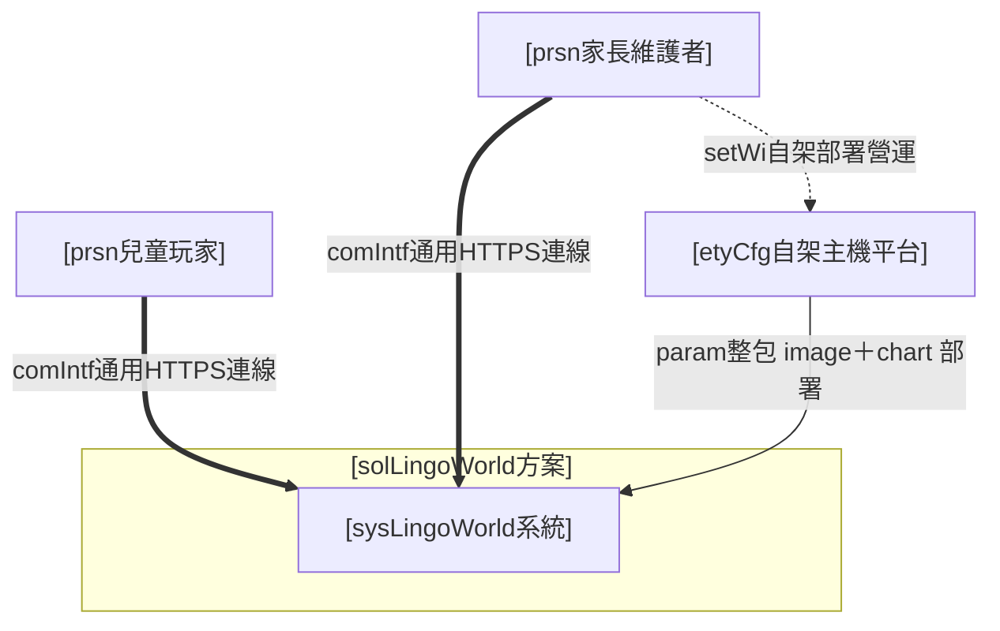
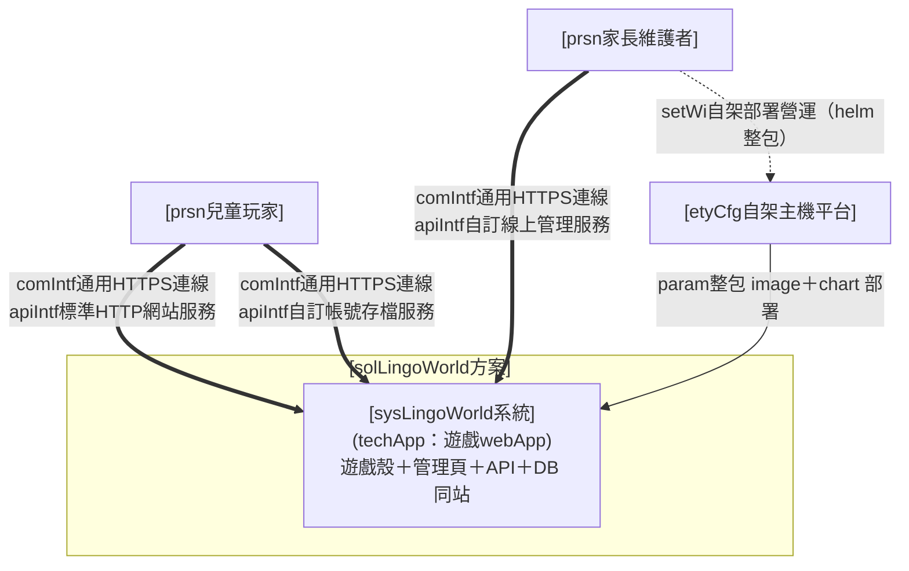
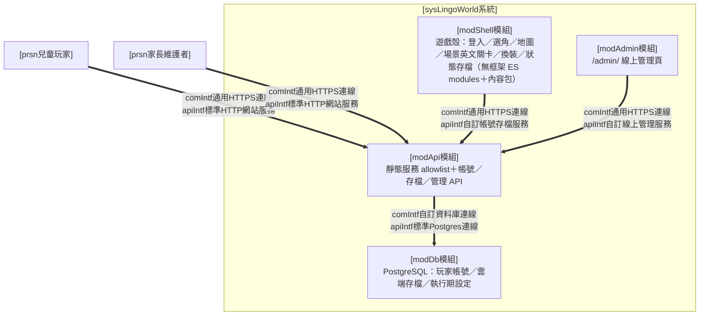
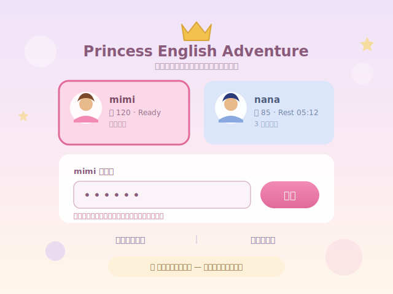
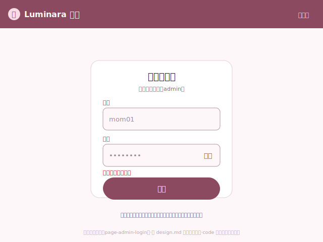
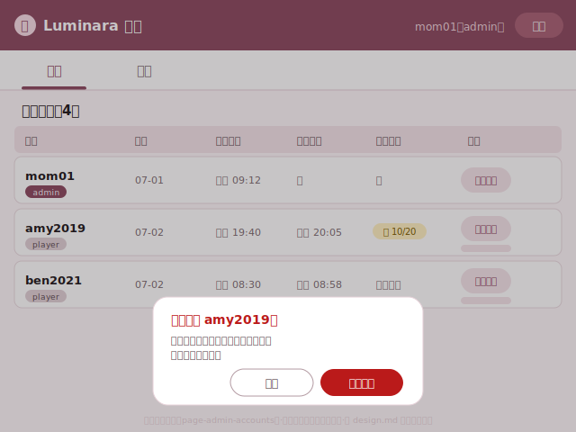
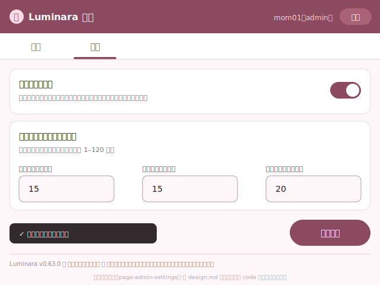
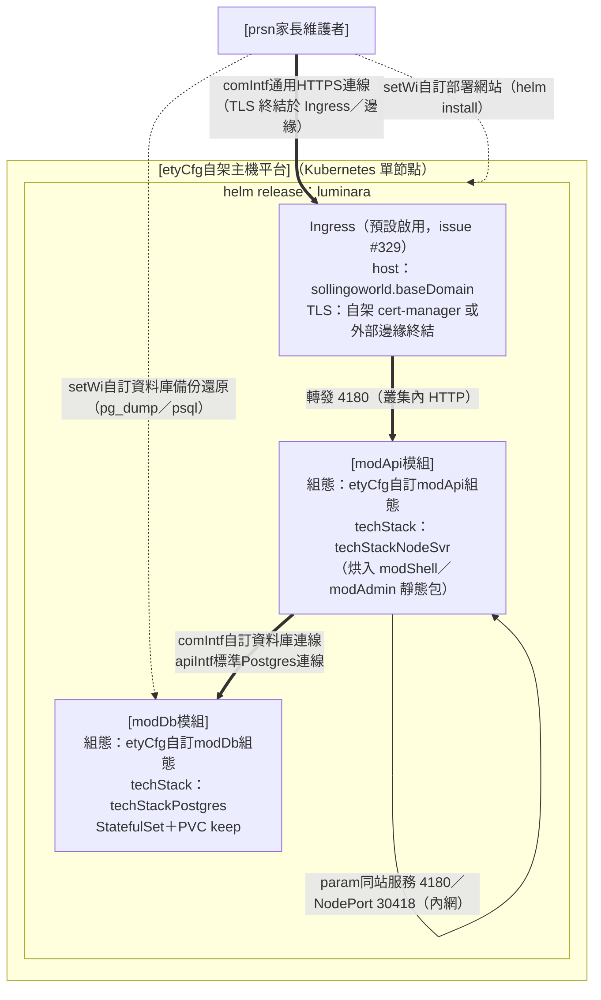

# I. 需求分析

## A. 主旨摘要

* 需求方為**家庭**（家長為 6–10 歲兒童提供英文學習）；痛點為兒童英文學習**動機不足**與**成果不可見**。
* 本方案 [solLingoWorld方案] 以公主角色扮演（ADV）換裝遊戲，把「英文學習動機與成果可見性」轉為一個可重複的**正向閉環**：短回合英文練習 → 答對得 coins → 兌換角色外觀（換裝）→ 想要更多外觀而回頭練習。
* MVP 範圍：單一**家庭自架**網頁遊戲，含英語短回合練習、角色陪伴與王國場景探索、答對得幣換裝、每帳號雲端存檔跨裝置還原、護眼遊玩時長與強制休息、維護者線上帳號與執行期設定管理、內容資料包維護；對外以版本化整包（container image＋helm chart）散佈，維護者於自有 Kubernetes（家庭主機單節點即足）一鍵安裝升級。本章只描述需求，不展開解法元件。

## B. 運作想定

### (A) 資訊架構

> 圖例（三線通則）：`==>` 粗＝運行（系統／裝置間通訊，標 comIntf）｜`-.->` 虛＝人員操作（維護者對主機之部署營運）｜`-->` 細＝部署設定。

### (B) 單位人員

#### 方案外單位人員關聯

* [etyCfg自架主機平台]：家庭自有 Kubernetes（單節點即足）或本機／區網主機，提供本方案運行環境；屬部署基礎設施、非本方案交付物，維護者自備。
* 本方案為家庭自用自架，**無對外機構、上級或服務對象關聯**。

#### 方案內單位人員編組

| 單位 | 層級 | 職責 |
| --- | --- | --- |
| **[prsn兒童玩家]** | 使用者（家長協助之 6–10 歲兒童） | 遊玩英語練習、角色陪伴探索、答對換裝、選角命名、帳號登入與遊玩 |
| **[prsn家長維護者]** | 維護者／admin（家長） | 自架部署營運、線上玩家帳號與執行期設定管理、內容資料包維護、作品資訊維護 |

### (C) 動作項目

| orgsopcat 大類 | orgSop 職責 | 說明 |
| --- | --- | --- |
| **orgsopcat#1-兒童遊玩學習** | orgSop#1-兒童英語遊玩學習 | 兒童玩短回合英語練習、角色陪伴與場景探索、答對得幣換裝之正向閉環，含選角命名與畫面即時回饋（承 spec#1,2,3,4,6,11,12,15,19,20,21） |
| **orgsopcat#2-玩家帳號與時間** | orgSop#2-玩家帳號與進度保全 | 玩家以帳密註冊登入、每帳號雲端存檔跨裝置還原、同伺服器多帳號進度分離（承 spec#5,8,23,24） |
| **orgsopcat#2-玩家帳號與時間** | orgSop#3-護眼時間管控 | 連續遊玩達設定時長後結算並強制休息，維護者可鎖定個別帳號時長（承 spec#9） |
| **orgsopcat#3-伺服器營運** | orgSop#4-維護者自架部署營運 | 維護者以 helm 整包於自有 K8s 安裝、升級、移除本方案，並保全玩家資料（承 spec#7,27） |
| **orgsopcat#3-伺服器營運** | orgSop#5-維護者線上帳號與執行期管理 | 維護者於線上管理頁管理玩家帳號（清單／重設密碼／撤銷 session／刪除）與執行期設定（新帳號預設時長／個別鎖定／註冊開關）（承 spec#25,26） |
| **orgsopcat#4-內容與資訊** | orgSop#6-維護者內容維護 | 維護者以 dev 工具依內容資料包維護公主、衣物對位與旋轉、地圖場景對話、角色語音等（承 spec#13,14,16,17,18,22） |
| **orgsopcat#4-內容與資訊** | orgSop#7-作品資訊呈現 | 玩家與家長於 About 檢視作品版權宣告與版本沿革（承 spec#10） |

### (D) 軟硬項目

* [etyCfg自架主機平台]：家庭 Kubernetes 單節點叢集或本機／區網主機（開發期以 docker compose＋node 執行）。
* 瀏覽器：現代瀏覽器含 Web Speech API（英中語音朗讀與角色配音）。
* 影像模型：GPT／影像模型（維護期產製童話手繪 raster 角色、衣物與場景素材；非運行期相依）。

## C. 組態設定

### (A) 技術選型

* **techStyle＝[techStyle童話手繪粉彩]**：方案設計主軸——低飽和粉彩色域、童話手繪 raster 美術語彙（禁 SVG／CSS 濾鏡／模糊補版偽裝素材）、柔和描邊＋自然陰影；雙端語氣分工（玩家端兒童友善英語、管理端家長白話中文）。主題種子（品牌色 lavender／sky＋粉彩識別色盤）→ token 檔生成後唯讀引用。

### (B) 關鍵參數

* 遊玩偏好：預設每次遊玩／休息時長（各 15 分鐘，維護者可調）、護眼上限、心情延長換算。
* 帳號偏好：帳號為小寫英數 3–16 字（**可數字開頭**、至少含一個英文字母）、密碼 8–72 字且**須含至少一個數字與一個小寫英文**（開頭字元不限；2026-07-16 USR 核定調整，issue #330——家長替小孩取帳密的直覺優先，如生日開頭帳號）；家長協助輸入動線（大欄位、就地錯誤提示、觸控友善）。既有帳號之舊密碼仍可登入，新規僅適用建立密碼時點（詳 ＜II.C.(B)＞ 相容鐵則）。
* 內容結構偏好：內容以資料包為模組化單位（公主、衣物、地圖與場景、聲音、遊戲規則），可沿既有結構擴充。

### (C) 人機介面

* **look（整體視覺／外殼）**：雙端分工——**玩家遊戲端**沿 ＜C.(A)＞ 之 [techStyle童話手繪粉彩] 全幅手繪視覺（不套管理網站皮、不出現任何管理／dev 入口）；**維護者管理端**採 MD3 管理網站基座（Top App Bar 帳號／說明選單＋primary tabs 帳號/設定＋Main；線上管理僅 2 目的地、依 MD3 用 tabs 非 Drawer，dev 內容工具因層級深另用左 Drawer 依資料包分層），錨 [hmiIntf通用視覺規範]、套同一主題種子 token。二端共用品牌色種子、粉彩色域、字體鏈與語氣分工。

### (D) 部署做法

* 正式路徑＝**helm 整包**（單一 release，依 [comIntf通用K8sHelm部署格式]）：單一 app image（同站服務遊戲殼靜態檔、`/admin/` 管理頁與 `/api/*` 端點）＋PostgreSQL（資料落 PVC 持久化），維護者於自有 K8s `helm install`／`helm upgrade`／`helm uninstall`。開發期路徑＝docker compose（PostgreSQL）＋node 本機執行。
* **支援公網正式部署**（2026-07-16 USR 定調，issue #329——舊「家庭內網 only、勿轉發公網」定位除役）：chart 預設展開即含 Ingress（web 可達性 GATE、檢核表第 11 項），host 慣例 `sollingoworld.<baseDomain>`（baseDomain 預設 `local`、預設可展開）；TLS 兩模式——①自架 ingress-nginx＋cert-manager（chart 帶 tls 段＋issuer annotation）②外部邊緣終結（如 Cloudflare Tunnel，chart 免 tls）；**公網部署須配 TLS 終結**（帳密不得過公網明文），純內網部署仍可 NodePort HTTP。README K8s 安裝段內嵌 bash＋pwsh 環境檢查腳本（偵測預設 IngressClass，防孤兒 Ingress 無聲 404，檢核表第 12 項）。
* **除役變更面（issue #329，交付物語句一致性）**：「勿轉發公網」語句四處除役——`README.md`（部署共通注意）、`sysLingoWorld/deploy/helm/values.yaml` 註解、`templates/NOTES.txt`、`templates/ingress.yaml` 頭註；NOTES.txt 增 ingress 啟用分支輸出 `https://<host>/` 服務網址。README 部署段補：公網 profile 之 `api.trustProxy` 對照表（僅 ingress=1／tunnel→ingress=2，接 #331）、`/admin/` 公網暴露安全注意（管理操作建議自內網或加 IP allowlist annotation）、既有 NodePort 用戶升級註記（有預設 IngressClass 之叢集升級後將新增 host 路由，暴露面仍限叢集所在網段、對外仍取決於防火牆/轉發）。

## D. 規格效益

### (A) 規格要求

* **spec#1-可用短回合低挫折方式練習英文**：讓年幼學習者以「聽情境句、從少量選項選正確英文、立即對錯回饋」的短回合循環練英文，遇困難可取用中文協助；以獎勵高低鼓勵先嘗試英文（越早未借中文答對獎勵越高、借中文該題無獎勵）；內容依地區英文等級分級、以貼近兒童日常的功能性生活對話為主，題目歸屬特定場景並以角色第一人稱對話呈現（非考試式指令）。
* **spec#2-可用角色陪伴與場景探索維持遊玩意願**：以公主角色陪伴、王國地圖與多地區場景探索及地點互動、風格一致的童話手繪場景與差異化角色配音，提高兒童反覆遊玩意願。
* **spec#3-可把學習成果轉為看得見的外觀獎勵**：讓答對所得 coins 兌換為角色外觀（髮型、整件 outfit、鞋、配件）等可見變化，使成就可見而非僅顯示分數。
* **spec#4-可形成練英文獲獎勵換裝的正向閉環**：使英文練習、獎勵取得與換裝回饋構成同一個可重複的正向循環。
* **spec#5-可保存並還原玩家進度**：讓每帳號各自的 coins、學習紀錄、擁有與穿搭、所在位置、所選角色、名字與識別色可被保存並於再次遊玩時還原。
* **spec#6-可選擇與命名自己的公主**：讓玩家選定公主外觀（Lumi、Yumi、Rosa 三位可辨識）、命名並確認識別色與背景花紋，之後可重選或調整而不影響既有進度。
* **spec#7-可以自架伺服器形態部署並模組化擴充內容**：能以「靜態遊戲殼＋node API 核」自架伺服器形態部署遊玩，且地區、角色、可玩公主與衣物等內容可以 raster 內容包模組化新增與調整。
* **spec#8-可用伺服器帳號分離不同玩家進度**：讓同一自架伺服器上多位玩家各自擁有帳號、每次進入先登入，使不同玩家的進度與換裝成果互不混用。
* **spec#9-可限制每次遊玩時長並強制休息以護眼**：連續遊玩達設定時長後自動結算並進入強制休息，休息屆滿前不可續玩；預設遊玩／休息各 15 分鐘，可由玩家調整、亦可由維護者對個別帳號覆寫並鎖定。護眼鎖定為 per-account 伺服器端計、屬家長輔助非防駭防線——兒童可自助註冊新帳號繞過，故建議維護者於初裝成員到齊後關閉註冊（spec#26）。
* **spec#10-可查看作品版權與版本沿革**：於設定 About 頁呈現作品版權宣告、授權條款（PolyForm Noncommercial 1.0.0）與歷次版本中文短主旨，使玩家與家長識別來源並了解版本演進。
* **spec#11-可依場景情境分流生活聊天與打工任務並給予不同回饋**：各可互動場景可提供生活聊天（2 選項、答對提升心情並延長當次可玩時間）與打工任務（3 選項、切合場景之勞務、以 coins 回饋），使精神回饋與勞動所得明確分流。
* **spec#12-可依透明角色輪廓強化角色立繪圖地分離**：以角色透明輪廓為基準提供常態描邊與自然陰影，讓角色在複雜背景中維持清楚辨識，且與互動狀態光暈語意分離。
* **spec#13-可由維護者依內容資料包結構維護與擴充各項組態**：讓維護者依內容資料包（公主、衣物、地圖場景、聲音、遊戲規則）及其相依關係集中檢視、調整與擴充各包可設定項；僅於本機開發環境提供、不出現於公開遊玩端。
* **spec#14-公主衣櫃可開啟單品 overlay 即時調整對位**：讓家庭使用者於衣櫃每件已擁有單品旁觸發調整，以全螢幕 overlay 在不離開遊戲下即時調整並預覽單品對位與旋轉，確認後儲存並即時套用。
* **spec#15-overlay 調整不中斷遊戲流程且不引入四角變形**：調整 overlay 以獨立覆蓋層呈現、關閉後遊戲回到原位；對位限矩形邊界＋旋轉、不引入四角任意變形；無法連線寫回時明確提示而不 crash 遊戲。
* **spec#16-可由維護者在瀏覽器端調整衣物旋轉角度並儲存**：讓維護者以旋轉角度滑桿即時預覽並儲存衣物 layer 的旋轉設定（向下相容缺省 0）。
* **spec#17-可從區網任何家庭裝置存取衣物調整工具**：讓維護工具伺服器預設監聽區網並顯示可連線 IP，使同一家庭區網內任何裝置可直接以瀏覽器開啟並儲存衣物對位；僅影響 dev 工具、不納入靜態部署。
* **spec#18-調整儲存後維持原環境不跳轉**：使調整 overlay 儲存後維持原環境（衣櫃回衣櫃、商店回商店），不誤跳至公主衣櫃。
* **spec#19-可玩角色 roster 精簡為三位（Lumi、Yumi、Rosa）**：可玩公主 roster 為三位可辨識公主；既有帶已移除角色 id 之舊存檔於讀取時 fallback 為預設角色而不 crash、不殘留。
* **spec#20-可於對話場景即時看見金錢並順暢瀏覽換裝面板**：讓兒童於對話場景畫面內即時看見目前 coins，且換裝面板於桌機寬視口一次完整呈現品項、選衣時公主立繪維持完整可見。
* **spec#21-可讓新局公主以得體入門造型起步並保留換裝成長空間**：使新建帳號公主以得體入門造型起步、僅預先擁有身上所穿品項，其餘須以 coins 購得，使換裝成長動機自第一次遊玩即成立。
* **spec#22-可高效且不誤失工作地使用管理設定工具**：讓維護者於桌機與家庭區網行動裝置高效安全使用管理設定工具——未儲存防護、寫回後保留工作點、一致回饋、編輯效率與小螢幕可用；僅為 dev 工具、公開遊玩端不受影響。
* **spec#23-可建立帳密帳號並登入遊玩**：讓玩家（或協助之家長）於遊戲入口以帳密註冊並登入遊玩，前後端同源驗證、密碼以業界標準雜湊儲存、核發可撤銷之時效 session、登入失敗不洩漏帳號存在性。
* **spec#24-可雲端保存進度並跨裝置還原**：將每帳號全部進度保存於伺服器端，登入即還原、跨裝置一致；伺服器暫不可達時以記憶體續玩並背景重試，並以樂觀併發保護不靜默覆蓋較新進度。
* **spec#25-可由維護者線上管理玩家帳號**：讓維護者以瀏覽器於線上管理頁完成玩家帳號管理（清單、重設密碼、撤銷 session、刪除帳號），與玩家遊戲入口分流、兒童端不出現管理入口。
* **spec#26-可由維護者線上管理執行期遊戲設定**：讓維護者於同一線上管理頁調整執行期設定（新帳號預設時長、個別帳號時長覆寫與鎖定、註冊開關），存於伺服器、儲存即生效、不需改版或重新部署。
* **spec#27-可取得版本化整包發行物並於自架環境安裝升級與保全資料**：以單一 container image＋單一 helm chart 之版本化整包作為對外散佈單位，供維護者於自有 K8s 一鍵安裝與升級，且升級與重啟不遺失玩家帳號、雲端存檔與執行期設定，並提供資料庫備份還原程序。

**端對端驗收課目（e2eTest，依 productReadme，每 orgSop 至少一案，回扣 orgSop／spec）**：

* **e2eTest#01-兒童遊玩學習閉環**（依 orgSop#1）：登入 → 選角命名 → 進場景練英文答對得幣 → 逛店購買換裝 → 生活聊天延時／打工賺幣，全程畫面即時回饋，正向閉環成立（回扣 spec#1,2,3,4,6,11,20,21）。
* **e2eTest#02-玩家帳號與跨裝置存檔**（依 orgSop#2）：註冊 → 遊玩累積進度 → 雲端保存 → 另一裝置登入還原 → 免密續玩 → 多帳號進度互不混用（回扣 spec#5,8,23,24）。
* **e2eTest#03-護眼時長與強制休息**（依 orgSop#3）：連續遊玩達時長 → 自動結算 → 強制休息鎖定 → 屆滿前不可續玩、返回初始選單不繞過鎖定（回扣 spec#9）。
* **e2eTest#04-維護者自架部署與資料保全**（依 orgSop#4）：`helm install` → 遊玩管理 smoke → `helm upgrade` 驗資料保全 → 備份 dump／還原實走 → `helm uninstall` 預設保留 → 同名重裝續用（回扣 spec#7,27）。
* **e2eTest#05-維護者線上帳號與執行期管理**（依 orgSop#5）：admin 登入 → 帳號清單 → 線上重設密碼／撤銷 session → 時長鎖定使孩子端唯讀 → 註冊開關 → 二次確認刪除帳號（回扣 spec#25,26）。
* **e2eTest#06-維護者內容維護**（依 orgSop#6）：dev 工具依資料包導覽 → 衣物對位／旋轉調整並寫回 → 場景對話維護 → 未儲存防護與寫回後保留工作點（回扣 spec#13,14,16,17,18,22）。
* **e2eTest#07-作品資訊呈現**（依 orgSop#7）：開啟 About → 顯示版權宣告與最近版本中文短主旨（回扣 spec#10）。

### (B) 效益指標

* **spec#1**：單回合時長、答對率、提示與中文協助使用比例、獎勵各層級分佈、句型分級涵蓋度、題目與場景主體相符率、對話自然口語感抽查通過率。
* **spec#2**：到訪地點數、連續遊玩回合數、角色配音差異覆蓋率、場景背景完整繪製與尺寸合格率、離場語音即時收束生效率、同場景歡迎詞每次造訪只播一次正確率。
* **spec#3**：購買件數、換裝次數、body＋head 合成與頸部接縫對位錯誤率、類別級 layer bounds 對位 QA 通過率、換裝殘留檢出率、服裝類別精簡（髮型／outfit／鞋／配件）合格率。
* **spec#4**：單次遊玩完成「答題→購買→換裝」閉環的比例。
* **spec#5**：還原欄位完整度、識別色補齊正確率、重整後狀態保留率。
* **spec#6**：選角完成率、三位公主辨識正確率、識別色與背景花紋設定與舊存檔相容率、帶已移除 id 舊存檔升級正確率。
* **spec#7**：自架部署成功率、新增內容包後既有功能未回歸、可玩公主／衣物 layer／場景背景獨立擴充成功率、raster 素材與資產標準（尺寸／檔重）合規率。
* **spec#8**：帳號間進度隔離正確率、帳號卡摘要與識別色辨識清晰度、切換帳號後狀態一致性、玩家端無刪除入口合格率。
* **spec#9**：達上限後休息遵守率、本回合結算呈現正確率、剩餘可玩時間呈現正確率、返回初始選單後鎖定維持率、維護者鎖定時玩家端唯讀與強制值生效率。
* **spec#10**：About 頁開啟率、版本沿革顯示完整度、版權宣告呈現正確率。
* **spec#11**：各模組（聊天／逛店／打工）開啟場景比例、聊天延時與心情累加正確率、打工 coins 回饋與地區級距正確率、聊天 2 選項／打工 3 選項符合率、回饋型別未混用率。
* **spec#12**：角色輪廓清楚度、複雜背景外框辨識通過率、常態大範圍糊化光暈檢出率、試穿光暈正確出現與移除率、雙視口輪廓 QA 通過率。
* **spec#13**：頂層導覽對齊內容資料包正確率、各管理頁歸入正確節點正確率、地圖場景包內分層正確率、公開遊玩端無此入口合格率。
* **spec#14**：調整按鈕於衣櫃 mode 正確率、overlay 不破壞遊戲 DOM 正確率、五滑桿即時預覽正確率、邊界換算合法率、儲存後對位反映正確率。
* **spec#15**：overlay 獨立覆蓋層且不污染遊戲 DOM 合格率、無四角變形確認率、寫回失敗明確提示且不 crash 通過率、取消無損遊戲狀態正確率。
* **spec#16**：旋轉滑桿範圍正確性、即時預覽精準度、儲存後 sidecar 值與渲染吻合度、缺省 rotation=0 後向相容率。
* **spec#17**：工具伺服器啟動 log 顯示區網 IP 合格率、區網裝置連線與儲存成功率、靜態部署不受影響合格率。
* **spec#18**：商店模式儲存後維持商店環境比率、衣櫃模式維持衣櫃環境比率、誤跳公主衣櫃檢出率（應 0%）。
* **spec#19**：選角介面僅三位公主合格率、帶已移除 id 舊存檔升級為預設角色正確率、已移除角色 UI 殘留檢出率（應 0%）、舊存檔讀取不 crash 率。
* **spec#20**：對話場景 coins 指示與 state 同步正確率、桌機寬視口衣櫃面板品項完整呈現合格率、公主立繪未被面板遮擋 QA 通過率、窄屏面板可用性合格率。
* **spec#21**：新局預設得體造型正確率、新局擁有等於所穿品項正確率、已移除角色品項殘留檢出率（應 0%）、新局可購外觀品項數（保留成長空間）。
* **spec#22**：未儲存變更攔截生效率、成功寫回整頁重載發生率（應 0%）、原生 alert／confirm 殘留數（應 0）、危險操作確認覆蓋率、deep link 回工作點正確率、觸控目標 ≥44px 合格率、品質清單修正完成率。
* **spec#23**：註冊成功率、非法帳號／不合規密碼前後端雙層擋下率、登入失敗統一訊息（不洩漏帳號存在性）合格率、資料庫／日誌明文密碼檢出率（應 0%）、session 免重輸續玩成功率、登出後 token 失效率。
* **spec#24**：跨裝置還原欄位完整度、關鍵事件即時寫入成功率、伺服器不可達不 crash 率、同步狀態提示正確率、樂觀鎖過期寫入被拒（不靜默覆蓋）正確率、遷移成功率。
* **spec#25**：admin 登入成功率、帳號清單欄位正確率、重設密碼後舊 session 失效率、刪除帳號連帶消失率、admin 自刪擋下率、非 admin 存取管理端點拒絕率、回應含敏感欄位檢出率（應 0%）。
* **spec#26**：設定儲存後即時生效率（不需重啟）、新帳號預設時長套用正確率、鎖定帳號強制值與唯讀正確率、解除鎖定回復自調率、註冊關閉時 API 拒絕與入口隱藏率、DB 缺值程式預設遞補正確率、非法值拒絕率。
* **spec#27**：依手冊安裝成功率、安裝後健康檢查與遊戲／管理頁可用率、升級後帳號／存檔／執行期設定保留率、uninstall 預設保留資料卷合格率、重裝續用資料完整率、備份可還原率、chart 版本鏈一致率、image 混入 dev 工具檢出率（應 0%）。

# II. 方案設計

## A. 主旨摘要

* 依 ＜II.C.(A)＞ 宣告之 `techApp=遊戲webApp` 架構 canon 承接需求：本方案為**單一 sys** [sysLingoWorld系統]（全端 webApp＝一個 sys——擁有玩家資料所有權與 `/api/*` 對外契約、獨立演進）。
* MVP 實例化＝一個家庭自架網頁遊戲系統，標準 mod 組成＝遊戲殼＋線上管理頁＋API＋DB（見 ＜II.C.(A)＞、逐 mod 設計見 ＜III＞），同站服務（免 CORS）、以單一 helm release 整包部署。
* 本層 team 編組與 teamSop 承接 ＜I＞ orgSop#1–7；teamSop 為 ＜III＞ prsnSop 之上捲 derived（維護改 ＜III＞、此處重生）。

## B. 運作想定

### (A) 資訊架構

> 圖例（三線通則）：`==>` 粗＝運行（系統／裝置間通訊，標 comIntf／apiIntf）｜`-.->` 虛＝人員操作（維護者部署營運）｜`-->` 細＝部署設定。

### (B) 單位人員

#### 方案外單位人員關聯

* [etyCfg自架主機平台]：維護者自有 Kubernetes（家庭主機單節點即足）或本機／區網主機，承載本 sys 之運行；屬部署平台、非本方案交付物。
* 本 sys 對外無其他機構、上級或外部服務相依（語音走瀏覽器內建 Web Speech，非外部服務）。

#### 方案內單位人員編組

| team（承 orgSop#） | 組員（執行） | 組長（督核） | 使用目的 |
| --- | --- | --- | --- |
| **team兒童遊玩（#1）** | prsn兒童玩家 | prsn家長維護者（旁側陪伴） | 英語練習閉環、探索、選角、換裝 |
| **team帳號存檔（#2）** | prsn兒童玩家 | — | 帳號註冊登入、雲端存檔還原 |
| **team時間管控（#3）** | prsn兒童玩家 | prsn家長維護者（時長鎖定） | 遊玩計時結算休息、時長調整鎖定 |
| **team部署營運（#4）** | prsn家長維護者 | — | helm 整包安裝升級移除、資料備份還原 |
| **team線上管理（#5）** | prsn家長維護者 | — | 線上玩家帳號管理、執行期設定管理 |
| **team內容維護（#6）** | prsn家長維護者 | — | 資料包組態、衣物對位旋轉、對話語音維護 |
| **team作品資訊（#7）** | prsn兒童玩家 | — | 關於／版權／版本沿革呈現 |

### (C) 動作項目

> **derived 標記**：本層 teamSop 為 ＜III＞ prsnSop 之上捲視圖（維護改 ＜III＞、此處重生），勿獨立增刪；編號全程上下對應（teamSop#N.M 之 N＝所承接 orgSop#N）。

| team（承 orgSop#） | teamSop（使用目的） |
| --- | --- |
| **team兒童遊玩（#1）** | teamSop#1.1-遊玩英語練習閉環 teamSop#1.2-場景探索與角色陪伴 teamSop#1.3-選角命名與識別設定 teamSop#1.4-換裝與商店 |
| **team帳號存檔（#2）** | teamSop#2.1-帳號註冊登入登出 teamSop#2.2-雲端存檔保存還原 |
| **team時間管控（#3）** | teamSop#3.1-遊玩計時結算與休息鎖定 teamSop#3.2-遊玩時長調整與維護者鎖定 |
| **team部署營運（#4）** | teamSop#4.1-helm 整包安裝升級移除 teamSop#4.2-資料庫備份與還原 |
| **team線上管理（#5）** | teamSop#5.1-線上玩家帳號管理 teamSop#5.2-執行期遊戲設定管理 |
| **team內容維護（#6）** | teamSop#6.1-依資料包管理組態 teamSop#6.2-衣物對位與旋轉調整 teamSop#6.3-場景對話與角色語音維護 |
| **team作品資訊（#7）** | teamSop#7.1-關於版權與版本沿革呈現 |

### (D) 軟硬項目

* [etyCfg自架主機平台]：Kubernetes 單節點叢集（正式）或本機／區網主機（開發期 docker compose＋node）。
* PostgreSQL：玩家帳號、雲端存檔與執行期設定之持久化（資料落 PVC）。
* 瀏覽器 Web Speech API：英中語音朗讀與角色配音（無外部 TTS 相依）。

## C. 組態設定

### (A) 技術選型

* **techApp＝[techApp遊戲webApp]**（本 sys 唯一宣告）：自架網頁遊戲系統類型，綁下列 canon（能力清單／介面 bar／標準 mod 組成／單一 release 部署組成由本契約承載，GATE 業界審查據以驗）。
  * **最低能力清單（六簇，逐項落為 orgSop／teamSop／prsnSop 與具名頁）**：① 玩家帳號與雲端存檔（註冊／登入／登出、session 續玩、跨裝置還原、樂觀併發不靜默覆蓋、離線韌性）；② 兒童端可用性（手機直向第一視口、觸控 ≥44px、兒童友善錯誤、家長協助輸入）；③ 護眼／家長管控（時長限制強制休息、個別帳號鎖定）；④ 維護者線上管理（登入登出、帳號清單、重設密碼、撤銷登入、刪除帳號二次確認防自鎖、執行期設定即時生效、關於／版本、使用說明）；⑤ 安全基線（密碼單向雜湊、統一錯誤不洩存在性、速率限制僅計失敗、受保護 API 驗 session、管理 API 驗 admin、靜態 allowlist）；⑥ 維運（`/healthz`／`/readyz`、備份還原記入手冊）。
  * **介面 bar（雙端）**：玩家遊戲端＝沿 techStyle 全幅童話手繪視覺、不得出現任何管理／dev 入口；管理端＝MD3 管理網站基座＋techStyle token、行動視口可用、危險操作 error 色＋二次確認、回饋 snackbar、未儲存防護。不合格樣式：兒童端曝露管理入口、管理端硬寫色／原生 alert、截圖混入 dev-only 元素、鎖定／唯讀無視覺標示。
  * **標準 mod 組成（逐 mod 設計見 ＜III＞）**：modShell（`techStack: StaticWeb`，遊戲殼＋內容包）＋modAdmin（`techStack: StaticWeb`，`/admin/` 線上管理頁）＋modApi（`techStack: NodeSvr`，帳號／存檔／管理 API＋靜態服務 allowlist）＋modDb（`techStack: Postgres`，玩家資料與執行期設定、所有權屬本 sys）。
  * **單一 release 部署組成**：`deployHelm`——一個 sys＝一個 helm chart；modApi image 烘入 modShell／modAdmin 靜態包（同站免 CORS）＋modDb（chart 內 StatefulSet）；chart 預設展開含 Ingress（host `sollingoworld.<baseDomain>`，issue #329），TLS 兩模式（自架 ingress-nginx＋cert-manager／外部邊緣終結如 Cloudflare Tunnel）——公網部署須 TLS 終結、純內網 NodePort HTTP 仍可用。
  * **點名強制 techItem**：無——語音走瀏覽器內建 Web Speech；若日後引入外部 TTS／發音評分再於 ＜III.C.(A)＞ 點名對應 techItem。

### (B) 關鍵參數

* sys 對外契約埠：`paramApiPort`＝`4180`（同站服務遊戲殼／`/admin/`／`/api/*`）；正式 `paramServiceType`＝`NodePort` 固定 `30418`（重裝穩定）。
* 帳號安全基線：`paramUsernamePattern`＝`^(?=.*[a-z])[a-z0-9]{3,16}$`（可數字開頭、至少含一英文字母，issue #330）、`paramPasswordMinLength`＝`8`、`paramPasswordMix`＝`須含至少一數字與一小寫英文`（長度以 ASCII 字元計、上限 72 對應 bcrypt 72 bytes 有效輸入）、`paramPasswordHash`＝`bcrypt cost≥10`、`paramSessionTtlDays`＝`30`。
* 新規適用邊界（issue #330 相容鐵則）：新規僅適用**建立密碼之時點**——註冊、線上管理頁重設（含 admin 自改）、CLI `reset-password`、admin bootstrap **首次建立**；**登入之格式預檢維持舊制下限（6–72 長度）不隨新規收緊**（既有 6–7 碼舊密碼仍可登入）；**admin bootstrap 先查帳號存在、僅於建立時驗新規**（既有部署升級後沿用舊 `ADMIN_PASSWORD` 不得啟動失敗／CrashLoop）。
* 起始與執行期預設：`paramAdminBootstrap`（`ADMIN_USERNAME`／`ADMIN_PASSWORD` 僅於帳號不存在時建立唯一 admin、不覆寫既有）、`paramRegistrationOpenDefault`＝`true`、`paramDefaultPlayLimit`＝`play 15／rest 15／max 20 分鐘`。

### (C) 人機介面

* **IA（功能分配／導覽）**：導覽由 SOP 三層機械衍生——orgSop→Drawer 主項（L1）、teamSop→次層群組（L2）、prsnSop→第三層 leaf（L3）；玩家遊戲端採全幅場景導覽（登入→選角→地圖→場景選單→第二層互動之兩層動線），管理端僅帳號／執行期設定 2 目的地、依 MD3 adaptive navigation 用 primary tabs（非 Drawer；Top App Bar 帳號選單含登出、說明選單含使用說明／關於）；dev 內容資料包管理頁因層級深另用左 Drawer 依資料包分層。行動視口表格降級卡片列。反擁擠：一階段一主題一頁，不把多功能塞單頁。
* **[hmiIntf自訂角色尺度與美術規範]**（自訂設計；原 `contract-local/` 同名契約檔 2026-07-17 依 repoStructVersion 2.0「自訂不成檔」原則併回本節，規則不變、修訂沿革見 git 歷史；issue #342）：
  * **共用 rig 與自然尺度**：`canvas=512x768`、`groundBaselineY=768`、`fullCanvasHeightCm=200`（1cm=3.84px）、`bodyHeightPx=naturalHeightCm/200*768`；NPC `stageScale=1.0`、Lumi `naturalHeightCm=125`／ADV `stageScale=1.20`。所有可玩紙娃娃共用 `shared-512x768-v1` rig（同身型／畫布／slot 對位／衣物 layer）；registry 保留 `lumi`/`yumi`/`sol` 舊 id（Mary 沿用 `sol`，**主角感只由 ADV 舞台倍率 `1.20` 表達、不得把 base 做成不同自然尺度**），新角用 `rosa`；`npcNaturalHeightCm` 寫於各 area scene config 供 runtime 與 QA 共用；特殊矮小或大型角色可有不同 `naturalHeightCm` 但仍須落 `768px=200cm` 尺度內，**超過 200cm 須拆成明確特殊規格**、不得偷改 canvas 或 CSS。
  * **角色與 NPC 素材**：NPC 圖（`areas/*/assets/characters/*.webp`）＝512x768 透明 WebP、身體視覺中心對齊 x≈256、腳底貼 canvas 底端——偏移屬素材錯誤須改圖，不得 runtime per-NPC nudge；可視高度只由 `npcNaturalHeightCm` 換算。可玩公主 `base.webp` 採 baked-in 短髮 playwear base（不得烘入長髮／長袖／睡衣／禮服／鞋帽／皇冠／場景／純色底），GPT 童話手繪 raster（禁 SVG／CSS 濾鏡／向量拼貼／renderer 特例）；runtime 只留 `base.webp`、選角 portrait 由 CSS 裁切頭胸（無獨立 thumb）；Yumi 僅改深藍髮、Mary 僅改深綠髮，其餘不得動；starter items 為舊存檔相容 no-op、不得重複疊圖。
  * **wardrobe 單品**：單一 `512×512` 長邊貼滿透明 WebP/PNG（兼投影層與商店預覽；禁 SVG／emoji／placeholder）；對位＝類別 `safeBox`（軟性指引）＋per-item `targetBox`（512x768 canvas 座標、維護者校準，含四角自由形變 `corners`，相容舊 `topInset`/`bottomInset`；超出 safeBox 告警、出畫布才報錯）；新增同類預設繼承、不得一次性 nudge／改 CSS selector；完成判定須實穿檢查（手機直向＋桌機、露膚層逐膚色驗接縫）。素材以三層描述詞（houseStyle＋packStyle＋itemDesc）驅動影像模型生成、同包 2–3 件作風格錨、「生成→改詞→重生」流程（devtool 提供 📝描述詞／♻重生）；留痕（model/prompt/date）暫存各包 `style.json` `_gen`（工具到位後內嵌圖檔 metadata），**產圖與壓縮流程不得 `-strip` 掉 provenance metadata**（需壓縮去其餘 metadata 時須保留或重寫留痕）；影像生成屬 dev 期工具、runtime 不得即時呼叫。單品畫**穿戴正視、單層**（披風前閉合斗篷形；鞋正視優先靴）。
  * **場景與素材通則**：runtime 素材統一 WebP；world map `1536x1536`、area map `1536x1536`、ADV 場景背景單張 `1024x1024` 由 sceneArt 統一載入（CSS 不得硬編背景 URL／fallback）；背景整張皆正式繪製、不得模糊延展 frosted 補版（手機直向以中央裁切）；ADV 對話 UI 低飽和深色高不透明底；CSS 只管 UI chrome／排版／陰影，不得以幾何拼貼宣稱完成。
  * **輪廓與陰影**：以透明素材 alpha 為基準之圖地分離——貼合外框深色描邊＋自然景深陰影（`drop-shadow` 多層：描邊層深色短距低模糊、景深層柔和）；亮色光暈只作互動狀態提示（如試穿），不得替代常態可讀性；各 surface 強度分級（ADV 立繪＞地圖 token／頭胸照，**紙娃娃全身著裝須避免多層 wardrobe layer 各自累積過重髒邊**）；完成判定以手機直向＋桌機截圖驗 NPC／紙娃娃／token／頭胸照／試穿態——**試穿光暈僅於狀態中出現、關閉後不殘留，且文字與操作控制不被陰影遮擋**。

### (D) 部署做法

* 單一 helm release（`deployHelm`）：`helm install luminara <chart>`（chart 源＝發佈列車 OCI／Release `.tgz`，pre-release 驗測＝本 repo `sysLingoWorld/deploy/helm`），秘密以 values 檔供給用後即刪、不 `--set` 內聯；升級 `helm upgrade luminara <chart>`（不重供秘密沿用既值）；移除 `helm uninstall luminara`（PVC `helm.sh/resource-policy: keep` 預設保留）。開發期＝`docker compose -f deploy/compose.yaml up -d`（PostgreSQL 16、port `5433`）＋`cd sysLingoWorld/modApi && npm start`。詳部署／運作拓樸與指令見 ＜III.C.(D)＞。

## D. 規格效益

### (A) 規格要求

* **組態符合性測試（cfgTest，對象限 [etyCfg…]）**：
  * **cfgTest#01**：[etyCfg自架主機平台] 部署組態符合契約（K8s／compose 基本組態合法）。
  * **cfgTest#02**：[etyCfg自訂sys組態] 系統部署與選型組態符合契約（單一 sys、四 mod techStack 值合法）。
  * **cfgTest#03**：[etyCfg自訂modShell組態] 內容包預設與 registry 組態（含公主／衣物／場景／規則）符合契約。
  * **cfgTest#04**：[etyCfg自訂modApi組態] 帳號規則、密碼雜湊、session 時效、資料庫連線、admin 起始與執行期設定程式預設符合契約。
  * **cfgTest#05**：[etyCfg自訂modDb組態] PostgreSQL 版本、持久化與備份還原基線符合契約。
  * **cfgTest#06**：[etyCfg自架主機平台] helm chart 組態——`helm lint` 0 錯誤、`helm template` 合法 manifest、values 明確欄位、chart version／appVersion／image tag 與 `VERSION` 同源防漂移。
* **文件程式化測試（docProgTest，productReadme 承接 orgSop）**：docProgTest#01–07 各承接 orgSop#1–7，驗 README 產品手冊敘述之操作步驟可依樣完成（安裝、遊玩、帳號、時間、線上管理、內容維護、關於）。

### (B) 效益指標

* 本層不重列指標，承接 ＜I.D.(B)＞ 每 spec 之效益指標；team／teamSop 之達成以其所承接 orgSop 對應 spec 之指標衡量。

# III. 系統設計

## A. 主旨摘要

* 本 sys 依 techApp 標準 mod 組成切分為**四個建置單元**：modShell（遊戲殼靜態網站包）、modAdmin（`/admin/` 線上管理頁靜態子樹）、modApi（node 伺服器）、modDb（PostgreSQL）。前端遊戲殼之各領域（啟動殼、內容包、狀態存檔、地圖、ADV 場景與英文關卡、換裝、自測）為 modShell 內組件、非獨立建置單元；後端之靜態服務、帳號、存檔、管理各職能為 modApi 內組件。
* modShell／modAdmin 為無框架 StaticWeb（免打包），由 modApi 同站服務（免 CORS）；modApi image 烘入二靜態包＋modDb 以單一 helm release 部署。

## B. 運作想定

### (A) 資訊架構

> 圖例（三線通則）：`==>` 粗＝運行（系統／裝置間通訊，標 comIntf／apiIntf）｜`-.->` 虛＝人員操作｜`-->` 細＝部署設定。

* **模組間介面（comIntf／apiIntf）**：瀏覽器經 [apiIntf標準HTTP網站服務] 自 modApi 載入 modShell／modAdmin 靜態包；modShell／modAdmin 經 [apiIntf自訂帳號存檔服務]（`/api/*`）與 [apiIntf自訂線上管理服務]（`/api/admin/*`）呼叫 modApi；modApi 經 [apiIntf標準Postgres連線] 存取 modDb。
* **資料介面（datIntf）**：[datIntf自訂玩家帳號紀錄]——modDb 持有 ACCOUNT（帳號／bcrypt 雜湊／role）、SESSION（tokenHash／TTL）、SAVE（JSONB 全量 state＋schemaVersion＋updatedAt）、SETTINGS（執行期設定單列）四類，per-sys schema、跨 sys 禁直接查表（本方案單一 sys，僅本 sys 存取）。
* **不變式（invariant）**：存檔以 `updatedAt` 樂觀併發（過期寫入 409 不靜默覆蓋）；密碼僅存 bcrypt 雜湊（庫與日誌不落明文）；受保護 API 驗 session、管理 API 驗 admin；schema 演進採加法（零遷移、舊 image 可讀新 schema）。

### (B) 單位人員

#### 方案外單位人員關聯

* 本層（mod）方案外關聯對象＝[etyCfg自架主機平台]（承載 modApi image 與 modDb PVC）；無其他外部相依。

#### 方案內單位人員編組

| team（角色） | 組員 prsn（執行） | 組長 prsn（督核） | 備註 |
| --- | --- | --- | --- |
| **team兒童遊玩／帳號／時間／作品（#1,2,3,7）** | prsn兒童玩家 | prsn家長維護者（時長鎖定督核） | 玩家操作遊戲殼各 surface |
| **team部署營運／線上管理／內容維護（#4,5,6）** | prsn家長維護者 | — | 維護者操作 CLI／管理頁／dev 工具 |

### (C) 動作項目

| teamSop | 組員執行（prsnSop#N.M.1）〔surface·WI〕 | 組長督核（prsnSop#N.M.2） |
| --- | --- | --- |
| teamSop#1.1 | prsnSop#1.1.1〔prsn兒童玩家·場景對話頁〕答題〔[runWi自訂答英文題]、[runWi自訂取用中文協助]、[runWi自訂生活聊天]、[runWi自訂打工任務]〕 | — |
| teamSop#1.2 | prsnSop#1.2.1〔prsn兒童玩家·世界地圖頁／地區地圖頁／場景選單頁〕探索〔[runWi自訂地圖導航]、[runWi自訂返回場景選單]〕 | — |
| teamSop#1.3 | prsnSop#1.3.1〔prsn兒童玩家·選角命名頁〕選角〔[runWi自訂選角命名]、[runWi自訂設定識別色]、[runWi自訂設定背景花紋]〕 | — |
| teamSop#1.4 | prsnSop#1.4.1〔prsn兒童玩家·換裝商店頁〕換裝〔[runWi自訂購買衣物]、[runWi自訂換裝]、[runWi自訂退款]、[runWi自訂調整衣物對位]〕 | — |
| teamSop#2.1 | prsnSop#2.1.1〔prsn兒童玩家·通用登入頁〕登入〔[runWi自訂登入帳號]、[runWi自訂註冊帳號]、[runWi自訂登出帳號]、[runWi自訂回到初始選單]〕 | — |
| teamSop#2.2 | prsnSop#2.2.1〔prsn兒童玩家·（背景）〕存檔〔[runWi自訂匯入存檔]〕 | — |
| teamSop#3.1 | prsnSop#3.1.1〔prsn兒童玩家·遊玩結算休息頁〕計時結算〔系統計時消耗／時間到結算／休息鎖定〕 | — |
| teamSop#3.2 | prsnSop#3.2.1〔prsn兒童玩家·設定頁〕調整時長〔[runWi自訂調整遊玩限制]〕 | prsnSop#3.2.2〔prsn家長維護者·執行期設定頁〕鎖定督核〔[setWi自訂線上調整執行期設定]〕 |
| teamSop#4.1 | prsnSop#4.1.1〔prsn家長維護者·CLI／helm〕部署〔[setWi自訂部署網站]、[setWi自訂升級部署]、[setWi自訂移除部署]〕 | — |
| teamSop#4.2 | prsnSop#4.2.1〔prsn家長維護者·CLI〕備份還原〔[setWi自訂資料庫備份還原]〕 | — |
| teamSop#5.1 | prsnSop#5.1.1〔prsn家長維護者·玩家帳號管理頁〕管理帳號〔[setWi自訂線上管理帳號]〕 | — |
| teamSop#5.2 | prsnSop#5.2.1〔prsn家長維護者·執行期設定頁〕設定〔[setWi自訂線上調整執行期設定]〕 | — |
| teamSop#6.1 | prsnSop#6.1.1〔prsn家長維護者·內容資料包管理頁〕維護〔[setWi自訂依資料包管理組態]〕 | — |
| teamSop#6.2 | prsnSop#6.2.1〔prsn家長維護者·衣物調整工具頁〕調整〔[setWi自訂調整衣物旋轉]〕 | — |
| teamSop#6.3 | prsnSop#6.3.1〔prsn家長維護者·內容資料包管理頁（場景／語音分頁）〕維護〔[setWi自訂設定角色語音]、[setWi自訂依資料包管理組態]〕 | — |
| teamSop#7.1 | prsnSop#7.1.1〔prsn兒童玩家·設定頁 About〕檢視〔[runWi自訂檢視關於資訊]〕 | — |

### (D) 軟硬項目

* **部署元件清單**：modApi container image（Node.js LTS＋TypeScript，烘入 modShell／modAdmin 靜態包）、modDb PostgreSQL 16（StatefulSet 單副本、資料落 PVC）、helm chart（`sysLingoWorld/deploy/helm/`，**預設含 Ingress**、TLS 兩模式選配，issue #329）。部署拓樸圖見 ＜C.(D)＞。

## C. 組態設定

### (A) 技術選型

* **techStack（每 mod 一個，值限封閉枚舉）**：
  * [modShell模組] `techStack: StaticWeb`——無框架 HTML／JS／CSS ES modules，網站包產物（無打包，靜態收集）；內容包（公主／衣物／地圖場景／聲音）同屬此構件交付。
  * [modAdmin模組] `techStack: StaticWeb`——`/admin/` 線上管理頁靜態子樹；MD3 管理網站基座（錨 [hmiIntf通用視覺規範]）。
  * [modApi模組] `techStack: NodeSvr`——Node.js LTS＋TypeScript；建置 `npm ci && npm run build`（→`dist/`）、測試 `npm test`（vitest ≥80%）、產物＝Docker image。
  * [modDb模組] `techStack: Postgres`——PostgreSQL 16（現成服務型；版本 pin、單副本 Recreate、PVC 持久化、`pg_dump`／`psql` 備份還原）。
* **techItem**：無外部函式庫型強制點名；語音走瀏覽器內建 Web Speech API（modShell 內用，非獨立容器、非 techStack）。日後如引入外部 TTS／發音評分再於此點名對應 techItem。

### (B) 關鍵參數

* **[etyCfg自訂modShell組態]**（內容與遊玩，values.yaml）：`paramDefaultArea=castle`、`paramDefaultCharacter=lumi`、`paramPlayableCharacters=lumi,yumi,rosa`、`paramProfileColorPalette=8 pastel`、`paramBackgroundPatterns=8`、`paramInitialThemeRandomization=profileColor,backgroundPattern`、`paramPlayMinutes=15`、`paramRestMinutes=15`、`paramPlayMaxMinutes=20`、`paramMoodMinutesPerPoint=1`、`paramChatChoiceCount=2`、`paramJobChoiceCount=3`、`paramRewardSecondTryRatio=0.5`、`paramSpeechRateScale=0.8`、`paramSpeechLeadingPad=8 full-width spaces`、`paramWardrobeLayerBounds=type defaults`、`paramCharacterSilhouetteFilter=outline+depth-shadow`、`paramAssetStandards`（各類圖像像素尺寸與檔重預算 SSOT：角色 body／head／NPC 512×768、場景 1024×1024、地區／世界地圖 1536×1536、衣物單品 512×512、UI 1280×720）。
* **[etyCfg自訂modApi組態]**（Env→K8s Secret 與 values）：`paramApiPort=4180`、`paramServiceType=NodePort(30418)`、`paramIngress=enabled 預設 true（預設展開即含 Ingress，web 可達性 GATE）／className 留空＝交叢集預設（README 環境檢查把關）／baseDomain 預設 local——host 缺值時算出 sollingoworld.<baseDomain>（預設 sollingoworld.local，內網以 hosts 檔或 mDNS 可用、公網改自有網域）、ingress.host 顯式覆寫優先、預設值保證 helm template 可展開不 required 紅／tls=[{hosts,secretName}] 選配（自架模式由 ingress.annotations 供 cert-manager issuer；外部邊緣終結模式 tls 留空）／公網 profile 連動（issue #331 交接）：enabled=true 時 README 對照表載明 api.trustProxy 建議值（僅 ingress=1、tunnel→ingress=2）——chart 不自動連動（代理跳數僅部署者可知），機制歸 #331、建議值文件歸本單`、`paramUsernamePattern=^(?=.*[a-z])[a-z0-9]{3,16}$（可數字開頭、至少含一英文字母，issue #330）`、`paramPasswordMinLength=8`、`paramPasswordMix=須含至少一數字與一小寫英文（僅適用建立密碼時點，詳 II.C.(B) 相容鐵則）`、`paramPasswordHash=bcrypt cost≥10`、`paramSessionTtlDays=30`、`paramAdminBootstrap=ADMIN_USERNAME+ADMIN_PASSWORD env（先查帳號存在、僅於首次建立時依新規驗證——升級部署沿用舊值不得 CrashLoop，issue #330）`、`paramRegistrationOpenDefault=true`、`paramDefaultPlayLimit=play15/rest15/max20`、`paramTrustProxy=TRUST_PROXY env（Express trust proxy 跳數；預設 0；依實際代理跳數設定——僅 ingress=1、tunnel→ingress=2（且 ingress 須開 use-forwarded-headers 否則 XFF 被覆寫）；helm values 欄位 api.trustProxy 投影此 env；公網 profile 之連動預設由 #329 交付。警語：≥1 時 XFF 可被可直連者偽造，公網部署應以 ingress 為唯一對外入口；因限流 key 含帳號（見 paramRateLimitKey）且僅計失敗，偽造收益有限）`、`paramRateLimitKey=register:{ip}:{username}／login:{ip}:{username}（key 一律含嘗試帳號名——同名重試才累計，代理／NodePort SNAT／家庭 NAT 共用 IP 情境下鄰居失敗不再鎖死他人註冊（issue #331）；429 回應附等待秒數）`、Secret＝`DATABASE_URL`／`SESSION_SECRET`／`ADMIN_USERNAME`／`ADMIN_PASSWORD`／`POSTGRES_PASSWORD`。

* **[etyCfg自訂modDb組態]**：`paramDbName=luminara`、`paramDbImage=postgres:16`、`paramDbStorage=PVC 1Gi（helm.sh/resource-policy: keep）`、測試庫 `luminara_test`、helm-e2e namespace `luminara-e2e`（測試禁觸營運庫 `luminara`）。
* **[etyCfg自訂devServer組態]**（dev-only 工具，不入正式部署）：`paramServerHost=0.0.0.0（HOST 覆寫）`、`paramServerPort=4174`。

### (C) 人機介面

三高度之 page 高度——逐具名頁列規格（版型引 MD3 canonical layouts＋MUI＋WAI-ARIA APG；命名循「領域+功能+頁」，真通用者 `[通用…頁]`；示意圖見各頁 `docs/design-visual/`，硬規則⑤ 每具名頁一張、以文字規格為準）：

| 頁面 | 導覽 orgSop／teamSop（L1／L2） | 版型（MD3）＋主要元件 | prsnSop（L3 leaf） | surface |
| --- | --- | --- | --- | --- |
| [通用登入頁] | 帳號存檔／teamSop#2.1 | feed：帳號卡清單（頭胸照＋識別色底＋摘要）＋密碼欄＋切換／註冊＋就地錯誤回饋（見表下錯誤回饋通則） | #2.1.1 | 遊戲殼 |
| 選角命名頁 | 兒童遊玩／teamSop#1.3 | 對話框：三公主選擇＋名字 TextField＋識別色／花紋 picker | #1.3.1 | 遊戲殼 |
| 世界地圖頁 | 兒童遊玩／teamSop#1.2 | 全幅場景：世界地圖＋公主 token＋地區入口 | #1.2.1 | 遊戲殼 |
| 地區地圖頁 | 兒童遊玩／teamSop#1.2 | 全幅場景：地區地圖＋地點 hotspot＋公主 token | #1.2.1 | 遊戲殼 |
| 場景選單頁 | 兒童遊玩／teamSop#1.1·1.2 | 全幅場景：第一層互動選單（聊天／打工／逛店／換裝／離開）＋即時 coins | #1.1.1·#1.2.1 | 遊戲殼 |
| 場景對話頁 | 兒童遊玩／teamSop#1.1 | 全屏對話覆蓋：角色立繪＋題幹＋2／3 選項＋中文協助＋即時 coins | #1.1.1 | 遊戲殼 |
| 換裝商店頁 | 兒童遊玩／teamSop#1.4 | list-detail：多欄貨架面板（試穿／購買／穿脫）＋公主立繪（面板於立繪後） | #1.4.1 | 遊戲殼 |
| 衣物調整頁（overlay） | 兒童遊玩／teamSop#1.4 | 獨立 dialog：512:768 預覽＋五滑桿（中心XY／寬高／旋轉） | #1.4.1 | 遊戲殼 |
| 遊玩結算休息頁 | 時間管控／teamSop#3.1 | 對話框：本回合成果（coins／答題數／正確度）＋剩餘休息＋返回選單 | #3.1.1 | 遊戲殼 |
| 設定頁 | 時間管控·作品資訊／teamSop#3.2·7.1 | 分頁表單：時長設定（可唯讀鎖定）＋About（版權／版本沿革）＋帳號／登出 | #3.2.1·#7.1.1 | 遊戲殼 |
| [通用管理登入頁] | 線上管理／teamSop#5.1 | 表單：admin 帳密登入（MD3 管理基座） | #5.1.1 | 管理台 |
| 玩家帳號管理頁 | 線上管理／teamSop#5.1 | list-detail：帳號 DataGrid（清單／重設密碼／撤銷 session／刪除二次確認）＋詳情 | #5.1.1 | 管理台 |
| 執行期設定頁 | 線上管理·時間管控／teamSop#5.2·3.2 | 表單：新帳號預設時長／個別帳號鎖定／註冊開關（儲存即生效；未儲存離頁 MD3 確認） | #5.2.1·#3.2.2 | 管理台 |
| 內容資料包管理頁 | 內容維護／teamSop#6.1·6.3 | list-detail：左資料包導覽 Drawer＋右各包編輯（衣物／地圖場景／對話／語音／公主預設）＋未儲存防護 | #6.1.1·#6.3.1 | 管理設定工具（dev-only） |
| 衣物調整工具頁 | 內容維護／teamSop#6.2 | 舞台＋滑桿：衣物 layer 對位／旋轉即時預覽＋數值輸入＋還原 | #6.2.1 | 管理設定工具（dev-only） |
| （CLI／helm，非頁） | 部署營運／teamSop#4.1·4.2 | 命令列：`helm install／upgrade／uninstall`、`pg_dump`／`psql` | #4.1.1·#4.2.1 | CLI |

> **通用管理常規（掛 admin shell Top App Bar、各管理頁共用、非域功能，承 orgSop#7 延伸至 admin 端）**：帳號資訊／**登出**（帳號選單）、**使用說明**／**關於**（版權·版本沿革·PolyForm Noncommercial 授權，說明選單）；玩家自助改密不提供（改密走 admin 代重設，spec#25）。
> **錯誤回饋通則（登入／註冊表單，issue #331）**：任何送出被拒（驗證不符、撞名、限流、連線失敗）之錯誤訊息一律**就地醒目呈現且保證在視野內**——錯誤行置於送出鈕**上方**之**固定高度預留容器**（不推擠按鈕、無 layout shift；手機軟鍵盤展開時鈕下內容常在畫面外）、出現時捲入視野、聚焦錯誤行並以 `aria-live=assertive` 通報；格式類錯誤同時將肇事欄位置為 error 狀態（MD3 supporting text＋`aria-invalid`／`aria-describedby` 關聯）；訊息不得僅以色彩區辨（前綴 ⚠ 圖示）、限流訊息附可再試等待時間、用語為家長可讀之簡句；送出中鈕面呈忙碌狀態（disabled＋進行中字樣），杜絕「按了沒反應」感受。
> **衣物調整雙表面邊界**：衣物調整頁（overlay，玩家於衣櫃即時微調、正式端不寫回）與衣物調整工具頁（dev，維護者系統化內容維護、寫回 sidecar）職責分離、非重複建置。

**逐頁示意圖（設計期參考稿·待 code 以實際截圖替換；以文字規格為準，硬規則⑤）**：既有登入與管理端 4 頁示意圖如下；其餘玩家遊戲端具名頁（選角命名、世界／地區地圖、場景選單、場景對話、換裝商店、衣物調整 overlay、遊玩結算休息、設定）與 dev 工具頁之示意圖**列緩製**——本增量為既有已部署產品之改名／格式升版、非新 UI 設計，玩家端實際運行畫面即參考，最終態真實截圖由 code 段 Q3 產品手冊逐頁補入 [README.md]。

### (D) 部署做法

> 圖例（三線通則）：`==>` 粗＝運行（系統／裝置間通訊，標 comIntf／apiIntf）｜`-.->` 虛＝人員操作（維護者部署營運）｜`-->` 細＝部署設定。

* **建置指令**：遊戲殼無打包（靜態收集）；modApi `cd sysLingoWorld/modApi && npm ci && npm run build`（TypeScript→`dist/`）；正式 image 根目錄 Dockerfile 多階段 `docker build -t ghcr.io/twstellerwhale-ocean2/sollingoworld:<VERSION> .`（非 root、COPY 對齊靜態 allowlist、`devtool/`／測試不入包、`linux/amd64`、OCI 標籤 `org.opencontainers.image.source` 指本 repo 使 GHCR package 自動關聯——issue #343）；chart `helm package sysLingoWorld/deploy/helm`（chart `version`／`appVersion` 與 `VERSION` 同源）。
* **測試指令**：modApi 單元 `cd sysLingoWorld/modApi && npm test`（vitest，涵蓋率 ≥80%）＋整合 `npm run integration`（compose PostgreSQL 專用測試庫 `luminara_test`）＋依賴安全 `npm audit`；方案層端對端 `node tests/e2e-account-cloud.mjs`／`node tests/e2e-admin-console.mjs`（含證據截圖）／`node tests/e2e-register-topology.mjs`（intTest#13 客戶模擬拓撲：代理標頭限流隔離＋手機視口錯誤回饋可見性＋登入回饋三類錯誤〔撞名／限流／連線失敗〕瀏覽器層與帳號卡面板路徑、免密續玩忙碌態與卡面登出有效性——issue #336）；helm 機判 `node scripts/chartLint.mjs`＋真裝 e2e `node tests/e2e-helm.mjs`（k8s 專用 ns `luminara-e2e`）；結構守門 `node scripts/structureLint.mjs`、`pwsh scripts/docLint.ps1 -Path docs/design.md`、`pwsh scripts/repoLint.ps1 -Path .`；版號防漂移 `node scripts/genVersion.mjs --check`。**設計約束：任何測試一律指向專用測試庫（`luminara_test`／ns `luminara-e2e`）、禁對營運庫 `luminara` 讀寫**。
* **部署指令**：正式＝`helm install luminara <chart> -f secrets.yaml`／`helm upgrade luminara <chart>`／`helm uninstall luminara`（PVC keep）；備份 `kubectl exec <db-pod> -- pg_dump -U luminara luminara > backup.sql`、還原 `kubectl exec -i <db-pod> -- psql -U luminara luminara < backup.sql`；admin 忘密後門 `kubectl exec <app-pod> -- npm run reset-password -- <username> <new-password>`。開發期＝`docker compose -f deploy/compose.yaml up -d`（port 5433）＋`cd sysLingoWorld/modApi && npm start`。
* **發行物命名（結構化）**：container image＝`ghcr.io/twstellerwhale-ocean2/sollingoworld`（單一 sys＝方案級 image，取最短結構名幹 `sollingoworld`）＋helm chart＝`sollingoworld-chart`（涵蓋層路徑＋`-chart` 後綴）。**image 與 chart 同名會撞同一 GHCR OCI path 同 tag**（v0.64.3 首發時兩者皆 `sollingoworld`，chart 被迫只掛 GitHub Release、無法上 OCI）；chart 加 `-chart` 使 image 保留最短名、chart 亦能正常上 OCI，兩者分流不撞。發行名依發佈列車命名紀律（image `sol[-sys[-mod]]`／chart `sol-chart` 結構）算出、於此宣告定案（取代舊 image `solkidgalgame1`／chart `solkidgalgame` 之不一致；registry push 與 GitHub Release 由發佈列車執行，本 repo 增量只交付可發行 build 產物）。
* **命名層對照（四名並存、各有其位）**：方案／repo codename＝`solLingoWorld`（自 `solKidGalGame` 改名）｜發行物名＝image `sollingoworld` ＋ chart `sollingoworld-chart`（同一結構名幹 `sollingoworld`、chart 帶 `-chart` 後綴分流 OCI；自舊 `solkidgalgame1`／`solkidgalgame` 收斂）｜helm release／DB／測試 ns＝`luminara`／`luminara_test`／`luminara-e2e`（沿用不改）｜玩家端品牌＝`Luminara — Princess English Adventure`（遊戲內顯示，沿用不改）。
* **版號（單一 SSOT）**：根目錄 `VERSION`（JSON：`version`／`date`／`copyright`／`history[]`）為唯一事實來源；`game-engine/build/version.js`／`CHANGELOG.md` 由 `node scripts/genVersion.mjs` 投影生成（禁手改，`--check` 守門）；chart `name`／`version`／image 名亦自此投影；版號釘選於 merge（feat→minor／fix→patch／breaking→major）。

## D. 規格效益

### (A) 規格要求

* **組態符合性測試（cfgTest）**：承 ＜II.D.(A)＞ cfgTest#01–06（各 [etyCfg…] 組態合契約）。
* **雙人工品質查核（機械綠 ≠ 可收，`paramExperienceQualityGate`）**：會話語感 QA（逐題查核，`paramDialogueQualityBar`）與版型視覺 QA（雙視口逐畫面走查，`paramLayoutQualityBar`）齊備且全過、納入 test-summary，方可宣稱完成。
* **端對端驗收**：承 ＜I.D.(A)＞ e2eTest#01–07（依 orgSop）。

**遞增整合測試（intTest，setWi／runWi 責任鏈實測，列首 `| NN |` 自 01 連續）**：

| NN | 課目 |
| --- | --- |
| 01 | 自架部署（compose＋node）：服務啟動、`/healthz` 200、受保護 API 未帶 session 401 |
| 02 | 帳號註冊登入登出與 session（bcrypt、統一錯誤、速率限制僅計失敗、逾期／撤銷 401） |
| 03 | 雲端存檔保存還原：全量 upsert、`updatedAt` 樂觀鎖 409、形狀校驗 422、跨帳號無存取 |
| 04 | 舊存檔遷移：Markdown 匯入與本機一鍵遷移、`sol`→`lumi` 與缺欄 fallback |
| 05 | 遊玩計時結算與休息鎖定、心情延長不逾上限、返回選單不繞過鎖定 |
| 06 | 中文協助獎勵階梯（全額／半額／無）、語音穩定播放與 fallback 診斷 |
| 07 | 換裝：body＋head 合成對位、類別級 layer bounds、wear-only 穿脫、overlay 對位儲存 |
| 08 | 內容擴充：新增內容包→registry 重生→即時預覽；資產尺寸／檔重 lint |
| 09 | 線上帳號管理：清單／重設密碼／撤銷 session／刪除、admin 自刪擋下、非 admin 403 |
| 10 | 執行期設定：新帳號預設時長／個別鎖定／註冊開關，儲存即生效、DB 缺值程式預設遞補 |
| 11 | helm chart 機判：`helm lint` 0、manifest 探針／固定 nodePort／StatefulSet／PVC keep／缺秘密負向／版本鏈三源／Dockerfile COPY 對齊 allowlist／**預設展開含 `kind: Ingress`＋host 慣例＋README 環境檢查碼塊（bash＋pwsh 各含 `ingressclass` 關鍵字；web 可達性，issue #329）** |
| 12 | helm 真裝 e2e（單節點叢集）：install→smoke→upgrade 資料保全→pg_dump 備份還原→uninstall keep→同名重裝續用 |
| 13 | 客戶模擬拓撲（issue #331）：限流 key 含帳號名——共用來源 IP（代理／SNAT 模擬）下甲的失敗不鎖乙的註冊、同名重試才累計且 429 附等待秒數；`TRUST_PROXY=2` 兩跳 XFF 鏈解出真實 client IP、`TRUST_PROXY=0` 預設行為不變；手機視口（375×812）註冊／登入被拒時錯誤訊息**於視野內**可見（viewport 斷言）、欄位級 error 狀態、送出中鈕面忙碌狀態 |

### (B) 效益指標

* 本層不重列指標，承接 ＜I.D.(B)＞ 每 spec 之效益指標。
