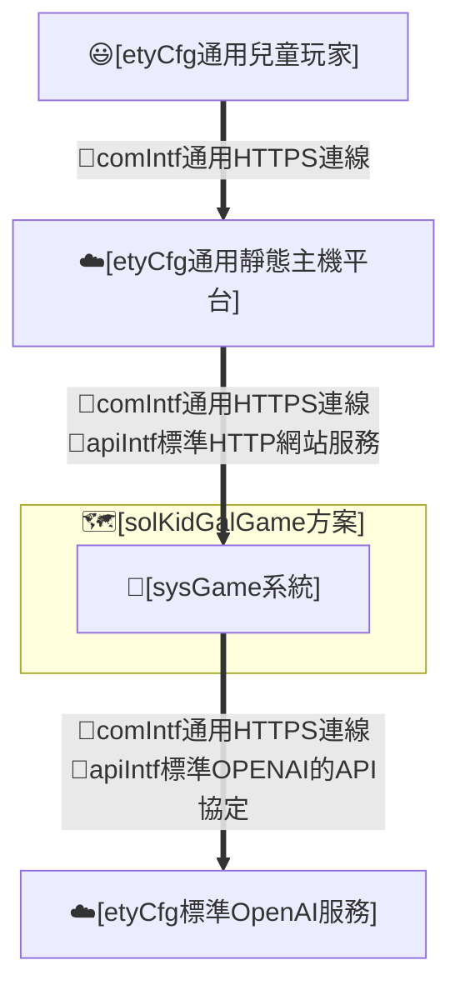
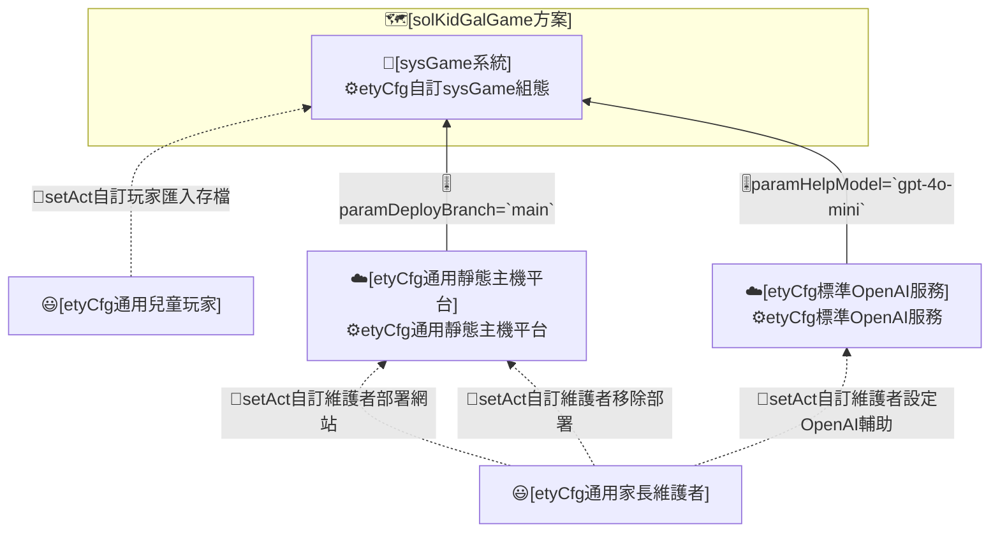
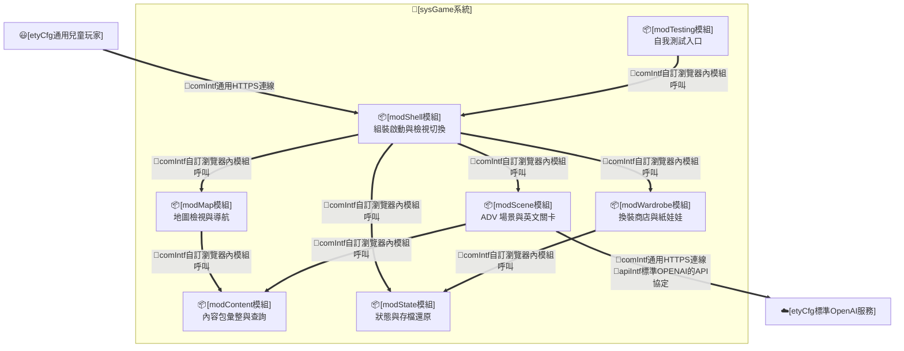
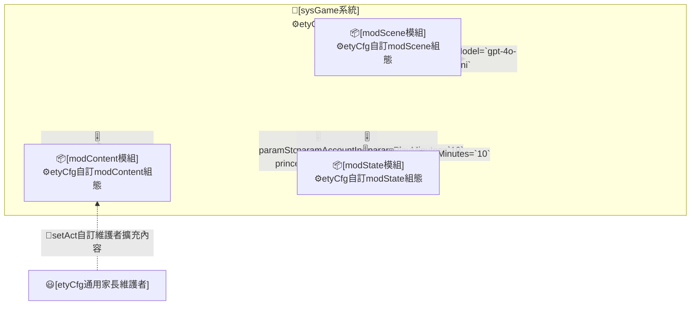

# I. 主旨目的

## A. 設計主旨

* 本 REPO 為 [solKidGalGame方案] 的設計文件。
* 本 REPO 屬方案層級，設計重點在將 `兒童英文學習動機與成果可見性議題`，轉換為靜態網頁遊戲各系統之各自 `實體運作責任`。

## B. 設計目的

* **spec#1-可用短回合低挫折方式練習英文**：方案須讓年幼學習者以「聽情境句、從少量選項選出正確英文、立即對錯回饋」的短回合循環接觸英文，遇困難時可取得提示（含題目與各選項的中文理解協助），降低挫折；並以獎勵高低鼓勵先嘗試英文——未借助中文且越早答對者獎勵越高、曾借助中文者該題無獎勵，維持以英文為主、中文為輔的學習動機。
* **spec#2-可用角色陪伴與場景探索維持遊玩意願**：方案須以公主角色陪伴、王國地圖與多地區場景探索及地點互動，提高兒童反覆遊玩意願。
* **spec#3-可把學習成果轉為看得見的外觀獎勵**：方案須讓答對所得 coins 能兌換為角色外觀（髮型、衣物、鞋帽、配件、outfit set）等可見變化，使成就可見而非僅顯示分數。
* **spec#4-可形成練英文獲獎勵換裝的正向閉環**：方案須使英文練習、獎勵取得與換裝回饋構成同一個可重複的正向循環。
* **spec#5-可保存並還原玩家進度**：方案須讓每個帳號各自的 coins、學習紀錄、擁有與穿搭、所在位置與所選角色及名字可被保存並於再次遊玩時還原。
* **spec#6-可選擇與命名自己的公主**：方案須讓玩家首次進入時選定公主外觀並命名，之後可重選外觀或改名，且不影響既有存檔進度。
* **spec#7-可用純靜態網站方式部署並模組化擴充內容**：方案須能以 GitHub Pages 等純靜態方式部署遊玩，且 area、角色與衣物等內容可模組化新增與調整。
* **spec#8-可用本機多帳號分離不同玩家進度**：方案須讓同一裝置上多位玩家各自擁有獨立帳號，每次進入遊戲先選擇要使用的帳號，並可新增與刪除帳號，使不同玩家的進度與換裝成果互不混用；多帳號僅限同一瀏覽器本機，不含網路登入、密碼或雲端同步。
* **spec#9-可限制每次遊玩時長並強制休息以護眼**：方案須在兒童連續遊玩達設定時長後自動結算本回合成果並進入強制休息，休息時間結束前不可續玩，以保護兒童視力；每次遊玩與休息的時長可由玩家於設定調整，並以各帳號各自計算。

# II. 設計分析

## A. 方案設計(solKidGalGame)

### (A) 架構項目

### (B) 組態項目

### (C) 運作個案

* **solStory#1-短回合英文練習**：
  * **solCase#1.1**：[etyCfg通用兒童玩家]執行[runAct自訂玩家答英文題]，於場景聽情境句並從選項選出正確英文，取得即時對錯回饋與獎勵。
* **solStory#2-地圖探索與角色陪伴**：
  * **solCase#2.1**：[etyCfg通用兒童玩家]執行[runAct自訂玩家地圖導航]，於世界地圖與地區地圖間移動並進入地點場景。
* **solStory#3-換裝獎勵**：
  * **solCase#3.1**：[etyCfg通用兒童玩家]執行[runAct自訂玩家購買衣物]，以 coins 於商店購買外觀商品。
  * **solCase#3.2**：[etyCfg通用兒童玩家]執行[runAct自訂玩家換裝]，於衣櫃或商店試穿並穿戴所購商品。
* **solStory#4-學習換裝閉環**：
  * **solCase#4.1**：[etyCfg通用兒童玩家]執行[runAct自訂玩家退款]，將不需要的商品退回 coins，回到練習與換裝循環。
* **solStory#5-進度保存與還原**：
  * **solCase#5.1**：[sysGame系統]執行[runAct自訂系統保存進度]，將玩家進度寫入瀏覽器本機儲存。
  * **solCase#5.2**：[etyCfg通用兒童玩家]執行[setAct自訂玩家匯入存檔]，從 Markdown 存檔還原進度。
* **solStory#6-選角與命名**：
  * **solCase#6.1**：[etyCfg通用兒童玩家]執行[runAct自訂玩家選角命名]，首次進入時選定公主外觀並輸入名字。
* **solStory#7-部署擴充與移除**：
  * **solCase#7.1**：[etyCfg通用家長維護者]執行[setAct自訂維護者部署網站]，將網站包發佈至靜態主機平台。
  * **solCase#7.2**：[etyCfg通用家長維護者]執行[setAct自訂維護者擴充內容]，調整 area、角色或衣物內容包（新增、替換或移除單一包）。
  * **solCase#7.3**：[etyCfg通用家長維護者]執行[setAct自訂維護者移除部署]，停用靜態主機平台上的部署。
* **solStory#8-初始化與異常復原**：
  * **solCase#8.1**：[sysGame系統]執行[runAct自訂系統還原進度]，讀取本機存檔並將缺漏或損壞欄位正規化回預設值。
* **solStory#9-輔助提示與外部服務**：
  * **solCase#9.1**：[etyCfg通用兒童玩家]執行[runAct自訂玩家取得Help提示]，於答題遇困難時向 OpenAI 輔助取得一則簡短提示。
  * **solCase#9.2**：[etyCfg通用家長維護者]執行[setAct自訂維護者設定OpenAI輔助]，設定本機 OpenAI proxy 與金鑰以啟用提示。
* **solStory#10-多帳號選擇與管理**：
  * **solCase#10.1**：[etyCfg通用兒童玩家]執行[runAct自訂玩家選擇帳號]，每次進入遊戲時於帳號選擇畫面選擇要使用的帳號。
  * **solCase#10.2**：[etyCfg通用兒童玩家]執行[runAct自訂玩家新增帳號]，建立一個新帳號並成為使用中帳號。
  * **solCase#10.3**：[etyCfg通用兒童玩家]執行[runAct自訂玩家刪除帳號]，刪除一個帳號，並於刪除使用中帳號後回到帳號選擇。
* **solStory#11-遊玩時間限制與護眼休息**：
  * **solCase#11.1**：[sysGame系統]執行[runAct自訂系統遊玩計時消耗]，依真實經過時間逐步遞減目前帳號的遊玩時間預算（energy）。
  * **solCase#11.2**：[sysGame系統]執行[runAct自訂系統時間到結算]，於遊玩時間預算耗盡時自動結算並呈現本回合成果（獲得金錢、答題數與答題正確度）。
  * **solCase#11.3**：[sysGame系統]執行[runAct自訂系統休息鎖定]，結算後鎖定目前帳號遊玩，休息時長屆滿前不可續玩、屆滿後解鎖。
  * **solCase#11.4**：[etyCfg通用兒童玩家]執行[runAct自訂玩家調整遊玩限制]，於設定調整每次遊玩與休息的時長。
* **solStory#12-中文雙語協助與獎勵階梯**：
  * **solCase#12.1**：[etyCfg通用兒童玩家]執行[runAct自訂玩家取用中文協助]，於答題時撥放題目或某一選項的中文以理解題意。
  * **solCase#12.2**：[sysGame系統]執行[runAct自訂系統結算協助獎勵]，依本題是否取用過中文與答對前的送出次數，套用全額／半額／無獎勵。

### (D) 重點組態

* **Env轉K8sSec參數**
  * [etyCfg標準OpenAI服務]
    * `OPENAI_API_KEY`：本機 proxy 環境變數，不入網站包。
    * `OPENAI_ORG_ID`：本機 proxy 環境變數，選配。
* **HelmChart參數-chart.yaml**
  * [etyCfg自訂sysGame組態]：暫無（靜態網站包採 [techStackStaticWeb]，預設 Pages 直推，無自有 chart）。
* **HelmChart參數-values.yaml**
  * [etyCfg自訂sysGame組態]
    * paramTechStack=`techStackStaticWeb`
    * paramDeployTarget=`github-pages`
    * paramSiteRoot=`repository-root`
  * [etyCfg通用靜態主機平台]
    * paramDeployBranch=`main`

## B. 系統設計(sysGame系統)

### (A) 架構項目

### (B) 組態項目

### (C) 運作個案

* **sysStory#1-承接英文練習與提示**：
  * **sysCase#1.1**：[modScene模組]承接[runAct自訂玩家答英文題]，載入題庫、比對選項並回饋獎勵。
  * **sysCase#1.2**：[modScene模組]承接[runAct自訂玩家取得Help提示]，呼叫 OpenAI 輔助回傳一則提示。
* **sysStory#2-承接地圖導航**：
  * **sysCase#2.1**：[modMap模組]承接[runAct自訂玩家地圖導航]，處理世界與地區地圖移動及進入地點。
* **sysStory#3-承接換裝與商店**：
  * **sysCase#3.1**：[modWardrobe模組]承接[runAct自訂玩家購買衣物]，扣除 coins 並標記擁有。
  * **sysCase#3.2**：[modWardrobe模組]承接[runAct自訂玩家換裝]，更新 outfit 並重繪紙娃娃。
  * **sysCase#3.3**：[modWardrobe模組]承接[runAct自訂玩家退款]，回補 coins 並取消擁有。
* **sysStory#4-承接狀態保存與還原**：
  * **sysCase#4.1**：[modState模組]承接[runAct自訂系統保存進度]，寫入瀏覽器本機儲存。
  * **sysCase#4.2**：[modState模組]承接[setAct自訂玩家匯入存檔]，解析 Markdown 並正規化還原。
  * **sysCase#4.3**：[modState模組]承接[runAct自訂系統還原進度]，缺漏欄位回退預設值。
* **sysStory#5-承接選角與內容擴充**：
  * **sysCase#5.1**：[modShell模組]承接[runAct自訂玩家選角命名]，更新 activeCharacterId 與 playerName。
  * **sysCase#5.2**：[modContent模組]承接[setAct自訂維護者擴充內容]，匯入新內容包至 registry。
* **sysStory#6-承接多帳號選擇與管理**：
  * **sysCase#6.1**：[modShell模組]承接[runAct自訂玩家選擇帳號]，啟動時先進入帳號選擇，讀取帳號清單，玩家選定後透過 modState 載入該帳號進度再進入遊戲。
  * **sysCase#6.2**：[modState模組]承接[runAct自訂玩家新增帳號]，建立新帳號的初始進度並設為使用中帳號。
  * **sysCase#6.3**：[modState模組]承接[runAct自訂玩家刪除帳號]，移除指定帳號，刪除使用中帳號後清除使用中指向並交回帳號選擇。
* **sysStory#7-承接遊玩時間限制與護眼休息**：
  * **sysCase#7.1**：[modState模組]承接[runAct自訂系統遊玩計時消耗]，依真實經過時間遞減目前帳號的遊玩時間預算並持久化至該帳號進度。
  * **sysCase#7.2**：[modShell模組]承接[runAct自訂系統時間到結算]，於預算耗盡時呈現本回合成果結算畫面。
  * **sysCase#7.3**：[modShell模組]承接[runAct自訂系統休息鎖定]，依休息時長鎖定遊玩入口、屆滿後解鎖。
  * **sysCase#7.4**：[modState模組]承接[runAct自訂玩家調整遊玩限制]，保存每次遊玩與休息時長至目前帳號。
* **sysStory#8-承接中文雙語協助與獎勵階梯**：
  * **sysCase#8.1**：[modScene模組]承接[runAct自訂玩家取用中文協助]，以瀏覽器語音依 `zh-TW` 撥放題目或選項的中文（題庫含中文欄位；缺中文時降級為僅英文撥放）。
  * **sysCase#8.2**：[modScene模組]承接[runAct自訂系統結算協助獎勵]，依中文使用旗標與答對前送出次數，以全額／半額（paramRewardSecondTryRatio）／無 結算 coins。

### (D) 重點組態

* **Env轉K8sSec參數**
  * [etyCfg自訂modScene組態]：`OPENAI_API_KEY` 經本機 proxy 注入，網站包不含金鑰。
* **HelmChart參數-chart.yaml**
  * [etyCfg自訂sysGame組態]：暫無。
* **HelmChart參數-values.yaml**
  * [etyCfg自訂modState組態]
    * paramStorageKey=`luminara-princess-english-adv`
    * paramSaveMarker=`LUMINARA_SAVE_JSON`
    * paramAccountIndexKey=`luminara-princess-english-accounts`
    * paramPlayMinutes=`10`
    * paramRestMinutes=`10`
  * [etyCfg自訂modContent組態]
    * paramDefaultArea=`castle`
    * paramDefaultCharacter=`lumi`
  * [etyCfg自訂modScene組態]
    * paramHelpModel=`gpt-4o-mini`
    * paramHelpAudioLang=`zh-TW`
    * paramRewardSecondTryRatio=`0.5`

# III. 測試規格

本章測試規格對應＜II. 設計分析＞的架構項目、運作個案與重點組態，驗證工程設計是否成立；[spec#N] 的部署後成效不在本章直接宣稱達成，改於＜IV. 部署成效＞回頭評估。方案層 productReadme 視為自然語言操作腳本，須可供自然人閱讀，也可供 AI Agent 依步驟執行、驗證與回報。

## A. 模組層級：測試建議

* **單元測試**
  * 所有自製[comp組件]必須進行函數單元測試。
  * 測試涵蓋度必須達到80%以上。
  * 測試案例必須聚焦於各組件內部邏輯的正確性與錯誤處理。
  * 測試案例不應涉及跨組件協作或整體流程驗證。

## B. 系統層級：測試建議

* **靜態介面測試**
  * comIntf
  * apiIntf
  * hmiIntf
  * datIntf
* **靜態組態測試**
  * etyCfg
* **遞增整合測試**
  * setAct
  * runAct

## C. 方案層級：組態測試(etyCfg)

| 代號 | 測試對象 | 通過判定 |
|---|---|---|
| cfgTest#01 | [etyCfg通用兒童玩家] | 玩家角色組態符合契約規範 |
| cfgTest#02 | [etyCfg通用家長維護者] | 維護者角色組態符合契約規範 |
| cfgTest#03 | [etyCfg標準OpenAI服務] | OpenAI 服務組態與金鑰來源符合契約規範 |
| cfgTest#04 | [etyCfg通用靜態主機平台] | 靜態主機部署組態符合契約規範 |
| cfgTest#05 | [etyCfg自訂sysGame組態] | 系統部署與選型組態符合契約規範 |
| cfgTest#06 | [etyCfg自訂modContent組態] | 內容包預設與 registry 組態符合契約規範 |
| cfgTest#07 | [etyCfg自訂modState組態] | 儲存鍵與存檔標記組態符合契約規範 |
| cfgTest#08 | [etyCfg自訂modScene組態] | 提示模型與輔助組態符合契約規範 |

## D. 方案層級：整合測試(setAct/runAct)

### 初始部署設定相關 setAct

#### intTest#01-驗證 [setAct自訂維護者部署網站]

* 既有基底：無。
* 新增項目：[sysGame系統]之靜態網站包部署至靜態主機平台。
* 步驟：
  1. 將 repo 內容以靜態方式發佈至 GitHub Pages（站根為 repository root，保留 .nojekyll）。
  2. 以瀏覽器開啟部署 URL。
* 預期結果：
  1. 首頁載入成功，index.html 與 game-engine ES module 無 404。

#### intTest#02-驗證 [setAct自訂維護者設定OpenAI輔助]

* 既有基底：intTest#01。
* 新增項目：[sysGame系統]之本機 OpenAI Help proxy 設定。
* 步驟：
  1. 設定環境變數 OPENAI_API_KEY 後啟動 server.mjs。
  2. 對 /api/help 發出一筆 POST 請求。
* 預期結果：
  1. 已設金鑰時回傳 200 與一則簡短提示文字；未設金鑰時回傳 503。

#### intTest#03-驗證 [setAct自訂維護者擴充內容]

* 既有基底：intTest#01。
* 新增項目：[sysGame系統]之新增內容包。
* 步驟：
  1. 新增一個 area、wardrobe 或 character 內容包並於對應 registry 匯入。
  2. 重新載入遊戲。
* 預期結果：
  1. 新內容出現於對應地圖、商店或選角，且既有內容不受影響。

#### intTest#04-驗證 [setAct自訂維護者移除部署]

* 既有基底：intTest#01。
* 新增項目：[sysGame系統]之部署移除。
* 步驟：
  1. 停用或刪除靜態主機平台上的部署。
* 預期結果：
  1. 部署 URL 不再提供遊戲，且本機開發環境不受影響。

#### intTest#05-驗證 [setAct自訂玩家匯入存檔]

* 既有基底：intTest#01。
* 新增項目：[sysGame系統]之 Markdown 存檔匯入。
* 步驟：
  1. 於 Save/Load 介面貼入先前匯出的 Markdown 存檔並載入。
* 預期結果：
  1. coins、outfit、diary、所在位置、角色與名字均還原正確。

### 加入[sysGame系統]相關 runAct

#### intTest#06-驗證 [runAct自訂玩家答英文題]

* 既有基底：intTest#01。
* 新增項目：[sysGame系統]之答題行為。
* 步驟：
  1. 進入具 lesson 的地點，選出正確英文選項。
* 預期結果：
  1. 顯示答對回饋並增加 coins 與學習紀錄。

#### intTest#07-驗證 [runAct自訂玩家地圖導航]

* 既有基底：intTest#06。
* 新增項目：[sysGame系統]之地圖導航行為。
* 步驟：
  1. 由地區地圖經 gate 回世界地圖，再進入另一地區 entry node。
* 預期結果：
  1. 場景切換至目標地區，玩家位置與 playerNode 一致。

#### intTest#08-驗證 [runAct自訂玩家購買衣物]

* 既有基底：intTest#06。
* 新增項目：[sysGame系統]之購買行為。
* 步驟：
  1. 於商店以足夠 coins 購買一件商品。
* 預期結果：
  1. coins 正確扣除，商品標記為 owned。

#### intTest#09-驗證 [runAct自訂玩家換裝]

* 既有基底：intTest#08。
* 新增項目：[sysGame系統]之換裝行為。
* 步驟：
  1. 於衣櫃穿戴已擁有商品。
* 預期結果：
  1. 紙娃娃 outfit 更新且互斥 slot 正確處理。

#### intTest#10-驗證 [runAct自訂玩家退款]

* 既有基底：intTest#08。
* 新增項目：[sysGame系統]之退款行為。
* 步驟：
  1. 於退款介面退回一件已擁有商品。
* 預期結果：
  1. coins 回補，商品取消 owned 且不再可穿戴。

#### intTest#11-驗證 [runAct自訂玩家選角命名]

* 既有基底：intTest#01。
* 新增項目：[sysGame系統]之選角命名行為。
* 步驟：
  1. 於選角畫面選定外觀並輸入名字後確認。
* 預期結果：
  1. activeCharacterId 與 playerName 更新，遊戲內稱呼隨之改變。

#### intTest#12-驗證 [runAct自訂玩家取得Help提示]

* 既有基底：intTest#02、intTest#06。
* 新增項目：[sysGame系統]之 Help 提示行為。
* 步驟：
  1. 於答題畫面按下 Help。
* 預期結果：
  1. 顯示一則不直接揭露答案的簡短提示；輔助不可用時顯示降級訊息。

#### intTest#13-驗證 [runAct自訂系統保存進度]

* 既有基底：intTest#08。
* 新增項目：[sysGame系統]之自動保存行為。
* 步驟：
  1. 進行任一會改變狀態的操作後重新整理頁面。
* 預期結果：
  1. coins、outfit 與位置等狀態自瀏覽器本機儲存還原。

#### intTest#14-驗證 [runAct自訂系統還原進度]

* 既有基底：intTest#13。
* 新增項目：[sysGame系統]之缺漏正規化行為。
* 步驟：
  1. 載入缺少 activeCharacterId 或含未知 item 的存檔。
* 預期結果：
  1. 缺漏欄位回退預設值，狀態不變量（coins 非負、裝備指向已擁有物）成立。

#### intTest#15-驗證 [runAct自訂玩家選擇帳號]

* 既有基底：intTest#01。
* 新增項目：[sysGame系統]之進入時帳號選擇行為。
* 步驟：
  1. 在已有至少一個帳號的狀態下啟動遊戲，於帳號選擇畫面選定一個帳號。
* 預期結果：
  1. 載入該帳號進度並進入遊戲，coins、穿搭與所在位置與該帳號一致。

#### intTest#16-驗證 [runAct自訂玩家新增帳號]

* 既有基底：intTest#01。
* 新增項目：[sysGame系統]之新增帳號行為。
* 步驟：
  1. 於帳號選擇畫面新增一個帳號並進入。
* 預期結果：
  1. 建立乾淨初始進度（coins 為預設、無 owned、無穿搭）並成為使用中帳號，且不影響其他帳號。

#### intTest#17-驗證 [runAct自訂玩家刪除帳號]

* 既有基底：intTest#16。
* 新增項目：[sysGame系統]之刪除帳號行為。
* 步驟：
  1. 刪除一個非使用中帳號。
  2. 刪除目前使用中帳號。
* 預期結果：
  1. 被刪帳號自清單移除，其餘帳號進度不受影響。
  2. 刪除使用中帳號後回到帳號選擇；刪除最後一個帳號後僅顯示新增帳號的空狀態。

#### intTest#18-驗證 [runAct自訂玩家調整遊玩限制]

* 既有基底：intTest#15。
* 新增項目：[sysGame系統]之遊玩／休息時長設定與持久化。
* 步驟：
  1. 以一個帳號進入遊戲，於設定將每次遊玩與休息時長改為非預設值並儲存。
  2. 重新整理頁面並以同一帳號進入。
* 預期結果：
  1. 設定值套用且重整後仍保留，僅作用於該帳號，其他帳號維持各自設定。

#### intTest#19-驗證 [runAct自訂系統遊玩計時消耗]

* 既有基底：intTest#18。
* 新增項目：[sysGame系統]之遊玩時間預算隨真實時間遞減行為。
* 步驟：
  1. 將每次遊玩時長設為極短測試值後進入遊戲並停留於遊玩畫面。
  2. 等待設定時長經過。
* 預期結果：
  1. 該帳號的遊玩時間預算（energy）隨真實經過時間遞減至 0。

#### intTest#20-驗證 [runAct自訂系統時間到結算]

* 既有基底：intTest#19。
* 新增項目：[sysGame系統]之時間到自動結算行為。
* 步驟：
  1. 接續 intTest#19，待遊玩時間預算遞減至 0。
* 預期結果：
  1. 自動顯示本回合成果結算畫面，含本回合獲得金錢、答題數與答題正確度。

#### intTest#21-驗證 [runAct自訂系統休息鎖定]

* 既有基底：intTest#20。
* 新增項目：[sysGame系統]之休息鎖定與屆滿解鎖行為。
* 步驟：
  1. 接續 intTest#20 結算後，於休息時長屆滿前嘗試續玩。
  2. 等待休息時長屆滿後再次嘗試續玩。
* 預期結果：
  1. 休息時長屆滿前遊玩入口被鎖定、不可續玩。
  2. 休息時長屆滿後解鎖，可重新開始遊玩。

#### intTest#22-驗證 [runAct自訂玩家取用中文協助]

* 既有基底：intTest#06。
* 新增項目：[sysGame系統]之題目與選項中文撥放行為。
* 步驟：
  1. 進入具 lesson 的地點，於題目按下中文撥放，再於任一選項按下中文撥放。
  2. 載入一個缺中文欄位的 lesson 後重試。
* 預期結果：
  1. 題目與該選項以 zh-TW 語音撥放中文。
  2. 缺中文欄位時降級為僅英文撥放，不報錯。

#### intTest#23-驗證 [runAct自訂系統結算協助獎勵]

* 既有基底：intTest#22。
* 新增項目：[sysGame系統]之獎勵階梯結算行為。
* 步驟：
  1. 不按中文，第一次即選出正確選項。
  2. 另一題不按中文，先答錯一次、第二次選出正確選項。
  3. 另一題先按中文撥放再答對，或連續答錯兩次後第三次才答對。
* 預期結果：
  1. 第一次答對且未用中文：發全額 coins。
  2. 第二次答對且未用中文：發半額 coins（paramRewardSecondTryRatio）。
  3. 曾用中文或第三次起答對：不發 coins；旗標與次數於換題後重置。

## E. 方案層級：文件程式化測試

#### docProgTest#01-productReadme 承接 [solStory#1-短回合英文練習]

* productReadme 要求：
  1. 說明如何進入場景、聽情境句、選英文與看回饋。
* 通過判定：
  1. 自然人或 AI Agent 可依 productReadme 完成一次答題。

#### docProgTest#02-productReadme 承接 [solStory#2-地圖探索與角色陪伴]

* productReadme 要求：
  1. 說明世界地圖、地區地圖與進入地點的導覽方式。
* 通過判定：
  1. 讀者可依 productReadme 由世界地圖進入任一地區地點。

#### docProgTest#03-productReadme 承接 [solStory#3-換裝獎勵]

* productReadme 要求：
  1. 說明如何用 coins 購買並換裝。
* 通過判定：
  1. 讀者可依 productReadme 完成一次購買與換裝。

#### docProgTest#04-productReadme 承接 [solStory#4-學習換裝閉環]

* productReadme 要求：
  1. 說明退款與回到練習循環的方式。
* 通過判定：
  1. 讀者可依 productReadme 完成一次退款並回到循環。

#### docProgTest#05-productReadme 承接 [solStory#5-進度保存與還原]

* productReadme 要求：
  1. 說明自動保存、匯出與匯入 Markdown 存檔的方式。
* 通過判定：
  1. 讀者可依 productReadme 匯出再匯入並還原進度。

#### docProgTest#06-productReadme 承接 [solStory#6-選角與命名]

* productReadme 要求：
  1. 說明首次選角與命名，以及之後重選與改名的方式。
* 通過判定：
  1. 讀者可依 productReadme 完成選角與命名。

#### docProgTest#07-productReadme 承接 [solStory#7-部署擴充與移除]

* productReadme 要求：
  1. 說明以 GitHub Pages 部署、擴充內容包與移除部署的方式。
* 通過判定：
  1. 維護者可依 productReadme 完成一次靜態部署。

#### docProgTest#08-productReadme 承接 [solStory#8-初始化與異常復原]

* productReadme 要求：
  1. 說明首次進入初始化與存檔損壞時的復原表現。
* 通過判定：
  1. 讀者可依 productReadme 預期缺漏存檔會回退預設並可繼續遊玩。

#### docProgTest#09-productReadme 承接 [solStory#9-輔助提示與外部服務]

* productReadme 要求：
  1. 說明 Help 提示的啟用條件與 OpenAI 本機 proxy 設定。
* 通過判定：
  1. 維護者可依 productReadme 設定並驗證 Help 提示。

#### docProgTest#10-productReadme 承接 [solStory#10-多帳號選擇與管理]

* productReadme 要求：
  1. 說明進入遊戲時如何選擇帳號，以及如何新增與刪除帳號，與刪除使用中／最後帳號後的表現。
* 通過判定：
  1. 讀者可依 productReadme 新增、選擇與刪除帳號，且不同帳號進度互不混用。

#### docProgTest#11-productReadme 承接 [solStory#11-遊玩時間限制與護眼休息]

* productReadme 要求：
  1. 說明連續遊玩會逐步用盡遊玩時間、時間到的本回合結算、休息等待後才可續玩，以及如何於設定調整每次遊玩與休息時長（各帳號各自）。
* 通過判定：
  1. 讀者可依 productReadme 預期玩到時間上限後進入休息，並能於設定調整時長。

#### docProgTest#12-productReadme 承接 [solStory#12-中文雙語協助與獎勵階梯]

* productReadme 要求：
  1. 說明題目與各選項可撥放中文以理解，以及獎勵階梯（未用中文越早答對獎勵越高、用中文或多次才對則無）。
* 通過判定：
  1. 讀者可依 productReadme 取用中文協助並理解不同情況下的獎勵差異。

## F. 方案層級：文件端對端測試

#### e2eTest#01-依 productReadme 驗測主循環

* 依據：docProgTest#01、docProgTest#03、[solCase#1.1]、[solCase#3.1]。
* 步驟：
  1. 依 productReadme 進入場景答對一題取得 coins。
  2. 依 productReadme 至商店購買並換裝。
* 預期結果：
  1. 完成「練英文→獲獎勵→換裝」一輪，外觀可見改變。

#### e2eTest#02-依 productReadme 驗測存檔還原

* 依據：docProgTest#05、[solCase#5.1]、[solCase#5.2]。
* 步驟：
  1. 依 productReadme 匯出 Markdown 存檔。
  2. 清除本機狀態後依 productReadme 匯入該存檔。
* 預期結果：
  1. coins、outfit、位置、角色與名字均還原一致。

#### e2eTest#03-依 productReadme 驗測部署與首次進入

* 依據：docProgTest#07、docProgTest#06、[solCase#7.1]、[solCase#6.1]。
* 步驟：
  1. 依 productReadme 將網站包部署至 GitHub Pages。
  2. 以全新瀏覽器開啟部署 URL，完成選角與命名。
* 預期結果：
  1. 首次進入顯示選角命名畫面，命名後進入遊戲且 ES module 無 404。

#### e2eTest#04-依 productReadme 驗測輔助降級

* 依據：docProgTest#09、[solCase#9.1]。
* 步驟：
  1. 在未設定 OpenAI 金鑰的環境下依 productReadme 按下 Help。
* 預期結果：
  1. 顯示降級提示而非崩潰，答題流程仍可繼續。

#### e2eTest#05-依 productReadme 驗測多帳號隔離與刪除

* 依據：docProgTest#10、[solCase#10.1]、[solCase#10.2]、[solCase#10.3]。
* 步驟：
  1. 依 productReadme 新增兩個帳號，分別遊玩產生不同 coins 與穿搭。
  2. 依 productReadme 在帳號選擇切換到另一帳號。
  3. 依 productReadme 刪除目前使用中帳號。
* 預期結果：
  1. 兩帳號進度互不混用，各自顯示自己的 coins、穿搭與位置。
  2. 切換後顯示對應帳號進度。
  3. 刪除使用中帳號後回到帳號選擇；刪除最後一個帳號顯示僅可新增的空狀態。

#### e2eTest#06-依 productReadme 驗測遊玩時間限制與休息

* 依據：docProgTest#11、[solCase#11.1]、[solCase#11.2]、[solCase#11.3]。
* 步驟：
  1. 依 productReadme 於設定將每次遊玩時長設為極短測試值並開始遊玩至用盡。
  2. 觀察時間到的結算與其後的休息鎖定。
  3. 等待休息時長屆滿後依 productReadme 續玩。
* 預期結果：
  1. 時間到顯示本回合成果結算（金錢、答題數、答題正確度）。
  2. 休息期間遊玩入口被鎖定、不可續玩。
  3. 休息屆滿後可續玩；切換至另一帳號時其遊玩時間與休息獨立計算。

#### e2eTest#07-依 productReadme 驗測中文協助與獎勵階梯

* 依據：docProgTest#12、[solCase#12.1]、[solCase#12.2]。
* 步驟：
  1. 依 productReadme 進入答題，不按中文且第一次答對，記錄所得 coins。
  2. 另一題不按中文、第二次才答對，記錄所得 coins。
  3. 另一題先按中文協助再答對，記錄所得 coins。
* 預期結果：
  1. 第一次答對所得為全額。
  2. 第二次才答對所得約為全額之半。
  3. 用過中文者該題無 coins。

# IV. 部署成效

## A. 部署組態

* **開發 REPO**：`git remote origin`
* **產品 REPO**：`待定`（預設與開發 REPO 同庫，經 GitHub Pages 發佈）
* **productReadme 來源**：`README.md`（本 repo 根目錄產品手冊；尚未採 buildStage 目錄慣例）
* **部署方式**：靜態網站包，依 [techStackStaticWeb]；預設直推 GitHub Pages（Deploy from a branch，repository root 為站根，保留 .nojekyll），可選後置標準 static-serve Helm chart。namespace、release、主機與網域由部署者於實際部署時決定並記錄。
* **建置指令**：無打包（no-op，直接收集靜態檔）；本機預覽 `python -m http.server 4173`，或 `node server.mjs`（另含選配 OpenAI Help proxy，預設 `http://127.0.0.1:4174/`）。
* **測試指令**：型別契約檢查 `npx --yes -p typescript tsc --noEmit --project jsconfig.json`；瀏覽器 selftest `?selftest=data-audit`／`?selftest=save-load`／`?selftest=monkey`／`?selftest=help-reward`／`?selftest=visual-qa&surface=<id>`；結構檢查 `pwsh scripts/docLint.ps1 -Path docs/design.md` 與 `pwsh scripts/repoLint.ps1 -Path .`。
* **部署指令**：GitHub Pages「Deploy from a branch」，站根為 repository root，保留 `.nojekyll`；可選後置 static-serve Helm chart。

## B. 成效追蹤

* **spec#1-可用短回合低挫折方式練習英文**
  * 評估方式：觀察兒童完成單題所需時間、重試次數與中文協助使用情形。
  * 觀察項目：單回合時長、答對率、提示與中文協助使用比例、全額／半額／無獎勵各層級分佈。
* **spec#2-可用角色陪伴與場景探索維持遊玩意願**
  * 評估方式：觀察單次遊玩探索的地點數與回訪次數。
  * 觀察項目：到訪地點數、連續遊玩回合數。
* **spec#3-可把學習成果轉為看得見的外觀獎勵**
  * 評估方式：觀察 coins 兌換為外觀的比例。
  * 觀察項目：購買件數、換裝次數、coins 留存。
* **spec#4-可形成練英文獲獎勵換裝的正向閉環**
  * 評估方式：觀察「答題→購買→換裝」是否在單次遊玩內成環。
  * 觀察項目：單次遊玩完成閉環的比例。
* **spec#5-可保存並還原玩家進度**
  * 評估方式：以匯出再匯入比對狀態一致性。
  * 觀察項目：還原欄位完整度、重整後狀態保留率。
* **spec#6-可選擇與命名自己的公主**
  * 評估方式：觀察選角命名完成率與改名後稱呼一致性。
  * 觀察項目：選角完成率、稱呼動態化正確率。
* **spec#7-可用純靜態網站方式部署並模組化擴充內容**
  * 評估方式：以全新環境依 productReadme 完成部署與內容擴充。
  * 觀察項目：部署成功率、新增內容包後既有功能未回歸。
* **spec#8-可用本機多帳號分離不同玩家進度**
  * 評估方式：以多個帳號分別遊玩後比對各自進度是否互不混用。
  * 觀察項目：帳號間進度隔離正確率、刪除帳號後狀態一致性。
* **spec#9-可限制每次遊玩時長並強制休息以護眼**
  * 評估方式：觀察單次連續遊玩是否於設定時長後進入結算與休息，且休息屆滿前無法續玩。
  * 觀察項目：達上限後休息遵守率、本回合結算呈現正確率、時長設定調整生效率。
