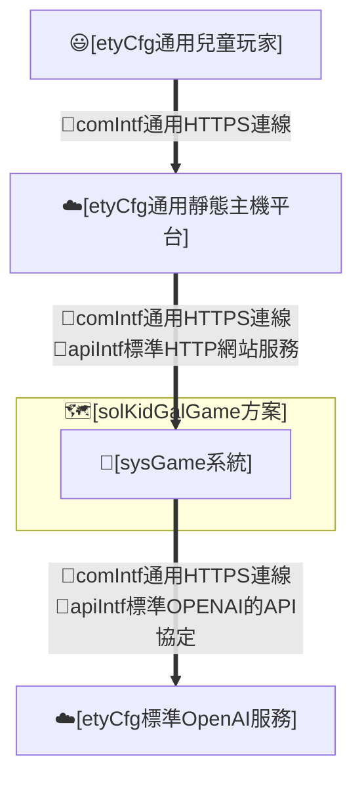
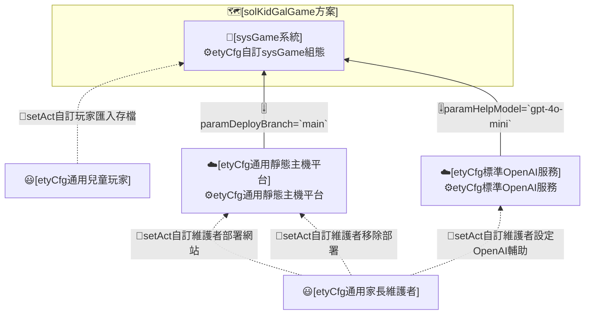
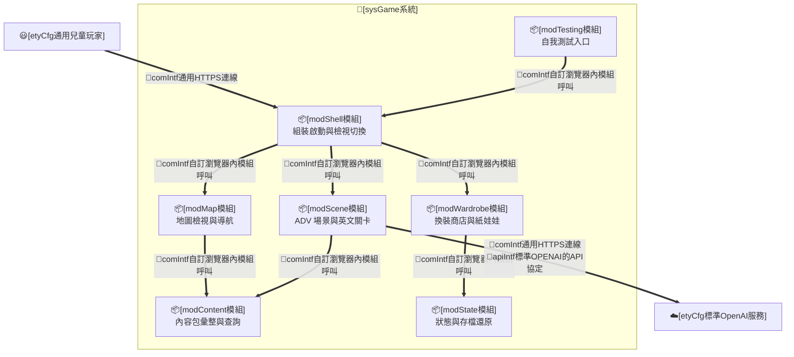
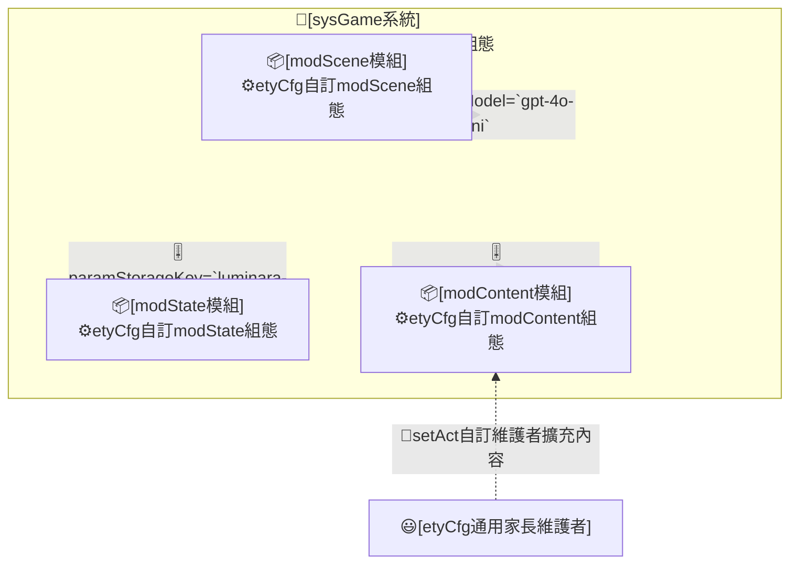

# I. 主旨目的

## A. 設計主旨

* 本 REPO 為 [solKidGalGame方案] 的設計文件。
* 本 REPO 屬方案層級，設計重點在將 `兒童英文學習動機與成果可見性議題`，轉換為靜態網頁遊戲各系統之各自 `實體運作責任`。

## B. 設計目的

* **spec#1-可用短回合低挫折方式練習英文**：方案須讓年幼學習者以「聽情境句、從少量選項選出正確英文、立即對錯回饋」的短回合循環接觸英文，遇困難時可取得提示，降低挫折。
* **spec#2-可用角色陪伴與場景探索維持遊玩意願**：方案須以公主角色陪伴、王國地圖與多地區場景探索及地點互動，提高兒童反覆遊玩意願。
* **spec#3-可把學習成果轉為看得見的外觀獎勵**：方案須讓答對所得 coins 能兌換為角色外觀（髮型、衣物、鞋帽、配件、outfit set）等可見變化，使成就可見而非僅顯示分數。
* **spec#4-可形成練英文獲獎勵換裝的正向閉環**：方案須使英文練習、獎勵取得與換裝回饋構成同一個可重複的正向循環。
* **spec#5-可保存並還原玩家進度**：方案須讓玩家的 coins、學習紀錄、擁有與穿搭、所在位置與所選角色及名字可被保存並於再次遊玩時還原。
* **spec#6-可選擇與命名自己的公主**：方案須讓玩家首次進入時選定公主外觀並命名，之後可重選外觀或改名，且不影響既有存檔進度。
* **spec#7-可用純靜態網站方式部署並模組化擴充內容**：方案須能以 GitHub Pages 等純靜態方式部署遊玩，且 area、角色與衣物等內容可模組化新增與調整。

# II. 設計分析

## A. 方案設計(solKidGalGame)

### (A) 架構項目

### (B) 組態項目

### (C) 運作個案

* **solStory#1-短回合英文練習**：
  * **solCase#1.1**：[etyCfg通用兒童玩家]執行[runAct自訂玩家答英文題]，於場景聽情境句並從選項選出正確英文，取得即時對錯回饋與獎勵。
* **solStory#2-地圖探索與角色陪伴**：
  * **solCase#2.1**：[etyCfg通用兒童玩家]執行[runAct自訂玩家地圖導航]，於世界地圖與地區地圖間移動並進入地點場景。
* **solStory#3-換裝獎勵**：
  * **solCase#3.1**：[etyCfg通用兒童玩家]執行[runAct自訂玩家購買衣物]，以 coins 於商店購買外觀商品。
  * **solCase#3.2**：[etyCfg通用兒童玩家]執行[runAct自訂玩家換裝]，於衣櫃或商店試穿並穿戴所購商品。
* **solStory#4-學習換裝閉環**：
  * **solCase#4.1**：[etyCfg通用兒童玩家]執行[runAct自訂玩家退款]，將不需要的商品退回 coins，回到練習與換裝循環。
* **solStory#5-進度保存與還原**：
  * **solCase#5.1**：[sysGame系統]執行[runAct自訂系統保存進度]，將玩家進度寫入瀏覽器本機儲存。
  * **solCase#5.2**：[etyCfg通用兒童玩家]執行[setAct自訂玩家匯入存檔]，從 Markdown 存檔還原進度。
* **solStory#6-選角與命名**：
  * **solCase#6.1**：[etyCfg通用兒童玩家]執行[runAct自訂玩家選角命名]，首次進入時選定公主外觀並輸入名字。
* **solStory#7-部署擴充與移除**：
  * **solCase#7.1**：[etyCfg通用家長維護者]執行[setAct自訂維護者部署網站]，將網站包發佈至靜態主機平台。
  * **solCase#7.2**：[etyCfg通用家長維護者]執行[setAct自訂維護者擴充內容]，調整 area、角色或衣物內容包（新增、替換或移除單一包）。
  * **solCase#7.3**：[etyCfg通用家長維護者]執行[setAct自訂維護者移除部署]，停用靜態主機平台上的部署。
* **solStory#8-初始化與異常復原**：
  * **solCase#8.1**：[sysGame系統]執行[runAct自訂系統還原進度]，讀取本機存檔並將缺漏或損壞欄位正規化回預設值。
* **solStory#9-輔助提示與外部服務**：
  * **solCase#9.1**：[etyCfg通用兒童玩家]執行[runAct自訂玩家取得Help提示]，於答題遇困難時向 OpenAI 輔助取得一則簡短提示。
  * **solCase#9.2**：[etyCfg通用家長維護者]執行[setAct自訂維護者設定OpenAI輔助]，設定本機 OpenAI proxy 與金鑰以啟用提示。

### (D) 重點組態

* **Env轉K8sSec參數**
  * [etyCfg標準OpenAI服務]
    * `OPENAI_API_KEY`：本機 proxy 環境變數，不入網站包。
    * `OPENAI_ORG_ID`：本機 proxy 環境變數，選配。
* **HelmChart參數-chart.yaml**
  * [etyCfg自訂sysGame組態]：暫無（靜態網站包採 [techStackStaticWeb]，預設 Pages 直推，無自有 chart）。
* **HelmChart參數-values.yaml**
  * [etyCfg自訂sysGame組態]
    * paramTechStack=`techStackStaticWeb`
    * paramDeployTarget=`github-pages`
    * paramSiteRoot=`repository-root`
  * [etyCfg通用靜態主機平台]
    * paramDeployBranch=`main`

## B. 系統設計(sysGame系統)

### (A) 架構項目

### (B) 組態項目

### (C) 運作個案

* **sysStory#1-承接英文練習與提示**：
  * **sysCase#1.1**：[modScene模組]承接[runAct自訂玩家答英文題]，載入題庫、比對選項並回饋獎勵。
  * **sysCase#1.2**：[modScene模組]承接[runAct自訂玩家取得Help提示]，呼叫 OpenAI 輔助回傳一則提示。
* **sysStory#2-承接地圖導航**：
  * **sysCase#2.1**：[modMap模組]承接[runAct自訂玩家地圖導航]，處理世界與地區地圖移動及進入地點。
* **sysStory#3-承接換裝與商店**：
  * **sysCase#3.1**：[modWardrobe模組]承接[runAct自訂玩家購買衣物]，扣除 coins 並標記擁有。
  * **sysCase#3.2**：[modWardrobe模組]承接[runAct自訂玩家換裝]，更新 outfit 並重繪紙娃娃。
  * **sysCase#3.3**：[modWardrobe模組]承接[runAct自訂玩家退款]，回補 coins 並取消擁有。
* **sysStory#4-承接狀態保存與還原**：
  * **sysCase#4.1**：[modState模組]承接[runAct自訂系統保存進度]，寫入瀏覽器本機儲存。
  * **sysCase#4.2**：[modState模組]承接[setAct自訂玩家匯入存檔]，解析 Markdown 並正規化還原。
  * **sysCase#4.3**：[modState模組]承接[runAct自訂系統還原進度]，缺漏欄位回退預設值。
* **sysStory#5-承接選角與內容擴充**：
  * **sysCase#5.1**：[modShell模組]承接[runAct自訂玩家選角命名]，更新 activeCharacterId 與 playerName。
  * **sysCase#5.2**：[modContent模組]承接[setAct自訂維護者擴充內容]，匯入新內容包至 registry。

### (D) 重點組態

* **Env轉K8sSec參數**
  * [etyCfg自訂modScene組態]：`OPENAI_API_KEY` 經本機 proxy 注入，網站包不含金鑰。
* **HelmChart參數-chart.yaml**
  * [etyCfg自訂sysGame組態]：暫無。
* **HelmChart參數-values.yaml**
  * [etyCfg自訂modState組態]
    * paramStorageKey=`luminara-princess-english-adv`
    * paramSaveMarker=`LUMINARA_SAVE_JSON`
  * [etyCfg自訂modContent組態]
    * paramDefaultArea=`castle`
    * paramDefaultCharacter=`lumi`
  * [etyCfg自訂modScene組態]
    * paramHelpModel=`gpt-4o-mini`

# III. 測試規格

本章測試規格對應＜II. 設計分析＞的架構項目、運作個案與重點組態，驗證工程設計是否成立；[spec#N] 的部署後成效不在本章直接宣稱達成，改於＜IV. 部署成效＞回頭評估。方案層 productReadme 視為自然語言操作腳本，須可供自然人閱讀，也可供 AI Agent 依步驟執行、驗證與回報。

## A. 模組層級：測試建議

* **單元測試**
  * 所有自製[comp組件]必須進行函數單元測試。
  * 測試涵蓋度必須達到80%以上。
  * 測試案例必須聚焦於各組件內部邏輯的正確性與錯誤處理。
  * 測試案例不應涉及跨組件協作或整體流程驗證。

## B. 系統層級：測試建議

* **靜態介面測試**
  * comIntf
  * apiIntf
  * hmiIntf
  * datIntf
* **靜態組態測試**
  * etyCfg
* **遞增整合測試**
  * setAct
  * runAct

## C. 方案層級：組態測試(etyCfg)

| 代號 | 測試對象 | 通過判定 |
|---|---|---|
| cfgTest#01 | [etyCfg通用兒童玩家] | 玩家角色組態符合契約規範 |
| cfgTest#02 | [etyCfg通用家長維護者] | 維護者角色組態符合契約規範 |
| cfgTest#03 | [etyCfg標準OpenAI服務] | OpenAI 服務組態與金鑰來源符合契約規範 |
| cfgTest#04 | [etyCfg通用靜態主機平台] | 靜態主機部署組態符合契約規範 |
| cfgTest#05 | [etyCfg自訂sysGame組態] | 系統部署與選型組態符合契約規範 |
| cfgTest#06 | [etyCfg自訂modContent組態] | 內容包預設與 registry 組態符合契約規範 |
| cfgTest#07 | [etyCfg自訂modState組態] | 儲存鍵與存檔標記組態符合契約規範 |
| cfgTest#08 | [etyCfg自訂modScene組態] | 提示模型與輔助組態符合契約規範 |

## D. 方案層級：整合測試(setAct/runAct)

### 初始部署設定相關 setAct

#### intTest#01-驗證 [setAct自訂維護者部署網站]

* 既有基底：無。
* 新增項目：[sysGame系統]之靜態網站包部署至靜態主機平台。
* 步驟：
  1. 將 repo 內容以靜態方式發佈至 GitHub Pages（站根為 repository root，保留 .nojekyll）。
  2. 以瀏覽器開啟部署 URL。
* 預期結果：
  1. 首頁載入成功，index.html 與 game-engine ES module 無 404。

#### intTest#02-驗證 [setAct自訂維護者設定OpenAI輔助]

* 既有基底：intTest#01。
* 新增項目：[sysGame系統]之本機 OpenAI Help proxy 設定。
* 步驟：
  1. 設定環境變數 OPENAI_API_KEY 後啟動 server.mjs。
  2. 對 /api/help 發出一筆 POST 請求。
* 預期結果：
  1. 已設金鑰時回傳 200 與一則簡短提示文字；未設金鑰時回傳 503。

#### intTest#03-驗證 [setAct自訂維護者擴充內容]

* 既有基底：intTest#01。
* 新增項目：[sysGame系統]之新增內容包。
* 步驟：
  1. 新增一個 area、wardrobe 或 character 內容包並於對應 registry 匯入。
  2. 重新載入遊戲。
* 預期結果：
  1. 新內容出現於對應地圖、商店或選角，且既有內容不受影響。

#### intTest#04-驗證 [setAct自訂維護者移除部署]

* 既有基底：intTest#01。
* 新增項目：[sysGame系統]之部署移除。
* 步驟：
  1. 停用或刪除靜態主機平台上的部署。
* 預期結果：
  1. 部署 URL 不再提供遊戲，且本機開發環境不受影響。

#### intTest#05-驗證 [setAct自訂玩家匯入存檔]

* 既有基底：intTest#01。
* 新增項目：[sysGame系統]之 Markdown 存檔匯入。
* 步驟：
  1. 於 Save/Load 介面貼入先前匯出的 Markdown 存檔並載入。
* 預期結果：
  1. coins、outfit、diary、所在位置、角色與名字均還原正確。

### 加入[sysGame系統]相關 runAct

#### intTest#06-驗證 [runAct自訂玩家答英文題]

* 既有基底：intTest#01。
* 新增項目：[sysGame系統]之答題行為。
* 步驟：
  1. 進入具 lesson 的地點，選出正確英文選項。
* 預期結果：
  1. 顯示答對回饋並增加 coins 與學習紀錄。

#### intTest#07-驗證 [runAct自訂玩家地圖導航]

* 既有基底：intTest#06。
* 新增項目：[sysGame系統]之地圖導航行為。
* 步驟：
  1. 由地區地圖經 gate 回世界地圖，再進入另一地區 entry node。
* 預期結果：
  1. 場景切換至目標地區，玩家位置與 playerNode 一致。

#### intTest#08-驗證 [runAct自訂玩家購買衣物]

* 既有基底：intTest#06。
* 新增項目：[sysGame系統]之購買行為。
* 步驟：
  1. 於商店以足夠 coins 購買一件商品。
* 預期結果：
  1. coins 正確扣除，商品標記為 owned。

#### intTest#09-驗證 [runAct自訂玩家換裝]

* 既有基底：intTest#08。
* 新增項目：[sysGame系統]之換裝行為。
* 步驟：
  1. 於衣櫃穿戴已擁有商品。
* 預期結果：
  1. 紙娃娃 outfit 更新且互斥 slot 正確處理。

#### intTest#10-驗證 [runAct自訂玩家退款]

* 既有基底：intTest#08。
* 新增項目：[sysGame系統]之退款行為。
* 步驟：
  1. 於退款介面退回一件已擁有商品。
* 預期結果：
  1. coins 回補，商品取消 owned 且不再可穿戴。

#### intTest#11-驗證 [runAct自訂玩家選角命名]

* 既有基底：intTest#01。
* 新增項目：[sysGame系統]之選角命名行為。
* 步驟：
  1. 於選角畫面選定外觀並輸入名字後確認。
* 預期結果：
  1. activeCharacterId 與 playerName 更新，遊戲內稱呼隨之改變。

#### intTest#12-驗證 [runAct自訂玩家取得Help提示]

* 既有基底：intTest#02、intTest#06。
* 新增項目：[sysGame系統]之 Help 提示行為。
* 步驟：
  1. 於答題畫面按下 Help。
* 預期結果：
  1. 顯示一則不直接揭露答案的簡短提示；輔助不可用時顯示降級訊息。

#### intTest#13-驗證 [runAct自訂系統保存進度]

* 既有基底：intTest#08。
* 新增項目：[sysGame系統]之自動保存行為。
* 步驟：
  1. 進行任一會改變狀態的操作後重新整理頁面。
* 預期結果：
  1. coins、outfit 與位置等狀態自瀏覽器本機儲存還原。

#### intTest#14-驗證 [runAct自訂系統還原進度]

* 既有基底：intTest#13。
* 新增項目：[sysGame系統]之缺漏正規化行為。
* 步驟：
  1. 載入缺少 activeCharacterId 或含未知 item 的存檔。
* 預期結果：
  1. 缺漏欄位回退預設值，狀態不變量（coins 非負、裝備指向已擁有物）成立。

## E. 方案層級：文件程式化測試

#### docProgTest#01-productReadme 承接 [solStory#1-短回合英文練習]

* productReadme 要求：
  1. 說明如何進入場景、聽情境句、選英文與看回饋。
* 通過判定：
  1. 自然人或 AI Agent 可依 productReadme 完成一次答題。

#### docProgTest#02-productReadme 承接 [solStory#2-地圖探索與角色陪伴]

* productReadme 要求：
  1. 說明世界地圖、地區地圖與進入地點的導覽方式。
* 通過判定：
  1. 讀者可依 productReadme 由世界地圖進入任一地區地點。

#### docProgTest#03-productReadme 承接 [solStory#3-換裝獎勵]

* productReadme 要求：
  1. 說明如何用 coins 購買並換裝。
* 通過判定：
  1. 讀者可依 productReadme 完成一次購買與換裝。

#### docProgTest#04-productReadme 承接 [solStory#4-學習換裝閉環]

* productReadme 要求：
  1. 說明退款與回到練習循環的方式。
* 通過判定：
  1. 讀者可依 productReadme 完成一次退款並回到循環。

#### docProgTest#05-productReadme 承接 [solStory#5-進度保存與還原]

* productReadme 要求：
  1. 說明自動保存、匯出與匯入 Markdown 存檔的方式。
* 通過判定：
  1. 讀者可依 productReadme 匯出再匯入並還原進度。

#### docProgTest#06-productReadme 承接 [solStory#6-選角與命名]

* productReadme 要求：
  1. 說明首次選角與命名，以及之後重選與改名的方式。
* 通過判定：
  1. 讀者可依 productReadme 完成選角與命名。

#### docProgTest#07-productReadme 承接 [solStory#7-部署擴充與移除]

* productReadme 要求：
  1. 說明以 GitHub Pages 部署、擴充內容包與移除部署的方式。
* 通過判定：
  1. 維護者可依 productReadme 完成一次靜態部署。

#### docProgTest#08-productReadme 承接 [solStory#8-初始化與異常復原]

* productReadme 要求：
  1. 說明首次進入初始化與存檔損壞時的復原表現。
* 通過判定：
  1. 讀者可依 productReadme 預期缺漏存檔會回退預設並可繼續遊玩。

#### docProgTest#09-productReadme 承接 [solStory#9-輔助提示與外部服務]

* productReadme 要求：
  1. 說明 Help 提示的啟用條件與 OpenAI 本機 proxy 設定。
* 通過判定：
  1. 維護者可依 productReadme 設定並驗證 Help 提示。

## F. 方案層級：文件端對端測試

#### e2eTest#01-依 productReadme 驗測主循環

* 依據：docProgTest#01、docProgTest#03、[solCase#1.1]、[solCase#3.1]。
* 步驟：
  1. 依 productReadme 進入場景答對一題取得 coins。
  2. 依 productReadme 至商店購買並換裝。
* 預期結果：
  1. 完成「練英文→獲獎勵→換裝」一輪，外觀可見改變。

#### e2eTest#02-依 productReadme 驗測存檔還原

* 依據：docProgTest#05、[solCase#5.1]、[solCase#5.2]。
* 步驟：
  1. 依 productReadme 匯出 Markdown 存檔。
  2. 清除本機狀態後依 productReadme 匯入該存檔。
* 預期結果：
  1. coins、outfit、位置、角色與名字均還原一致。

#### e2eTest#03-依 productReadme 驗測部署與首次進入

* 依據：docProgTest#07、docProgTest#06、[solCase#7.1]、[solCase#6.1]。
* 步驟：
  1. 依 productReadme 將網站包部署至 GitHub Pages。
  2. 以全新瀏覽器開啟部署 URL，完成選角與命名。
* 預期結果：
  1. 首次進入顯示選角命名畫面，命名後進入遊戲且 ES module 無 404。

#### e2eTest#04-依 productReadme 驗測輔助降級

* 依據：docProgTest#09、[solCase#9.1]。
* 步驟：
  1. 在未設定 OpenAI 金鑰的環境下依 productReadme 按下 Help。
* 預期結果：
  1. 顯示降級提示而非崩潰，答題流程仍可繼續。

# IV. 部署成效

## A. 部署組態

* **開發 REPO**：`git remote origin`
* **產品 REPO**：`待定`（預設與開發 REPO 同庫，經 GitHub Pages 發佈）
* **productReadme 來源**：`README.md`（本 repo 根目錄產品手冊；尚未採 buildStage 目錄慣例）
* **部署方式**：靜態網站包，依 [techStackStaticWeb]；預設直推 GitHub Pages（Deploy from a branch，repository root 為站根，保留 .nojekyll），可選後置標準 static-serve Helm chart。namespace、release、主機與網域由部署者於實際部署時決定並記錄。
* **建置指令**：無打包（no-op，直接收集靜態檔）；本機預覽 `python -m http.server 4173`，或 `node server.mjs`（另含選配 OpenAI Help proxy，預設 `http://127.0.0.1:4174/`）。
* **測試指令**：型別契約檢查 `npx --yes -p typescript tsc --noEmit --project jsconfig.json`；瀏覽器 selftest `?selftest=data-audit`／`?selftest=save-load`／`?selftest=monkey`／`?selftest=visual-qa&surface=<id>`；結構檢查 `pwsh scripts/docLint.ps1 -Path docs/design.md` 與 `pwsh scripts/repoLint.ps1 -Path .`。
* **部署指令**：GitHub Pages「Deploy from a branch」，站根為 repository root，保留 `.nojekyll`；可選後置 static-serve Helm chart。

## B. 成效追蹤

* **spec#1-可用短回合低挫折方式練習英文**
  * 評估方式：觀察兒童完成單題所需時間與重試次數。
  * 觀察項目：單回合時長、答對率、提示使用比例。
* **spec#2-可用角色陪伴與場景探索維持遊玩意願**
  * 評估方式：觀察單次遊玩探索的地點數與回訪次數。
  * 觀察項目：到訪地點數、連續遊玩回合數。
* **spec#3-可把學習成果轉為看得見的外觀獎勵**
  * 評估方式：觀察 coins 兌換為外觀的比例。
  * 觀察項目：購買件數、換裝次數、coins 留存。
* **spec#4-可形成練英文獲獎勵換裝的正向閉環**
  * 評估方式：觀察「答題→購買→換裝」是否在單次遊玩內成環。
  * 觀察項目：單次遊玩完成閉環的比例。
* **spec#5-可保存並還原玩家進度**
  * 評估方式：以匯出再匯入比對狀態一致性。
  * 觀察項目：還原欄位完整度、重整後狀態保留率。
* **spec#6-可選擇與命名自己的公主**
  * 評估方式：觀察選角命名完成率與改名後稱呼一致性。
  * 觀察項目：選角完成率、稱呼動態化正確率。
* **spec#7-可用純靜態網站方式部署並模組化擴充內容**
  * 評估方式：以全新環境依 productReadme 完成部署與內容擴充。
  * 觀察項目：部署成功率、新增內容包後既有功能未回歸。
