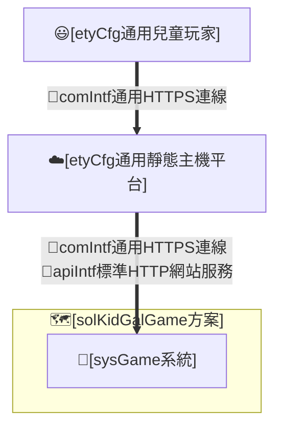
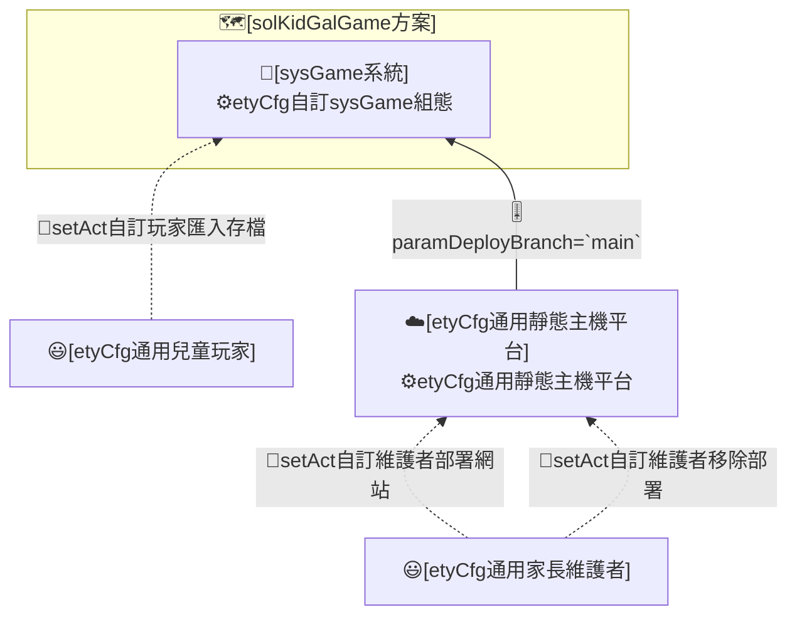
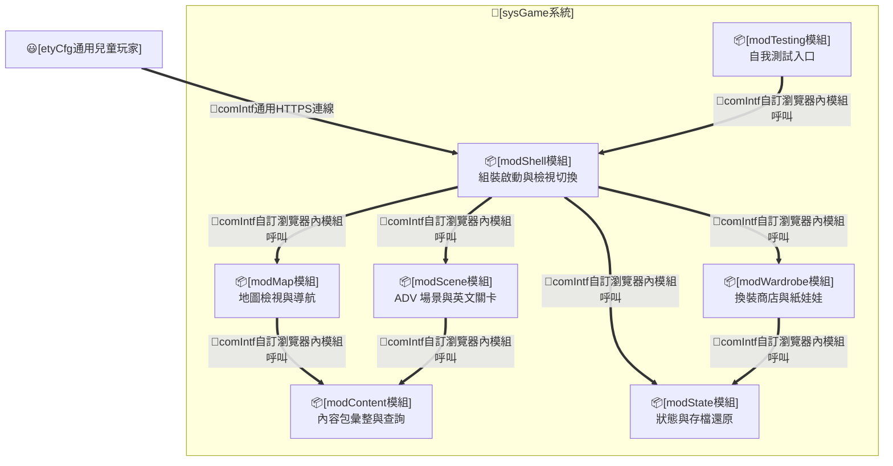
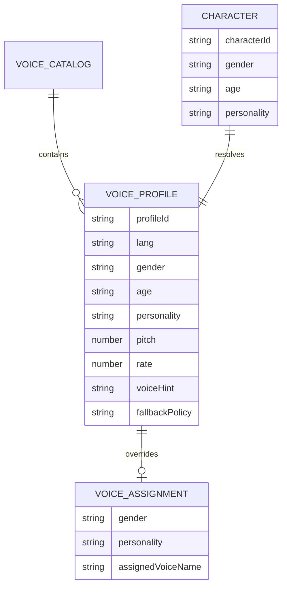
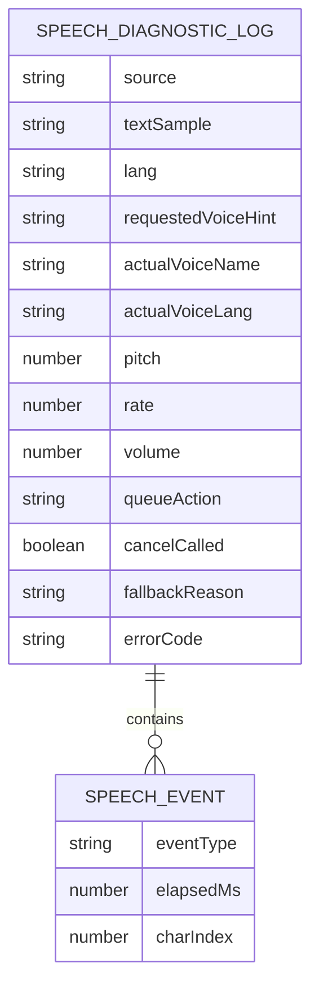
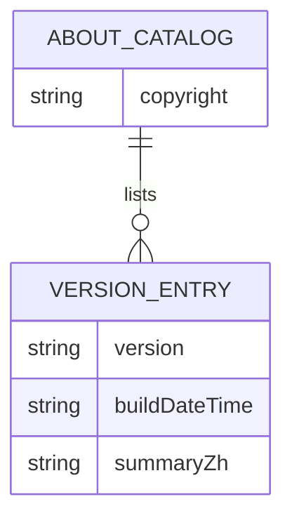
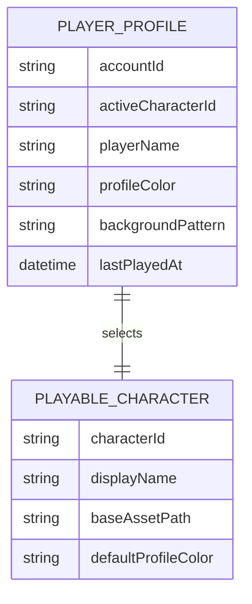

# I. 主旨目的

## A. 設計主旨

* 本 REPO 為 [solKidGalGame方案] 的設計文件。
* 本 REPO 屬方案層級，設計重點在將 `兒童英文學習動機與成果可見性議題`，轉換為靜態網頁遊戲各系統之各自 `實體運作責任`。

## B. 設計目的

* **spec#1-可用短回合低挫折方式練習英文**：方案須讓年幼學習者以「聽情境句、從少量選項選出正確英文、立即對錯回饋」的短回合循環接觸英文，遇困難時可取得提示（含題目與各選項的中文理解協助），降低挫折；英文與中文語音協助須播放開頭清楚、語速適合兒童理解，並以獎勵高低鼓勵先嘗試英文——未借助中文且越早答對者獎勵越高、曾借助中文者該題無獎勵，維持以英文為主、中文為輔的學習動機。練習內容須依地區英文等級分級、句型由單句逐級進階至較複雜句並補齊各級缺口，且以貼近兒童日常的功能性生活對話為主、避免與生活脫節的描述句與超現實選項；每道題目（含題組開場白／結語外框與干擾選項）須歸屬特定場景並與該場景主體相符，不採跨場景可互換的換名詞樣板，亦不得出現指涉「英文字／英文單字」之 meta 敘述（如「需要一個英文字」）；且場景對話（歡迎詞與題幹）一律由場景角色以第一人稱對玩家公主發話、不另設題組開場白／結語旁白（角色首句即題幹 Q1），題幹為角色台詞而非對玩家的操作指示（不採「Pick／Tell／Choose」之考試式 prompt），選項為玩家公主可回應的話語（回應、承諾、行動確認或任務回報），使練習以「公主與場景角色互動」之真實對話形式而非考試作答形式呈現；玩家公主之回應（選項與正解）並須讀來自然口語、貼近真實聊天語氣（可適度使用語氣詞與生活用語、非強制且不超綱），避免教科書式孤立直述句，當場景角色提出幫忙請求時正解須以自然應允語句開頭（如「Sure thing」「OK, I can …」「Well, I think I can help …」）再接實質回答或回報，使協助回應親切一致而非生硬。此外，每道題目須讓玩家公主之回應具實質意義、非無意義複述：打工任務之題幹須留予公主判斷或選擇空間，公主回應須為經思考的決策、判斷或建議，不得為複述角色指令或其顯而易見動作／狀態之同義回覆；生活聊天之公主回應為自然社交或情感回應；兩類之各選項（含干擾選項）皆須為該情境內合理但有別之回應，使理解挑戰來自語意辨析而非排除超現實荒謬句。
* **spec#2-可用角色陪伴與場景探索維持遊玩意願**：方案須以公主角色陪伴、王國地圖與多地區場景探索及地點互動（各地圖之地點配置須對應地圖背景藝術元素並相互不過度群聚，使場景探索之空間定位一致且具沉浸感；各 ADV 場景背景須在手機直向與桌機視口下呈現完整、清楚且風格一致的童話手繪內容，不以上下模糊、延展、frosted cover 或失焦補版替代應繪製區域），提高兒童反覆遊玩意願；並讓不同場景人物與玩家公主各具貼合其角色的聲音表現（含玩家公主以其聲音朗讀所選作答），使陪伴與場景更具辨識度與臨場沉浸，而非一律同一語音；玩家或家長並可於設定依角色的性別與性格類型，為各類角色指定實際採用的語音，使不同人物聲線可被真正區分，未指定之類型由系統自動選用合適語音；語音播放開頭須清楚，且受瀏覽器語音能力限制時須明確降級且不中斷遊戲；離開場景（關閉場景對話、切換場景或返回地圖）時正在播放的語音須即時收束、不殘留跨場景發聲，以約 1 秒內平滑淡出至靜音為目標聽感（受瀏覽器語音能力限制無法漸進淡出時，明確降級為即時停止）；場景內第一↔二層切換（自場景選單進入子互動或自子互動返回場景選單）時，前一情境正在播放的語音亦須即時收束、不跨層級殘留，使語音改接當下話題；且同一場景之歡迎詞（場景角色第一人稱開場招呼）每次造訪只播一次——首次進入場景播放，造訪內返回場景選單不重播，離場後再次進入則重新播放一次。
* **spec#3-可把學習成果轉為看得見的外觀獎勵**：方案須讓答對所得 coins 能兌換為角色外觀（髮型、衣物、鞋帽、配件）等可見變化，使成就可見而非僅顯示分數；目前可玩公主 base 依使用者指定採 baked-in 短髮 playwear，仍不得烘入長髮、長袖、睡衣、禮服、皇冠或背景，且預設 starter 項不得造成重複疊圖。可玩公主 base 屬童話手繪風格 raster 素材，角色新增、髮色修訂或眼睛局部校準須以 GPT 產生或修圖取得透明 PNG／WebP，再縮放對位至 `shared-512x768-v1`；不得以 SVG、CSS 濾鏡、向量拼貼或 runtime 特例代替角色素材。本議題指定 [Yumi] 改為深藍頭髮，歷史 id `sol` 所代表之公主對外呈現為 [Mary] 並改為深綠頭髮；後續依使用者要求，Mary／Yumi 眼睛使用 [Rosa] 眼睛校準；除髮色、顯示名稱與眼睛局部校準外，其服裝、姿勢、比例、透明底、baseline 與紙娃娃 rig 對位不得改動。wardrobe layer 穿上後須與 `shared-512x768-v1` 四位可玩公主 base 正確對位；衣物對位應以類別級上下左右邊界／安全框組態管理，使同類衣物統一遵照同一對位範圍，避免每件衣服各自新增一次性位移或 CSS nudge。正式服裝 layer 與商品縮圖須使用 GPT 產生符合本作品童話手繪風格的 bitmap 美術素材，並轉為透明 WebP／PNG 等正式圖像資產；不得使用 SVG 作為正式服裝素材、商品縮圖或完成品替代素材。人物全身著裝與人物卡頭胸部大頭照須由同一套紙娃娃層合成幾何產生——頭胸照僅為該合成之等比頭胸裁切、共用同一類別級對位，不得對頭胸照另施會破壞衣物對位之第二套縮放或位移，使場景全身著裝與頭胸照大頭照之衣物對位一致、不錯位（不出現服裝錯位至臉部）。完成判定須包含實際把代表性衣物穿上角色後的手機直向與桌機視覺檢查（含全身著裝與頭胸照大頭照兩種呈現），確認衣物位置、比例、接縫與跨角色共用 layer 對位合格、且頭胸照與全身著裝對位一致，而非僅確認檔案存在或程式無錯。
* **spec#4-可形成練英文獲獎勵換裝的正向閉環**：方案須使英文練習、獎勵取得與換裝回饋構成同一個可重複的正向循環。
* **spec#5-可保存並還原玩家進度**：方案須讓每個帳號各自的 coins、學習紀錄、擁有與穿搭、所在位置、所選角色、名字與識別色可被保存並於再次遊玩時還原。
* **spec#6-可選擇與命名自己的公主**：方案須讓玩家首次進入時選定公主外觀、命名並確認識別色，之後可重選外觀、改名或調整識別色，且不影響既有存檔進度；可玩公主 roster 須提供可辨識差異，使用者可見名為 Lumi、Yumi、Mary、Rosa，並保留既有 `lumi`／`yumi`／`sol` id 的舊存檔相容，其中 `sol` 為歷史 stable id、預設玩家名與顯示標籤為 `Mary`。識別色須以飽和度較低、柔和的粉彩色盤供選擇，並可由調色器自訂任一色（既有存檔之識別色須相容保留、不被重置）；新帳號或首次初始化公主視覺主題時，profileColor 與背景花紋須各自自合法集合一次性隨機選出並寫入帳號狀態，後續載入不得重抽；玩家仍可手動改色或自背景花紋集（如波浪、泡泡、格紋等）改選，與識別色共同構成可辨識且具沉浸感的公主視覺主題。
* **spec#7-可用純靜態網站方式部署並模組化擴充內容**：方案須能以 GitHub Pages 等純靜態方式部署遊玩，且 area、角色、可玩公主 roster 與衣物等內容可模組化新增與調整；角色、wardrobe layer、商品縮圖、ADV 場景背景與可見美術素材之交付應採內容包 raster 檔案，不以 SVG、CSS 濾鏡、模糊補版或 renderer 特例偽裝素材完成；新增 wardrobe 內容包須沿用類別級 layer bounds 組態，使新增同類衣物不需另建單件對位常數；新增或替換場景背景須維持單張 `1024x1024` WebP 與現有 sceneArt renderer 載入方式，整張圖皆應為正式繪製內容；且各類圖像資產（可玩公主與場景人物 base 512×768、ADV 場景背景 1024×1024、地區地圖 1536×1536、世界地圖 1024×1536、衣物縮圖 256×256、衣物 layer 512×768、UI 資產等）須符合各自宣告之標準像素尺寸與檔重預算（byte budget），使純靜態載入不因錯置過大圖檔而變慢，新增資產類別須先於資產標準表登記其尺寸與檔重上限方納入（標準尺寸與檔重之合規守門屬工程實作，見＜II＞重點組態與＜III＞整合測試）。
* **spec#8-可用本機多帳號分離不同玩家進度**：方案須讓同一裝置上多位玩家各自擁有獨立帳號，每次進入遊戲先選擇要使用的帳號，並可新增與刪除帳號；帳號選擇與遊戲內人物資訊須以同一套頭胸部大頭照、背景識別色、最近遊玩時間、coins 與可遊玩／休息狀態輔助辨識，且大頭照卡片須以該帳號識別色之半透明底色鋪底（避免過重色塊、維持柔和一致的辨識）；該頭胸部大頭照須與全身著裝同源同對位（沿用同一紙娃娃層合成之等比頭胸裁切、不另維護第二套裁切），使其即時穿搭之衣物不錯位，並使不同玩家的進度與換裝成果互不混用；多帳號僅限同一瀏覽器本機，不含網路登入、密碼或雲端同步。
* **spec#9-可限制每次遊玩時長並強制休息以護眼**：方案須在兒童連續遊玩達設定時長後自動結算本回合成果並進入強制休息，休息時間結束前不可續玩，以保護兒童視力；每次遊玩與休息的預設時長各 15 分鐘，且可由玩家於設定調整並以各帳號各自計算。遊戲內須顯示本次可玩時間額度（基礎時長與生活聊天延長之合計，並使聊天延長可被看見）與剩餘可玩時間，休息／結算畫面須允許回到初始帳號／公主選單但不得繞過休息鎖定；地圖上公主 token 須以足夠大的尺寸醒目且清楚呈現（較原放大約一倍），不再以識別色背板標示，各帳號識別色不再於地圖 token 上呈現（以視覺簡潔為先）。
* **spec#10-可查看作品版權與版本沿革**：方案須在設定選單提供 About 頁籤，呈現作品版權宣告，並以中文短主旨列出歷次版本的主要變更，使玩家與家長能識別作品來源並了解版本演進。
* **spec#11-可依場景情境分流生活聊天與打工任務並給予不同回饋**：方案須讓各可互動場景皆可提供「生活聊天」「逛店」「打工任務」三種互動、不以商店為特例——其中生活聊天為各可互動場景（含商店場景）預設皆可進行之互動（公主房換裝與城門傳送非寒暄場景，不開啟生活聊天），逛店與打工任務則選擇性開啟；生活聊天為輕鬆日常寒暄對話、採較少選項（2 選項），答對提升心情並在護眼時長上限內延長當次可玩時間，使兒童體會社交是滿足自我需求而非期待他人回饋；打工任務為切合該場景主體的任務、採較多選項（3 選項）、可結合簡易數學與生活常識，以 coins 回饋體現勞動所得（各地區打工報酬採平緩等差級距、隨地區英文難度微幅遞增，避免單一地區報酬畸高而誘發洗 coins 或使其他地區失去意義）；逛店沿用既有以 coins 購買外觀之機制（商店定價與報酬級距相稱、隨地區平緩遞增，使各地區商品皆可於數題勞動之內負擔、不因地區出現懸殊價差）；藉此以互動選項多寡與回饋型別（心情 vs coins）共同使人際互動的精神回饋與勞動所得的金錢回饋明確分流。
* **spec#12-可依透明角色輪廓強化角色立繪圖地分離**：方案須以角色透明輪廓為基準提供常態描邊與自然陰影，讓角色在複雜背景中維持清楚辨識；描邊與陰影須可依 ADV 立繪、紙娃娃、地圖 token、頭胸照等 surface 分級調整，並與試穿提示等互動狀態光暈維持語意分離，不得以大範圍糊化發光取代角色本體輪廓辨識。

# II. 設計分析

## A. 方案設計(solKidGalGame)

### (A) 架構項目

### (B) 組態項目

### (C) 運作個案

* **solStory#1-短回合英文練習**：
  * **solCase#1.1**：[etyCfg通用兒童玩家]執行[runAct自訂玩家答英文題]，於場景聽情境句並從選項選出正確英文，取得即時對錯回饋與獎勵；題目依該場景主體與地區英文等級（句型分級、生活化）設計，選項須為公主可回應之情境內語句、干擾選項須屬同場景語域而非超現實荒謬句。
* **solStory#2-地圖探索與角色陪伴**：
  * **solCase#2.1**：[etyCfg通用兒童玩家]執行[runAct自訂玩家地圖導航]，以可見的公主頭像在世界地圖、城堡地圖與各地區地圖一致地移動並進入地點場景（世界地圖採移動到目的地後再進入的探索式進入）。
  * **solCase#2.2**：[sysGame系統]執行[runAct自訂系統渲染場景背景]，於玩家進入地點場景時載入該場景正式 `1024x1024` 手繪背景，並在手機直向與桌機視口下呈現完整內容，不以模糊補版或 runtime 濾鏡遮蔽資產缺陷。
* **solStory#3-換裝獎勵**：
  * **solCase#3.1**：[etyCfg通用兒童玩家]執行[runAct自訂玩家購買衣物]，以 coins 於商店購買外觀商品。
  * **solCase#3.2**：[etyCfg通用兒童玩家]執行[runAct自訂玩家換裝]，於衣櫃或商店試穿並穿戴所購商品，髮型與衣物變化均應由可替換外觀層呈現；穿搭後之衣物位置須依類別級 layer bounds 與實際穿搭視覺 QA 判定是否對位。
* **solStory#4-學習換裝閉環**：
  * **solCase#4.1**：[etyCfg通用兒童玩家]執行[runAct自訂玩家退款]，將不需要的商品退回 coins，回到練習與換裝循環。
* **solStory#5-進度保存與還原**：
  * **solCase#5.1**：[sysGame系統]執行[runAct自訂系統保存進度]，將玩家進度寫入瀏覽器本機儲存。
  * **solCase#5.2**：[etyCfg通用兒童玩家]執行[setAct自訂玩家匯入存檔]，從 Markdown 存檔還原進度。
* **solStory#6-選角與命名**：
  * **solCase#6.1**：[etyCfg通用兒童玩家]執行[runAct自訂玩家選角命名]，首次進入時自 Lumi、Yumi、Mary、Rosa 四位可辨識公主外觀選定一位並輸入名字，之後仍可重選外觀或改名；其中 Mary 沿用歷史 stable id `sol`。
  * **solCase#6.2**：[etyCfg通用兒童玩家]執行[runAct自訂玩家設定公主識別色]，於選角命名流程選擇公主識別色；新帳號或首次初始化時由系統自飽和度較低的粉彩色盤一次性隨機選入 profileColor 並保存，玩家可改選色盤色或以調色器自訂任一色（既有存檔之識別色相容保留），該色用於公主選單與人物資訊的大頭照卡片半透明底色與帳號辨識；#161 後地圖公主 token 不再套用識別色背板。
  * **solCase#6.3**：[etyCfg通用兒童玩家]執行[runAct自訂玩家設定公主背景花紋]，新帳號或首次初始化時由系統自背景花紋集（如波浪、泡泡、格紋等）一次性隨機選入 backgroundPattern 並保存；玩家可再改選花紋，與識別色共同構成公主視覺主題。
* **solStory#7-部署擴充與移除**：
  * **solCase#7.1**：[etyCfg通用家長維護者]執行[setAct自訂維護者部署網站]，將網站包發佈至靜態主機平台。
  * **solCase#7.2**：[etyCfg通用家長維護者]執行[setAct自訂維護者擴充內容]，調整 area、角色、可玩公主、衣物或場景背景內容包（新增、替換或移除單一包），且可玩公主 base 與 wardrobe 外觀層須持續遵守同一紙娃娃 rig；可玩公主 base、wardrobe layer 與場景背景須由 GPT 產生或修圖為童話手繪風格 raster 素材，不得以 SVG、CSS 濾鏡、模糊補版或 runtime 特例代替；新增衣物須依其類別繼承共用 layer bounds，不得每件重做一次對位；調整 area 內容時，各地圖之地點配置須對應該地圖背景藝術元素且相互不過度群聚，場景背景須為完整繪製之 `1024x1024` WebP；新增或替換之各類資產均須符合資產標準表（paramAssetStandards）宣告之像素尺寸與檔重預算，超出預算之過大圖檔須先重壓縮至預算內（維持像素尺寸與童話手繪觀感）或登記具名豁免，方可納入內容包。
  * **solCase#7.3**：[etyCfg通用家長維護者]執行[setAct自訂維護者移除部署]，停用靜態主機平台上的部署。
* **solStory#8-初始化與異常復原**：
  * **solCase#8.1**：[sysGame系統]執行[runAct自訂系統還原進度]，讀取本機存檔並將缺漏或損壞欄位正規化回預設值。
* **solStory#9-多帳號選擇與管理**：
  * **solCase#9.1**：[etyCfg通用兒童玩家]執行[runAct自訂玩家選擇帳號]，每次進入遊戲時於帳號選擇畫面選擇要使用的帳號；帳號卡顯示頭胸部大頭照、背景識別色、最近遊玩時間、coins 與目前可玩／休息狀態。
  * **solCase#9.2**：[etyCfg通用兒童玩家]執行[runAct自訂玩家新增帳號]，建立一個新帳號並成為使用中帳號。
  * **solCase#9.3**：[etyCfg通用兒童玩家]執行[runAct自訂玩家刪除帳號]，刪除一個帳號，並於刪除使用中帳號後回到帳號選擇。
  * **solCase#9.4**：[etyCfg通用兒童玩家]執行[runAct自訂玩家回到初始選單]，於遊戲內透過明確按鈕返回初始帳號／公主選單，以便同裝置玩家切換帳號或調整公主設定；返回不得重置既有進度。
* **solStory#10-遊玩時間限制與護眼休息**：
  * **solCase#10.1**：[sysGame系統]執行[runAct自訂系統遊玩計時消耗]，依真實經過時間逐步遞減目前帳號的遊玩時間預算，並在人物資訊欄顯示本次開始時間與剩餘可玩時間。
  * **solCase#10.2**：[sysGame系統]執行[runAct自訂系統時間到結算]，於遊玩時間預算耗盡時自動結算並呈現本回合成果（獲得金錢、答題數與答題正確度）。
  * **solCase#10.3**：[sysGame系統]執行[runAct自訂系統休息鎖定]，結算後鎖定目前帳號遊玩，休息時長屆滿前不可續玩、屆滿後解鎖；休息／結算畫面可返回初始帳號／公主選單，但回到同一未解鎖帳號仍維持休息鎖定。
  * **solCase#10.4**：[etyCfg通用兒童玩家]執行[runAct自訂玩家調整遊玩限制]，於設定調整每次遊玩與休息的時長。
* **solStory#11-中文雙語協助與獎勵階梯**：
  * **solCase#11.1**：[etyCfg通用兒童玩家]執行[runAct自訂玩家取用中文協助]，於答題時撥放題目或某一選項的中文以理解題意。
  * **solCase#11.2**：[sysGame系統]執行[runAct自訂系統結算協助獎勵]，依本題是否取用過中文與答對前的送出次數，套用全額／半額／無獎勵。
* **solStory#12-角色差異化配音**：
  * **solCase#12.1**：[sysGame系統]執行[runAct自訂系統角色配音]，依場景人物各自的角色特性，以貼合該人物的聲音撥放其對白與場景開場。
  * **solCase#12.2**：[sysGame系統]執行[runAct自訂系統公主朗讀作答]，於玩家選定選項時，以目前玩家公主的聲音朗讀所選的選項文字。
  * **solCase#12.3**：[sysGame系統]執行[runAct自訂系統穩定語音播放]，以瀏覽器 Web Speech API 播放英文、中文、NPC 與公主語音時，先完成使用者啟動、voice 載入、語言 fallback、佇列或替換策略與錯誤降級，避免快速連點或無條件取消造成首字被截斷，並於離開場景時即時收束正在播放之語音、不殘留跨場景；場景內第一↔二層切換（自場景選單進入子互動或自子互動返回場景選單）時亦即時收束前段語音、改接當下話題。
  * **solCase#12.4**：[sysGame系統]執行[runAct自訂系統記錄語音診斷]，記錄每次語音播放之文字摘要、語言、voice、pitch、rate、queue 動作、事件時間與錯誤代碼，供維護者判斷工程品質與瀏覽器限制。
  * **solCase#12.5**：[etyCfg通用兒童玩家]執行[runAct自訂玩家設定角色語音]，於設定為各角色類型（依性別與性格）自瀏覽器可用語音中指定該類型採用的語音，未指定之類型沿用系統自動選用之語音。
* **solStory#13-關於與版本沿革**：
  * **solCase#13.1**：[etyCfg通用兒童玩家]執行[runAct自訂玩家檢視關於資訊]，於設定選單 About 頁籤檢視作品版權宣告與歷次版本的中文短主旨。
* **solStory#14-場景互動分流與雙回饋**：
  * **solCase#14.1**：[etyCfg通用兒童玩家]執行[runAct自訂玩家生活聊天]，於各可互動場景（含商店場景，公主房／城門除外）進行日常寒暄對話，答對提升心情並在護眼時長上限內延長當次可玩時間；題幹為角色寒暄、公主回應為自然社交或情感回應而非無意義複述。
  * **solCase#14.2**：[etyCfg通用兒童玩家]執行[runAct自訂玩家打工任務]，於開啟打工任務的場景完成切合該場景主體的任務（可結合簡易數學與生活常識），以 coins 回饋；題幹須留予公主判斷或選擇空間，公主回應須為經思考的決策、判斷或建議，非複述角色指令或其顯而易見動作之同義回覆。
  * **solCase#14.3**：[etyCfg通用家長維護者]執行[setAct自訂維護者擴充內容]，以單一場景模板統一宣告各場景啟用之模組：生活聊天為各可互動場景預設啟用（公主房／城門除外），逛店與打工任務選擇性開啟，不以商店為特例。
  * **solCase#14.4**：[etyCfg通用兒童玩家]執行[runAct自訂玩家返回場景選單]，自場景內任一第二層互動（生活聊天、打工任務、逛店、退款、換裝、提示）以一致的返回操作回到第一層場景選單，可於同一次造訪續選該場景其他互動，僅於第一層場景選單選擇離開時才退出場景回到地圖；返回第一層場景選單時前段語音即時收束、且不重複聽到該場景歡迎詞，使同一場景每次造訪只播一次歡迎詞（離場後再次造訪才重新招呼一次）。
* **solStory#15-角色立繪輪廓辨識**：
  * **solCase#15.1**：[sysGame系統]執行[runAct自訂系統渲染角色輪廓]，於 ADV 角色立繪、紙娃娃、地圖 token 與頭胸照等 surface 套用依透明 alpha 輪廓產生的常態描邊與自然陰影，使角色在複雜背景中清楚辨識，且不把試穿提示等互動狀態光暈混作常態輪廓效果。

### (D) 重點組態

* **Env轉K8sSec參數**
  * 暫無。
* **HelmChart參數-chart.yaml**
  * [etyCfg自訂sysGame組態]：暫無（靜態網站包採 [techStackStaticWeb]，預設 Pages 直推，無自有 chart）。
* **HelmChart參數-values.yaml**
  * [etyCfg自訂sysGame組態]
    * paramTechStack=`techStackStaticWeb`
    * paramDeployTarget=`github-pages`
    * paramSiteRoot=`repository-root`
  * [etyCfg通用靜態主機平台]
    * paramDeployBranch=`main`

## B. 系統設計(sysGame系統)

### (A) 架構項目

### (B) 組態項目

### (C) 運作個案

* **sysStory#1-承接英文練習**：
  * **sysCase#1.1**：[modScene模組]承接[runAct自訂玩家答英文題]，載入該場景題庫（依場景主體與地區英文等級分級、生活化，且題組歡迎詞與干擾選項亦切合場景主體、由場景角色以第一人稱對公主發話（題幹為角色台詞、選項為公主自然口語之回應；不另設題組開場白／結語旁白）、無超現實或指涉英文字之 meta 敘述）、依模式呈現選項數、比對選項並判定正確性；正確性判定為各互動模式共用，獎勵型別（coins 或心情）與每題選項數（生活聊天 2、打工任務 3）由所屬模式決定。
* **sysStory#2-承接地圖導航**：
  * **sysCase#2.1**：[modMap模組]承接[runAct自訂玩家地圖導航]，以單一玩家頭像機制在世界、城堡與地區地圖一致渲染、定位與移動公主（鍵盤方向鍵自由走動）。
  * **sysCase#2.2**：[modMap模組]承接[runAct自訂玩家地圖導航]，於世界地圖點選目的地時先令公主頭像移動至該目的地座標後再進入，移動途中再次點選即略過位移直接進入。
  * **sysCase#2.3**：[modScene模組]承接[runAct自訂系統渲染場景背景]，以 sceneArt renderer 載入 [modContent模組] 宣告之單張 `1024x1024` WebP 場景背景；renderer 只負責通用載入、overlay 與 viewport cover，不為個別場景新增 CSS blur、frosted cover、上下延展或裁切特例來遮蔽背景圖本身的補版缺陷。
* **sysStory#3-承接換裝與商店**：
  * **sysCase#3.1**：[modWardrobe模組]承接[runAct自訂玩家購買衣物]，扣除 coins 並標記擁有。
  * **sysCase#3.2**：[modWardrobe模組]承接[runAct自訂玩家換裝]，以角色 base 加上髮型、衣物與配件 layer 的順序更新 outfit 並重繪紙娃娃；目前角色 base 依使用者指定含 baked-in 短髮 playwear，starter 髮型與 starter 服裝須正規化為 no overlay 以避免重複疊圖；[Yumi] 與 [Mary] 髮色調整須回到角色 base raster 素材本身，不由 [modWardrobe模組] 以濾鏡或額外 layer 代改。wardrobe layer 渲染須先依 item type／slot 取得類別級上下左右邊界或安全框，再將該類 layer 放入對應範圍；單件商品預設不得自帶一次性 nudge，必要例外須受控且可由視覺 QA 追溯。換裝模型採單品單層：每件 wardrobe item 至多對應單一外觀層，不採整套綁定（outfit set）一次裝備多件、亦不採單件跨多層（如 outer 前後雙層），換裝一律以單品逐件穿戴疊合呈現。
  * **sysCase#3.3**：[modWardrobe模組]承接[runAct自訂玩家退款]，回補 coins 並取消擁有。
* **sysStory#4-承接狀態保存與還原**：
  * **sysCase#4.1**：[modState模組]承接[runAct自訂系統保存進度]，寫入瀏覽器本機儲存。
  * **sysCase#4.2**：[modState模組]承接[setAct自訂玩家匯入存檔]，解析 Markdown 並正規化還原。
  * **sysCase#4.3**：[modState模組]承接[runAct自訂系統還原進度]，缺漏欄位回退預設值。
* **sysStory#5-承接選角與內容擴充**：
  * **sysCase#5.1**：[modShell模組]承接[runAct自訂玩家選角命名]，於 `lumi`、`yumi`、`sol`、`rosa` 可玩公主 roster 中更新 activeCharacterId、playerName 與 profileColor，且保留 `lumi`／`yumi`／`sol` 舊 id 對既有存檔相容；`sol` 之使用者可見標籤與預設玩家名為 `Mary`，舊存檔仍以 `activeCharacterId="sol"` 載入該公主。
  * **sysCase#5.2**：[modShell模組]承接[runAct自訂玩家設定公主識別色]，提供飽和度較低的粉彩色盤與調色器自訂供玩家設定 profileColor（自訂色以格式驗證取代固定色盤白名單，既有存檔之 profileColor 相容保留、不被重置）；新帳號或首次初始化缺 profileColor 時，由 [modState模組] 自粉彩色盤一次性隨機選出初始 profileColor 並保存至帳號狀態，後續載入不得重抽；公主選單、帳號卡與人物資訊欄均使用同一個可重用頭胸部大頭照渲染函式，以目前角色之即時穿搭（紙娃娃外觀層裁切為頭胸）呈現、卡片底色為 profileColor 之半透明鋪底，不另維護第二套裁切邏輯；公主選單因選角當下尚未套用衣櫥而呈現各公主基本造型。
  * **sysCase#5.3**：[modContent模組]承接[setAct自訂維護者擴充內容]，匯入新內容包至 registry；可玩公主與 wardrobe layer 均須遵守 [hmiIntf自訂角色尺度與美術規範] 的 `shared-512x768-v1` rig；可玩公主 base、wardrobe layer、商品縮圖與 ADV 場景背景須以 GPT 產生或修圖為童話手繪風格 transparent/raster 素材，不得以 SVG、CSS 濾鏡、向量拼貼、模糊補版或 renderer 特例代替；新增 wardrobe item 須依 `type`／slot 繼承類別級 layer bounds、且每件至多對應單一 layer slot（單品單層，不採 bundle 套裝或單件多層）；新增或替換場景背景須交付完整繪製之 `1024x1024` WebP，並在 manifest 以 `sceneArt.src` 指向正式資產；所有匯入之圖像資產（角色與 NPC base、wardrobe layer、商品縮圖、ADV 場景背景、地區與世界地圖、UI 等）均須通過資產 lint——其像素尺寸等於 paramAssetStandards 宣告之類別標準值、且檔案位元組不超出該類別檔重預算，超標即視為內容缺陷需重壓縮或具名豁免，使過大圖檔於擴充當下即被擋下、不拖慢純靜態載入。
  * **sysCase#5.4**：[modShell模組]承接[runAct自訂玩家設定公主背景花紋]，自 [modContent模組] 背景花紋資產集提供選項供玩家擇一，更新並持久化目前帳號之背景花紋至其視覺主題狀態；新帳號或首次初始化缺 backgroundPattern 時，由 [modState模組] 自可見背景花紋集合一次性隨機選出初始 backgroundPattern 並保存至帳號狀態，後續載入不得重抽；未知花紋時回退無花紋預設。
* **sysStory#6-承接多帳號選擇與管理**：
  * **sysCase#6.1**：[modShell模組]承接[runAct自訂玩家選擇帳號]，啟動時先進入帳號選擇，讀取帳號清單與各帳號摘要（頭胸部大頭照、profileColor、lastPlayedAt、coins、play/rest 狀態），玩家選定後透過 modState 載入該帳號進度再進入遊戲。
  * **sysCase#6.2**：[modState模組]承接[runAct自訂玩家新增帳號]，建立新帳號的初始進度並設為使用中帳號；初始進度須一次性寫入自合法集合隨機抽得的 profileColor 與 backgroundPattern，使帳號卡第一次顯示即具備穩定主題。
  * **sysCase#6.3**：[modState模組]承接[runAct自訂玩家刪除帳號]，移除指定帳號，刪除使用中帳號後清除使用中指向並交回帳號選擇。
  * **sysCase#6.4**：[modShell模組]承接[runAct自訂玩家回到初始選單]，於遊戲內提供返回初始帳號／公主選單的明確按鈕，返回時先保存目前帳號進度與 lastPlayedAt，再顯示帳號選擇畫面。
* **sysStory#7-承接遊玩時間限制與護眼休息**：
  * **sysCase#7.1**：[modState模組]承接[runAct自訂系統遊玩計時消耗]，依真實經過時間遞減目前帳號的遊玩時間預算並持久化至該帳號進度；預設每次遊玩與休息各 15 分鐘。
  * **sysCase#7.2**：[modShell模組]承接[runAct自訂系統時間到結算]，於預算耗盡時呈現本回合成果結算畫面，並顯示返回初始帳號／公主選單的按鈕。
  * **sysCase#7.3**：[modShell模組]承接[runAct自訂系統休息鎖定]，依休息時長鎖定遊玩入口、屆滿後解鎖；若玩家返回初始選單再選回同一帳號，仍依該帳號 restUntil 判斷不可續玩。
  * **sysCase#7.4**：[modState模組]承接[runAct自訂玩家調整遊玩限制]，保存每次遊玩與休息時長至目前帳號。
  * **sysCase#7.5**：[modShell模組]承接[runAct自訂系統遊玩計時消耗]，在人物資訊欄顯示本次可玩時間額度（基礎時長與生活聊天延長之合計，延長量以清楚可見方式標記）與剩餘可玩時間，不以百分比作為主要呈現。
* **sysStory#8-承接中文雙語協助與獎勵階梯**：
  * **sysCase#8.1**：[modScene模組]承接[runAct自訂玩家取用中文協助]，以瀏覽器語音依 `zh-TW` 撥放題目或選項的中文（題庫含中文欄位；缺中文時降級為僅英文撥放）；可用 voice 清單載入後，中文優先選取 `zh-TW` voice，其次 `zh` voice，再降級 default voice，且降級須寫入語音診斷紀錄。
  * **sysCase#8.2**：[modScene模組]承接[runAct自訂系統結算協助獎勵]，依中文使用旗標與答對前送出次數，以全額／半額（paramRewardSecondTryRatio）／無 結算 coins。
* **sysStory#9-承接角色差異化配音**：
  * **sysCase#9.1**：[modScene模組]承接[runAct自訂系統角色配音]，依說話者宣告的角色特性查 [modContent模組] 的 [datIntf自訂角色音色目錄] 取得音頻參數（pitch／rate，年齡主要於此表現）套用發聲，並依說話者（性別×性格）類型解析實際 voice——優先採使用者於設定指定之語音，未指定則繼承其性別類型，再依 paramSpeechPreferredVoices 之語言優先 fallback 選取；所有經 [modScene模組] 之語音發聲（含角色配音、公主朗讀作答與中文協助）最終語速均另乘全域 paramSpeechRateScale 倍率以利兒童聽辨；特性缺漏、不在目錄、使用者未指定且瀏覽器無合適 voice 時降級為 paramDefaultVoiceProfile 之預設嗓音，並保留角色 profile 與實際 voice 採用結果。
  * **sysCase#9.2**：[modScene模組]承接[runAct自訂系統公主朗讀作答]，於玩家選定選項時以目前玩家公主之音色朗讀所選選項文字；`playableVoiceById` 須覆蓋 `lumi`、`yumi`、`sol`、`rosa`，並沿用既有語音開關（關閉時不發聲）。
  * **sysCase#9.3**：[modScene模組]承接[runAct自訂系統穩定語音播放]，以單一 `speechManager` 包裝 `SpeechSynthesisUtterance`；啟動時先讀 `getVoices()` 並監聽 `voiceschanged`，發聲前先採使用者為該（性別×性格）類型指定之 voice（未指定則繼承性別類型），再依 `lang` 與 voice hint 之語言優先 fallback 選取 voice，並於送入 utterance 之文字開頭加入固定前置留白（paramSpeechLeadingPad）以延後首字出聲、改善開頭清楚度；`speak()` 採佇列或 replace-last 策略，不得每次無條件 `speechSynthesis.cancel()`；`cancel()` 僅用於使用者明確停止、切換語音、同一語音重播、離開場景收束或場景內第一↔二層切換收束。離開場景（關閉場景對話、切換場景或返回地圖之共同收口）時須收束正在播放之語音、不殘留跨場景發聲——因 Web Speech API 之 `SpeechSynthesisUtterance.volume` 於 `speak()` 當下固定、無法對進行中語句即時調整音量（僅 `cancel()` 可中止），故以即時 `cancel()` 作為「約 1 秒內音量淡出」目標聽感之明確降級實作，並將該次 stop 來源寫入語音診斷紀錄。場景內第一↔二層切換（自場景選單進入第二層子互動，或自第二層返回第一層場景選單之共同收口）亦以相同即時 `cancel()` 收束前段語音、stop 來源標記為層級切換並寫入診斷，使語音改接當下話題、不跨層級殘留；收束須冪等且在當下情境 `speak()` 之前完成，不誤殺當下話題該播之語音。
  * **sysCase#9.4**：[modScene模組]承接[runAct自訂系統記錄語音診斷]，監聽 utterance `start`、`end`、`error`、`boundary` 事件，記錄 queue 動作、voice 載入狀態、實際語音參數、錯誤代碼與是否因 autoplay/user activation、audio-busy、voice-unavailable、language-unavailable、interrupted 或 canceled 降級。
  * **sysCase#9.5**：[modScene模組]承接[runAct自訂玩家設定角色語音]，提供各角色類型（性別×性格，僅列實際有角色採用之類型）之瀏覽器可用語音清單供設定選單選取，並將使用者指定持久化（[datIntf自訂角色音色目錄] 之使用者語音指定，存於 paramVoiceAssignmentKey）；指定之 voice 於本機 `getVoices()` 不存在時，依繼承（性別類型）或語言優先 fallback 解析並寫入語音診斷紀錄。
* **sysStory#10-承接關於與版本沿革**：
  * **sysCase#10.1**：[modShell模組]承接[runAct自訂玩家檢視關於資訊]，於系統選單新增 About 頁籤，渲染作品版權宣告與最近 10 個版本的中文短主旨；當前版本資訊併入此頁籤，由 [datIntf自訂版本沿革目錄] 之首筆導出，Settings 不再另列版本卡。
* **sysStory#11-承接場景互動分流與雙回饋**：
  * **sysCase#11.1**：[modScene模組]承接[runAct自訂玩家生活聊天]，載入該場景生活聊天題組（各可互動場景含商店預設皆具備、題幹為場景角色以第一人稱對公主之寒暄、以 paramChatChoiceCount 之 2 選項（公主自然口語之回應）呈現），答對時依 paramChatMoodReward 累加心情值並請求 [modState模組] 延長當次遊玩時間。
  * **sysCase#11.2**：[modScene模組]承接[runAct自訂玩家打工任務]，載入該場景打工任務題組（可含簡易數學與生活常識、題幹為場景角色以第一人稱向公主提出之具體工作請求——即該角色實際需公主代勞、切合該場景主體之勞務差事（如搬運、收拾、遞送、清點、備膳、整理等），排除純觀看、站位、寒暄或道別等非勞動內容、以 paramJobChoiceCount 之 3 選項（公主應允並完成該工作之回應／回報，正解須以自然應允語句開頭如「Sure thing」「OK, I can …」再接實質回報）呈現，題組外框與干擾項切合場景、無超現實或 meta 敘述），答對時依各地區平緩等差之打工報酬基數（castle／urban／rural／wild 微幅遞增）、並沿用中文協助獎勵階梯（全額／半額／無）以 coins 回饋。
  * **sysCase#11.3**：[modState模組]承接[runAct自訂系統心情延長遊玩]，依心情值與 paramMoodMinutesPerPoint 換算延長目前帳號當次遊玩時間預算，且延長後不超過 paramPlayMaxMinutes 護眼上限。
  * **sysCase#11.4**：[modContent模組]承接[setAct自訂維護者擴充內容]，以單一場景設定宣告各場景啟用之生活聊天／逛店／打工任務模組與對應題組，生活聊天為各可互動場景預設啟用（公主房／城門除外）、商店場景同時提供逛店與生活聊天，不再以商店為特例（無 kind:"shop" 特例殘留）。
  * **sysCase#11.5**：[modScene模組]承接[runAct自訂玩家返回場景選單]，使場景互動採第一層場景選單與第二層互動畫面之兩層動線——第二層各互動畫面（生活聊天、打工任務、逛店、退款、換裝、提示，含答題完成畫面）之返回一律回到第一層場景選單而不關閉冒險視窗，僅第一層場景選單之離開關閉冒險視窗回到地圖；返回第一層場景選單之共同收口（`backToSceneMenu`）須先收束前段語音（同 sysCase#9.3 之層級切換收束），並以本次造訪之「歡迎詞已播」旗標控制 `openSceneAdv` 不重播歡迎詞（`source` 為場景開場之 NPC 語音）——首次進入場景播放、造訪內返回不重播，離場（`closeAdv()`／場景切換）清旗標使再次造訪重新播放一次；旗標與造訪繫結、為暫態不持久化存檔。
* **sysStory#12-承接角色立繪輪廓辨識**：
  * **sysCase#12.1**：[modScene模組]承接[runAct自訂系統渲染角色輪廓]，為 ADV NPC 立繪套用依透明 alpha 輪廓計算的常態描邊與自然陰影；描邊提供深色輪廓辨識，陰影提供角色後方景深，不以大範圍亮色光暈作為常態可讀性來源。
  * **sysCase#12.2**：[modWardrobe模組]承接[runAct自訂系統渲染角色輪廓]，為可玩公主紙娃娃、地圖 token 與頭胸照套用 surface 分級的輪廓規則；多層 wardrobe layer 不得因逐層陰影疊加造成過重髒邊，試穿狀態光暈須保留為互動狀態提示而非角色常態陰影。

### (D) 重點組態

* **Env轉K8sSec參數**
  * 暫無。
* **HelmChart參數-chart.yaml**
  * [etyCfg自訂sysGame組態]：暫無。
* **HelmChart參數-values.yaml**
  * [etyCfg自訂modContent組態]
    * paramDefaultArea=`castle`
    * paramDefaultCharacter=`lumi`
    * paramPlayableCharacters=`lumi,yumi,sol,rosa`
    * paramProfileColorPalette=`8 pastel preset colors`
    * paramProfileColorCustomEnabled=`true`
    * paramBackgroundPatterns=`8 (wave,bubble,grid,...)`
    * paramCardBackgroundAlpha=`0.45`
    * paramInitialThemeRandomization=`profileColor,backgroundPattern`
    * paramDefaultVoiceProfile=`default`
    * paramAssetStandards=`per-class {pixelSize, maxKB, mode}：固定畫布 exact——characterBase/NPC 512×768·350、scene 1024×1024·500、areaMap 1536×1536·600、worldMap 1024×1536·600、ui 1280×720·120；緊貼裁切容於畫布 bound（素材去白邊後寬高≤畫布，#176 以 targetBox 等比 fit）——wardrobeThumb ≤256×256·60、wardrobeLayer ≤512×768·120、mapLayer（地圖裝飾層）≤512×512·80`（資產 lint 之尺寸與檔重 SSOT；初始檔重門檻，code 可依實測 USR-gated 微調）
  * [etyCfg自訂modScene組態]
    * paramChineseAudioLang=`zh-TW`
    * paramRewardSecondTryRatio=`0.5`
    * paramChatMoodReward=`1`
    * paramChatChoiceCount=`2`
    * paramJobChoiceCount=`3`
    * paramSpeechRateScale=`0.8`
    * paramSpeechQueueMode=`replace-last`
    * paramSpeechDebounceMs=`120`
    * paramSpeechWarmupEnabled=`true`
    * paramSpeechDiagnosticsEnabled=`true`
    * paramSpeechPreferredVoices=`user-assigned,lang-first`
    * paramSpeechLeadingPad=`8 full-width spaces`
    * paramVoiceBucketDimensions=`gender,personality`
  * [etyCfg自訂modState組態]
    * paramStorageKey=`luminara-princess-english-adv`
    * paramSaveMarker=`LUMINARA_SAVE_JSON`
    * paramAccountIndexKey=`luminara-princess-english-accounts`
    * paramVoiceAssignmentKey=`luminara-princess-english-voice`
    * paramPlayMinutes=`15`
    * paramRestMinutes=`15`
    * paramPlayMaxMinutes=`20`
    * paramMoodMinutesPerPoint=`1`
  * [etyCfg自訂modWardrobe組態]
    * paramWardrobeLayerBounds=`wardrobeLayerBoundsByType`（每個 item type 定義 render bounds 與 `safeBox`）
    * paramCharacterSilhouetteFilter=`outline+depth-shadow`

## C. 補充設計(選配)

* [datIntf自訂角色音色目錄]：角色特性維度與其音頻參數對照，併同使用者語音指定之單一資料來源，供 [modScene模組] 查表配音。維度（如性別、年齡、性格）相互組合為音色項，每項對應 pitch／rate／語言與 voice hint，並含 `default` 降級項；pitch／rate 由維度合成（年齡主要於此表現）。角色（NPC 與可玩公主）以其特性宣告對應至一個音色項。實際播放之 voice 解析優先序為：使用者於設定為該（性別×性格）類型指定之語音 → 同性別類型之指定（繼承）→ 依目前瀏覽器 `getVoices()` 之語言優先 fallback；系統不硬編單一 voice name——使用者未指定時一律以語言優先選取以維持跨平台可攜，指定之 voice 於本機不存在時亦依上述順序降級。

* [datIntf自訂語音診斷紀錄]：語音播放工程品質之診斷資料，供 [modScene模組] 記錄 Web Speech API 實際行為與平台限制。每筆紀錄至少包含播放來源、文字摘要、語言、要求 voice hint、實際 voice name/lang、pitch、rate、volume、queue 動作、是否呼叫 cancel、`start`／`end`／`error`／`boundary` 事件時間、錯誤代碼與 fallback 原因；此資料只判斷工程流程與降級狀態，不直接取代真人聽感驗證。

* [datIntf自訂版本沿革目錄]：作品版權宣告與歷次版本沿革。其**單一資料來源為根目錄 `VERSION`**（結構化 SSOT，見＜IV.A 版號與發佈＞）；`game-engine/build/version.js` 由 `VERSION` 投影生成（`node scripts/genVersion.mjs`），供 [modShell模組] 渲染 About 頁籤。含一筆版權宣告字串，與依時間新到舊排列的版本沿革清單（即 `VERSION.history` 中 `playerVisible:true` 之投影），每筆含版本標識、建置時間與中文短主旨；當前版號（版本卡）取 `VERSION.version`（SemVer），可能為 internal release，**不必等於沿革首筆**（internal／dev-only 改動不進玩家沿革）；About 頁籤至少呈現最近 10 筆玩家可見版本。

* [datIntf自訂玩家公主識別設定]：目前帳號的公主外觀、名字、識別色與背景花紋之單一狀態來源，供 [modShell模組] 渲染公主選單、帳號卡與人物資訊欄，並供 [modMap模組] 渲染地圖公主 token 半透明橢圓背版。profileColor 來自飽和度較低的粉彩色盤、初始化時一次性隨機抽得之色，或玩家以調色器自訂之色（以格式驗證、不限固定色盤白名單）；既有存檔之識別色相容保留、不被重置。backgroundPattern 來自背景花紋集，初始化時一次性隨機抽得或由玩家擇一；缺漏欄位只在新帳號／首次初始化時隨機補齊並保存，未知值才回退無花紋預設。

# III. 測試規格

本章測試規格對應＜II. 設計分析＞的架構項目、運作個案與重點組態，驗證工程設計是否成立；[spec#N] 的部署後成效不在本章直接宣稱達成，改於＜IV. 部署成效＞回頭評估。方案層 productReadme 視為自然語言操作腳本，須可供自然人閱讀，也可供 AI Agent 依步驟執行、驗證與回報。

## A. 模組層級：測試建議

* **單元測試**
  * 所有自製[comp組件]必須進行函數單元測試。
  * 測試涵蓋度必須達到80%以上。
  * 測試案例必須聚焦於各組件內部邏輯的正確性與錯誤處理。
  * 測試案例不應涉及跨組件協作或整體流程驗證。

## B. 系統層級：測試建議

* **靜態介面測試**
  * comIntf
  * apiIntf
  * hmiIntf
  * datIntf
* **靜態組態測試**
  * etyCfg
* **遞增整合測試**
  * setAct
  * runAct

## C. 方案層級：組態測試(etyCfg)

| 代號 | 測試對象 | 通過判定 |
|---|---|---|
| cfgTest#01 | [etyCfg通用兒童玩家] | 玩家角色組態符合契約規範 |
| cfgTest#02 | [etyCfg通用家長維護者] | 維護者角色組態符合契約規範 |
| cfgTest#03 | [etyCfg通用靜態主機平台] | 靜態主機部署組態符合契約規範 |
| cfgTest#04 | [etyCfg自訂sysGame組態] | 系統部署與選型組態符合契約規範 |
| cfgTest#05 | [etyCfg自訂modContent組態] | 內容包預設與 registry 組態符合契約規範 |
| cfgTest#06 | [etyCfg自訂modState組態] | 儲存鍵與存檔標記組態符合契約規範 |
| cfgTest#07 | [etyCfg自訂modScene組態] | 英文練習、中文協助與獎勵組態符合契約規範 |
| cfgTest#08 | [etyCfg自訂modWardrobe組態] | wardrobe 類別級 layer bounds 與素材限制組態符合契約規範 |

## D. 方案層級：整合測試(setAct/runAct)

### 初始部署設定相關 setAct

#### intTest#01-驗證 [setAct自訂維護者部署網站]

* 既有基底：無。
* 新增項目：[sysGame系統]之靜態網站包部署至靜態主機平台。
* 步驟：
  1. 將 repo 內容以靜態方式發佈至 GitHub Pages（站根為 repository root，保留 .nojekyll）。
  2. 以瀏覽器開啟部署 URL。
* 預期結果：
  1. 首頁載入成功，index.html 與 game-engine ES module 無 404。

#### intTest#02-驗證 [setAct自訂維護者擴充內容]

* 既有基底：intTest#01。
* 新增項目：[sysGame系統]之新增內容包。
* 步驟：
  1. 新增一個 area、wardrobe 或 character 內容包並於對應 registry 匯入。
  2. 重新載入遊戲。
* 預期結果：
  1. 新內容出現於對應地圖、商店或選角，且既有內容不受影響。

#### intTest#03-驗證 [setAct自訂維護者移除部署]

* 既有基底：intTest#01。
* 新增項目：[sysGame系統]之部署移除。
* 步驟：
  1. 停用或刪除靜態主機平台上的部署。
* 預期結果：
  1. 部署 URL 不再提供遊戲，且本機開發環境不受影響。

#### intTest#04-驗證 [setAct自訂玩家匯入存檔]

* 既有基底：intTest#01。
* 新增項目：[sysGame系統]之 Markdown 存檔匯入。
* 步驟：
  1. 於 Save/Load 介面貼入先前匯出的 Markdown 存檔並載入。
* 預期結果：
  1. coins、outfit、diary、所在位置、角色與名字均還原正確。

### 加入[sysGame系統]相關 runAct

#### intTest#05-驗證 [runAct自訂玩家答英文題]

* 既有基底：intTest#01。
* 新增項目：[sysGame系統]之答題行為。
* 步驟：
  1. 進入具 lesson 的地點，選出正確英文選項。
* 預期結果：
  1. 顯示答對回饋並增加 coins 與學習紀錄。

#### intTest#06-驗證 [runAct自訂玩家地圖導航]

* 既有基底：intTest#05。
* 新增項目：[sysGame系統]之地圖導航行為。
* 步驟：
  1. 由地區地圖經 gate 回世界地圖，再進入另一地區 entry node。
* 預期結果：
  1. 場景切換至目標地區，玩家位置與 playerNode 一致。

#### intTest#07-驗證 [runAct自訂玩家購買衣物]

* 既有基底：intTest#05。
* 新增項目：[sysGame系統]之購買行為。
* 步驟：
  1. 於商店以足夠 coins 購買一件商品。
* 預期結果：
  1. coins 正確扣除，商品標記為 owned。

#### intTest#08-驗證 [runAct自訂玩家換裝]

* 既有基底：intTest#07。
* 新增項目：[sysGame系統]之換裝行為。
* 步驟：
  1. 於衣櫃穿戴已擁有商品。
* 預期結果：
  1. 紙娃娃 outfit 更新且互斥 slot 正確處理；目前 baked-in playwear base 不得出現黑底，且 starter 髮型／服裝不會重複疊在 base 上。
  2. 已穿戴商品依其 item type／slot 套用 `wardrobeLayerBoundsByType` 類別級 layer bounds；`data-audit` 會檢查 layer type、render bounds、`safeBox` 與 PNG／WebP bitmap 限制，且未出現單件專用 CSS nudge 或未登記的一次性位移。
  3. 換裝模型維持單品單層：每件已穿戴 wardrobe item 至多產生一個外觀層、layer slot 不含 outerBack，且不存在 type 為 outfitSet 之整套綁定商品（無 outfit set、無 outer 前後雙層）。

#### intTest#09-驗證 [runAct自訂玩家退款]

* 既有基底：intTest#07。
* 新增項目：[sysGame系統]之退款行為。
* 步驟：
  1. 於退款介面退回一件已擁有商品。
* 預期結果：
  1. coins 回補，商品取消 owned 且不再可穿戴。

#### intTest#10-驗證 [runAct自訂玩家選角命名]

* 既有基底：intTest#01。
* 新增項目：[sysGame系統]之選角命名行為。
* 步驟：
  1. 於選角畫面選定外觀、輸入名字並選擇識別色後確認。
* 預期結果：
  1. activeCharacterId、playerName 與 profileColor 更新，遊戲內稱呼與人物資訊隨之改變，且 Lumi、Yumi、Mary、Rosa 四位可玩公主在選角畫面可辨識；Mary 以 `activeCharacterId="sol"` 保存與載入。

#### intTest#11-驗證 [runAct自訂系統保存進度]

* 既有基底：intTest#07。
* 新增項目：[sysGame系統]之自動保存行為。
* 步驟：
  1. 進行任一會改變狀態的操作後重新整理頁面。
* 預期結果：
  1. coins、outfit 與位置等狀態自瀏覽器本機儲存還原。

#### intTest#12-驗證 [runAct自訂系統還原進度]

* 既有基底：intTest#11。
* 新增項目：[sysGame系統]之缺漏正規化行為。
* 步驟：
  1. 載入缺少 activeCharacterId、profileColor 或含未知 item 的存檔。
* 預期結果：
  1. 缺漏欄位回退安全值；缺 profileColor 或 backgroundPattern 時補入合法集合中的初始化值並持久化，未知 item 被移除或回退，狀態不變量（coins 非負、裝備指向已擁有物）成立。

#### intTest#13-驗證 [runAct自訂玩家選擇帳號]

* 既有基底：intTest#01。
* 新增項目：[sysGame系統]之進入時帳號選擇行為。
* 步驟：
  1. 在已有至少一個帳號的狀態下啟動遊戲，於帳號選擇畫面選定一個帳號。
* 預期結果：
  1. 帳號卡顯示該帳號頭胸部大頭照、背景識別色、最近遊玩時間、coins 與可玩／休息狀態；選定後載入該帳號進度並進入遊戲，coins、穿搭、所在位置與 profileColor 與該帳號一致。

#### intTest#14-驗證 [runAct自訂玩家新增帳號]

* 既有基底：intTest#01。
* 新增項目：[sysGame系統]之新增帳號行為。
* 步驟：
  1. 於帳號選擇畫面新增一個帳號並進入。
* 預期結果：
  1. 建立乾淨初始進度（coins 為預設、無 owned、無穿搭）並成為使用中帳號，且不影響其他帳號；profileColor 與 backgroundPattern 於建立時自合法集合一次性隨機寫入，重新整理後不重抽。

#### intTest#15-驗證 [runAct自訂玩家刪除帳號]

* 既有基底：intTest#14。
* 新增項目：[sysGame系統]之刪除帳號行為。
* 步驟：
  1. 刪除一個非使用中帳號。
  2. 刪除目前使用中帳號。
* 預期結果：
  1. 被刪帳號自清單移除，其餘帳號進度不受影響。
  2. 刪除使用中帳號後回到帳號選擇；刪除最後一個帳號後僅顯示新增帳號的空狀態。

#### intTest#16-驗證 [runAct自訂玩家調整遊玩限制]

* 既有基底：intTest#13。
* 新增項目：[sysGame系統]之遊玩／休息時長設定與持久化。
* 步驟：
  1. 以一個帳號進入遊戲，確認每次遊玩與休息時長預設各為 15 分鐘。
  2. 於設定將每次遊玩與休息時長改為非預設值並儲存。
  3. 重新整理頁面並以同一帳號進入。
* 預期結果：
  1. 設定值套用且重整後仍保留，僅作用於該帳號，其他帳號維持各自設定。

#### intTest#17-驗證 [runAct自訂系統遊玩計時消耗]

* 既有基底：intTest#16。
* 新增項目：[sysGame系統]之遊玩時間預算隨真實時間遞減行為。
* 步驟：
  1. 將每次遊玩時長設為極短測試值後進入遊戲並停留於遊玩畫面。
  2. 等待設定時長經過。
* 預期結果：
  1. 該帳號的遊玩時間預算隨真實經過時間遞減至 0，人物資訊欄以本次可玩時間額度與剩餘可玩時間呈現，不以百分比作為主要資訊。

#### intTest#18-驗證 [runAct自訂系統時間到結算]

* 既有基底：intTest#17。
* 新增項目：[sysGame系統]之時間到自動結算行為。
* 步驟：
  1. 接續 intTest#17，待遊玩時間預算遞減至 0。
* 預期結果：
  1. 自動顯示本回合成果結算畫面，含本回合獲得金錢、答題數與答題正確度，並提供返回初始帳號／公主選單的按鈕。

#### intTest#19-驗證 [runAct自訂系統休息鎖定]

* 既有基底：intTest#18。
* 新增項目：[sysGame系統]之休息鎖定與屆滿解鎖行為。
* 步驟：
  1. 接續 intTest#18 結算後，於休息時長屆滿前嘗試續玩。
  2. 於休息時長屆滿前按返回初始選單，再選回同一帳號。
  3. 等待休息時長屆滿後再次嘗試續玩。
* 預期結果：
  1. 休息時長屆滿前遊玩入口被鎖定、不可續玩。
  2. 返回初始選單不會清除 restUntil；選回同一帳號仍維持休息鎖定。
  3. 休息時長屆滿後解鎖，可重新開始遊玩。

#### intTest#20-驗證 [runAct自訂玩家取用中文協助]

* 既有基底：intTest#05。
* 新增項目：[sysGame系統]之題目與選項中文撥放行為。
* 步驟：
  1. 進入具 lesson 的地點，於題目按下中文撥放，再於任一選項按下中文撥放。
  2. 載入一個缺中文欄位的 lesson 後重試。
* 預期結果：
  1. 題目與該選項以中文語音撥放；可用 voice 清單存在時優先採 `zh-TW`，其次 `zh`，最後 default voice。
  2. 缺中文欄位時降級為僅英文撥放，不報錯；若缺中文 voice，仍可發聲並在 [datIntf自訂語音診斷紀錄] 登記 `language-unavailable` 或 fallback reason。

#### intTest#21-驗證 [runAct自訂系統結算協助獎勵]

* 既有基底：intTest#20。
* 新增項目：[sysGame系統]之獎勵階梯結算行為。
* 步驟：
  1. 不按中文，第一次即選出正確選項。
  2. 另一題不按中文，先答錯一次、第二次選出正確選項。
  3. 另一題先按中文撥放再答對，或連續答錯兩次後第三次才答對。
* 預期結果：
  1. 第一次答對且未用中文：發全額 coins。
  2. 第二次答對且未用中文：發半額 coins（paramRewardSecondTryRatio）。
  3. 曾用中文或第三次起答對：不發 coins；旗標與次數於換題後重置。

#### intTest#22-驗證 [runAct自訂系統角色配音]

* 既有基底：intTest#01。
* 新增項目：[sysGame系統]之依角色音色配音行為。
* 步驟：
  1. 進入兩個角色特性宣告不同的場景，分別觸發其對白或場景開場語音。
* 預期結果：
  1. 各角色之語音以 [datIntf自訂角色音色目錄] 中其特性對應之音頻參數（pitch／rate／voice hint）建構，兩者 profile 參數不相同。
  2. [datIntf自訂語音診斷紀錄] 登記每次實際採用 voice name/lang、pitch、rate、queue action 與 fallback reason；未指定使用者語音且瀏覽器不支援差異 voice 時，測試仍須揭露「profile 不同但 actual voice 相同」的降級事實；若已為對應（性別×性格）類型指定語音，actual voice 應依指定而不同。

#### intTest#23-驗證 [runAct自訂系統公主朗讀作答]

* 既有基底：intTest#05。
* 新增項目：[sysGame系統]之公主朗讀所選選項行為。
* 步驟：
  1. 於答題畫面選定一個選項。
* 預期結果：
  1. 系統以目前玩家公主之音色朗讀所選選項，語音文字為該選項、音頻參數為該公主 profile；語音開關關閉時不發聲。

#### intTest#24-驗證 角色配音缺特性降級

* 既有基底：intTest#22。
* 新增項目：[sysGame系統]之缺特性降級行為。
* 步驟：
  1. 為一個未宣告特性或特性值不在目錄的角色觸發配音。
* 預期結果：
  1. 以 paramDefaultVoiceProfile 之預設嗓音發聲，不丟出例外、流程不中斷，並在 [datIntf自訂語音診斷紀錄] 登記 `voice-unavailable` 或 `profile-fallback` 原因。

#### intTest#25-驗證 全域朗讀語速倍率

* 既有基底：intTest#22。
* 新增項目：[sysGame系統]之全域朗讀語速倍率套用行為。
* 步驟：
  1. 取兩個 rate 不同的角色音色 profile，分別計算其最終發聲語速。
* 預期結果：
  1. 各 profile 之最終發聲語速＝其 rate × paramSpeechRateScale，且 paramSpeechRateScale 基準為 `0.8`；兩者相對快慢順序維持不變。

#### intTest#26-驗證 跨地圖公主頭像一致顯示

* 既有基底：intTest#06。
* 新增項目：[sysGame系統]之跨地圖玩家頭像一致渲染與定位行為（含放大後尺寸與移除識別色背板）。
* 步驟：
  1. 依序進入世界地圖、城堡地圖與各地區地圖（urban／rural／wild）。
* 預期結果：
  1. 每張地圖皆出現可見的公主頭像，定位於該地圖目前玩家位置（世界地圖定位於目前目的地）；頭像較原放大約一倍，且不再以識別色橢圓背板標示（不渲染背板、亦不於地圖 token 套用 profileColor），仍維持清楚定位與圖地分離。

#### intTest#27-驗證 世界地圖走到再進入與途中略過

* 既有基底：intTest#26。
* 新增項目：[sysGame系統]之世界地圖「移動至目的地後進入」與「移動途中略過」行為。
* 步驟：
  1. 於世界地圖點選一個啟用的目的地，觀察公主頭像移動至該目的地座標後進入該地區。
  2. 另一次於頭像移動途中再次點選目的地。
* 預期結果：
  1. 頭像先移動到目的地座標，到達後才切換進入該地區場景。
  2. 移動途中再次點選即略過剩餘位移、立即進入該地區；停用之目的地（如 ocean）於兩種路徑皆不進入。

#### intTest#28-驗證 [runAct自訂玩家檢視關於資訊]

* 既有基底：intTest#01。
* 新增項目：[sysGame系統]之 About 頁籤呈現版權宣告與版本沿革行為。
* 步驟：
  1. 開啟設定選單並切換至 About 頁籤。
  2. 讀取版本沿革資料源，比對其首筆版本與當前 buildInfo 版本，並檢查 Settings 頁籤是否仍有獨立版本卡。
* 預期結果：
  1. About 頁籤顯示版權宣告字串，並列出最近 10 個版本（或現有全部）的版本標識與中文短主旨。
  2. 版本沿革資料源非空且首筆版本與當前版本一致；Settings 頁籤不再出現獨立版本卡。

#### intTest#29-驗證 可玩公主基底與 starter 相容項不重疊

* 既有基底：intTest#08。
* 新增項目：[sysGame系統]之可玩紙娃娃 baked-in playwear base 與 starter 相容項契約。
* 步驟：
  1. 載入 Lumi、Yumi、Mary、Rosa 四位可玩公主 base（Mary 之 stable id 為 `sol`）。
  2. 對同一角色套用預設狀態、舊存檔 starter 髮型與舊存檔 `starterPajama`。
  3. 檢查 `starterPajama`、`softBrownHair` 或其後續等效預設外觀項不會在 baked-in base 上重複疊圖。
* 預期結果：
  1. 四位可玩公主 base 皆為 `512x768` 透明 WebP 並遵守 `shared-512x768-v1` 對位，無黑底，腳底 baseline 與身高比例符合紙娃娃版型。
  2. 預設狀態與舊存檔 starter 外觀正規化為 no overlay，不會在 baked-in 短髮 playwear base 上重複顯示第二套 starter hair 或 starter outfit。
  3. 其他 wardrobe layer 仍可依既有 slot 疊在角色 base 上；Yumi base 髮色呈深藍、Mary base 髮色呈深綠，且 Mary／Yumi 眼睛依使用者要求使用 Rosa 眼睛校準；其餘服裝、姿勢、比例、透明底與對位不變。
  4. 角色 base 來源為 GPT 產生或修圖之童話手繪風格 raster 素材，交付為 PNG／WebP；不得新增 SVG 角色素材、CSS 濾鏡改色或 renderer 特例。

#### intTest#30-驗證 四角色 roster 與舊存檔相容

* 既有基底：intTest#10、intTest#12、intTest#23。
* 新增項目：[sysGame系統]之四位可玩公主 roster、舊 id 相容與可玩公主音色覆蓋。
* 步驟：
  1. 於選角畫面逐一選擇 `lumi`、`yumi`、`sol`、`rosa`。
  2. 載入舊存檔中 activeCharacterId 為 `lumi`、`yumi`、`sol` 的資料。
  3. 對四位可玩公主各觸發一次公主朗讀作答。
* 預期結果：
  1. Lumi、Yumi、Mary、Rosa 依使用者指定角色方向對應，皆轉為透明 WebP，且不把黑底、禮服、皇冠或背景烘進 base；Mary 使用 `sol` stable id。
  2. 舊存檔的 `lumi`、`yumi`、`sol` 均正常載入，不因 `sol` 對外改名 Mary 或 roster 增加 `rosa` 而重置。
  3. `playableVoiceById` 對四個 id 皆能解析，缺瀏覽器 voice 時依既有規則降級。

#### intTest#31-驗證 公主識別色與大頭照一致渲染

* 既有基底：intTest#10、intTest#13、intTest#26。
* 新增項目：[sysGame系統]之 profileColor、粉彩色盤與調色器自訂、頭胸部大頭照共用渲染與卡片半透明底色，以及頭胸部大頭照與全身著裝同源同對位（即時穿搭衣物不錯位）。
* 步驟：
  1. 新增兩個帳號並記錄其初始化 profileColor 與 backgroundPattern。
  2. 重新整理後再次進入同兩個帳號，確認初始化主題是否重抽。
  3. 自粉彩色盤將其中一位公主改為另一識別色並確認，再以調色器自訂一個不在色盤內的色並確認。
  4. 為使用中帳號穿戴代表性 wardrobe item（含上衣／下身或洋裝、外套或配件類別）。
  5. 進入帳號選擇、遊戲人物資訊欄與世界地圖。
* 預期結果：
  1. 新帳號初始化 profileColor 來自約 8 種低飽和粉彩色合法集合，backgroundPattern 來自背景花紋合法集合；重整或再次載入同帳號時維持原值、不重抽。
  2. 公主選單、帳號卡與人物資訊欄皆以同一頭胸部裁切呈現大頭照（不顯示全身紙娃娃）；資訊欄與帳號卡之大頭照反映目前穿搭之即時衣著，公主選單呈現基本造型；且資訊欄／帳號卡之頭胸照大頭照與場景全身著裝同源同對位、所穿戴衣物不跑位（含著裝 bust 與空裝 bust 雙情境、四位可玩公主 base 取景一致），不出現服裝錯位至臉部。
  3. 大頭照卡片底色為該帳號 profileColor 之半透明（約 paramCardBackgroundAlpha）鋪底；#161 後地圖公主 token 不再套用識別色背板，改由 intTest#26 驗證放大且無背板。
  4. 調色器自訂之色可被接受並保存（不被重置回色盤色）。

#### intTest#32-驗證 遊戲內返回初始選單

* 既有基底：intTest#13、intTest#16。
* 新增項目：[sysGame系統]之遊戲內回到初始帳號／公主選單行為。
* 步驟：
  1. 以一個帳號進入遊戲並改變 coins 或位置。
  2. 按遊戲內返回初始選單按鈕。
  3. 在初始選單改選另一帳號，再切回原帳號。
* 預期結果：
  1. 返回初始選單前會保存目前帳號進度與 lastPlayedAt。
  2. 可從初始選單切換帳號或調整公主設定。
  3. 切回原帳號時進度未重置，且休息鎖定狀態仍依該帳號獨立計算。

#### intTest#33-驗證 Web Speech voice 載入與語言 fallback

* 既有基底：intTest#20、intTest#22。
* 新增項目：[sysGame系統]之 Web Speech API voice 載入、`voiceschanged` 與語言 fallback 行為。
* 步驟：
  1. 模擬 `speechSynthesis.getVoices()` 初次回傳空陣列，之後觸發 `voiceschanged` 並提供 `zh-TW`、`zh`、`en-US`、`en` 與 default voice 清單。
  2. 分別觸發中文協助、英文題目撥放、NPC 配音與公主朗讀。
  3. 移除 `zh-TW` 或 `en-US` voice 後重試，並再模擬完全無相符語言 voice。
* 預期結果：
  1. voice 清單尚未載入時，系統不因空清單失敗；`voiceschanged` 後會更新可用 voice cache。
  2. 中文依 `zh-TW` → `zh` → default fallback；英文依 `en-US` → `en` → default fallback；角色 voice hint 僅作偏好，不硬綁單一 voice name。
  3. 每次發聲診斷均記錄 requestedLang、voiceHint、actualVoiceName、actualVoiceLang、voiceLoadState 與 fallback reason。

#### intTest#34-驗證 語音佇列與 cancel 策略

* 既有基底：intTest#20、intTest#23。
* 新增項目：[sysGame系統]之 `speechSynthesis.speak()` 佇列使用、replace-last 與 `cancel()` 使用邊界。
* 步驟：
  1. 快速連點題目英文、題目中文與選項英文撥放鈕。
  2. 對同一語音鈕連點以觸發重播，再關閉 Voice 開關。
  3. 以 spy 檢查 `speechSynthesis.cancel()` 呼叫時機，並收集 utterance `start`、`end`、`error`、`boundary` 事件。
* 預期結果：
  1. 一般連續撥放不會每次無條件先呼叫 `cancel()`；只在使用者明確停止、切換語音或同一語音重播時中斷既有 utterance。
  2. 快速連點採 paramSpeechDebounceMs 與 paramSpeechQueueMode=`replace-last` 收斂，避免上一段語音剛啟動即被下一段截斷。
  3. 診斷紀錄含 queue action、cancelCalled、event timings 與 callback completion；Voice 關閉時不發聲但流程完成。

#### intTest#35-驗證 語音診斷紀錄與錯誤降級

* 既有基底：intTest#33、intTest#34。
* 新增項目：[sysGame系統]之 Web Speech API 錯誤碼紀錄與不中斷降級。
* 步驟：
  1. 模擬 utterance error：`not-allowed`、`audio-busy`、`voice-unavailable`、`language-unavailable`、`interrupted`、`canceled`、`synthesis-failed`。
  2. 分別於中文協助、英文撥放與角色配音路徑觸發上述錯誤。
  3. 檢查畫面、答題狀態、獎勵旗標與語音診斷紀錄。
* 預期結果：
  1. 語音錯誤不造成遊戲崩潰、答題停住或獎勵旗標錯亂。
  2. `not-allowed`／autoplay 類錯誤會要求下一次使用者 click／tap 後再啟動語音，不依賴頁面載入自動發聲。
  3. 所有錯誤均記錄 error code、utterance source、requested text summary、language、actual voice、fallback action 與是否可重試。

#### intTest#36-驗證 [runAct自訂玩家生活聊天]

* 既有基底：intTest#05。
* 新增項目：[sysGame系統]之生活聊天答題與心情累加行為。
* 步驟：
  1. 進入有開啟生活聊天模組的場景（含商店場景），確認每題選項數後進行生活聊天並答對一題。
* 預期結果：
  1. 顯示答對回饋，心情值依 paramChatMoodReward 增加，且該題不發放 coins。
  2. 每題僅呈現 paramChatChoiceCount（2）個選項，且題幹為場景角色以第一人稱對公主發話、選項為公主可回應的話語（非 Pick／Tell 之 meta 指令）；公主回應為自然社交或情感回應，干擾選項屬同場景語域而非超現實荒謬句。

#### intTest#37-驗證 [runAct自訂系統心情延長遊玩]

* 既有基底：intTest#36、intTest#17。
* 新增項目：[sysGame系統]之心情換算延長當次遊玩時間且受護眼上限限制行為。
* 步驟：
  1. 以接近 paramPlayMaxMinutes 的遊玩時間預算進入有生活聊天的場景，連續聊天答對多題。
* 預期結果：
  1. 當次遊玩時間預算依心情值與 paramMoodMinutesPerPoint 延長，但不超過 paramPlayMaxMinutes 護眼上限；達上限後再答對不再延長。

#### intTest#38-驗證 [runAct自訂玩家打工任務]

* 既有基底：intTest#05。
* 新增項目：[sysGame系統]之打工任務答題與 coins 回饋行為。
* 步驟：
  1. 進入有開啟打工任務模組的場景，完成一題切合場景、含簡易數學或生活常識的任務並答對。
* 預期結果：
  1. 顯示答對回饋並依既有獎勵階梯發放 coins，且題目內容與該場景主體相符。
  2. 每題以 paramJobChoiceCount（3）個選項呈現；題幹為場景角色以第一人稱向公主提出之切合場景主體、且留予公主判斷或選擇空間之請求（求建議、做選擇、判斷或解法；排除純觀看、站位、寒暄或道別等不需公主決策之內容），不另設題組開場白旁白；三選項為公主對該請求之不同合理決策／建議／解法，彼此有別、皆屬同場景語域、非 Pick／Tell 之 meta 指令，無超現實或指涉英文字之 meta 敘述；正解須體現思考決策、不得為複述角色指令或其顯而易見動作／狀態之同義回覆（echo confirmation），可以自然語句開頭（合該地區英文分級，如「Sure thing」「OK, I can …」「Well, I think …」）；可由 selftest data-audit 以允收開頭清單、打工題請求性（題幹須留予公主決策、非純觀看／站位／寒暄／道別）與「正解非題幹複述」核對。

#### intTest#39-驗證 場景模組選擇性開啟

* 既有基底：intTest#02。
* 新增項目：[sysGame系統]之單一場景模板選擇性開啟生活聊天／逛店／打工任務模組。
* 步驟：
  1. 載入分別只開啟不同模組組合的場景設定（例如僅聊天、聊天＋打工、聊天＋逛店＋打工）。
  2. 進入各場景。
  3. 另載入商店場景與公主房／城門場景並進入。
* 預期結果：
  1. 各場景僅顯示其已開啟模組的互動入口，未開啟者不出現。
  2. 原商店場景的購買行為由 shop 模組旗標承接，無 kind:"shop" 特例殘留。
  3. 商店場景同時提供逛店與生活聊天入口；公主房（換裝）與城門（傳送）不提供生活聊天。

#### intTest#40-驗證 公主背景花紋設定與識別色相容

* 既有基底：intTest#31、intTest#11、intTest#12。
* 新增項目：[sysGame系統]之 backgroundPattern per-account 設定持久化與既有識別色相容。
* 步驟：
  1. 為目前帳號自背景花紋集擇一並確認，重新整理頁面後再以同一帳號進入。
  2. 另開一帳號設定不同背景花紋與識別色。
  3. 載入一筆 profileColor 為舊預設色盤色值（不在新粉彩色盤內）且無 backgroundPattern 的舊存檔。
* 預期結果：
  1. 所選背景花紋隨帳號持久化、重整後還原，且各帳號之背景花紋與識別色互不混用。
  2. 舊存檔之既有 profileColor 相容保留，不因改用粉彩色盤而被重置為角色預設色。
  3. 舊存檔缺 backgroundPattern 時補入合法初始化值並保存，未知 backgroundPattern 才回退無花紋預設，流程不報錯。

#### intTest#41-驗證 [runAct自訂玩家設定角色語音] 指定、繼承與缺 voice 降級

* 既有基底：intTest#22。
* 新增項目：[sysGame系統]之使用者語音指定、性別繼承與指定 voice 缺失降級行為。
* 步驟：
  1. 以 mock 之 `getVoices()` 提供多個具名 voice（如 `David`、`Zira`、`Mark`），於設定為某（性別×性格）類型指定其一並儲存。
  2. 對同性別但未指定的另一性格類型觸發配音。
  3. 重新整理頁面後再觸發步驟 1 之類型配音。
  4. 將步驟 1 指定之 voice 自 `getVoices()` 移除後再觸發其配音。
* 預期結果：
  1. 指定之類型以指定的 voice 發聲（actual voice name 與指定一致）。
  2. 同性別未指定之類型繼承該性別之指定 voice。
  3. 指定經 paramVoiceAssignmentKey 持久化，重整後仍生效。
  4. 指定 voice 於本機不存在時，依繼承（性別類型）或語言優先 fallback 降級發聲，不丟例外，並於 [datIntf自訂語音診斷紀錄] 登記 fallback reason。

#### intTest#42-驗證 語音首字前置留白

* 既有基底：intTest#34。
* 新增項目：[sysGame系統]之送入 `SpeechSynthesisUtterance` 文字開頭固定前置留白行為。
* 步驟：
  1. 對英文題目、中文協助與角色配音各觸發一次發聲，攔截實際送入 utterance 的文字。
* 預期結果：
  1. 送入 utterance 之文字開頭含 paramSpeechLeadingPad 之固定前置留白；顯示於畫面之原文不受影響。
  2. 前置留白套用於所有經 speechManager 之發聲路徑，不改變後續字元與語意。

#### intTest#43-驗證 場景互動兩層導覽一致性

* 既有基底：intTest#39。
* 新增項目：[sysGame系統]之場景互動兩層動線（第二層返回回到第一層、第一層離開關閉冒險視窗回地圖）。
* 步驟：
  1. 進入同時開啟生活聊天與逛店的場景，於第一層場景選單進入生活聊天，答完一題或按返回。
  2. 自第一層場景選單分別進入逛店、退款、換裝（公主房）與提示等其餘第二層畫面後按返回。
  3. 回到第一層場景選單後按離開。
* 預期結果：
  1. 每個第二層畫面（含答題完成畫面）之返回都回到第一層場景選單、冒險視窗維持開啟，可於同次造訪續選同場景其他互動（如聊天後接著逛店）。
  2. 僅第一層場景選單之離開關閉冒險視窗、回到地圖。

#### intTest#44-驗證 離場語音收束

* 既有基底：intTest#06、intTest#34。
* 新增項目：[sysGame系統]之離開場景（關閉場景對話、切換場景或返回地圖）時對正在播放語音之收束與不跨場景殘留。
* 步驟：
  1. 進入場景觸發較長之角色配音或公主朗讀，於語音仍在播放（`speechSynthesis.speaking` 為 true）時離開場景（關閉場景對話、切換場景或返回地圖）。
  2. 以 spy 檢查 `speechSynthesis.cancel()` 呼叫時機與離場後 `speechSynthesis.speaking` 狀態，並收集語音診斷紀錄之 stop 來源。
  3. 離場後於另一場景或地圖等待，確認無上一場景語音續播。
* 預期結果：
  1. 離開場景時即時收束正在播放之語音，收束後 `speechSynthesis.speaking` 為 false，無跨場景殘留發聲。
  2. 語音診斷紀錄記錄該次 stop 來源為離場收束（cancelCalled 為 true），符合「Web Speech API 不支援進行中語句音量淡出時降級為即時停止」之設計。
  3. 收束不影響後續場景語音正常播放與既有語音開關行為。

#### intTest#45-驗證 場景內層級切換語音收束

* 既有基底：intTest#43、intTest#44。
* 新增項目：[sysGame系統]之場景內第一↔二層切換（自場景選單進入第二層子互動，或自第二層返回第一層場景選單）時對前段語音之即時收束與不跨層級殘留。
* 步驟：
  1. 進入場景於第一層觸發較長之角色配音或歡迎詞，於語音仍在播放（`speechSynthesis.speaking` 為 true）時進入第二層子互動（如生活聊天或逛店）。
  2. 於第二層觸發語音（如作答朗讀或 shop 招呼）後、語音仍在播放時，以一致返回操作回到第一層場景選單。
  3. 以 spy 檢查各切換點 `speechSynthesis.cancel()` 呼叫時機與切換後 `speechSynthesis.speaking` 狀態，並收集語音診斷紀錄之 stop 來源。
* 預期結果：
  1. 進入第二層與返回第一層之切換點，前段語音即時收束，切換後 `speechSynthesis.speaking` 為 false，無跨層級殘留發聲。
  2. 語音診斷紀錄記錄該次 stop 來源為場景內層級切換（cancelCalled 為 true）。
  3. 收束於當下情境語音 `speak()` 之前完成、未誤殺當下話題該播之語音；不影響既有語音開關與離場收束（intTest#44）行為。

#### intTest#46-驗證 場景歡迎詞每次造訪只播一次

* 既有基底：intTest#43、intTest#45。
* 新增項目：[sysGame系統]之同一場景歡迎詞依造訪態旗標僅於每次造訪播放一次。
* 步驟：
  1. 自地圖進入某場景（第一層），以 spy 記錄歡迎詞語音（場景開場之 NPC 語音）之 `speak` 呼叫次數。
  2. 進入第二層子互動後再返回第一層場景選單，重複數次。
  3. 自第一層場景選單離開回地圖，再次進入同一場景。
* 預期結果：
  1. 首次進入場景時歡迎詞 `speak` 呼叫一次。
  2. 造訪內進入第二層再返回第一層，歡迎詞 `speak` 不再被呼叫（仍正常渲染第一層選單與 `advLine` 文字）。
  3. 離場後再次進入同一場景，歡迎詞 `speak` 重新被呼叫一次（造訪態旗標於離場已重置）；公主房等本無歡迎詞之場景不受影響。

#### intTest#47-驗證 場景背景資產完整繪製

* 既有基底：intTest#02、intTest#06。
* 新增項目：[sysGame系統]之 ADV 場景背景資產完整性與 renderer 無補版特例。
* 步驟：
  1. 列出 [content-package/areas/*/assets/scenes/*-1024.webp] 全部 runtime 場景背景，讀取每張圖實際尺寸。
  2. 依 manifest 逐一進入對應場景，以手機直向與桌機視口各截圖一次，並輸出全場景 contact sheet。
  3. 檢查 sceneArt renderer 與場景 CSS 沒有針對個別場景新增 blur、frosted cover、上下延展或 fallback 背景圖規則。
  4. 將每張場景標記為「完整繪製」「合理景深」「需重繪」，其中「需重繪」只適用於上下區域以模糊或延展替代原本應繪製內容者。
* 預期結果：
  1. 全部 runtime 場景背景皆為 `1024x1024` WebP 且由 `sceneArt.src` 載入。
  2. 無 renderer 或 CSS 個別場景補版特例。
  3. 確認需重繪者已替換為完整繪製內容，或於測試輸出列明尚待重繪清單；合理景深不被誤列為缺陷。

#### intTest#48-驗證 角色立繪輪廓描邊與自然陰影

* 既有基底：intTest#08、intTest#10、intTest#14、intTest#26、intTest#47。
* 新增項目：[sysGame系統]之角色立繪透明輪廓描邊、自然陰影與互動狀態光暈分離。
* 步驟：
  1. 進入含 [NPC角色立繪] 的 ADV 場景，以手機直向與桌機視口各截圖一次。
  2. 進入可顯示 [公主紙娃娃]、[地圖token] 與 [頭胸照] 的畫面，以手機直向與桌機視口各截圖一次。
  3. 啟用試穿狀態，再截圖一次 [公主紙娃娃]。
  4. 檢查角色輪廓規則只使用透明素材 alpha 形成描邊與陰影，沒有新增場景背景式大範圍發光或個別角色 CSS 特例。
  5. 檢查試穿提示光暈只在試穿狀態出現，且不取代常態輪廓描邊。
* 預期結果：
  1. ADV NPC、公主紙娃娃、地圖 token 與頭胸照在複雜背景上皆可辨識人物外框。
  2. 常態效果包含貼合角色輪廓的深色描邊與自然景深陰影，沒有糊成不分輪廓的大範圍亮色光暈。
  3. 試穿狀態光暈仍可辨識為互動提示，關閉試穿後不殘留。
  4. 多層 wardrobe layer 沒有因逐層陰影疊加造成過重髒邊；若瀏覽器對 background-image 的 `drop-shadow()` 表現不一致，測試輸出須列明受影響 surface 與降級方式。

#### intTest#49-驗證 圖像資產標準尺寸與檔重預算

* 既有基底：intTest#02、intTest#47。
* 新增項目：[sysGame系統]之全圖像資產標準尺寸與檔重預算 lint（檔案系統掃描全部 shipped 圖像檔，不只 registry／CSS 引用者）。
* 步驟：
  1. 以檔案系統 gate（scripts/assetLint.mjs）掃描 content-base/ 與 content-package/ 下全部圖像檔（含未被 registry／CSS 引用之 orphan 與裝飾資產），依 paramAssetStandards 類別歸類（角色／NPC base、wardrobe layer／縮圖、ADV 場景、地區／世界地圖、地圖裝飾層、UI 等）；瀏覽器 data-audit 另對 registry 引用資產做 runtime 載入＋尺寸／檔重檢查。
  2. 對每張資產讀取實際像素尺寸與檔案位元組大小。
  3. 比對該類別標準：固定畫布類（地圖／場景／角色 base／UI）像素尺寸須等於標準值、緊貼裁切類（衣物 layer／縮圖、地圖裝飾層）寬高須容於標準畫布；檔案位元組須不超出該類別檔重預算（maxKB）。
  4. 將不符者標記為違規（尺寸不符或檔重超標），未分類者報為漏網類別，具名豁免項另列。
* 預期結果：
  1. 每張資產之像素尺寸符合 paramAssetStandards 宣告之類別標準（固定畫布類等於、裁切類容於畫布）。
  2. 每張資產之檔案位元組不超出 paramAssetStandards 宣告之類別檔重預算；現存超標之過大圖檔已重壓縮至預算內，或列入具名豁免清單。
  3. content-base／content-package 下每個 shipped 圖像檔均歸入已登記類別、受尺寸與檔重把關（未分類即報漏網），無 orphan／CSS-only／裝飾資產逃逸 gate。

## E. 方案層級：文件程式化測試

#### docProgTest#01-productReadme 承接 [solStory#1-短回合英文練習]

* productReadme 要求：
  1. 說明如何進入場景、聽情境句、選英文與看回饋。
* 通過判定：
  1. 自然人或 AI Agent 可依 productReadme 完成一次答題。

#### docProgTest#02-productReadme 承接 [solStory#2-地圖探索與角色陪伴]

* productReadme 要求：
  1. 說明世界地圖、城堡地圖與地區地圖皆以可見公主頭像移動（鍵盤走動／點選地點走到再進入、移動途中再點即略過）並進入地點的導覽方式。
  2. 說明場景背景以完整 `1024x1024` 童話手繪圖呈現，若維護者發現上下區域是模糊補版，應列為美術資產重繪而非操作問題。
* 通過判定：
  1. 讀者可依 productReadme 於世界地圖移動公主並進入任一地區地點。
  2. 讀者可依 productReadme 理解場景背景品質期待，並能把模糊補版回報為場景資產問題。

#### docProgTest#03-productReadme 承接 [solStory#3-換裝獎勵]

* productReadme 要求：
  1. 說明如何用 coins 購買並換裝，且目前預設短髮 playwear 來自使用者指定 baked-in base；wardrobe layer 依類別級對位範圍穿到角色身上，若要完全自由替換髮型或衣物，須改回中性 base 與可替換 layer。
* 通過判定：
  1. 讀者可依 productReadme 完成一次購買與換裝。

#### docProgTest#04-productReadme 承接 [solStory#4-學習換裝閉環]

* productReadme 要求：
  1. 說明退款與回到練習循環的方式。
* 通過判定：
  1. 讀者可依 productReadme 完成一次退款並回到循環。

#### docProgTest#05-productReadme 承接 [solStory#5-進度保存與還原]

* productReadme 要求：
  1. 說明自動保存、匯出與匯入 Markdown 存檔的方式。
* 通過判定：
  1. 讀者可依 productReadme 匯出再匯入並還原進度。

#### docProgTest#06-productReadme 承接 [solStory#6-選角與命名]

* productReadme 要求：
  1. 說明首次選角、命名與識別色設定（新帳號會隨機取得初始識別色與背景花紋，之後可自粉彩色盤選擇、以調色器自訂或改選背景花紋組成公主視覺主題）、Lumi／Yumi／Mary／Rosa 四位可玩公主方向，以及之後重選、改名、改色與改背景花紋的方式；並說明 Mary 沿用舊 `sol` 存檔 id。
* 通過判定：
  1. 讀者可依 productReadme 完成四角色選角、命名、改色（含調色器自訂色）與設定背景花紋，並理解新帳號初始主題會一次性隨機保存，且既有 `lumi`／`yumi`／`sol` 存檔（含其識別色）仍相容。

#### docProgTest#07-productReadme 承接 [solStory#7-部署擴充與移除]

* productReadme 要求：
  1. 說明以 GitHub Pages 部署、擴充內容包與移除部署的方式，並指向可玩公主 `shared-512x768-v1` rig 與 base／wardrobe layer 分層契約；維護者須知道角色 base、wardrobe layer、商品縮圖與場景背景應使用 GPT 產生或修圖之童話手繪風格 raster 素材，不可用 SVG、CSS 濾鏡、模糊補版或 renderer 特例代替，新增衣物須繼承類別級 layer bounds，新增或替換場景背景須為完整繪製之 `1024x1024` WebP。
* 通過判定：
  1. 維護者可依 productReadme 完成一次靜態部署。
  2. 維護者可依 productReadme 判斷新增或替換場景背景時的正式素材門檻。

#### docProgTest#08-productReadme 承接 [solStory#8-初始化與異常復原]

* productReadme 要求：
  1. 說明首次進入初始化與存檔損壞時的復原表現。
* 通過判定：
  1. 讀者可依 productReadme 預期缺漏存檔會回退預設並可繼續遊玩。

#### docProgTest#09-productReadme 承接 [solStory#9-多帳號選擇與管理]

* productReadme 要求：
  1. 說明進入遊戲時如何依帳號卡資訊選擇帳號、如何新增與刪除帳號、刪除使用中／最後帳號後的表現，以及遊戲內如何返回初始選單切換帳號或調整公主設定。
* 通過判定：
  1. 讀者可依 productReadme 新增、選擇、刪除與切換帳號，且不同帳號進度、識別色與休息狀態互不混用。

#### docProgTest#10-productReadme 承接 [solStory#10-遊玩時間限制與護眼休息]

* productReadme 要求：
  1. 說明連續遊玩會逐步用盡遊玩時間、預設遊玩與休息各 15 分鐘、人物資訊欄顯示本次開始時間與剩餘可玩時間、時間到的本回合結算、休息等待後才可續玩，以及如何於設定調整每次遊玩與休息時長（各帳號各自）。
* 通過判定：
  1. 讀者可依 productReadme 預期玩到時間上限後進入休息，知道返回初始選單不會繞過休息鎖定，並能於設定調整時長。

#### docProgTest#11-productReadme 承接 [solStory#11-中文雙語協助與獎勵階梯]

* productReadme 要求：
  1. 說明題目與各選項可撥放中文以理解，以及獎勵階梯（未用中文越早答對獎勵越高、用中文或多次才對則無）。
  2. 說明中文／英文語音使用瀏覽器內建語音，會以較慢速度播放，並在瀏覽器缺中文 voice 時自動降級不中斷遊戲。
* 通過判定：
  1. 讀者可依 productReadme 取用中文協助並理解不同情況下的獎勵差異。
  2. 讀者可預期不同裝置 voice 可能不同，且缺對應 voice 時遊戲仍可繼續。

#### docProgTest#12-productReadme 承接 [solStory#12-角色差異化配音]

* productReadme 要求：
  1. 說明不同場景人物會以各自的聲音說話、玩家公主會以其聲音唸出所選的答案，以及這些語音受既有 Voice 開關控制。
  2. 說明 #109 語音品質規劃：語速基準約 80%、首字清楚度、voice fallback、佇列／重播策略，以及維護者可用診斷紀錄判斷實際採用 voice 與錯誤。
  3. 說明玩家／家長可於設定依角色類型（性別×性格）指定瀏覽器可用語音、未指定時系統自動選用並可繼承同性別之指定，以及語音開頭以前置留白改善清楚度。
* 通過判定：
  1. 讀者可依 productReadme 預期不同角色的聲音差異與公主朗讀作答，並知道如何開關語音。
  2. 維護者可依 productReadme 理解 Web Speech API 限制與本案採用的降級、診斷與 QA 重點。
  3. 讀者可依 productReadme 於設定為某角色類型指定語音、聽出指定後的聲線差異，並理解未指定時的自動選用與裝置缺 voice 時的降級。

#### docProgTest#13-productReadme 承接 [solStory#13-關於與版本沿革]

* productReadme 要求：
  1. 說明如何於設定選單開啟 About 頁籤，檢視作品版權宣告與歷次版本的中文短主旨。
* 通過判定：
  1. 讀者可依 productReadme 開啟 About 頁籤並讀到版權宣告與版本沿革。

#### docProgTest#14-productReadme 承接 [solStory#14-場景互動分流與雙回饋]

* productReadme 要求：
  1. 說明場景可提供生活聊天、逛店與打工任務三種互動；生活聊天答對可提升心情並在護眼上限內延長可玩時間（社交為滿足自我需求），打工任務則完成切合場景的任務賺取 coins。
  2. 說明場景互動採兩層動線：進入場景後於場景選單選擇互動，於互動畫面以返回回到場景選單續選其他互動，於場景選單按離開才退出場景回到地圖。
* 通過判定：
  1. 讀者可依 productReadme 區分三種互動，並理解聊天延長時間與打工賺 coins 的回饋差異。
  2. 讀者可依 productReadme 於同一次進場內完成「聊天→返回場景選單→逛店」，並理解僅於場景選單按離開才回到地圖。

#### docProgTest#15-productReadme 承接 [solStory#15-角色立繪輪廓辨識]

* productReadme 要求：
  1. 說明角色立繪在 ADV 場景、紙娃娃、地圖 token 與頭胸照中以透明輪廓描邊和自然陰影保持可辨識，且試穿提示光暈屬互動狀態效果。
  2. 說明維護者新增角色、衣物或背景時，須以手機直向與桌機視口檢查角色輪廓清楚度，不得以大範圍糊化發光替代角色本體描邊。
* 通過判定：
  1. 讀者可依 productReadme 理解角色常態輪廓、自然陰影與試穿光暈三者的差異。
  2. 維護者可依 productReadme 判斷新增美術素材後是否需要調整角色輪廓規則或回報素材問題。

## F. 方案層級：文件端對端測試

#### e2eTest#01-依 productReadme 驗測主循環

* 依據：docProgTest#01、docProgTest#03、[solCase#1.1]、[solCase#3.1]。
* 步驟：
  1. 依 productReadme 進入場景答對一題取得 coins。
  2. 依 productReadme 至商店購買並換裝。
* 預期結果：
  1. 完成「練英文→獲獎勵→換裝」一輪，外觀可見改變。

#### e2eTest#02-依 productReadme 驗測存檔還原

* 依據：docProgTest#05、[solCase#5.1]、[solCase#5.2]。
* 步驟：
  1. 依 productReadme 匯出 Markdown 存檔。
  2. 清除本機狀態後依 productReadme 匯入該存檔。
* 預期結果：
  1. coins、outfit、位置、角色與名字均還原一致。

#### e2eTest#03-依 productReadme 驗測部署與首次進入

* 依據：docProgTest#07、docProgTest#06、[solCase#7.1]、[solCase#6.1]、[solCase#6.2]。
* 步驟：
  1. 依 productReadme 將網站包部署至 GitHub Pages。
  2. 以全新瀏覽器開啟部署 URL，完成選角、命名與識別色設定。
* 預期結果：
  1. 首次進入顯示選角命名畫面，命名與改色後進入遊戲且 ES module 無 404。

#### e2eTest#04-依 productReadme 驗測多帳號隔離、辨識與刪除

* 依據：docProgTest#09、[solCase#9.1]、[solCase#9.2]、[solCase#9.3]、[solCase#9.4]。
* 步驟：
  1. 依 productReadme 新增兩個帳號，分別設定不同公主、名字與識別色，並遊玩產生不同 coins 與穿搭。
  2. 依 productReadme 從遊戲內返回初始選單，再在帳號選擇切換到另一帳號。
  3. 依 productReadme 刪除目前使用中帳號。
* 預期結果：
  1. 兩帳號進度互不混用，帳號卡各自顯示頭胸部大頭照、背景識別色、最近遊玩時間、coins 與可玩／休息狀態。
  2. 切換後顯示對應帳號進度，人物資訊欄使用同一大頭照裁切與 profileColor。
  3. 刪除使用中帳號後回到帳號選擇；刪除最後一個帳號顯示僅可新增的空狀態。

#### e2eTest#05-依 productReadme 驗測遊玩時間限制與休息

* 依據：docProgTest#10、[solCase#10.1]、[solCase#10.2]、[solCase#10.3]。
* 步驟：
  1. 依 productReadme 於設定將每次遊玩時長設為極短測試值並開始遊玩至用盡。
  2. 觀察人物資訊欄的本次可玩時間額度與剩餘可玩時間，以及時間到的結算與其後的休息鎖定。
  3. 於休息期間返回初始帳號／公主選單再選回同一帳號。
  4. 等待休息時長屆滿後依 productReadme 續玩。
* 預期結果：
  1. 時間到顯示本回合成果結算（金錢、答題數、答題正確度）。
  2. 休息期間遊玩入口被鎖定、不可續玩；返回初始選單不會繞過同一帳號的休息鎖定。
  3. 休息屆滿後可續玩；切換至另一帳號時其遊玩時間與休息獨立計算。

#### e2eTest#06-依 productReadme 驗測中文協助與獎勵階梯

* 依據：docProgTest#11、[solCase#11.1]、[solCase#11.2]。
* 步驟：
  1. 依 productReadme 進入答題，不按中文且第一次答對，記錄所得 coins。
  2. 另一題不按中文、第二次才答對，記錄所得 coins。
  3. 另一題先按中文協助再答對，記錄所得 coins。
* 預期結果：
  1. 第一次答對所得為全額。
  2. 第二次才答對所得約為全額之半。
  3. 用過中文者該題無 coins。

#### e2eTest#07-依 productReadme 驗測角色配音與公主朗讀

* 依據：docProgTest#12、[solCase#12.1]、[solCase#12.2]、[solCase#12.3]、[solCase#12.4]。
* 步驟：
  1. 依 productReadme 進入不同場景人物的地點，聽其對白或場景開場。
  2. 依 productReadme 答題並聽公主朗讀所選選項，再關閉 Voice 後重試。
  3. 依語音診斷紀錄檢查實際採用 voice、pitch、rate、queue action 與 fallback reason。
* 預期結果：
  1. 不同角色聲音可辨；公主以其聲音朗讀所選作答；若瀏覽器 voice 能力不足，診斷紀錄明確揭露降級。
  2. 關閉 Voice 後角色配音與公主朗讀皆靜音，答題流程仍可繼續。

#### e2eTest#08-依 productReadme 驗測世界地圖公主探索

* 依據：docProgTest#02、[solCase#2.1]。
* 步驟：
  1. 依 productReadme 於世界地圖以鍵盤方向鍵移動公主頭像。
  2. 依 productReadme 點選一個目的地，觀察公主走到該地點後進入該地區。
  3. 依 productReadme 再次點選目的地並於移動途中再點一次以略過直接進入。
* 預期結果：
  1. 公主頭像於世界地圖可見並隨鍵盤移動。
  2. 點選目的地後公主先走到該座標再進入該地區。
  3. 移動途中再次點選即略過位移、立即進入該地區。

#### e2eTest#09-依 productReadme 驗測 About 版權與版本沿革

* 依據：docProgTest#13、[solCase#13.1]。
* 步驟：
  1. 依 productReadme 於設定選單開啟 About 頁籤。
  2. 檢視版權宣告與版本沿革清單。
* 預期結果：
  1. About 頁籤顯示版權宣告，並以中文短主旨列出歷次版本（至少最近 10 版或現有全部）。

#### e2eTest#10-依 productReadme 驗測四角色選角、識別色與換裝分層

* 依據：docProgTest#03、docProgTest#06、docProgTest#07、[solCase#3.2]、[solCase#6.1]、[solCase#6.2]、[solCase#7.2]。
* 步驟：
  1. 依 productReadme 建立新帳號，於選角畫面逐一檢視 Lumi、Yumi、Mary、Rosa 的頭胸部大頭照與初始主題。
  2. 選擇一位公主並自粉彩色盤或調色器自訂改其識別色、再選一背景花紋後進入遊戲，確認 baked-in 短髮 playwear base 顯示正常，並於衣櫃切換代表性 wardrobe layer（至少含上衣／下身／洋裝／鞋帽或配件類別）。
  3. 載入 activeCharacterId 為 `lumi`、`yumi`、`sol` 且缺 profileColor 的舊存檔。
* 預期結果：
  1. 四位公主在選角畫面可辨識，Rosa 以棕髮甜美系呈現，Yumi 為深藍髮，Mary 為深綠髮且沿用 `sol` id；新帳號初始識別色與背景花紋自合法集合一次性隨機取得並保存，所選識別色（含調色器自訂色）以半透明底色套用於大頭照卡片、所選背景花紋於視覺主題生效。
  2. 四張 base 無黑底且對位正確，預設與舊存檔 starter 外觀不會重複疊圖；代表性 wardrobe layer 穿上後符合其類別級 layer bounds，衣物位置、比例、接縫與跨角色共用 layer 對位合格；Yumi、Mary 與 wardrobe 素材為 GPT 產生或修圖之童話手繪風格 raster 圖，不存在 SVG 角色／服裝素材、CSS 濾鏡改色或 renderer 特例。
  3. 舊存檔仍載入對應公主，不因新增 Rosa 或 `sol` 對外改名 Mary 而回退預設；缺 profileColor 或 backgroundPattern 時會補入合法初始化值並保存。

#### e2eTest#11-依 productReadme 驗測語音清楚度與 Web Speech 降級

* 依據：docProgTest#11、docProgTest#12、[solCase#12.3]、[solCase#12.4]。
* 步驟：
  1. 以手機尺寸與桌機瀏覽器各進行一次答題，依序撥放題目英文、題目中文、選項英文與選項中文。
  2. 連續快速點擊兩個不同語音鈕，再對同一語音鈕重播一次。
  3. 聽測 NPC 開場、國王／王后／孩童或其他差異角色對白，以及玩家公主作答朗讀。
  4. 於設定為某角色類型（性別×性格）指定一個不同的瀏覽器 voice 後，再聽測該類型角色的配音。
  5. 檢查語音診斷紀錄中的 actualVoiceName、actualVoiceLang、rate、queue action、cancelCalled、start/end/error 事件與 fallback reason。
* 預期結果：
  1. 中英文語音首字可聽見且不明顯悶掉（含開頭前置留白生效），語速約為基準 80%，兒童可理解。
  2. 快速連點不造成後一段或前一段語音首字靜默截斷；需要替換時診斷紀錄顯示 replace-last 或 stop 原因。
  3. 經設定為角色類型指定不同瀏覽器 voice 後，該類型角色聲線可真正被區分；未指定且平台 voice 限制造成差異不足時，診斷紀錄與 QA 結果明確標示，不視為未揭露成功。

#### e2eTest#12-依 productReadme 驗測聊天延長時間與打工賺幣

* 依據：docProgTest#14、[solCase#14.1]、[solCase#14.2]。
* 步驟：
  1. 依 productReadme 進入有生活聊天的場景，聊天答對數題，觀察心情與剩餘可玩時間。
  2. 依 productReadme 進入有打工任務的場景，完成任務並答對，觀察 coins。
* 預期結果：
  1. 聊天答對提升心情並延長當次可玩時間，但不超過護眼上限。
  2. 打工答對獲得 coins；兩種互動的回饋型別不同（心情 vs coins）。

#### e2eTest#13-依 productReadme 驗測場景內互動往返不被迫離場

* 依據：docProgTest#14、[solCase#14.1]、[solCase#14.4]、[solCase#3.1]。
* 步驟：
  1. 依 productReadme 進入同時開啟生活聊天與逛店的場景，於場景選單進行生活聊天並答完一題。
  2. 依 productReadme 自互動畫面按返回回到場景選單，再於場景選單選擇逛店並購買一件商品。
  3. 依 productReadme 於場景選單按離開。
* 預期結果：
  1. 聊天結束後返回場景選單、未被迫退出場景，可於同次造訪接著進入逛店完成購買。
  2. 僅於場景選單按離開才退出場景回到地圖。

#### e2eTest#14-依 productReadme 驗測場景背景完整繪製

* 依據：docProgTest#02、docProgTest#07、[solCase#2.2]、[solCase#7.2]。
* 步驟：
  1. 依 productReadme 與維護者擴充規則列出全部場景背景資產，確認每張為 `1024x1024` WebP。
  2. 依 productReadme 進入代表性場景，於手機直向與桌機視口各截圖一次，並檢視上下區域、對話框後方可見區域與主體構圖。
  3. 依 productReadme 對新增或替換場景背景進行同樣檢查。
* 預期結果：
  1. 場景背景以完整童話手繪內容呈現，沒有以上下模糊、延展、frosted cover 或 runtime 特例撐滿尺寸。
  2. 合理景深、霧氣或光暈可保留；被判定為補版的資產須列入重繪清單並於完成後重新截圖比對。

#### e2eTest#15-依 productReadme 驗測角色立繪輪廓辨識

* 依據：docProgTest#15、[solCase#15.1]。
* 步驟：
  1. 依 productReadme 進入代表性 ADV 場景，檢視 NPC 與公主立繪。
  2. 依 productReadme 進入地圖、帳號卡或人物資訊欄，檢視地圖 token 與頭胸照。
  3. 依 productReadme 進入可試穿衣物的畫面，切換試穿狀態並截圖比較。
* 預期結果：
  1. 角色在手機直向與桌機視口皆有清楚輪廓，人物與背景不混在一起。
  2. 常態輪廓描邊與自然陰影不呈現大範圍糊化發光。
  3. 試穿提示光暈只在試穿狀態出現，且不影響常態角色輪廓辨識。

# IV. 部署成效

## A. 部署組態

* **開發 REPO**：`git remote origin`
* **產品 REPO**：`待定`（預設與開發 REPO 同庫，經 GitHub Pages 發佈）
* **productReadme 來源**：`README.md`（本 repo 根目錄產品手冊；尚未採 buildStage 目錄慣例）
* **部署方式**：靜態網站包，依 [techStackStaticWeb]；預設直推 GitHub Pages（Deploy from a branch，repository root 為站根，保留 .nojekyll），可選後置標準 static-serve Helm chart。namespace、release、主機與網域由部署者於實際部署時決定並記錄。
* **建置指令**：無打包（no-op，直接收集靜態檔）；本機預覽 `python -m http.server 4173`，或 `node server.mjs`（預設 `http://127.0.0.1:4174/`）。
* **本機開發工具入口**：本機開發環境（前端偵測 `location.hostname` 為 `127.0.0.1`／`localhost`／`[::1]`）下，起始選單之選角對話框 `Start` 鈕下方顯示［衣物調整工具］dev 入口，點擊以相對路徑導向 `tool/wardrobe-tuner.html`；以前端環境偵測為閘門，正式發佈站（GitHub Pages 公開網域）一律不顯示此入口。屬 dev-only 作者工具便利性、非玩家功能（不進產品手冊主流程與 e2e），其完整套用／管理功能仍需 `node server.mjs`。
* **測試指令**：型別契約檢查 `npx --yes -p typescript tsc --noEmit --project jsconfig.json`；瀏覽器 selftest `?selftest=data-audit`／`?selftest=save-load`／`?selftest=accounts`／`?selftest=playtimer`／`?selftest=profile-color`／`?selftest=map-avatar`／`?selftest=character-silhouette`／`?selftest=monkey`／`?selftest=chinese-reward`／`?selftest=scene-nav`／`?selftest=dev-tools`／`?selftest=visual-qa&surface=<id>`；場景背景資產 visual QA 需輸出全場景 contact sheet 與手機直向／桌機截圖；圖像資產標準尺寸與檔重預算之檔案系統 gate `node scripts/assetLint.mjs`（掃描 content-base／content-package 全部 shipped 圖像檔、不只 registry 引用，對照 paramAssetStandards），瀏覽器 `?selftest=data-audit` 另對 registry 引用資產做 runtime 尺寸／檔重檢查；版號投影防漂移 gate `node scripts/genVersion.mjs --check`（斷言 `game-engine/build/version.js`／`CHANGELOG.md` 與根目錄 `VERSION` SSOT 一致）；結構檢查 `pwsh scripts/docLint.ps1 -Path docs/design.md` 與 `pwsh scripts/repoLint.ps1 -Path .`。
* **部署指令**：GitHub Pages「Deploy from a branch」，站根為 repository root，保留 `.nojekyll`；可選後置 static-serve Helm chart。
* **版號與發佈（單一 VERSION SSOT、版號釘選於 merge、release 解耦）**：
  * **單一 SSOT＝根目錄 `VERSION`**：版號之唯一事實來源為根目錄 `VERSION`（**結構化 JSON**，持有 `version`（SemVer，現行 `0.1.0`）＋`date`＋`copyright`＋`history[]`，後者即版本沿革/about；`history[0]` 須等於頂層 `version`／`date`）。其餘所有版號面皆自 `VERSION` **投影、不另存第二份**：`game-engine/build/version.js`（遊戲 runtime）與 `CHANGELOG.md` 由 `node scripts/genVersion.mjs` 生成，git tag 為 `v{version}`，遊戲 About 與 buildInfo 由 `version.js` 導出。
  * **版號釘選於 merge**：每張 PR 於 merge 當下，嚴格依該 PR 的 Conventional Commits 變更型別 bump `VERSION` 之 `version`（`feat→minor`／`fix→patch`／breaking→`major`）並補一筆 `history`，維持 1 PR＝1 增量＝1 版號；「版本時間」即該 PR 入庫之 `date`，不另由日曆或 release 決定。
  * **buildInfo（與版號獨立）**：buildInfo ＝ `VERSION` 之 `version`＋`date` ＋ build 當下由 `git` 取得之 commit SHA（回答「線上這顆是哪個 commit」）；**SHA 不入 `VERSION`**（commit 後才產生、寫入會循環依賴），故僅 `version`／`date` 投影進 `version.js`，SHA 由部署點之 git tag／commit 追溯。
  * **CHANGELOG／About 皆為 VERSION 投影**：`CHANGELOG.md` 投影 `history` 全量（含 internal）；[datIntf自訂版本沿革目錄] 之 `versionHistory`（遊戲 About）只投影 `history` 中 `playerVisible:true` 之 feat／fix。dev-only 類改動（如本機開發工具入口、版號工具本身）標 `playerVisible:false`、歸 internal——進 `CHANGELOG.md` 但不進玩家 About 沿革。當前版號（版本卡）為 SemVer、可能為 internal release，故不必等於玩家沿革首筆（與舊「首筆＝當前」雙軌規則脫鉤）。
  * **防漂移**：`version.js`／`CHANGELOG.md` 為生成投影，禁止手改；`node scripts/genVersion.mjs --check` 斷言其與 `VERSION` 一致（列入＜測試指令＞與 repoLint gate），杜絕投影與 SSOT 漂移。
  * **release 與版號解耦**：本 repo 為 GitHub Pages 部署型 app、無下游 consumer——release 純部署＋公告，不再計算或遞增版號（版號 merge 時已定，release 只挑一顆已版號的 build 去 ship）；發佈可跳號、節奏自選，僅需「已對外發布過的版本之間單調不倒退」（對無 consumer 之部署 app 屬衛生建議、非硬契約）。

## B. 成效追蹤

* **spec#1-可用短回合低挫折方式練習英文**
  * 評估方式：觀察兒童完成單題所需時間、重試次數與中文協助使用情形，並抽查題庫的句型分級、場景相符性與對話自然口語感（含打工正解之自然應允語句開頭）。
  * 觀察項目：單回合時長、答對率、提示與中文協助使用比例、全額／半額／無獎勵各層級分佈、中英文語音首字清楚度、語音錯誤與 fallback 發生率、各地區句型分級涵蓋度、題目（含題組外框與干擾選項）與所屬場景主體相符率、生活化對話（非描述句／超現實選項、無指涉英文字之 meta 旁白）比例、對話以場景角色第一人稱發話（非第三人稱旁白）且題幹為角色台詞（非 Pick／Tell 之 meta 指令）之涵蓋率、玩家公主回應之自然口語感（非教科書式孤立直述句）抽查通過率、打工正解以自然應允語句開頭之涵蓋率、打工正解體現思考決策（非複述題幹指令或顯而易見動作）之涵蓋率、各選項皆情境內合理有別（無超現實干擾）之比例。
* **spec#2-可用角色陪伴與場景探索維持遊玩意願**
  * 評估方式：觀察單次遊玩探索的地點數與回訪次數、地圖各地點配置對應背景之空間一致性、ADV 場景背景完整繪製與風格一致性，以及角色配音的覆蓋、使用者語音指定採用與降級情形，並觀察離開場景時語音是否即時收束、不殘留跨場景，以及場景內第一↔二層切換時前段語音是否即時收束、同場景歡迎詞是否每次造訪只播一次。
  * 觀察項目：到訪地點數、連續遊玩回合數、已宣告音色特性的角色比例、缺特性降級發生率、actual voice 差異覆蓋率、使用者語音指定（性別×性格）設定採用率、指定後角色聲線真人可辨識率、指定 voice 於裝置缺失之降級率、語音首字清楚度、離場語音收束生效率、跨場景語音殘留發生率、場景內層級切換語音收束生效率、層級切換語音殘留發生率、同場景每次造訪歡迎詞播放次數正確率、地圖各地點落在對應背景藝術元素之正確率與相互不過度群聚情形、場景背景 `1024x1024` 尺寸合格率、場景背景上下模糊補版檢出率、需重繪場景完成替換率、合理景深與補版誤判率。
* **spec#3-可把學習成果轉為看得見的外觀獎勵**
  * 評估方式：觀察 coins 兌換為外觀的比例，並以素材 QA 確認 baked-in base 無黑底、對位正確、starter 預設外觀不重複疊圖，且 Yumi／Mary 髮色修訂與 wardrobe layer 素材遵守 GPT 童話手繪 raster 素材與禁止 SVG／濾鏡代替之限制；另以實際穿搭視覺 QA 檢查代表性 wardrobe 類別是否依類別級 layer bounds 正確對位。
  * 觀察項目：購買件數、換裝次數、coins 留存、base 對位錯誤率、wardrobe 類別級 layer bounds 覆蓋率、代表性衣物實穿對位 QA 通過率、跨角色共用 layer 對位錯誤率、starter 預設外觀重疊率、Yumi 深藍髮與 Mary 深綠髮視覺 QA 通過率、非髮色外觀變動率、SVG／濾鏡／單件 nudge 替代檢出率、頭胸照大頭照與全身著裝衣物對位一致性 QA 通過率（含著裝 bust 服裝錯位至臉部檢出率）、outfit set／outer 雙層殘留檢出率（單品單層不變式，應為 0）。
* **spec#4-可形成練英文獲獎勵換裝的正向閉環**
  * 評估方式：觀察「答題→購買→換裝」是否在單次遊玩內成環。
  * 觀察項目：單次遊玩完成閉環的比例。
* **spec#5-可保存並還原玩家進度**
  * 評估方式：以匯出再匯入比對狀態一致性，並驗證舊存檔缺識別色時可正規化。
  * 觀察項目：還原欄位完整度、profileColor 補齊正確率、重整後狀態保留率。
* **spec#6-可選擇與命名自己的公主**
  * 評估方式：觀察選角命名與識別色設定完成率、改名後稱呼一致性、四位公主辨識度，以及識別色（初始化隨機、粉彩與調色器自訂）與背景花紋設定情形與舊存檔相容。
  * 觀察項目：選角完成率、profileColor 設定成功率、初始 profileColor 與 backgroundPattern 合法集合命中率、初始主題重整後不重抽成功率、調色器自訂色保存（不被重置）成功率、背景花紋設定與套用率、粉彩色盤各色辨識度、稱呼動態化正確率、Lumi／Yumi／Mary／Rosa 辨識正確率、舊 `lumi`／`yumi`／`sol` 存檔（含既有識別色）載入成功率。
* **spec#7-可用純靜態網站方式部署並模組化擴充內容**
  * 評估方式：以全新環境依 productReadme 完成部署與內容擴充，並驗證可玩公主、衣物 layer 與場景背景可獨立擴充，且角色、wardrobe 與 sceneArt 素材擴充流程維持 raster 內容包交付、類別級對位組態與 `1024x1024` 場景背景契約可重用；並以資產 lint 驗證各類圖像資產之像素尺寸與檔重預算合規、過大圖檔已收斂，使純靜態載入不被過大圖檔拖慢。
  * 觀察項目：部署成功率、新增內容包後既有功能未回歸、可玩公主新增／替換成功率、新增 wardrobe item 繼承類別級 layer bounds 成功率、同一衣物 layer 跨角色對位成功率、角色與 wardrobe 素材 raster 交付率、場景背景 raster 交付率、場景背景完整繪製通過率、SVG／濾鏡／模糊補版／renderer 特例替代檢出率、資產標準尺寸合規率、資產檔重預算合規率、過大圖檔（超預算）檢出率、現存超標資產重壓縮完成率、地區地圖與場景背景載入時間。
* **spec#8-可用本機多帳號分離不同玩家進度**
  * 評估方式：以多個帳號分別遊玩後比對各自進度、識別色、最近遊玩時間與休息狀態是否互不混用，並觀察是否能於遊戲內返回初始選單切換。
  * 觀察項目：帳號間進度隔離正確率、帳號卡摘要正確率、帳號卡識別色半透明底色辨識清晰度、帳號卡／資訊欄頭胸照即時穿搭衣物對位錯誤率、返回初始選單成功率、刪除帳號後狀態一致性。
* **spec#9-可限制每次遊玩時長並強制休息以護眼**
  * 評估方式：觀察單次連續遊玩是否於設定時長後進入結算與休息，休息屆滿前是否無法續玩，以及返回初始選單是否不會繞過同帳號鎖定。
  * 觀察項目：達上限後休息遵守率、本回合結算呈現正確率、剩餘可玩時間呈現正確率、地圖公主 token 放大後醒目度與清楚辨識度（已移除識別色背板）、返回初始選單後鎖定維持率、時長設定調整生效率。
* **spec#10-可查看作品版權與版本沿革**
  * 評估方式：觀察玩家／家長是否能於 About 頁籤找到版權宣告與版本沿革。
  * 觀察項目：About 頁籤開啟率、版本沿革顯示完整度（中文短主旨涵蓋版本數）、版權宣告呈現正確率。
* **spec#11-可依場景情境分流生活聊天與打工任務並給予不同回饋**
  * 評估方式：觀察各場景啟用模組的分布，以及生活聊天延長時間、打工任務 coins 回饋是否如設計分流；並抽查打工題幹是否確為角色交派之勞務差事（非純觀看／站位／寒暄／道別）、正解是否為公主應允並完成該工作之回應；並觀察場景內各互動間往返的動線一致性；並觀察打工報酬與商店定價是否呈平緩地區級距、各地區商品於數題勞動內可負擔（無單一地區報酬畸高或定價懸殊）。
  * 觀察項目：開啟各模組（聊天／逛店／打工）的場景比例、生活聊天覆蓋可互動場景（含商店）比例、聊天答對後心情累加與當次可玩時間延長正確率（不逾護眼上限）、打工任務 coins 發放正確率、聊天 2 選項／打工 3 選項符合率、聊天與打工回饋型別未混用率、無 kind:"shop" 特例殘留、第二層互動返回回到第一層場景選單（冒險視窗不關閉）正確率、單次造訪內聊天後續選逛店成功率、僅第一層場景選單離開才退出場景之動線一致率、各地區打工報酬呈平緩等差（無單一地區畸高）符合率、商店定價隨地區平緩遞增且各地區典型商品於 1–9 題勞動內可負擔之比率。
* **spec#12-可依透明角色輪廓強化角色立繪圖地分離**
  * 評估方式：以手機直向與桌機視口截圖檢查 ADV NPC、公主紙娃娃、地圖 token、頭胸照與試穿狀態，確認角色常態描邊、自然陰影與互動光暈分離。
  * 觀察項目：角色輪廓清楚度、複雜背景下人物外框辨識通過率、常態大範圍糊化光暈檢出率、試穿狀態光暈正確出現與移除率、多層 wardrobe layer 陰影過重檢出率、手機直向與桌機視口角色輪廓 QA 通過率。
