# I. 主旨目的

## A. 設計主旨

* 本 REPO 為 [solKidGalGame方案] 的設計文件。
* 本 REPO 屬方案層級，設計重點在將 `兒童英文學習動機與成果可見性議題`，轉換為靜態網頁遊戲各系統之各自 `實體運作責任`。

## B. 設計目的

* **spec#1-可用短回合低挫折方式練習英文**：方案須讓年幼學習者以「聽情境句、從少量選項選出正確英文、立即對錯回饋」的短回合循環接觸英文，遇困難時可取得提示（含題目與各選項的中文理解協助），降低挫折；英文與中文語音協助須播放開頭清楚、語速適合兒童理解，並以獎勵高低鼓勵先嘗試英文——未借助中文且越早答對者獎勵越高、曾借助中文者該題無獎勵，維持以英文為主、中文為輔的學習動機。練習內容須依地區英文等級分級、句型由單句逐級進階至較複雜句並補齊各級缺口，且以貼近兒童日常的功能性生活對話為主、避免與生活脫節的描述句與超現實選項；每道題目（含題組開場白／結語外框與干擾選項）須歸屬特定場景並與該場景主體相符，不採跨場景可互換的換名詞樣板，亦不得出現指涉「英文字／英文單字」之 meta 敘述（如「需要一個英文字」）；且場景對話（歡迎詞與題幹）一律由場景角色以第一人稱對玩家公主發話、不另設題組開場白／結語旁白（角色首句即題幹 Q1），題幹為角色台詞而非對玩家的操作指示（不採「Pick／Tell／Choose」之考試式 prompt），選項為玩家公主可回應的話語（回應、承諾、行動確認或任務回報），使練習以「公主與場景角色互動」之真實對話形式而非考試作答形式呈現；玩家公主之回應（選項與正解）並須讀來自然口語、貼近真實聊天語氣（可適度使用語氣詞與生活用語、非強制且不超綱），避免教科書式孤立直述句，當場景角色提出幫忙請求時正解須以自然應允語句開頭（如「Sure thing」「OK, I can …」「Well, I think I can help …」）再接實質回答或回報，使協助回應親切一致而非生硬。此外，每道題目須讓玩家公主之回應具實質意義、非無意義複述：打工任務之題幹須留予公主判斷或選擇空間，公主回應須為經思考的決策、判斷或建議，不得為複述角色指令或其顯而易見動作／狀態之同義回覆；生活聊天之公主回應為自然社交或情感回應；兩類之各選項（含干擾選項）皆須為該情境內合理但有別之回應，使理解挑戰來自語意辨析而非排除超現實荒謬句。
* **spec#2-可用角色陪伴與場景探索維持遊玩意願**：方案須以公主角色陪伴、王國地圖與多地區場景探索及地點互動（各地圖之地點配置須對應地圖背景藝術元素並相互不過度群聚，使場景探索之空間定位一致且具沉浸感；各 ADV 場景背景須在手機直向與桌機視口下呈現完整、清楚且風格一致的童話手繪內容，不以上下模糊、延展、frosted cover 或失焦補版替代應繪製區域；惟當桌機或寬視口之容器比例與固定比例內容（地圖與 ADV 場景）不一致而於內容區外露出 letterbox 留白時，須以該畫面背景藝術之模糊放大版鋪底填補留白、使其成為風格一致的沉浸延伸，此模糊僅施於應繪製內容區之外、不替代或遮蔽任何應繪製內容），提高兒童反覆遊玩意願；並讓不同場景人物與玩家公主各具貼合其角色的聲音表現（含玩家公主以其聲音朗讀所選作答），使陪伴與場景更具辨識度與臨場沉浸，而非一律同一語音；維護者並可於 [管理設定工具] 之聲音管理頁籤依角色的性別與性格類型，為各類角色指定實際採用的語音（device-wide），使不同人物聲線可被真正區分，公開遊玩端未指定之類型由系統自動依性別與語言選用合適語音；語音播放開頭須清楚，且受瀏覽器語音能力限制時須明確降級且不中斷遊戲；離開場景（關閉場景對話、切換場景或返回地圖）時正在播放的語音須即時收束、不殘留跨場景發聲，以約 1 秒內平滑淡出至靜音為目標聽感（受瀏覽器語音能力限制無法漸進淡出時，明確降級為即時停止）；場景內第一↔二層切換（自場景選單進入子互動或自子互動返回場景選單）時，前一情境正在播放的語音亦須即時收束、不跨層級殘留，使語音改接當下話題；且同一場景之歡迎詞（場景角色第一人稱開場招呼）每次造訪只播一次——首次進入場景播放，造訪內返回場景選單不重播，離場後再次進入則重新播放一次。
* **spec#3-可把學習成果轉為看得見的外觀獎勵**：方案須讓答對所得 coins 能兌換為角色外觀（髮型、衣物、鞋帽、配件）等可見變化，使成就可見而非僅顯示分數；可玩公主立繪採**共用 `body`（neck-down ＋永久肌膚安全底著／居家底層，使角色永不裸露）＋ per-character `head`（臉＋預設髮型，承載髮色與識別）之分層合成**——衣物 wardrobe 疊於底著之上、髮型 wardrobe layer 須完全覆蓋 `head` 預設髮（含側髮、後髮、瀏海全輪廓），使更換衣物或髮型時舊層不殘留（消除昔日 baked-in 底圖不可移除所致之雙重疊圖）；`body`／`head` 均不得烘入長髮、外衣、睡衣、禮服、皇冠或背景，新增公主只需新增一張 `head`、共用同一 `body`。可玩公主 `body`／`head` 屬童話手繪風格 raster 素材，角色新增、髮色修訂或眼睛局部校準須以 GPT 產生或手工修圖取得透明 PNG／WebP，再縮放對位至 `shared-512x768-v1`；不得以 SVG、CSS 濾鏡、向量拼貼或 runtime 特例代替角色素材。[Yumi] 為深藍頭髮，[Yumi] 眼睛依使用者要求使用 [Rosa] 眼睛校準——此等髮色與眼睛校準由各 `head` 素材承載；除髮色、顯示名稱與眼睛局部校準外，其底著、姿勢、比例、透明底、baseline、`head`／`body` 頸部接縫與紙娃娃 rig 對位不得改動。wardrobe layer 穿上後須與 `shared-512x768-v1` 四位可玩公主 base 正確對位；衣物對位應以類別級上下左右邊界／安全框組態管理，使同類衣物統一遵照同一對位範圍，避免每件衣服各自新增一次性位移或 CSS nudge。正式服裝 layer 須使用 GPT／影像模型產生或修圖符合本作品童話手繪風格的 bitmap 美術素材，並轉為透明 WebP／PNG 等正式圖像資產（規範標準 `512×512` 解析度）；商店商品預覽直接重用該服裝 layer 素材（單一素材、不另設分離商品縮圖），使商店預覽與實際穿戴同源；不得使用 SVG 作為正式服裝素材或完成品替代素材。人物全身著裝與人物卡頭胸部大頭照須由同一套紙娃娃層合成幾何產生——頭胸照僅為該合成之等比頭胸裁切、共用同一類別級對位，不得對頭胸照另施會破壞衣物對位之第二套縮放或位移，使場景全身著裝與頭胸照大頭照之衣物對位一致、不錯位（不出現服裝錯位至臉部）。玩家換裝之操作入口統一為單一共用面板機制：商店（逛店）以試穿後購買並穿戴，公主房（衣櫃）則以單一「換裝」入口開啟與商店同一套衣櫃面板、就已擁有衣物直接穿脫切換（按下穿上後鈕字改為脫下、再按即脫下；wear-only、不含試穿與購買），不另設公主房專用分類表單，使換裝面板為單一共用機制而非兩套並存之進入動線（減少重工與技術債，呼應 spec#7 模組化重用）。換裝外觀之服裝類別精簡為髮型、整件 `outfit`（原 `dress` 改名之單件全身衣著）、鞋與配件（含原帽子）四類核心——移除分件上下身（`top`／`bottom`）型別與分類、改以整件 `outfit` 表達衣著，帽子（`headTop`）由獨立分類併入配件分類；既有 top／bottom 衣物退場移除，舊存檔曾穿之 top／bottom 與舊 `dress` 欄位以載入正規化遷移處理（清除分件 slot、`dress`→`outfit` 改鍵），使年幼玩家換裝選擇更直觀並降低衣物內容與紙娃娃圖層維護負擔。完成判定須包含實際把代表性衣物穿上角色後的手機直向與桌機視覺檢查（含全身著裝與頭胸照大頭照兩種呈現），確認衣物位置、比例、接縫與跨角色共用 layer 對位合格、且頭胸照與全身著裝對位一致，而非僅確認檔案存在或程式無錯。

* **spec#4-可形成練英文獲獎勵換裝的正向閉環**：方案須使英文練習、獎勵取得與換裝回饋構成同一個可重複的正向循環。
* **spec#5-可保存並還原玩家進度**：方案須讓每個帳號各自的 coins、學習紀錄、擁有與穿搭、所在位置、所選角色、名字與識別色可被保存並於再次遊玩時還原。
* **spec#6-可選擇與命名自己的公主**：方案須讓玩家首次進入時選定公主外觀、命名並確認識別色，之後可重選外觀、改名或調整識別色，且不影響既有存檔進度；可玩公主 roster 須提供可辨識差異，使用者可見名為 Lumi、Yumi、Rosa；既有存檔帶 `sol` 角色 id 者，於讀取時 fallback 為預設角色 `lumi`，使舊存檔可無縫升級至新三角色 roster。識別色須以飽和度較低、柔和的粉彩色盤供選擇，並可由調色器自訂任一色（既有存檔之識別色須相容保留、不被重置）；新帳號或首次初始化公主視覺主題時，profileColor 與背景花紋須各自自合法集合一次性隨機選出並寫入帳號狀態，後續載入不得重抽；玩家仍可手動改色或自背景花紋集（如波浪、泡泡、格紋等）改選，與識別色共同構成可辨識且具沉浸感的公主視覺主題。
* **spec#7-可以自架伺服器形態部署並模組化擴充內容**：方案須能以「靜態遊戲殼＋node API 核」之自架伺服器形態部署遊玩——遊戲端維持無 build 相依之原生靜態網站包（HTML/JS/CSS ES modules、無前端框架），由自架伺服器（本機、區網或家庭主機）同站服務遊戲殼與帳號存檔 API；不再以 GitHub Pages 公開遊玩為交付目標（既有 GitHub Pages 公開站不保留——USR 裁決不凍結舊版、公開網址自本增量起不再可玩；Pages 關閉退場與正式整包 image＋helm chart 對外發行於增量 #311 辦理），且 area、角色、可玩公主 roster 與衣物等內容可模組化新增與調整；角色、wardrobe layer、ADV 場景背景與可見美術素材之交付應採內容包 raster 檔案，不以 SVG、CSS 濾鏡、模糊補版或 renderer 特例偽裝素材完成；商店商品預覽直接重用 wardrobe layer 素材、不另設獨立商品縮圖；衣物內容以資源包為模組化單位——一個衣物資源包可含多種類別之衣物（含髮型，不限類別、無類別相容限制），對應一家衣物商店整包販售，原則上每地區一家衣物商店對應一個資源包；新增一個衣物資源包即新增其對應商店、並沿用類別級 layer bounds 組態，使新增同類衣物不需另建單件對位常數；新增或替換場景背景須維持單張 `1024x1024` WebP 與現有 sceneArt renderer 載入方式，整張圖皆應為正式繪製內容；且各類圖像資產（可玩公主立繪採共用 `body` 512×768 ＋ per-character `head` 512×768、場景人物 base 512×768、ADV 場景背景 1024×1024、地區地圖 1536×1536、世界地圖 1024×1536、衣物單品 layer 兼商店預覽 512×512、UI 資產等）須符合各自宣告之標準像素尺寸與檔重預算（byte budget），使純靜態載入不因錯置過大圖檔而變慢，新增資產類別須先於資產標準表登記其尺寸與檔重上限方納入（標準尺寸與檔重之合規守門屬工程實作，見＜II＞重點組態與＜III＞整合測試）。
* **spec#8-可用伺服器帳號分離不同玩家進度**：方案須讓同一自架伺服器上多位玩家各自擁有伺服器帳號，每次進入遊戲先於登入畫面登入要使用的帳號（帳號與密碼規則見 spec#23）；登入畫面沿用既有帳號卡辨識慣例——本裝置最近登入過之帳號以頭胸部大頭照、背景識別色、最近遊玩時間、coins 與可遊玩／休息狀態呈現，大頭照卡片以該帳號識別色之半透明底色鋪底（避免過重色塊、維持柔和一致的辨識），點選帳號卡輸入密碼即可進入，亦可切換輸入其他帳號或註冊新帳號；該頭胸部大頭照須與全身著裝同源同對位（沿用同一紙娃娃層合成之等比頭胸裁切、不另維護第二套裁切），使其即時穿搭之衣物不錯位，並使不同玩家的進度與換裝成果互不混用。帳號之刪除與集中管理屬維護者作業、由維護者線上管理承載（spec#25），玩家端不提供刪除入口。（原「多帳號僅限同一瀏覽器本機、不做網路登入／密碼／雲端同步」之限制自增量 #309 廢止，帳號與存檔改由 spec#23／spec#24 承載。）
* **spec#9-可限制每次遊玩時長並強制休息以護眼**：方案須在兒童連續遊玩達設定時長後自動結算本回合成果並進入強制休息，休息時間結束前不可續玩，以保護兒童視力；每次遊玩與休息的預設時長各 15 分鐘（新帳號預設時長可由維護者於執行期設定調整，spec#26），且可由玩家於設定調整並以各帳號各自計算；惟維護者可對個別帳號覆寫並鎖定遊玩／休息時長（家長管控，spec#26）——鎖定後遊戲內設定之時長欄位唯讀並明示由維護者管理，玩家不可自調、亦不可藉重新註冊或重整繞過。遊戲內須顯示本次可玩時間額度（基礎時長與生活聊天延長之合計，並使聊天延長可被看見）與剩餘可玩時間，休息／結算畫面須允許回到初始帳號／公主選單但不得繞過休息鎖定；地圖上公主 token 須以足夠大的尺寸醒目且清楚呈現（較原放大約一倍），不再以識別色背板標示，各帳號識別色不再於地圖 token 上呈現（以視覺簡潔為先）。
* **spec#10-可查看作品版權與版本沿革**：方案須在設定選單提供 About 頁籤，呈現作品版權宣告，並以中文短主旨列出歷次版本的主要變更，使玩家與家長能識別作品來源並了解版本演進。
* **spec#11-可依場景情境分流生活聊天與打工任務並給予不同回饋**：方案須讓各可互動場景皆可提供「生活聊天」「逛店」「打工任務」三種互動、不以商店為特例——其中生活聊天為各可互動場景（含商店場景）預設皆可進行之互動（公主房換裝與城門傳送非寒暄場景，不開啟生活聊天），逛店與打工任務則選擇性開啟；生活聊天為輕鬆日常寒暄對話、採較少選項（2 選項），答對提升心情並在護眼時長上限內延長當次可玩時間，使兒童體會社交是滿足自我需求而非期待他人回饋；打工任務為切合該場景主體的任務、採較多選項（3 選項）、可結合簡易數學與生活常識，以 coins 回饋體現勞動所得（各地區打工報酬採平緩等差級距、隨地區英文難度微幅遞增，避免單一地區報酬畸高而誘發洗 coins 或使其他地區失去意義）；逛店沿用既有以 coins 購買外觀之機制（商店定價與報酬級距相稱、隨地區平緩遞增，使各地區商品皆可於數題勞動之內負擔、不因地區出現懸殊價差）；藉此以互動選項多寡與回饋型別（心情 vs coins）共同使人際互動的精神回饋與勞動所得的金錢回饋明確分流。
* **spec#12-可依透明角色輪廓強化角色立繪圖地分離**：方案須以角色透明輪廓為基準提供常態描邊與自然陰影，讓角色在複雜背景中維持清楚辨識；描邊與陰影須可依 ADV 立繪、紙娃娃、地圖 token、頭胸照等 surface 分級調整，並與試穿提示等互動狀態光暈維持語意分離，不得以大範圍糊化發光取代角色本體輪廓辨識。
* **spec#13-可由維護者依內容資料包結構維護與擴充各項組態**：方案須讓維護者能依內容資料包（公主、衣物、地圖與場景、聲音等）及其相依與含蓋關係，集中檢視、調整與擴充各包之可設定項（公主登記與新局起始、衣物單品與投影對位、地圖座標、場景背景與對話題庫、角色語音指定、遊戲時間限制等）；新增內容包或設定項時可沿既有資料包結構擴充、不需打散既有維護動線；此維護者組態管理僅於本機開發環境提供、不出現於公開遊玩端。
* **spec#14-公主衣櫃可開啟單品 overlay 即時調整對位**：方案須讓所有家庭使用者可於公主衣櫃每件已擁有單品旁觸發「調整」按鈕，以全螢幕 overlay 在不離開遊戲的前提下，利用五組滑桿（中心 X、中心 Y、寬、高、旋轉角度 -180°～180°）即時調整目標單品的對位與旋轉，預覽立即反映於同一 overlay 之 paper-doll；確認後以一次操作將調整結果儲存回 sidecar，overlay 關閉後遊戲即時套用新對位而不需整頁重整。
* **spec#15-overlay 調整不中斷遊戲流程且不引入四角變形**：[adjust-overlay] 以不干擾現有遊戲表單 DOM 的獨立 `<dialog>` 覆蓋層呈現，關閉後遊戲回到原位；本 spec 範圍不引入四角任意變形（warp/corners），對位調整限矩形邊界（left/top/right/bottom 換算為滑桿友善的中心＋尺寸），配合旋轉組合使用；無法連線 dev server 之環境（含**自架正式服務**——`/tool/apply-wardrobe` 屬 dev-only [server.mjs]、不在 [sysApi系統] 正式服務內）時，overlay 可預覽但儲存失敗時以明確提示通知，不 crash 遊戲；此功能於自架正式服務上之定位（實質為 dev／LAN 調校作業）列增量 #310 檢整候選。
* **spec#16-可由維護者在瀏覽器端調整衣物旋轉角度並儲存**：方案須讓維護者能在 [wardrobe-tuner] 以旋轉角度滑桿（-180°～180°）即時預覽並儲存衣物 layer 的旋轉設定；旋轉值儲存於各衣物 sidecar metadata 選填 `rotation` 欄位（缺省 0，向下相容），[server.mjs] 寫入路徑支援 rotation 欄位讀寫，[game-engine] 渲染衣物 layer 時讀取並套用 CSS `transform: rotate(Ndeg)`（旋轉中心為元素中心），使維護者不需手動計算即可精確控制衣物旋轉。
* **spec#17-可從區網任何家庭裝置存取 wardrobe-tuner**：方案須讓 [server.mjs] 預設監聽 `0.0.0.0`（可由 `HOST` 環境變數覆寫），並於啟動 log 顯示局域網可連線 IP，使同一家庭區網內的任何裝置（手機、平板）可直接以瀏覽器開啟 [wardrobe-tuner] 並儲存衣物對位設定；此設定僅影響 dev-only [server.mjs]，不納入靜態部署。
* **spec#18-調整儲存後維持原環境不跳轉**：`patchWardrobeItem` 在呼叫 `renderPaperDolls()` 後，須依 `advMode` 選擇對應重繪：`advMode === "wardrobe"` → `renderWardrobeDetail(true)`；`advMode === "shop"` → `renderAdvShop(true)`；其他模式 → 不另行重繪商品面板；使調整 overlay 儲存後維持原環境（衣櫃回衣櫃、商店回商店），不誤跳至公主衣櫃。
* **spec#19-可玩角色 roster 精簡為三位（Lumi、Yumi、Rosa）**：可玩公主 roster 不含 sol（Mary）；選角介面、語音 profile 與初始衣物均不再呈現 sol 相關選項；既有存檔帶 `activeCharacterId: "sol"` 者，於讀取時 `normalizeState` 自動 fallback 為 `defaultActiveCharacterId`（`"lumi"`），使舊存檔可無縫升級至新三角色 roster 而不 crash 或顯示殘留選項。
* **spec#20-可於對話場景即時看見金錢並順暢瀏覽換裝面板**：方案須讓兒童於進入對話場景（含打工任務、生活聊天、逛店、衣櫃換裝）時，於場景畫面內即時看見目前 coins 數量，不因全屏對話覆蓋而看不見獎勵，使「答對得幣」之所得於當下可感（與 spec#4 正向閉環一致）；換裝與商店共用之衣櫃面板（spec#3）須提供足夠寬之瀏覽區，於桌機寬視口一次完整呈現所有可選品項而非以捲動藏起，且選衣時公主立繪維持完整可見、不被面板遮擋。換裝面板版面與金錢呈現之合格須含手機直向與桌機寬視口、實際穿上代表性衣物後之視覺檢查（與 spec#3 完成判定一致）。
* **spec#21-可讓新局公主以得體入門造型起步並保留換裝成長空間**：方案須使新建帳號之公主以一套得體（不華麗但不寒酸）之初始造型起步，且新局僅預先擁有身上所穿之品項、其餘外觀一律須以 coins 購得，使「答對得幣→換裝」之成長動機自第一次遊玩即成立（呼應 spec#4 正向閉環），避免新局即擁有過多（含華麗）品項而失去蒐集與獎勵意義；新局初始造型與起始擁有之具體品項屬可由維護者於起始組態調整之內容設定（呼應 spec#13）。
* **spec#22-可高效且不誤失工作地使用管理設定工具**：方案須讓維護者於桌機與家庭區網行動裝置（手機、平板，呼應 spec#17）上高效、安全地使用 [管理設定工具] 完成內容維護——(a) 工作保護：任何未儲存之編修（衣物框對位、旋轉、對話文本、公主預設等）在重新整理、關閉或切換頁面前均須獲得明確警示，寫回成功後不得以整頁重載丟棄其他未儲存工作與畫面狀態（選取、捲動、篩選、縮放平移）；(b) 導覽動線：左側導覽於收合狀態仍可辨識各資料包、麵包屑可點擊回上層，deep link 涵蓋分頁內工作點（子分頁、所選地區／場景／單品），使維護中斷後可回到原工作點；(c) 操作回饋：確認、錯誤與成功提示採與工具視覺一致之 MD3 dialog／snackbar（不使用原生阻塞式 alert／confirm），危險操作（刪除單品、清除全部語音指定）具 error 色視覺區隔與明確確認、成功訊息自動消散；(d) 編輯效率：框對位提供數值輸入與鍵盤微調、可單件還原與檢視本次待寫回變更清單，AI 生成對話採「生成→對照→採納」而不直接覆寫既有題庫；(e) 小螢幕可用：導覽抽屜於窄視口採 overlay 模式、觸控目標 ≥44px、預覽支援雙指縮放，觸控裝置可見必要操作說明。上述體驗以 paramToolUxQualityBar 之 20 項問題清單（issue #297 盤點）全數修正為完成判定；本工具仍為 dev-only（本機與區網），公開遊玩端不受影響。
* **spec#23-可建立帳密帳號並登入遊玩**：方案須讓玩家（或協助之家長）於遊戲入口註冊帳號並登入：帳號為小寫英文字母開頭、由小寫英文與數字組成之 3–16 字識別（paramUsernamePattern，`^[a-z][a-z0-9]{2,15}$`）、同一伺服器內全域唯一；密碼長度至少 6 字元（paramPasswordMinLength）；註冊與登入規則於前端與後端同源驗證、錯誤訊息友善且就地提示（帳號格式不符、密碼過短、帳號已存在各自可辨；登入失敗統一顯示「帳號或密碼不正確」、不洩漏帳號存在性）；密碼一律以業界標準單向雜湊（bcrypt、cost ≥10）儲存、資料庫與日誌不得出現明文；登入成功核發有時效之 session token（隨機不可預測、伺服器端可撤銷）並於裝置端快取（重啟瀏覽器免重新輸入、逾期或登出即失效），登出即撤銷 session；session 快取僅綁定本裝置**最後登入**之帳號，自登入畫面點選其他帳號卡一律須輸入密碼、切換登入成功即覆蓋並撤銷前一快取 session（共用裝置不誤入他人帳號）；session 逾期時遊戲端先嘗試完成一次保存再導回登入畫面；受保護 API 一律驗 session，未帶或無效一律拒絕；密碼長度上限 72 字元、密碼欄具顯示／隱藏切換（降低家長代輸錯誤）；登入與註冊端點具速率限制／連續失敗退避（參數 code 段落地）；**忘記密碼與變更密碼之去處明文**——密碼重設與變更屬維護者作業、由維護者線上管理承載（spec#25，玩家忘記密碼時由維護者於管理頁重設）；原伺服器端維護指令重設密碼之過渡程序保留、降級為維護者自身忘記密碼時之離線後門（唯一無法以管理頁自救之情境，README 維護者段重新定位）；欄位與動線以家長協助輸入為情境設計（大欄位、觸控友善、錯誤就地提示、不設 email 或第三方登入）。
* **spec#24-可雲端保存進度並跨裝置還原**：方案須將每帳號之全部遊玩進度（既有 normalized state 全項：coins、學習紀錄、擁有與穿搭、所在位置、所選角色、名字、識別色與背景花紋、遊玩／休息狀態等）保存於伺服器端，登入即還原、跨裝置跨瀏覽器一致；保存採自動節流（paramSaveDebounceMs）＋關鍵事件即時寫入（答題結算、購買退款、換裝、時間到結算、登出）；伺服器暫時不可達時遊戲以記憶體狀態續玩、背景重試並明確提示同步狀態、不 crash 不丟既有畫面；舊進度有兩條遷移路徑——(a) 既有 Markdown 匯出存檔可匯入為目前登入帳號之雲端進度、(b) 本裝置舊版 localStorage 本機帳號可於登入畫面一鍵遷移為伺服器帳號進度——兩者皆沿用既有匯入正規化與 `sol`→`lumi` 等相容 fallback，且承接帳號已有雲端進度時須明確警示覆蓋方向並經確認、先上傳成功後才標記已遷移（失敗可重試不重複）；Markdown 匯出功能保留作為離線備份。並發保護：同帳號多裝置同時遊玩時，保存以 `updatedAt` 樂觀比對——過期寫入被拒（HTTP 409）並由遊戲端提示重新載入，不靜默覆蓋較新進度；存檔 API 回應附伺服器時間，遊戲端據以校正遊玩／休息計時判定（裝置時鐘竄改之防護明文屬家長管理範圍、非技術防線）。
* **spec#25-可由維護者線上管理玩家帳號**：方案須讓維護者（admin）以瀏覽器於自架伺服器之專屬線上管理頁完成帳號管理，不再需要伺服器端指令——admin 以帳密登入管理頁（與玩家遊戲入口分流，遊戲殼與兒童端不出現任何管理入口）後可：(a) 檢視伺服器上全部玩家帳號之清單（帳號、建立時間、最近登入時間、存檔更新時間、目前可玩／休息狀態摘要）；(b) 為任一帳號重設密碼（含變更 admin 自身密碼——自身變更保留當前登入、其他裝置登出；新密碼沿用 spec#23 之密碼規則）；(c) 撤銷任一帳號之全部 session（該帳號所有裝置即刻登出）；(d) 刪除帳號——連同其存檔與全部 session 一併刪除，屬不可復原之危險操作、須經明確二次確認方執行（admin 自身不可刪除，防自鎖）。本增量明文不做：多管理員分級、操作稽核日誌、遊玩時長統計報表（留待真需求）。admin 憑證與玩家帳號同一安全標準（bcrypt 雜湊、登入失敗統一訊息、速率限制）；管理 API 一律驗 admin 身分——未登入、玩家 session 或逾期憑證一律拒絕、不洩漏管理資訊；第一個 admin 帳號由部署期程序建立（部署做法見＜IV.A＞），本方案為家庭自架情境、單一 admin 即足，不做多管理員分級與操作稽核日誌。管理頁屬管理網站介面（依 [hmiIntf通用視覺規範] MD3 基座）、桌機與行動裝置觸控皆可用。
* **spec#26-可由維護者線上管理執行期遊戲設定**：方案須讓維護者於同一線上管理頁調整**執行期遊戲設定**，設定存於伺服器資料庫、儲存後即時生效，不需改版或重新部署（落地資料三分歸屬之「執行期設定歸 DB」一分）——範圍：(a) **新帳號預設遊玩／休息時長**（新註冊帳號之 playMinutes／restMinutes／playMaxMinutes 初始值，取代寫死之程式常數；範圍限 spec#9 之合法分鐘區間）；(b) **個別帳號時長覆寫與鎖定**（家長管控）——對指定帳號設定強制遊玩／休息時長並鎖定，鎖定後該帳號遊戲內時長設定唯讀（spec#9），解除鎖定即回復玩家可自調；(c) **註冊開關**——關閉後伺服器拒絕新帳號註冊、遊戲登入畫面不提供註冊入口並顯示友善說明（家庭伺服器成員到齊後可關閉，防陌生註冊佔用）。設定採**明確欄位 schema**（每一設定項於本設計文件與程式各有具名定義）、資料庫缺值時以程式預設值遞補（部署升級零遷移負擔），不採動態 key-value 自由欄位。職能分界明文：內容編修（題庫、衣物對位、語音指定、地圖座標、公主預設）屬「內容歸 git」，維持 [管理設定工具]（[tool/]，dev-only）既有動線、隨版本發行，不納入本線上管理；本線上管理只管「這台伺服器的營運狀態」（帳號與執行期設定）。

# II. 設計分析

## A. 方案設計(solKidGalGame)

### (A) 架構項目

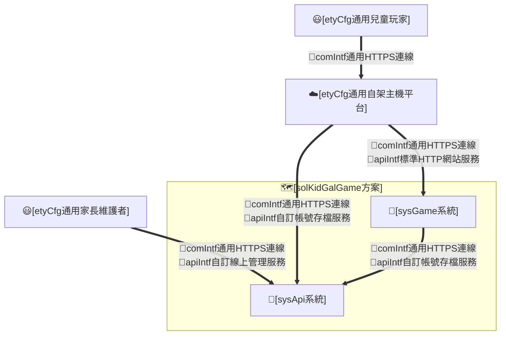

### (B) 組態項目

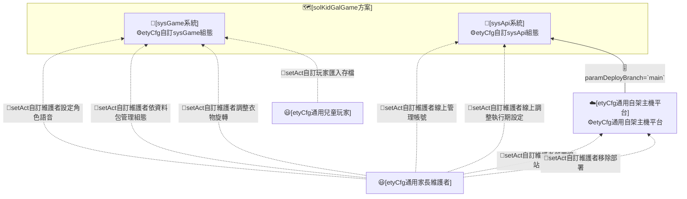

### (C) 運作個案

* **solStory#1-短回合英文練習**：
  * **solCase#1.1**：[etyCfg通用兒童玩家]執行[runAct自訂玩家答英文題]，於場景聽情境句並從選項選出正確英文，取得即時對錯回饋與獎勵；題目依該場景主體與地區英文等級（句型分級、生活化）設計，選項須為公主可回應之情境內語句、干擾選項須屬同場景語域而非超現實荒謬句。
* **solStory#2-地圖探索與角色陪伴**：
  * **solCase#2.1**：[etyCfg通用兒童玩家]執行[runAct自訂玩家地圖導航]，以可見的公主頭像在世界地圖、城堡地圖與各地區地圖一致地移動並進入地點場景（世界地圖採移動到目的地後再進入的探索式進入）。
  * **solCase#2.2**：[sysGame系統]執行[runAct自訂系統渲染場景背景]，於玩家進入地點場景時載入該場景正式 `1024x1024` 手繪背景，並在手機直向與桌機視口下呈現完整內容，不以模糊補版或 runtime 濾鏡遮蔽資產缺陷。
  * **solCase#2.3**：[sysGame系統]執行[runAct自訂系統鋪底視口留白]，當固定比例內容（城堡與地區地圖、世界地圖、ADV 場景背景）於桌機或寬視口置中後在內容區外露出 letterbox 留白時，以該畫面背景藝術之模糊放大版鋪滿留白、使其成為風格一致的沉浸延伸而非純色空白；此模糊鋪底僅施於應繪製內容區之外，不替代、模糊或遮蔽應繪製內容本身（與 solCase#2.2 之內容完整繪製不衝突）。
* **solStory#3-換裝獎勵**：
  * **solCase#3.1**：[etyCfg通用兒童玩家]執行[runAct自訂玩家購買衣物]，以 coins 於商店購買外觀商品。
  * **solCase#3.2**：[etyCfg通用兒童玩家]執行[runAct自訂玩家換裝]，於公主房（衣櫃）以單一「換裝」入口或於商店試穿後穿戴所購商品；公主房換裝採 wear-only 直接穿脫切換（按下穿上後鈕字改為脫下、再按即脫下），與商店共用同一套衣櫃面板機制、不另設專用分類表單；髮型與衣物變化均應由可替換外觀層呈現（服裝類別精簡為髮型、整件 `outfit`、鞋與配件含帽四類，無分件上下身）；穿搭後之衣物位置須依類別級 layer bounds 與實際穿搭視覺 QA 判定是否對位。
* **solStory#4-學習換裝閉環**：
  * **solCase#4.1**：[etyCfg通用兒童玩家]執行[runAct自訂玩家退款]，將不需要的商品退回 coins，回到練習與換裝循環。
* **solStory#5-進度保存與還原**：
  * **solCase#5.1**：[sysGame系統]執行[runAct自訂系統保存進度]，以目前登入帳號為單位將玩家進度寫入 [sysApi系統] 之雲端存檔（自動節流＋關鍵事件即時寫入）；伺服器暫不可達時以記憶體狀態續玩、背景重試並明確提示，不 crash。
  * **solCase#5.2**：[etyCfg通用兒童玩家]執行[setAct自訂玩家匯入存檔]，從 Markdown 存檔匯入還原為目前登入帳號之雲端進度（舊本機存檔之遷移路徑之一；Markdown 匯出保留作為離線備份）。
* **solStory#6-選角與命名**：
  * **solCase#6.1**：[etyCfg通用兒童玩家]執行[runAct自訂玩家選角命名]，首次進入時自 Lumi、Yumi、Rosa 三位可辨識公主外觀選定一位並輸入名字，之後仍可重選外觀或改名。
  * **solCase#6.2**：[etyCfg通用兒童玩家]執行[runAct自訂玩家設定公主識別色]，於選角命名流程選擇公主識別色；新帳號或首次初始化時由系統自飽和度較低的粉彩色盤一次性隨機選入 profileColor 並保存，玩家可改選色盤色或以調色器自訂任一色（既有存檔之識別色相容保留），該色用於公主選單與人物資訊的大頭照卡片半透明底色與帳號辨識；#161 後地圖公主 token 不再套用識別色背板。
  * **solCase#6.3**：[etyCfg通用兒童玩家]執行[runAct自訂玩家設定公主背景花紋]，新帳號或首次初始化時由系統自背景花紋集（如波浪、泡泡、格紋等）一次性隨機選入 backgroundPattern 並保存；玩家可再改選花紋，與識別色共同構成公主視覺主題。
* **solStory#7-部署擴充與移除**：
  * **solCase#7.1**：[etyCfg通用家長維護者]執行[setAct自訂維護者部署網站]，將「靜態遊戲殼＋node API 核」自架服務（[sysApi系統] node 服務＋PostgreSQL 資料庫）部署於本機、區網或家庭主機，由同一服務同站提供遊戲殼靜態檔與帳號存檔 API（正式 helm 整包對外發行於增量 #311；既有 GitHub Pages 舊版不保留、於 #311 關閉退場）。
  * **solCase#7.2**：[etyCfg通用家長維護者]執行[setAct自訂維護者擴充內容]，調整 area、角色、可玩公主、衣物或場景背景內容包（新增、替換或移除單一包），且可玩公主 base 與 wardrobe 外觀層須持續遵守同一紙娃娃 rig；可玩公主 base、wardrobe layer 與場景背景須由 GPT 產生或修圖為童話手繪風格 raster 素材，不得以 SVG、CSS 濾鏡、模糊補版或 runtime 特例代替；新增衣物須依其類別繼承共用 layer bounds，不得每件重做一次對位；調整 area 內容時，各地圖之地點配置須對應該地圖背景藝術元素且相互不過度群聚，場景背景須為完整繪製之 `1024x1024` WebP；新增或替換之各類資產均須符合資產標準表（paramAssetStandards）宣告之像素尺寸與檔重預算，超出預算之過大圖檔須先重壓縮至預算內（維持像素尺寸與童話手繪觀感）或登記具名豁免，方可納入內容包。
  * **solCase#7.3**：[etyCfg通用家長維護者]執行[setAct自訂維護者移除部署]，停用自架服務與資料庫（資料卷保留與否由維護者決定；GitHub Pages 之關閉退場於增量 #311 辦理）。
* **solStory#8-初始化與異常復原**：
  * **solCase#8.1**：[sysGame系統]執行[runAct自訂系統還原進度]，讀取伺服器端該帳號存檔並將缺漏或損壞欄位正規化回預設值。
* **solStory#9-帳號登入與管理**：
  * **solCase#9.1**：[etyCfg通用兒童玩家]執行[runAct自訂玩家登入帳號]，每次進入遊戲時於登入畫面登入要使用的帳號；本裝置最近登入過之帳號以帳號卡呈現（頭胸部大頭照、背景識別色、最近遊玩時間、coins 與目前可玩／休息狀態），點選帳號卡輸入密碼進入，亦可切換輸入其他帳號登入。
  * **solCase#9.2**：[etyCfg通用兒童玩家]執行[runAct自訂玩家註冊帳號]，以小寫英文帳號與至少 6 位密碼建立新帳號（前後端同源驗證、錯誤就地提示），成功即自動登入並成為使用中帳號。
  * **solCase#9.3**：[etyCfg通用兒童玩家]執行[runAct自訂玩家登出帳號]，登出目前帳號（先完成一次即時保存、撤銷 session）並回到登入畫面；玩家端不提供刪除帳號入口（帳號刪除屬維護者作業、於增量 #310 提供）。
  * **solCase#9.4**：[etyCfg通用兒童玩家]執行[runAct自訂玩家回到初始選單]，於遊戲內透過明確按鈕返回登入／帳號選擇畫面，以便同裝置玩家切換帳號或調整公主設定；返回不得重置既有進度。
* **solStory#10-遊玩時間限制與護眼休息**：
  * **solCase#10.1**：[sysGame系統]執行[runAct自訂系統遊玩計時消耗]，依真實經過時間逐步遞減目前帳號的遊玩時間預算，並在人物資訊欄顯示本次開始時間與剩餘可玩時間。
  * **solCase#10.2**：[sysGame系統]執行[runAct自訂系統時間到結算]，於遊玩時間預算耗盡時自動結算並呈現本回合成果（獲得金錢、答題數與答題正確度）。
  * **solCase#10.3**：[sysGame系統]執行[runAct自訂系統休息鎖定]，結算後鎖定目前帳號遊玩，休息時長屆滿前不可續玩、屆滿後解鎖；休息／結算畫面可返回初始帳號／公主選單，但回到同一未解鎖帳號仍維持休息鎖定。
  * **solCase#10.4**：[etyCfg通用兒童玩家]執行[runAct自訂玩家調整遊玩限制]，於設定調整每次遊玩與休息的時長。
* **solStory#11-中文雙語協助與獎勵階梯**：
  * **solCase#11.1**：[etyCfg通用兒童玩家]執行[runAct自訂玩家取用中文協助]，於答題時撥放題目或某一選項的中文以理解題意。
  * **solCase#11.2**：[sysGame系統]執行[runAct自訂系統結算協助獎勵]，依本題是否取用過中文與答對前的送出次數，套用全額／半額／無獎勵。
* **solStory#12-角色差異化配音**：
  * **solCase#12.1**：[sysGame系統]執行[runAct自訂系統角色配音]，依場景人物各自的角色特性，以貼合該人物的聲音撥放其對白與場景開場。
  * **solCase#12.2**：[sysGame系統]執行[runAct自訂系統公主朗讀作答]，於玩家選定選項時，以目前玩家公主的聲音朗讀所選的選項文字。
  * **solCase#12.3**：[sysGame系統]執行[runAct自訂系統穩定語音播放]，以瀏覽器 Web Speech API 播放英文、中文、NPC 與公主語音時，先完成使用者啟動、voice 載入、語言 fallback、佇列或替換策略與錯誤降級，避免快速連點或無條件取消造成首字被截斷，並於離開場景時即時收束正在播放之語音、不殘留跨場景；場景內第一↔二層切換（自場景選單進入子互動或自子互動返回場景選單）時亦即時收束前段語音、改接當下話題。
  * **solCase#12.4**：[sysGame系統]執行[runAct自訂系統記錄語音診斷]，記錄每次語音播放之文字摘要、語言、voice、pitch、rate、queue 動作、事件時間與錯誤代碼，供維護者判斷工程品質與瀏覽器限制。
  * **solCase#12.5**：[etyCfg通用家長維護者]執行[setAct自訂維護者設定角色語音]，於 [管理設定工具] 之聲音管理頁籤為各角色類型（依性別與性格）自瀏覽器可用語音中指定該類型採用的語音（device-wide），公開遊玩端未指定之類型沿用系統自動選用之語音。
* **solStory#13-關於與版本沿革**：
  * **solCase#13.1**：[etyCfg通用兒童玩家]執行[runAct自訂玩家檢視關於資訊]，於設定選單 About 頁籤檢視作品版權宣告與歷次版本的中文短主旨。
* **solStory#14-場景互動分流與雙回饋**：
  * **solCase#14.1**：[etyCfg通用兒童玩家]執行[runAct自訂玩家生活聊天]，於各可互動場景（含商店場景，公主房／城門除外）進行日常寒暄對話，答對提升心情並在護眼時長上限內延長當次可玩時間；題幹為角色寒暄、公主回應為自然社交或情感回應而非無意義複述。
  * **solCase#14.2**：[etyCfg通用兒童玩家]執行[runAct自訂玩家打工任務]，於開啟打工任務的場景完成切合該場景主體的任務（可結合簡易數學與生活常識），以 coins 回饋；題幹須留予公主判斷或選擇空間，公主回應須為經思考的決策、判斷或建議，非複述角色指令或其顯而易見動作之同義回覆。
  * **solCase#14.3**：[etyCfg通用家長維護者]執行[setAct自訂維護者擴充內容]，以單一場景模板統一宣告各場景啟用之模組：生活聊天為各可互動場景預設啟用（公主房／城門除外），逛店與打工任務選擇性開啟，不以商店為特例。
  * **solCase#14.4**：[etyCfg通用兒童玩家]執行[runAct自訂玩家返回場景選單]，自場景內任一第二層互動（生活聊天、打工任務、逛店、退款、換裝、提示）以一致的返回操作回到第一層場景選單，可於同一次造訪續選該場景其他互動，僅於第一層場景選單選擇離開時才退出場景回到地圖；返回第一層場景選單時前段語音即時收束、且不重複聽到該場景歡迎詞，使同一場景每次造訪只播一次歡迎詞（離場後再次造訪才重新招呼一次）。
* **solStory#15-角色立繪輪廓辨識**：
  * **solCase#15.1**：[sysGame系統]執行[runAct自訂系統渲染角色輪廓]，於 ADV 角色立繪、紙娃娃、地圖 token 與頭胸照等 surface 套用依透明 alpha 輪廓產生的常態描邊與自然陰影，使角色在複雜背景中清楚辨識，且不把試穿提示等互動狀態光暈混作常態輪廓效果。
* **solStory#16-依資料包集中維護組態**：
  * **solCase#16.1**：[etyCfg通用家長維護者]執行[setAct自訂維護者依資料包管理組態]，於 [管理設定工具] 依內容資料包結構（公主、衣物、地圖與場景、聲音、遊戲規則）及其相依與含蓋關係集中檢視、調整與擴充各包之可設定項，導覽依資料包分層（地圖與場景再依世界→地區→地點/場景→對話），新增內容包或設定項時沿既有資料包結構擴充而不打散既有維護動線；此維護者組態管理僅於本機開發環境提供、不出現於公開遊玩端。
* **solStory#17-衣物對位即時調整**：
  * **solCase#17.1**：[etyCfg通用兒童玩家]執行[runAct自訂玩家調整衣物對位]，於公主衣櫃按下已擁有單品之「調整」按鈕，在不離開遊戲的前提下以 overlay 即時調整並預覽該單品之對位（位移、縮放）與旋轉，儲存後遊戲立即反映新對位。
* **solStory#18-衣物旋轉調整與區網維護**：
  * **solCase#18.1**：[etyCfg通用家長維護者]執行[setAct自訂維護者調整衣物旋轉]，於 [wardrobe-tuner] 以旋轉角度滑桿調整並即時預覽目標衣物 layer 的旋轉，儲存後反映至遊戲渲染，且可於區網內任一裝置（如手機）開啟工具頁執行上述調整。
* **solStory#19-調整儲存後環境不跳轉**：
  * **solCase#19.1**：[etyCfg通用兒童玩家]執行[runAct自訂玩家調整衣物對位]，在商店模式按下 overlay 儲存後，仍維持商店環境、不跳回公主衣櫃。
* **solStory#20-角色 roster 精簡並平滑升級舊存檔**：
  * **solCase#20.1**：[etyCfg通用兒童玩家]執行[runAct自訂玩家選角命名]，可見公主 roster 精簡為 Lumi、Yumi、Rosa 三位；既有帶 `sol` 角色 id 之舊存檔於下次讀取時自動 fallback 為預設角色 `lumi`，使原以 sol（Mary）遊玩之帳號無縫升級至新 roster、不 crash 亦不殘留已移除角色。
* **solStory#21-對話場景金錢可見與換裝面板瀏覽**：
  * **solCase#21.1**：[sysGame系統]執行[runAct自訂系統顯示場景金錢]，於對話場景（打工任務、生活聊天、逛店、衣櫃換裝等全屏對話覆蓋）畫面內即時呈現目前帳號的 coins 數量，並隨答對得幣或購買消費同步更新，使玩家不需離開場景即可看見金錢變化。
  * **solCase#21.2**：[sysGame系統]執行[runAct自訂系統渲染換裝面板]，於換裝與商店共用之衣櫃面板加寬瀏覽區，並於桌機寬視口一次完整呈現所有可選品項（窄屏維持精簡欄數與必要捲動），且將面板置於公主立繪圖層之後，使選衣時公主維持完整可見、不被面板遮擋。
* **solStory#22-新局得體入門造型與精簡起始擁有**：
  * **solCase#22.1**：[sysGame系統]執行[runAct自訂系統初始化新局造型]，新建帳號時以得體入門造型起步（預設穿著為城堡裁縫店之珍珠白舞會裙、髮型與鞋維持既有簡約款），且僅預先擁有身上所穿之品項（髮型、整件 outfit、鞋三件），其餘外觀一律未擁有、須以 coins 購得；新局初始造型與起始擁有清單屬維護者可於起始組態（princessStart）調整之內容設定。
* **solStory#23-管理工具高效安全使用體驗**：
  * **solCase#23.1**：[etyCfg通用家長維護者]執行[setAct自訂維護者依資料包管理組態]，於任何編修未儲存時重新整理、關閉頁面或切換分頁，先獲得未儲存變更警示、可取消返回；寫回成功後維持原工作點（選取、捲動、篩選、縮放平移），不被整頁重載丟棄其他分頁未儲存工作。
  * **solCase#23.2**：[etyCfg通用家長維護者]執行[setAct自訂維護者依資料包管理組態]，經收合狀態仍可辨識之左側導覽、可點擊之麵包屑與含頁內工作點之 deep link（子分頁、所選地區／場景／單品），於維護中斷後直接回到原工作點續作。
  * **solCase#23.3**：[etyCfg通用家長維護者]執行[setAct自訂維護者依資料包管理組態]，所有確認、錯誤與成功回饋以工具內一致之 MD3 dialog／snackbar 呈現（成功自動消散、失敗持留並說明原因）；刪除單品、清除全部語音指定等危險操作具 error 色視覺區隔與明確確認，取消不執行。
  * **solCase#23.4**：[etyCfg通用家長維護者]執行[setAct自訂維護者調整衣物旋轉]（含框對位編修），以數值輸入與鍵盤微調精修框位、可單件還原或全部還原、套用前檢視待寫回變更清單；於場景對話編修時 AI 生成採「生成→對照→採納」三步，未採納前原題庫不被覆寫。
  * **solCase#23.5**：[etyCfg通用家長維護者]執行[setAct自訂維護者依資料包管理組態]，於區網手機／平板開啟工具時導覽抽屜採 overlay 模式（不常駐佔用內容寬度）、觸控目標 ≥44px、預覽可雙指縮放，觸控裝置可見必要操作說明（不依賴 hover title）。
* **solStory#24-帳號安全與跨裝置同步**：
  * **solCase#24.1**：[sysApi系統]執行[runAct自訂系統驗證帳號存取]，對受保護 API 一律驗 session token——未帶、偽造、逾期或已撤銷一律拒絕（401）；密碼僅以 bcrypt 雜湊儲存、資料庫與日誌不落明文；登入失敗統一訊息、不洩漏帳號存在性。
  * **solCase#24.2**：[sysApi系統]執行[runAct自訂系統同步雲端存檔]，以帳號為單位維護單一雲端存檔（整筆替換 upsert、最後寫入者勝、無跨帳號存取路徑），使同一帳號於任一裝置登入皆取得最後保存之進度。
* **solStory#25-維護者線上帳號管理**：
  * **solCase#25.1**：[etyCfg通用家長維護者]執行[setAct自訂維護者線上管理帳號]，以 admin 帳密自線上管理頁登入，檢視伺服器全部玩家帳號清單（帳號、建立時間、最近登入、存檔更新時間），為任一帳號重設密碼（含變更 admin 自身密碼）、撤銷其全部 session，或經明確二次確認後刪除帳號（連同存檔與全部 session，不可復原）。
  * **solCase#25.2**：[sysApi系統]執行[runAct自訂系統驗證管理存取]，對全部管理 API 一律驗 admin 身分——未登入、玩家 session、逾期或偽造憑證一律拒絕（401／403）、不洩漏管理資訊；admin 憑證與玩家帳號同一安全標準（bcrypt 雜湊、統一錯誤訊息、速率限制）。
* **solStory#26-執行期設定線上管理與生效**：
  * **solCase#26.1**：[etyCfg通用家長維護者]執行[setAct自訂維護者線上調整執行期設定]，於線上管理頁調整新帳號預設遊玩／休息時長、對個別帳號覆寫並鎖定時長（或解除鎖定）、開關新帳號註冊；設定寫入伺服器資料庫、儲存後即時生效，不需改版或重新部署。
  * **solCase#26.2**：[sysGame系統]執行[runAct自訂系統套用執行期設定]，自登入／存檔回應取得目前帳號之時長強制值與鎖定旗標——鎖定時遊戲內設定之時長欄位唯讀並明示由維護者管理；註冊關閉時登入畫面不提供註冊入口並顯示友善說明。

### (D) 重點組態

* **Env轉K8sSec參數**
  * [etyCfg自訂sysApi組態]
    * `DATABASE_URL`：PostgreSQL 連線字串（[apiIntf標準Postgres連線]）；正式 K8s Secret 於增量 #311 helm 化，本增量以本機 `.env`／compose 環境變數供給。
    * `SESSION_SECRET`：session token 雜湊（tokenHash）之 pepper（伺服器端秘密；token 本體為 opaque 隨機值、不採簽章式 token）；供給方式同上。
* **HelmChart參數-chart.yaml**
  * [etyCfg自訂sysGame組態]／[etyCfg自訂sysApi組態]：暫無自有 chart（正式 helm 整包於增量 #311 編制；本增量驗收環境為本機／區網 docker compose 或等效啟動）。
* **HelmChart參數-values.yaml**
  * [etyCfg自訂sysApi組態]
    * paramTechStack=`techStackNodeSvr`
    * paramDatabase=`PostgreSQL`（依 [techItem資料庫]，經 [apiIntf標準Postgres連線]）
    * paramApiPort=`4180`（暫定，code 段落地校準）
    * paramUsernamePattern=`^[a-z][a-z0-9]{2,15}$`
    * paramPasswordMinLength=`6`
    * paramPasswordHash=`bcrypt cost≥10`
    * paramSessionTtlDays=`30`（暫定，維護者可調）
  * [etyCfg自訂sysGame組態]
    * paramTechStack=`techStackStaticWeb`
    * paramDeployTarget=`self-host`（原 `github-pages` 自增量 #309 廢止；舊版不保留，Pages 於 #311 關閉退場）
    * paramSiteRoot=`repository-root`
    * paramExperienceQualityGate=`體驗品質雙人工查核（會話語感 QA intTest#64、版型視覺 QA intTest#65）為釋出必要條件；機械守門（lint／selftest）綠 ≠ 可收——機械守門驗「有沒有」、體驗查核驗「好不好」，兩者缺一不得宣稱完成`
    * paramLayoutQualityBar=`版型品質準則：手機直向（390×844 級）與桌機寬視口（1280×800 以上）逐畫面走查——無溢位、裁切、錯位或擠壓；間距遵循 8px 節奏、字級遵循一致型階；觸控目標 ≥44px；文字對比達 WCAG AA；同類元件跨畫面樣式一致（樣式收斂為 design token 與共用類別，禁單點 magic 補丁）；查核清單見 intTest#65`
    * paramCodeQualityBar=`工程品質準則：模組單一職責、邊界清楚；無死碼、殘留相容碼與重複實作；樣式與常數收斂為具名 token；函式短小具名、錯誤處理明確；任何重寫後全部既有守門（tsc／selftest／data-audit／assetLint／docLint／repoLint／genVersion --check）須維持綠`
    * paramToolUxQualityBar=`管理設定工具體驗品質準則（spec#22 完成判定＝issue #297 盤點之 20 項問題全數修正，分四類：A 導覽動線 1–5——收合導覽可辨識（tooltip）、麵包屑可點、deep link 含頁內工作點、寫回成功不整頁重載、未儲存變更防護（dirty＋beforeunload）；B 版面回饋 6–12——原生 alert/confirm 歸零改 MD3 dialog、icon 具觸控可見說明、危險操作 error 色與確認、回饋統一 snackbar 且成功自動消散、操作區長說明收斂為漸進揭示、五分頁版面骨架與欄寬調整一致、深色模式硬寫色歸零；C 編輯效率 13–18——框數值輸入欄、方向鍵微調（1px／Shift 10px）、單件與全部還原、套用前變更清單、AI 生成「生成→對照→採納」三步、儲存回饋標明實際寫回範圍；D 小螢幕 19–20——窄視口 drawer overlay 模式、pinch 縮放與觸控目標 ≥44px；查核方式見 intTest#67–#69，查核紀錄納入 test-summary）`
    * paramStructureQualityBar=`結構品質準則（issue #298 重構收斂條件、防巨石長回之長期結構守門）：(a) 單檔行數上限——JS 與 CSS 單檔 ≤800 行，其中 main.js 收斂為組裝與調度 ≤500 行；(b) 樣式疊層歸零——同一 CSS 檔內同一 media 範圍之同一選擇器重複規則塊為 0；styles/mobile.css 依畫面歸位解體（含 #295 append-only 品質總修段之歸位），樣式常數收斂為 base.css :root design token 與依畫面分層樣式檔，禁 append-only 補丁段；(c) 超標須具名豁免並登記於 lint 內豁免清單（現行豁免：game-engine/testing/selftests.js 為行為層守門檔、拆分另案；tool/wardrobe-tuner.css 之豁免由 issue #297 收斂移除——工具樣式依分頁解體為 ≤800 行分層檔、硬寫色收斂為 theme-md3 token，見 sysCase#15.5）；由 node scripts/structureLint.mjs 機檢、納入 ＜IV.A＞ 測試指令常備守門（intTest#66）`
  * [etyCfg通用自架主機平台]
    * paramDeployBranch=`main`（自架服務以 main 之建置產物部署）

## B. 系統設計(sysGame系統)

### (A) 架構項目

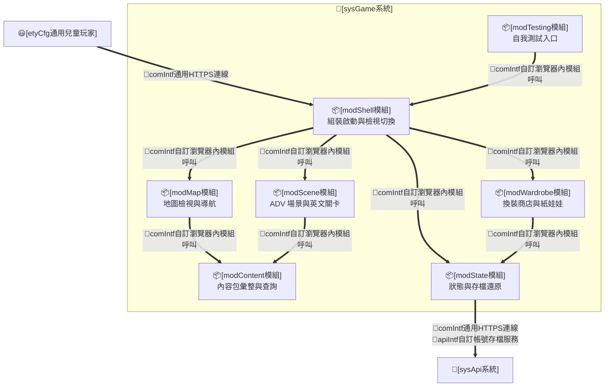

### (B) 組態項目

```mermaid
flowchart BT

ADM["😃[etyCfg通用家長維護者]"]

subgraph SYS["💽[sysGame系統]
⚙️etyCfg自訂sysGame組態"]
  CONTENT["📦[modContent模組]
⚙️etyCfg自訂modContent組態"]
  WARDROBE["📦[modWardrobe模組]
⚙️etyCfg自訂modWardrobe組態"]
  STATE["📦[modState模組]
⚙️etyCfg自訂modState組態"]
  SCENE["📦[modScene模組]
⚙️etyCfg自訂modScene組態"]
end

ADM -.->|"🔧setAct自訂維護者擴充內容"| CONTENT
ADM -.->|"🔧setAct自訂維護者設定角色語音"| SCENE
ADM -.->|"🔧setAct自訂維護者依資料包管理組態"| CONTENT
ADM -.->|"🔧setAct自訂維護者調整衣物旋轉"| WARDROBE
STATE -->|"🎚️paramStorageKey=`luminara-princess-english-adv`"| SYS
STATE -->|"🎚️paramAccountIndexKey=`luminara-princess-english-accounts`"| SYS
CONTENT -->|"🎚️paramDefaultArea=`castle`"| SYS
CONTENT -->|"🎚️paramDefaultVoiceProfile=`default`"| SYS
STATE -->|"🎚️paramPlayMinutes=`15`"| SYS
STATE -->|"🎚️paramRestMinutes=`15`"| SYS
STATE -->|"🎚️paramPlayMaxMinutes=`20`"| SYS
STATE -->|"🎚️paramMoodMinutesPerPoint=`1`"| SYS
SCENE -->|"🎚️paramChatMoodReward=`1`"| SYS
CONTENT -->|"🎚️paramProfileColorPalette=`8 pastel`"| SYS
CONTENT -->|"🎚️paramProfileColorCustomEnabled=`true`"| SYS
CONTENT -->|"🎚️paramBackgroundPatterns=`8 patterns`"| SYS
CONTENT -->|"🎚️paramPlayableCharacters=`lumi,yumi,rosa`"| SYS
CONTENT -->|"🎚️paramInitialThemeRandomization=`profileColor,backgroundPattern`"| SYS
WARDROBE -->|"🎚️paramWardrobeLayerBounds=`type defaults`"| SYS
WARDROBE -->|"🎚️paramCharacterSilhouetteFilter=`outline+depth-shadow`"| SYS
```

### (C) 運作個案

* **sysStory#1-承接英文練習**：
  * **sysCase#1.1**：[modScene模組]承接[runAct自訂玩家答英文題]，載入該場景題庫（依場景主體與地區英文等級分級、生活化，且題組歡迎詞與干擾選項亦切合場景主體、由場景角色以第一人稱對公主發話（題幹為角色台詞、選項為公主自然口語之回應；不另設題組開場白／結語旁白）、無超現實或指涉英文字之 meta 敘述）、依模式呈現選項數、比對選項並判定正確性；正確性判定為各互動模式共用，獎勵型別（coins 或心情）與每題選項數（生活聊天 2、打工任務 3）由所屬模式決定。
* **sysStory#2-承接地圖導航**：
  * **sysCase#2.1**：[modMap模組]承接[runAct自訂玩家地圖導航]，以單一玩家頭像機制在世界、城堡與地區地圖一致渲染、定位與移動公主（鍵盤方向鍵自由走動）。
  * **sysCase#2.2**：[modMap模組]承接[runAct自訂玩家地圖導航]，於世界地圖點選目的地時先令公主頭像移動至該目的地座標後再進入，移動途中再次點選即略過位移直接進入。
  * **sysCase#2.3**：[modScene模組]承接[runAct自訂系統渲染場景背景]，以 sceneArt renderer 載入 [modContent模組] 宣告之單張 `1024x1024` WebP 場景背景；renderer 只負責通用載入、overlay 與 viewport cover，不為個別場景新增 CSS blur、frosted cover、上下延展或裁切特例來遮蔽背景圖本身的補版缺陷。前述禁制針對「遮蔽應繪製內容本身之補版特例」；視口比例不符時內容區外 letterbox 留白之模糊鋪底為跨檢視共用之 stage 底（見 sysCase#2.4）、不屬個別場景補版、不遮蔽內容區，兩者語意分離。
  * **sysCase#2.4**：[modShell模組]承接[runAct自訂系統鋪底視口留白]，提供跨檢視共用之 stage 視口底機制：以目前檢視之背景圖為單一來源（地圖類 `map-1536`／`world-map`，ADV 類 `sceneArt.src` 之 `1024x1024`），於各 stage 容器內鋪一層位於內容層之下、`pointer-events: none` 的 backdrop，以 `background-size: cover` 放大並施模糊與輕度暗化，填滿桌機／寬視口因比例不符露出之 letterbox 留白；地圖與場景 stage 共用同一機制與同一組鋪底樣式常數（模糊半徑、放大倍率、暗化為共用 CSS 單一事實、不逐畫面硬寫，確切數值由 code 依 visual-qa 落地），且不改變內容層定位、不攔截 hotspot／marker 點擊與地圖拖曳；手機直向視口內容填滿、留白不顯著時此底自然不可見。
* **sysStory#3-承接換裝與商店**：
  * **sysCase#3.1**：[modWardrobe模組]承接[runAct自訂玩家購買衣物]，扣除 coins 並標記擁有。
  * **sysCase#3.2**：[modWardrobe模組]承接[runAct自訂玩家換裝]，以共用 `body` ＋ per-character `head` ＋ 髮型、衣物與配件 layer 的順序更新 outfit 並重繪紙娃娃（`body` 為含永久肌膚安全底著之最底層、`head` 疊於其上承載臉與預設髮、其餘 wardrobe layer 再依序疊上）；穿戴衣物疊於 `body` 底著之上、穿戴髮型 layer 須完全覆蓋 `head` 預設髮，更換時舊層卸下不殘留，舊存檔 starter 相容項正規化為 no overlay 以避免重複疊圖；[Yumi] 與 [Mary] 髮色與眼睛校準須回到該角色 `head` raster 素材本身，不由 [modWardrobe模組] 以濾鏡或額外 layer 代改。wardrobe layer 渲染須先依 item type／slot 取得類別級上下左右邊界或安全框，再將該類 layer 放入對應範圍；單件商品預設不得自帶一次性 nudge，必要例外須受控且可由視覺 QA 追溯。換裝模型採單品單層：每件 wardrobe item 至多對應單一外觀層，不採整套綁定（outfit set）一次裝備多件、亦不採單件跨多層（如 outer 前後雙層），換裝一律以單品逐件穿戴疊合呈現。可裝備服裝型別精簡為整件 `outfit`（原 `dress` 改名之單件全身衣著）、配件（含 `headTop`）與髮型、鞋——移除分件 `top`／`bottom` 型別、slot 與紙娃娃圖層，`outfitSlots`／`paperDollLayerOrder`／類別級 layer bounds 同步移除 top／bottom 並將 `dress` 鍵改名 `outfit`；舊存檔曾穿之 `top`／`bottom` 於 [modState模組] 載入正規化時清除、舊 `dress` 欄位改讀為 `outfit`，使既有存檔相容載入不殘留懸空 slot。
  * **sysCase#3.3**：[modWardrobe模組]承接[runAct自訂玩家退款]，回補 coins 並取消擁有。
  * **sysCase#3.4**：[modWardrobe模組]承接[runAct自訂玩家換裝]，公主房衣櫃與商店逛店**為同一套機制**——共用同一套多欄貨架面板（同一 `renderAdvShop`），且**穿脫互動直接走商店試穿之同一單一來源**（同一 `shopTryOnState`／`toggleShopTryOn`／`updateShopTileStates`，內部依 `advMode` 區分：衣櫃＝持久穿戴、商店＝暫時試穿），不另寫第二套穿脫函式；故衣櫃穿脫鈕即商店左側那顆 try-on 鈕（同位置、按下**就地更新不重建貨架**、面板不跳），就已擁有衣物提供穿脫切換（Wear↔Take Off），衣櫃不渲染右側購買鈕、商店則保留試穿＋購買；衣櫃穿脫鈕著深粉紅以與商店購買鈕（暗色玻璃）區辨。公主房第一層場景選單以單一「換裝」入口開啟此面板，入口鈕沿用一般場景選單樣式（不特別上色）。衣物類型不含 outerwear（外套，issue #244 移除）與分件 `top`／`bottom`（上下身，issue #251 移除、整件改稱 `outfit`）；衣櫃顯示分類精簡為髮型、整件 `outfit`、鞋與配件四類，原 `hats`（`headTop`）由獨立分類併入配件分類顯示。
  * **sysCase#3.5**：[modWardrobe模組]承接[runAct自訂玩家調整衣物對位]，於衣櫃面板每件已擁有單品右側渲染「調整」按鈕（[item-panel] `createItemPanelRow` 增加選填 `adjustButton` 設定，僅 advMode=`wardrobe` 傳入、商店與退款 mode 不傳即不渲染）；點擊後開啟 [adjust-overlay]——以獨立 `<dialog>` 全螢幕覆蓋，含固定 512:768 比例預覽區與五組 `<input type=range>`（中心 X、中心 Y、寬、高、旋轉 -180°～180°）；預覽區以 [paper-doll.js] `avatarMarkup`＋`applyLayerTransforms` 渲染目前 state.outfit 著裝，目標單品 targetBox（由滑桿 centerX／Y＋width／height 換算 left/top/right/bottom、並驗 left < right、top < bottom、不超出 512×768 canvas）與 rotation 即時覆寫（不呼叫 server）；「儲存」POST `/tool/apply-wardrobe` 寫回 sidecar 並觸發 index 重生（server 端已有此邏輯），成功後以動態 patch itemMap（不整頁重整）使調整立即反映於遊戲；「取消」丟棄本次調整；overlay 以獨立容器渲染、不共享遊戲 `[data-doll]` 選取器、不嵌入現有遊戲表單 DOM；無 dev server 之環境（含自架正式服務，寫回端點屬 dev-only [server.mjs]）儲存 POST 失敗，overlay 顯示明確提示、不 crash；本 spec 範圍不實作 warp/corners 四角任意變形。
  * **sysCase#3.6**：[modWardrobe模組]承接[setAct自訂維護者調整衣物旋轉]，以旋轉角度滑桿呈現於 [wardrobe-tuner]（前端單頁工具，非遊戲主體），拖動即時更新紙娃娃 layer 之 CSS `transform: rotate(Ndeg)`（旋轉中心為元素中心）；確認後 POST `/tool/apply-wardrobe`，[server.mjs] 將 `rotation` 欄位與 `targetBox` 一併寫回 sidecar 並重生 [index.generated.js]；[buildWardrobeItem] 自 sidecar 讀取 `rotation`（缺省 0、後向相容）傳入 item 物件；遊戲引擎於 `avatarMarkup` 以 `data-rotation` attribute 記錄、`applyLayerTransforms` 套用旋轉（與 `data-warp` 形變並存時合成）；[server.mjs] 預設監聽 `0.0.0.0`（`HOST` 環境變數可覆寫），啟動 log 顯示 LAN IP，使區網內任一裝置可直接開啟工具頁。
  * **sysCase#3.7**：[modWardrobe模組]承接[runAct自訂玩家調整衣物對位]，`patchWardrobeItem`（overlay 儲存後的 `onSave` 回呼）於呼叫 `renderPaperDolls()` 後依 `advMode` 決定重繪目標：`advMode === "wardrobe"` 時呼叫 `renderWardrobeDetail(true)`；`advMode === "shop"` 時呼叫 `renderAdvShop(true)`；其他模式不另行重繪商品面板；確保調整儲存後使用者維持原環境。
* **sysStory#4-承接狀態保存與還原**：
  * **sysCase#4.1**：[modState模組]承接[runAct自訂系統保存進度]，以目前 session 經 [apiIntf自訂帳號存檔服務] 將 normalized state 全量寫入 [sysApi系統] 之該帳號雲端存檔；保存策略（code 段落地）為 leading＋trailing 節流——閒置時任一 persist（含答題結算、購買退款、換裝、時間到結算等關鍵事件）**立即寫入**，連發變更於 paramSaveDebounceMs 內合併尾寫，登出與 pagehide／頁面隱藏時另行 flush；寫入失敗（網路或伺服器不可達）時保留記憶體狀態並退避背景重試、於畫面顯示同步狀態提示，不 crash 不丟畫面；瀏覽器本機儲存不再作為進度寫入目標（僅留 session 快取、裝置最近帳號摘要與舊帳號遷移唯讀來源）。
  * **sysCase#4.2**：[modState模組]承接[setAct自訂玩家匯入存檔]，解析 Markdown 並正規化後，上傳為目前登入帳號之雲端存檔（與本機舊帳號一鍵遷移共用同一上傳路徑）；承接帳號已有雲端進度時先明確警示覆蓋方向並經確認；遷移採「先上傳確認成功、後標記已遷移」順序，失敗可重試不重複。
  * **sysCase#4.3**：[modState模組]承接[runAct自訂系統還原進度]，登入後自 [sysApi系統] 載回該帳號存檔，缺漏欄位以 `normalizeState` 回退預設值（含 `sol`→`lumi` 等相容 fallback）；無存檔時建立新局初始進度。
* **sysStory#5-承接選角與內容擴充**：
  * **sysCase#5.1**：[modShell模組]承接[runAct自訂玩家選角命名]，於 `lumi`、`yumi`、`rosa` 可玩公主 roster 中更新 activeCharacterId、playerName 與 profileColor；既有存檔帶 `sol` 角色 id 者，於 [modState模組] `normalizeState` 讀取時 fallback 為 `defaultActiveCharacterId`（`lumi`），使舊存檔可無縫升級至新三角色 roster。
  * **sysCase#5.2**：[modShell模組]承接[runAct自訂玩家設定公主識別色]，提供飽和度較低的粉彩色盤與調色器自訂供玩家設定 profileColor（自訂色以格式驗證取代固定色盤白名單，既有存檔之 profileColor 相容保留、不被重置）；新帳號或首次初始化缺 profileColor 時，由 [modState模組] 自粉彩色盤一次性隨機選出初始 profileColor 並保存至帳號狀態，後續載入不得重抽；公主選單、帳號卡與人物資訊欄均使用同一個可重用頭胸部大頭照渲染函式，以目前角色之即時穿搭（紙娃娃外觀層裁切為頭胸）呈現、卡片底色為 profileColor 之半透明鋪底，不另維護第二套裁切邏輯；公主選單因選角當下尚未套用衣櫥而呈現各公主基本造型。
  * **sysCase#5.3**：[modContent模組]承接[setAct自訂維護者擴充內容]，匯入新內容包至 registry；可玩公主與 wardrobe layer 均須遵守 [hmiIntf自訂角色尺度與美術規範] 的 `shared-512x768-v1` rig；可玩公主 base、wardrobe layer 與 ADV 場景背景須以 GPT／影像模型產生或修圖為童話手繪風格 transparent/raster 素材，不得以 SVG、CSS 濾鏡、向量拼貼、模糊補版或 renderer 特例代替；新增 wardrobe item 須依 `type`／slot 繼承類別級 layer bounds、且每件至多對應單一 layer slot（單品單層，不採 bundle 套裝或單件多層）；wardrobe 內容以資源包為單位，一個資源包對應一家衣物商店、可含多種類別衣物（含髮型，不限類別），商店以其資源包整包供逛店（包內各類別沿用既有 UI 類別分頁瀏覽，不以單一類別切分商店），原則上每地區一家衣物商店；wardrobe 單品採單一 `512×512` 透明素材兼作投影層與商店預覽（不另設分離商品縮圖），素材由全域 house style＋該包 packStyle＋單品描述詞組 prompt 經影像模型生成、等比縮放使長邊貼滿（短邊置中留透明、不變形），留痕（model／prompt／date）寫入圖檔 metadata；維護工具提供三層描述詞編輯與單品重生；新增或替換場景背景須交付完整繪製之 `1024x1024` WebP，並在 manifest 以 `sceneArt.src` 指向正式資產；所有匯入之圖像資產（角色與 NPC base、wardrobe 單品 layer、ADV 場景背景、地區與世界地圖、UI 等）均須通過資產 lint——其像素尺寸等於 paramAssetStandards 宣告之類別標準值、且檔案位元組不超出該類別檔重預算，超標即視為內容缺陷需重壓縮或具名豁免，使過大圖檔於擴充當下即被擋下、不拖慢純靜態載入。
  * **sysCase#5.4**：[modShell模組]承接[runAct自訂玩家設定公主背景花紋]，自 [modContent模組] 背景花紋資產集提供選項供玩家擇一，更新並持久化目前帳號之背景花紋至其視覺主題狀態；新帳號或首次初始化缺 backgroundPattern 時，由 [modState模組] 自可見背景花紋集合一次性隨機選出初始 backgroundPattern 並保存至帳號狀態，後續載入不得重抽；未知花紋時回退無花紋預設。
* **sysStory#6-承接帳號登入與管理**：
  * **sysCase#6.1**：[modShell模組]承接[runAct自訂玩家登入帳號]，啟動時先進入登入畫面：自裝置快取（paramRecentAccountsKey）渲染本裝置最近登入過之帳號卡（頭胸部大頭照、profileColor、lastPlayedAt、coins、play/rest 摘要），點選帳號卡展開密碼欄、或切換「其他帳號」輸入帳號與密碼；經 [modState模組] 呼叫 [sysApi系統] 登入，成功後取得 session token 與該帳號雲端存檔進入遊戲，並更新裝置最近帳號摘要；失敗統一就地顯示「帳號或密碼不正確」。session 快取僅綁定本裝置最後登入之帳號：該帳號有有效 session 時免重新輸入密碼直接續用，點選**其他**帳號卡一律須輸入密碼、切換登入成功即覆蓋並撤銷前一快取 session；帳號卡主標為 playerName、副標 username（重名可辨），登入後遊戲內設定選單顯示「目前帳號：`username`」。
  * **sysCase#6.2**：[modState模組]承接[runAct自訂玩家註冊帳號]，前端先以 paramUsernamePattern／paramPasswordMinLength 驗證並就地提示，通過後呼叫 [sysApi系統] 註冊；成功即自動登入並建立新帳號初始進度（初始 profileColor 與 backgroundPattern 一次性隨機寫入，使帳號卡第一次顯示即具備穩定主題）；帳號已存在、伺服器不開放註冊（`403 registration-closed`，含停留於註冊表單期間才被關閉、送出方知之情境）等錯誤以友善訊息就地呈現。
  * **sysCase#6.3**：[modState模組]承接[runAct自訂玩家登出帳號]，登出前完成一次即時雲端保存、呼叫 [sysApi系統] 撤銷 session、清除裝置 session 快取（保留最近帳號摘要）並回到登入畫面；玩家端不提供刪除帳號（維護者於增量 #310 管理）。
  * **sysCase#6.4**：[modShell模組]承接[runAct自訂玩家回到初始選單]，於遊戲內提供返回登入／帳號選擇畫面的明確按鈕，返回時先保存目前帳號進度與 lastPlayedAt（同步至雲端），再顯示登入畫面；同裝置另一玩家可就其帳號卡輸入密碼進入。
* **sysStory#7-承接遊玩時間限制與護眼休息**：
  * **sysCase#7.1**：[modState模組]承接[runAct自訂系統遊玩計時消耗]，依真實經過時間遞減目前帳號的遊玩時間預算並持久化至該帳號進度；預設每次遊玩與休息各 15 分鐘。
  * **sysCase#7.2**：[modShell模組]承接[runAct自訂系統時間到結算]，於預算耗盡時呈現本回合成果結算畫面，並顯示返回初始帳號／公主選單的按鈕。
  * **sysCase#7.3**：[modShell模組]承接[runAct自訂系統休息鎖定]，依休息時長鎖定遊玩入口、屆滿後解鎖；若玩家返回初始選單再選回同一帳號，仍依該帳號 restUntil 判斷不可續玩。
  * **sysCase#7.4**：[modState模組]承接[runAct自訂玩家調整遊玩限制]，保存每次遊玩與休息時長至目前帳號；該帳號受維護者鎖定（spec#26）時不承接調整——設定之時長欄位唯讀（見 sysCase#16.1）。
  * **sysCase#7.5**：[modShell模組]承接[runAct自訂系統遊玩計時消耗]，在人物資訊欄顯示本次可玩時間額度（基礎時長與生活聊天延長之合計，延長量以清楚可見方式標記）與剩餘可玩時間，不以百分比作為主要呈現。
* **sysStory#8-承接中文雙語協助與獎勵階梯**：
  * **sysCase#8.1**：[modScene模組]承接[runAct自訂玩家取用中文協助]，以瀏覽器語音依 `zh-TW` 撥放題目或選項的中文（題庫含中文欄位；缺中文時降級為僅英文撥放）；可用 voice 清單載入後，中文優先選取 `zh-TW` voice，其次 `zh` voice，再降級 default voice，且降級須寫入語音診斷紀錄。
  * **sysCase#8.2**：[modScene模組]承接[runAct自訂系統結算協助獎勵]，依中文使用旗標與答對前送出次數，以全額／半額（paramRewardSecondTryRatio）／無 結算 coins。
* **sysStory#9-承接角色差異化配音**：
  * **sysCase#9.1**：[modScene模組]承接[runAct自訂系統角色配音]，依說話者宣告的角色特性查 [modContent模組] 的 [datIntf自訂角色音色目錄] 取得音頻參數（pitch／rate，年齡主要於此表現）套用發聲，並依說話者（性別×性格）類型解析實際 voice——優先採維護者於 [管理設定工具] 指定之語音，未指定則繼承其性別類型；仍未指定者，依內建「性別→候選語音名稱清單」（paramVoiceGenderCandidates）自瀏覽器 `getVoices()` 挑選**同性別**具名 voice（語言優先 en-US→en），命中不到（如 Android Google TTS 之 `en-us-x-…` 不具名代號）才再依 paramSpeechPreferredVoices 之語言優先 fallback 選取（fallbackReason 記 `gender-default`／語言 fallback）；不得以「性別字串子字串比對 voice 名稱」自動選取（瀏覽器 voice 名稱鮮少含 `female`／`male` 字樣，恆落空）；所有經 [modScene模組] 之語音發聲（含角色配音、公主朗讀作答與中文協助）最終語速均另乘全域 paramSpeechRateScale 倍率以利兒童聽辨；特性缺漏、不在目錄、使用者未指定且瀏覽器無合適 voice 時降級為 paramDefaultVoiceProfile 之預設嗓音，並保留角色 profile 與實際 voice 採用結果。
  * **sysCase#9.2**：[modScene模組]承接[runAct自訂系統公主朗讀作答]，於玩家選定選項時以目前玩家公主之音色朗讀所選選項文字；`playableVoiceById` 須覆蓋 `lumi`、`yumi`、`rosa`，並沿用既有語音開關（關閉時不發聲）。
  * **sysCase#9.3**：[modScene模組]承接[runAct自訂系統穩定語音播放]，以單一 `speechManager` 包裝 `SpeechSynthesisUtterance`；啟動時先讀 `getVoices()` 並監聽 `voiceschanged`，發聲前先採使用者為該（性別×性格）類型指定之 voice（未指定則繼承性別類型），再依內建性別候選清單（paramVoiceGenderCandidates）挑同性別具名 voice、最後依 `lang` 之語言優先 fallback 選取 voice，並於送入 utterance 之文字開頭加入固定前置留白（paramSpeechLeadingPad）以延後首字出聲、改善開頭清楚度；`speak()` 採佇列或 replace-last 策略，不得每次無條件 `speechSynthesis.cancel()`；`cancel()` 僅用於使用者明確停止、切換語音、同一語音重播、離開場景收束或場景內第一↔二層切換收束。離開場景（關閉場景對話、切換場景或返回地圖之共同收口）時須收束正在播放之語音、不殘留跨場景發聲——因 Web Speech API 之 `SpeechSynthesisUtterance.volume` 於 `speak()` 當下固定、無法對進行中語句即時調整音量（僅 `cancel()` 可中止），故以即時 `cancel()` 作為「約 1 秒內音量淡出」目標聽感之明確降級實作，並將該次 stop 來源寫入語音診斷紀錄。場景內第一↔二層切換（自場景選單進入第二層子互動，或自第二層返回第一層場景選單之共同收口）亦以相同即時 `cancel()` 收束前段語音、stop 來源標記為層級切換並寫入診斷，使語音改接當下話題、不跨層級殘留；收束須冪等且在當下情境 `speak()` 之前完成，不誤殺當下話題該播之語音。
  * **sysCase#9.4**：[modScene模組]承接[runAct自訂系統記錄語音診斷]，監聽 utterance `start`、`end`、`error`、`boundary` 事件，記錄 queue 動作、voice 載入狀態、實際語音參數、錯誤代碼與是否因 autoplay/user activation、audio-busy、voice-unavailable、language-unavailable、interrupted 或 canceled 降級。
  * **sysCase#9.5**：[modScene模組]承接[setAct自訂維護者設定角色語音]，提供各角色類型（性別×性格，僅列實際有角色採用之類型）之瀏覽器可用語音清單供 [管理設定工具] 之聲音管理頁籤選取，各桶下拉並將「裝置上實際存在之同性別推薦語音」（依 paramVoiceGenderCandidates 解析）置頂為 Recommended 群組、其餘歸 Other voices，以因應 Win11／Android 語音名稱混亂；並將維護者指定持久化（[datIntf自訂角色音色目錄] 之語音指定，存於 paramVoiceAssignmentKey、device-wide 非各帳號）；指定之 voice 於本機 `getVoices()` 不存在時，依繼承（性別類型）、性別候選清單或語言優先 fallback 解析並寫入語音診斷紀錄。
* **sysStory#10-承接關於與版本沿革**：
  * **sysCase#10.1**：[modShell模組]承接[runAct自訂玩家檢視關於資訊]，於系統選單新增 About 頁籤，渲染作品版權宣告與最近 10 個版本的中文短主旨；當前版本資訊併入此頁籤，由 [datIntf自訂版本沿革目錄] 之首筆導出，Settings 不再另列版本卡。
* **sysStory#11-承接場景互動分流與雙回饋**：
  * **sysCase#11.1**：[modScene模組]承接[runAct自訂玩家生活聊天]，載入該場景生活聊天題組（各可互動場景含商店預設皆具備、題幹為場景角色以第一人稱對公主之寒暄、以 paramChatChoiceCount 之 2 選項（公主自然口語之回應）呈現），答對時依 paramChatMoodReward 累加心情值並請求 [modState模組] 延長當次遊玩時間。
  * **sysCase#11.2**：[modScene模組]承接[runAct自訂玩家打工任務]，載入該場景打工任務題組（可含簡易數學與生活常識、題幹為場景角色以第一人稱向公主提出之具體工作請求——即該角色實際需公主代勞、切合該場景主體之勞務差事（如搬運、收拾、遞送、清點、備膳、整理等），排除純觀看、站位、寒暄或道別等非勞動內容、以 paramJobChoiceCount 之 3 選項（公主應允並完成該工作之回應／回報，正解須以自然應允語句開頭如「Sure thing」「OK, I can …」再接實質回報）呈現，題組外框與干擾項切合場景、無超現實或 meta 敘述），答對時依各地區平緩等差之打工報酬基數（castle／urban／rural／wild 微幅遞增）、並沿用中文協助獎勵階梯（全額／半額／無）以 coins 回饋。
  * **sysCase#11.3**：[modState模組]承接[runAct自訂系統心情延長遊玩]，依心情值與 paramMoodMinutesPerPoint 換算延長目前帳號當次遊玩時間預算，且延長後不超過 paramPlayMaxMinutes 護眼上限。
  * **sysCase#11.4**：[modContent模組]承接[setAct自訂維護者擴充內容]，以單一場景設定宣告各場景啟用之生活聊天／逛店／打工任務模組與對應題組，生活聊天為各可互動場景預設啟用（公主房／城門除外）、商店場景同時提供逛店與生活聊天，不再以商店為特例（無 kind:"shop" 特例殘留）。
  * **sysCase#11.5**：[modScene模組]承接[runAct自訂玩家返回場景選單]，使場景互動採第一層場景選單與第二層互動畫面之兩層動線——第二層各互動畫面（生活聊天、打工任務、逛店、退款、換裝、提示，含答題完成畫面）之返回一律回到第一層場景選單而不關閉冒險視窗，僅第一層場景選單之離開關閉冒險視窗回到地圖；返回第一層場景選單之共同收口（`backToSceneMenu`）須先收束前段語音（同 sysCase#9.3 之層級切換收束），並以本次造訪之「歡迎詞已播」旗標控制 `openSceneAdv` 不重播歡迎詞（`source` 為場景開場之 NPC 語音）——首次進入場景播放、造訪內返回不重播，離場（`closeAdv()`／場景切換）清旗標使再次造訪重新播放一次；旗標與造訪繫結、為暫態不持久化存檔。
* **sysStory#12-承接角色立繪輪廓辨識**：
  * **sysCase#12.1**：[modScene模組]承接[runAct自訂系統渲染角色輪廓]，為 ADV NPC 立繪套用依透明 alpha 輪廓計算的常態描邊與自然陰影；描邊提供深色輪廓辨識，陰影提供角色後方景深，不以大範圍亮色光暈作為常態可讀性來源。
  * **sysCase#12.2**：[modWardrobe模組]承接[runAct自訂系統渲染角色輪廓]，為可玩公主紙娃娃、地圖 token 與頭胸照套用 surface 分級的輪廓規則；其中 ADV 場景之公主立繪 surface 常態陰影須呈簡潔深灰立體投影（以單一方向性接地投影為主、保留貼合輪廓描邊），避免多層柔邊投影疊加被讀為角色光暈或糊化腳底陰影；多層 wardrobe layer 不得因逐層陰影疊加造成過重髒邊，試穿狀態光暈須保留為互動狀態提示而非角色常態陰影。
* **sysStory#13-承接依資料包集中維護組態**：
  * **sysCase#13.1**：[modContent模組]承接[setAct自訂維護者依資料包管理組態]，[管理設定工具] 依 [modContent模組] 之內容資料包結構（公主、衣物、地圖與場景、聲音、遊戲規則等資料包）組織兩層導覽——頂層為各內容資料包、包內再依含蓋關係分層（地圖與場景依世界→地區→地點/場景→對話），各既有管理頁（衣物單品與投影、地圖座標、場景對話、角色語音、新局起始等）依其所屬資料包歸入對應節點；新增管理頁沿資料包結構掛入而不需重排頂層導覽，工具僅於本機開發環境提供、寫回經 dev server 白名單，公開 GitHub Pages 不提供此入口。
* **sysStory#14-承接角色 roster 精簡與舊存檔升級**：
  * **sysCase#14.1**：[modState模組]承接[runAct自訂玩家選角命名]，`normalizeState` 讀取存檔時，若 `activeCharacterId` 不存在於 `characterRegistry`（如已移除之 `sol`），則 fallback 為 `defaultActiveCharacterId`（`lumi`）；移除後 `characterRegistry` 不含 `sol` 鍵、`playableVoiceById` 不含 `sol`、starter wardrobe 不含 `solStarterHair`，使 roster 精簡完整且無殘留。
* **sysStory#15-承接管理工具使用體驗**：
  * **sysCase#15.1**：[modContent模組]承接[setAct自訂維護者依資料包管理組態]，[管理設定工具] 前端建立五分頁共用之 UI 基礎（[tool/ui-helpers]：MD3 風格 dialog／snackbar／tooltip／dirty-guard，沿用 [tool/theme-md3.css] token、不引入外部框架、不動 [server.mjs] 寫回端點與檔案格式契約）；各分頁之 `window.alert`／`window.confirm` 全數改走共用 dialog、狀態回饋統一 snackbar（成功自動消散、失敗持留並可重試），共用 `setStatus`／`postJson` 等重複實作收斂至 [tool/ui-helpers]；危險操作（刪除單品、清除全部語音指定）採 error 色按鈕與確認對話框。
  * **sysCase#15.2**：[modContent模組]承接[setAct自訂維護者依資料包管理組態]，工具維護統一 dirty 註冊表——各分頁把未儲存工作副本（衣物框／旋轉、場景題庫、公主預設）登記為 dirty 來源，任一 dirty 時 `beforeunload` 攔截警示；新增／刪除／metadata 儲存／重生等寫回成功後改「局部重載資料模型＋原地重繪」，不再 `window.location.reload()` 整頁重載，保留選取、捲動、篩選、縮放平移與其他分頁未儲存工作。
  * **sysCase#15.3**：[modContent模組]承接[setAct自訂維護者依資料包管理組態]，導覽補強：收合抽屜各資料包鈕帶 tooltip（觸控長按／點擊可見）、麵包屑資料包段可點擊跳回該包首頁、hash deep link 自 `#panel` 擴充為含頁內工作點（地圖子分頁、場景地區與所選場景、衣物所選單品）且重載後還原；窄視口（≤980px）導覽抽屜改 overlay 模式（開啟時遮罩、選定後自動收合、不常駐佔寬），觸控目標 ≥44px、預覽舞台以 pointer events 支援 pinch 縮放（與既有滾輪縮放並存）。
  * **sysCase#15.4**：[modWardrobe模組]承接[setAct自訂維護者調整衣物旋轉]（含框對位編修），[wardrobe-tuner] 框對位增設數值輸入欄（與拖曳、預覽三向同步）與方向鍵微調（1px、Shift＝10px）、「還原此件」（回 seed）與「還原全部」；「套用到檔案」前呈現待寫回變更清單（單品框／旋轉異動件數與 `rules.js` 是否變動），寫回後回報實際寫入檔案；[scene-tuner] AI 生成改「生成→對照預覽→採納」三步，未採納前工作副本題庫不被覆寫。
  * **sysCase#15.5**：[modContent模組]承接[setAct自訂維護者依資料包管理組態]，工具樣式收斂：[tool/wardrobe-tuner.css] 依分頁解體為 ≤800 行分層樣式檔（共用 admin shell／衣物／地圖與場景／聲音與公主預設），硬寫色歸零改引 [tool/theme-md3.css] token 使深色模式一致，並自 structureLint 豁免清單移除（paramStructureQualityBar (c)）；解體採域內保序、每步視覺回歸（沿 #298 mobile.css 工法）。
* **sysStory#16-承接執行期設定生效**：
  * **sysCase#16.1**：[modState模組]承接[runAct自訂系統套用執行期設定]，自 [sysApi系統] 存檔回應（GET 與 PUT `/api/save` 皆搭載）取得時長政策（enforced playMinutes／restMinutes／playMaxMinutes 與 locked 旗標）套用目前帳號：locked 時遊玩／休息計時一律以政策值為執行值（**不改寫、不回寫** `state.playLimit` 之玩家自調值——政策與存檔資料分離，不與 `updatedAt` 樂觀鎖動線互相干擾），[modShell模組] 將設定選單之時長輸入欄設為唯讀顯示強制值並顯示「由維護者管理」提示，[modState模組] 不再承接玩家調整；解除鎖定後回復玩家自調值；PUT 回應之政策變更當場套用，使 admin 儲存對遊玩中裝置即時生效；保存收到 401／403（session 被撤銷或帳號被刪除）時不進背景退避重試，改走 session 逾期動線（嘗試性保存後導回登入畫面）。
  * **sysCase#16.2**：[modShell模組]承接[runAct自訂系統套用執行期設定]，登入畫面載入時查詢 [sysApi系統] 公開設定（註冊開關）：註冊關閉時不渲染「建立新帳號」入口（含空狀態之註冊表單），改顯示一句友善說明（如「本伺服器目前不開放新帳號，請找爸媽幫忙」）；查詢失敗時以註冊開放為預設、不阻斷登入動線。

### (D) 重點組態

* **Env轉K8sSec參數**
  * 暫無。
* **HelmChart參數-chart.yaml**
  * [etyCfg自訂sysGame組態]：暫無。
* **HelmChart參數-values.yaml**
  * [etyCfg自訂modContent組態]
    * paramDefaultArea=`castle`
    * paramDefaultCharacter=`lumi`
    * paramPlayableCharacters=`lumi,yumi,rosa`
    * paramProfileColorPalette=`8 pastel preset colors`
    * paramProfileColorCustomEnabled=`true`
    * paramBackgroundPatterns=`8 (wave,bubble,grid,...)`
    * paramCardBackgroundAlpha=`0.45`
    * paramInitialThemeRandomization=`profileColor,backgroundPattern`
    * paramDefaultVoiceProfile=`default`
    * paramAssetStandards=`per-class {pixelSize, maxKB, mode}：固定畫布 exact——characterBody/characterHead/NPC base 512×768·350、scene 1024×1024·500、areaMap 1536×1536·600、worldMap 1536×1536·600、ui 1280×720·120；緊貼裁切容於畫布 bound（素材去白邊後寬高≤畫布，#176 以 targetBox 等比 fit）——mapLayer（地圖裝飾層）≤512×512·80；長邊貼滿固定畫布 fill（畫布像素等於標準值、內容等比縮放使長邊貼滿至少一對對邊、短邊置中留透明、不變形）——wardrobe（衣物單品，單一素材兼 layer 與商店預覽）512×512·≈200（USR-gated 待實測；取代並移除分離 wardrobeThumb／wardrobeLayer 雙類）`（資產 lint 之尺寸與檔重 SSOT；初始檔重門檻，code 可依實測 USR-gated 微調）
  * [etyCfg自訂modScene組態]
    * paramChineseAudioLang=`zh-TW`
    * paramRewardSecondTryRatio=`0.5`
    * paramChatMoodReward=`1`
    * paramChatChoiceCount=`2`
    * paramJobChoiceCount=`3`
    * paramSpeechRateScale=`0.8`
    * paramSpeechQueueMode=`replace-last`
    * paramSpeechDebounceMs=`120`
    * paramSpeechWarmupEnabled=`true`
    * paramSpeechDiagnosticsEnabled=`true`
    * paramSpeechPreferredVoices=`user-assigned,gender-default,lang-first`
    * paramSpeechLeadingPad=`8 full-width spaces`
    * paramVoiceBucketDimensions=`gender,personality`
    * paramDialogueQualityBar=`題庫文本品質準則（spec#1 規則之語感落地）：(a) 母語者自然口語、貼近 6–10 歲兒童日常，讀來像真人對話而非教科書孤立句或翻譯腔；(b) 情境貼合場景主體與角色身分，題幹為角色台詞、選項為公主可回應語句；(c) 正解與干擾選項同語域、語意有別且皆情境內合理，辨析價值來自語意而非荒謬排除；(d) 打工正解以自然應允語開頭並體現思考決策；(e) 題庫重寫或新增須全題逐題通過人工語感查核（查核清單見 intTest#64），不得僅抽樣`
    * paramVoiceGenderCandidates=`內建「性別→候選語音名稱(優先序)」清單（voiceNameCandidatesByGender，資料源 Readium Speech＋各平台官方命名），供未指定時自 getVoices() 挑同性別具名 voice；刻意不含 "male"/"female" 裸字`
  * [etyCfg自訂modState組態]
    * paramStorageKey=`luminara-princess-english-adv`（自 #309 起僅作本裝置舊帳號一鍵遷移之唯讀來源，不再為進度寫入目標）
    * paramSaveMarker=`LUMINARA_SAVE_JSON`
    * paramAccountIndexKey=`luminara-princess-english-accounts`（同上，遷移唯讀來源）
    * paramSessionCacheKey=`luminara-princess-english-session`（裝置端 session token 快取）
    * paramRecentAccountsKey=`luminara-princess-english-recent`（本裝置最近帳號卡摘要快取）
    * paramSaveDebounceMs=`2000`（雲端保存節流，暫定、code 段落地校準）
    * paramVoiceAssignmentKey=`luminara-princess-english-voice`
    * paramPlayMinutes=`15`
    * paramRestMinutes=`15`
    * paramPlayMaxMinutes=`20`
    * paramMoodMinutesPerPoint=`1`
  * [etyCfg自訂modWardrobe組態]
    * paramWardrobeLayerBounds=`wardrobeLayerBoundsByType`（每個 item type 定義 render bounds 與 `safeBox`）
    * paramWardrobeRegistry=`衣物單品單一事實來源＝素材旁 JSON sidecar（<slug>.metadata.json 與 <slug>.webp 同目錄同基名，欄位 id／type／name／cost／icon／prompt／targetBox?；per-pack storeId 與 packStyle 置 <pack>/style.json）。registry 為其衍生：build 期 scripts/genWardrobeIndex.mjs 掃各包 layers 之 webp＋sidecar 產出 committed content-package/wardrobe/index.generated.js（frozen wardrobeItems，AUTO-GENERATED 勿手改），生成期守門每 webp↔sidecar 一一對應無孤兒、id 全域唯一、type 合法；runtime 只 import 生成 index（瀏覽器永不 readdir、純靜態相容 spec#7），dev server 於內容增刪後重生 index 供即時預覽。取代手寫 wardrobe/manifest.js 聚合、各包 manifest.js 寫死 wearable(...)、style.json items 與 asset-target-overrides.js 之多檔散落；管理工具新增／刪除／改 metadata 皆對單一 sidecar 原子操作、無跨檔孤兒`
    * paramWardrobeAssetStyle=`三層描述詞：全域 houseStyle ＋ 每包 packStyle｛name,reference,palette,motifs,linework,mood｝＋ 單品 itemDesc；組 prompt 經影像模型生成 512×512 透明單品素材（兼投影層與商店預覽），維護工具可編輯三層描述詞並逐件重生，留痕 model／prompt／date 寫入圖檔 metadata`
    * paramWardrobeChromaKeyWorkflow=`正式衣物素材一律採「先上純色人像框／臨時模特兒定位 → 去除人像 key color → 透明 wardrobe layer」流程，不得直接生成商品照或獨立單品圖；此規則適用所有正式穿戴素材：髮型、整件 outfit、鞋子、headTop/headSide/faceEyes/faceMask/neck/hand 等配件。依 item type 建立 1024×1024 chroma-key guide（髮型＝頭部／上胸輪廓，outfit＝含頭頸肩胸腰手腳的全身穿衣輪廓，shoes＝腿腳輪廓，headTop/headSide/faceEyes/faceMask＝頭部輪廓，neck＝頭頸胸輪廓，hand＝身側與手部輪廓）；影像模型必須先在 guide 上畫出「已穿在人像框上的狀態」，再由後處理移除 guide，只留下欲穿戴物件。outfit 領口、肩線、袖口、腰線、裙襬與開口必須依人像框包覆成形，不能像空衣架或平放衣物；鞋子必須依腳踝與腳掌成形，不能像商品陳列鞋；配件必須依頭、頸胸或手側位置成形，不能像孤立 icon。生成與去背後不得留下臉、五官、皮膚、頭、手腳、人物本體、模特兒框線、場景、背景、文字或浮水印；key color 使用高飽和亮洋紅 #ff00ff（必要時亮綠 #00ff00），禁止使用黑色以免深色髮型、鞋、酒紅、墨綠、深紫服飾被誤去除；鞋子素材須是「穿在紙娃娃雙腳上的正面穿戴視角」：左右腳分開、腳尖朝下、鞋口對準腳踝，可保留因 key color 腳部被移除形成的透明鞋口，禁止俯視商品照、側拍鞋、成雙陳列照、鞋盒展示或漂浮鞋子 icon；後處理以 key color/fuzz 去背、alpha bbox 裁切、長邊貼滿並置中輸出 512×512 透明 WebP，若殘留 key color、人體皮膚或模特兒輪廓，該素材不得納入正式 layer。`
    * paramWardrobePackStyles=`四包中世紀歐洲公主換裝風格：castle=城堡宮廷（高貴、正式、華麗、王族／宮廷舞會／典禮，色盤 gold/ivory/wine red/royal blue/deep purple/pearl/rose/emerald，元素 crown/jewel/pearl/lace/gold embroidery/crest/rose/lily/court floral，線條對稱端莊、垂墜寬裙、合身上身、袖口領口裝飾，氣氛 noble/elegant/formal/ornate/royal）；urban=城鎮街區（美麗精緻時髦但貼近日常，城鎮少女／商人之女／工坊學徒／書店少女，色盤 milk tea/caramel/olive/grey blue/misty pink/deep red/cream/dark green，元素 leather/button/plaid/lace/shawl/waist bag/book/key/town sign/brick，線條俐落合身、方便行走、裙襬不過大、外套層次，氣氛 refined/clever/lively/everyday/urban）；rural=Countryside 郊區鄉村（簡便樸素自然耐用，村莊／牧場／磨坊／菜園／小屋，公主微服出遊或鄉村冒險裝，色盤 beige/linen/earth brown/grass green/pale yellow/blue grey/terracotta/wood brown，元素 cotton linen/coarse cloth/apron/kerchief/straw/wood/flowers/basket/farm tools，線條寬鬆輕便短裙襬、少裝飾但溫暖可愛，氣氛 natural/plain/friendly/warm/free）；wild=Fairy Forest 童話森林（奇幻自然魔法精靈感，森林精靈／妖精／魔法植物／神秘湖泊，色盤 tender green/mint/aqua/lavender/starlight white/rose/moonlight silver/glowing cyan，元素 flower/vine/leaf/butterfly/fairy wing/crystal/star/moon/mushroom/glowing rune，線條輕盈飄逸不對稱自然流動、裙襬如花瓣或葉片，氣氛 dreamy/mysterious/free/magical/forest/adventure）。`
    * paramWardrobePilotItems=`第一批補齊為 4×4×4 共 64 件正式素材：4 個素材包（castle/urban/rural/wild）× 4 個 UI 類別（hair/outfit/shoes/accessories）× 每類 4 件。各包沿用內部 id：rural 對應 Countryside，wild 對應 Fairy Forest；accessories 依穿戴位置落在 headTop/headSide/neck/hand 等既有 slot。舊正式 wardrobe layer 可移除，starter no-layer 相容項可保留；本輪只要求素材本身為正確穿戴視角透明 layer，位置大小由後續人工 targetBox 調整。`
    * paramWardrobeRotation=`sidecar metadata 根層級選填 rotation 欄位（度數 number，順時針正方向，缺省 0，後向相容）；[wardrobe-tuner] 旋轉滑桿（-180～180）可調整並即時預覽，套用後經 [server.mjs] handleApplyWardrobe 寫回 sidecar、重生 index；[buildWardrobeItem] 傳遞至 item 物件（缺省補 0）；遊戲引擎渲染 wardrobe layer 時套用 CSS transform: rotate(Ndeg)（旋轉中心為元素中心）。`
    * paramCharacterSilhouetteFilter=`outline+depth-shadow`
  * [etyCfg自訂devServer組態]
    * paramServerHost=`server.mjs 本機監聽位址，由環境變數 HOST 覆寫；預設 0.0.0.0 使同一區網裝置可直接存取工具頁面；僅作用於 dev-only server.mjs，不納入正式部署；啟動 log 顯示第一個非迴環 IPv4 LAN IP 供參考`
    * paramServerPort=`4174`

## C. 系統設計(sysApi系統)

### (A) 架構項目

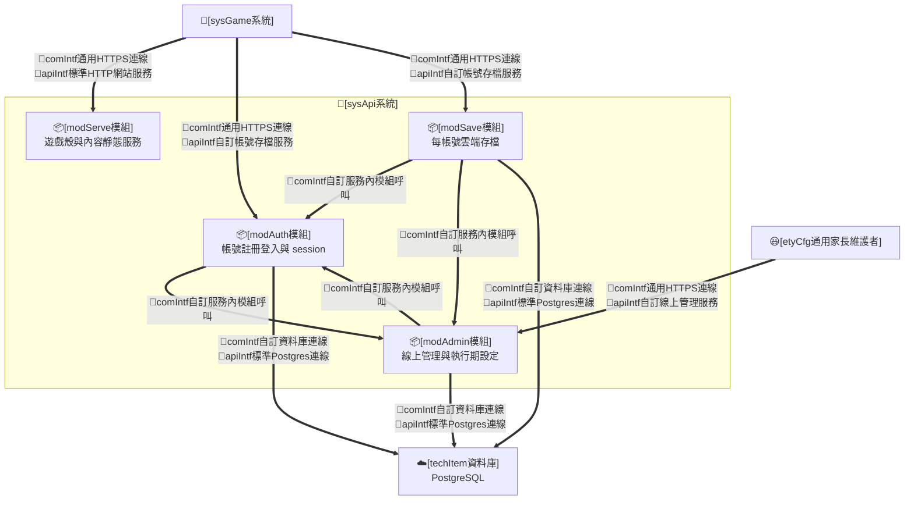

### (B) 組態項目

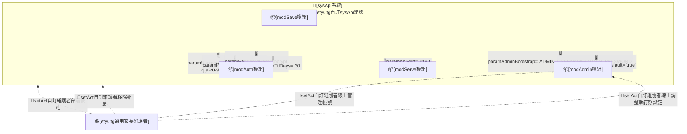

### (C) 運作個案

* **sysStory#1-承接帳號註冊登入**：
  * **sysCase#1.1**：[modAuth模組]承接[runAct自訂玩家註冊帳號]，先查 [modAdmin模組] 之註冊開關（spec#26，關閉時拒絕 `403 registration-closed`），再驗證帳號格式（paramUsernamePattern）與密碼長度（paramPasswordMinLength）、檢查帳號唯一性，以 bcrypt（cost ≥10）雜湊密碼後建立帳號並核發 session token；新帳號之初始遊玩／休息時長取執行期設定之新帳號預設時長（spec#26）；帳號已存在、格式不符、密碼過短各回可辨識之錯誤碼與訊息（HTTP 409／422），資料庫與日誌不落明文密碼。
  * **sysCase#1.2**：[modAuth模組]承接[runAct自訂玩家登入帳號]，比對密碼雜湊，成功即核發時效 paramSessionTtlDays 之 session token（opaque 隨機值、伺服器端僅存其雜湊 tokenHash、可撤銷；TTL 固定不展期）；失敗統一回 401「帳號或密碼不正確」、不區分帳號不存在與密碼錯誤；登入與註冊端點具速率限制／連續失敗退避——**僅累計失敗嘗試、成功即清零**（#309 審查 A5：防第三者以連續錯誤密碼定向鎖死他人帳號之正常登入）；受保護端點一律驗 session，未帶或無效回 401。
  * **sysCase#1.3**：[modAuth模組]承接[runAct自訂玩家登出帳號]，撤銷該 session token；已撤銷或逾期之 token 後續請求一律 401；逾期與已撤銷之 session 資料列由伺服器惰性清理（#309 審查 A7：於登入等既有寫入時機順掃刪除、不常駐排程），不無限累積。
* **sysStory#2-承接雲端存檔**：
  * **sysCase#2.1**：[modSave模組]承接[runAct自訂系統保存進度]，以 session 所屬帳號 upsert 該帳號之單一存檔紀錄（JSONB 全量 state＋schemaVersion＋updatedAt），寫入採整筆替換並以 `updatedAt` 樂觀比對——請求所帶基準 `updatedAt` 過期即拒（HTTP 409、不覆蓋較新進度，由遊戲端提示重新載入）；寫入前施 state **形狀校驗**（#309 審查 B9：頂層須為 JSON 物件、必要欄位型別檢查，非法形狀拒 422、不落庫），以參數化查詢執行、請求體具大小上限（值 code 段定）、無任何跨帳號存取路徑。
  * **sysCase#2.2**：[modSave模組]承接[runAct自訂系統還原進度]，登入後回傳該帳號存檔全量 state 與伺服器時間（供遊戲端校正遊玩／休息計時）；回應並搭載該帳號之時長政策（enforced 時長與 locked 旗標，經 [modAdmin模組] 讀帳號覆寫，spec#26）——**政策與存檔資料分離**：伺服器不改寫 `state.playLimit`（玩家原自調值保留於存檔、解除鎖定即回復），鎖定之強制值僅經 `playLimitPolicy` 下發、由遊戲端作為計時執行值套用（[sysGame系統] sysStory#16）；保存（PUT）回應亦搭載最新政策，使 admin 儲存對遊玩中裝置即時生效；無存檔時回空（HTTP 204），由遊戲端建立新局初始進度；伺服器不改寫其餘遊戲語意，正規化一律由遊戲端 `normalizeState` 執行。
  * **sysCase#2.3**：[modSave模組]承接[setAct自訂玩家匯入存檔]，接受遊戲端解析正規化後之整份 state 作為該帳號存檔（Markdown 遷移與本機舊帳號一鍵遷移共用此上傳路徑）；遷移／匯入屬使用者明示之覆蓋操作，遊戲端於承接帳號已有雲端進度時先明確警示覆蓋方向並經確認才上傳。
* **sysStory#3-承接遊戲殼服務**：
  * **sysCase#3.1**：[modServe模組]承接[setAct自訂維護者部署網站]，同站服務遊戲殼靜態檔（`index.html`、[game-engine]、[content-package] 等）、線上管理頁靜態子樹（`/admin/`，頁面本身可公開取得、其資料一律經受 admin 保護之管理 API）與 `/api/*` 端點（同源、免 CORS）；靜態服務維持 allowlist 子樹（[tool/]、內部檔案與其餘 repo 樹一律 404）；提供不受保護之 `/healthz` liveness／readiness 路徑；[server.mjs] 之 dev 工具職能（管理設定工具 sidecar 寫回）維持獨立、不併入本服務（內容編修屬「內容歸 git」，職能分界見 spec#26、不線上化）。
* **sysStory#4-承接維護者線上管理**：
  * **sysCase#4.1**：[modAdmin模組]承接[setAct自訂維護者線上管理帳號]，admin 以帳密自 `/admin/` 管理頁登入——憑證驗證沿用 [modAuth模組] 同一機制（bcrypt 比對、統一錯誤訊息、速率限制、opaque session token），僅 `role=admin` 之帳號可通過管理登入；全部管理 API 一律驗「有效 session **且** role=admin」，玩家 session 或未登入一律拒絕（solCase#25.2）；第一個 admin 帳號由部署期程序建立（paramAdminBootstrap：服務啟動時依 `ADMIN_USERNAME`／`ADMIN_PASSWORD` 環境變數**僅於該帳號不存在時建立**——不覆寫既有密碼，admin 於管理頁變更後之密碼以資料庫為準、不被服務重啟回滾；`ADMIN_USERNAME` 撞名既有 `role=player` 帳號時啟動失敗並明確報錯、不就地升權；見＜IV.A＞）。
  * **sysCase#4.2**：[modAdmin模組]承接[setAct自訂維護者線上管理帳號]，提供帳號清單（帳號、role、建立時間、最近登入時間、存檔更新時間、目前可玩／休息狀態摘要——由存檔之遊玩／休息時戳推導；參數化查詢）、重設任一帳號密碼（沿 spec#23 密碼規則驗證、bcrypt 重雜湊、並撤銷該帳號全部既有 session 使舊裝置重新登入——操作者重設**自身**密碼時保留當前管理 session、UI 明示其他裝置將登出）、撤銷任一帳號全部 session（輕量確認後執行）、刪除帳號（連同其存檔與全部 session 於同一交易刪除；admin 不得刪除自身帳號，防自鎖）；管理頁對 admin 自身列僅提供「重設密碼」（時長政策與撤銷 session 不適用自身、刪除禁用）；admin 帳號屬同一帳號體系、亦可於遊戲端登入遊玩；本增量明文不做遊玩時長統計報表與操作稽核日誌。
  * **sysCase#4.3**：[modAdmin模組]承接[setAct自訂維護者線上調整執行期設定]，讀寫執行期設定（明確欄位 schema：新帳號預設遊玩／休息／上限時長、註冊開關；單列存放、資料庫缺值時以程式預設遞補；單一 admin 情境、寫入採後寫勝不設基準比對）與個別帳號時長覆寫與鎖定（寫入前驗分鐘值於 spec#9 合法區間、且 `playMinutes ≤ playMaxMinutes`——違者 422 拒絕，設定與帳號覆寫同規則）；寫入即生效——後續註冊、登入與存檔請求即讀到新值，不需重啟服務。
  * **sysCase#4.4**：[modAdmin模組]承接[runAct自訂系統套用執行期設定]，對外提供不受保護之公開設定端點（僅揭露註冊開關等登入畫面所需之最小子集，不含任何帳號資料），供 [sysGame系統] 登入畫面查詢（sysCase#16.2）；並供 [modAuth模組]（註冊開關與新帳號預設時長，sysCase#1.1）與 [modSave模組]（時長政策搭載與強制套用，sysCase#2.2）服務內查詢。

### (D) 重點組態

* **Env轉K8sSec參數**
  * [etyCfg自訂sysApi組態]：`DATABASE_URL`、`SESSION_SECRET`（見 ＜II.A (D)＞；本增量以 `.env`／compose 供給，K8s Secret 於 #311 helm 化）。
* **HelmChart參數-chart.yaml**
  * [etyCfg自訂sysApi組態]：暫無自有 chart（於增量 #311 編制單一 release 之 helm 整包）。
* **HelmChart參數-values.yaml**
  * [etyCfg自訂sysApi組態]
    * paramApiPort=`4180`（暫定）
    * paramUsernamePattern=`^[a-z][a-z0-9]{2,15}$`
    * paramPasswordMinLength=`6`
    * paramPasswordHash=`bcrypt cost≥10`
    * paramSessionTtlDays=`30`（暫定，維護者可調）
    * paramDbName=`luminara`（暫定）
    * paramAdminBootstrap=`ADMIN_USERNAME＋ADMIN_PASSWORD env（服務啟動時僅於帳號不存在時建立唯一 admin；不覆寫既有密碼——admin 線上變更後之密碼以 DB 為準；撞名既有玩家帳號則啟動失敗報錯、不升權；username 沿 paramUsernamePattern、密碼沿 paramPasswordMinLength）`
    * paramRegistrationOpenDefault=`true`（執行期設定「註冊開關」之程式預設；DB 有值以 DB 為準）
    * paramDefaultPlayLimit=`play 15／rest 15／max 20 分鐘`（執行期設定「新帳號預設時長」之程式預設；DB 有值以 DB 為準，合法區間同 spec#9 之 1–120 分鐘）

## D. 補充設計(選配)

* **模組實作對照（issue #298 main.js 拆解後之引擎結構與責任，code 段實況回寫）**：[sysGame系統] 實作沿 [game-engine] 既有資料夾慣例承載 ＜II.B (A)＞ 各模組、不另創架構層或抽象框架——`main.js` 收斂為**組裝與調度**（控制器接線、bootstrap 與 selftest api facade，約 256 行）；跨關注點會話狀態集中 `core/session.js`（單一居所，含 elements）、資產路徑小工具 `core/asset-url.js`；ADV 場景流程與語音歸 [modScene模組]（`scene/adv-flow.js`＋`scene/speech.js`）、商店與衣櫃（紙娃娃穿脫＋貨架面板交易）歸 [modWardrobe模組]（`wardrobe/doll.js`＋`wardrobe/shop-panel.js`，資料夾沿慣例新增）、地圖歸 [modMap模組]（`map/map-runtime.js`＋`map/world-map.js`＋`map/map-gestures.js`）、HUD／主渲染歸 `render/hud.js`、遊玩時鐘歸 [modState模組]（`state/play-session.js`）、持久化歸 `system/persistence.js`、檢視調度／選單畫面／事件接線歸 `app/`（`views.js`／`select-screens.js`／`bind-events.js`）；模組介面以現行函式邊界為準、不重設計對外行為（spec#7 模組化方向之內部延伸，全程行為零變更、玩家無感）。樣式層同步收斂：[styles/mobile.css] 依畫面域解體為八個 ≤800 行分層樣式檔（shell／map／select-screens／system-menu／adv-scene／shop-panel／shop-items／misc，域內保序、main.css 依原層疊序匯入），同檔同 media 重複選擇器規則塊歸零、死宣告移除，design token 集中 [styles/base.css] 唯一 `:root`。結構收斂條件與長期守門見 ＜II.A (D)＞ paramStructureQualityBar 與 intTest#66。
* **管理設定工具實作對照（issue #297 UX 優化後之 tool/ 結構與責任，code 段實況回寫）**：[管理設定工具] 前端沿 [tool/] 既有單頁多 panel 慣例承載 sysStory#15——共用基礎 [tool/ui-helpers.js]（MD3 dialog／snackbar／dirty-guard（beforeunload）／hash 深連結／postJson／readFileAsDataUrl，收斂各分頁重複實作）、手勢互動 [tool/wardrobe-gestures.js]（舞台平移／滾輪／pinch 縮放、框拖拉、欄寬分隔條、衣櫃拖捲）；[tool/editor-tabs.js] 導覽補強（收合 tooltip、可點麵包屑、hashchange 切頁、窄視口 drawer overlay＋scrim）；各分頁模組（wardrobe／defaults／map／scene／voice-tuner.js）接線共用基礎並維護各自 dirty 來源與 hash 子狀態。樣式依分頁解體為五個 ≤800 行分層檔（[tool/tool-shell.css] 共用 shell＋UI 基礎、[tool/tool-wardrobe.css]、[tool/tool-stage.css]、[tool/tool-map-scene.css]、[tool/tool-voice-defaults.css]），硬寫色歸零改引 [tool/theme-md3.css] tokens（含補齊 dark error roles 與 --tool-* 元件 tokens），原 [tool/wardrobe-tuner.css]（1596 行）移除、structureLint 豁免同步移除；[server.mjs] 寫回端點與檔案格式契約零變動。
* [datIntf自訂角色音色目錄]：角色特性維度與其音頻參數對照，併同維護者語音指定之單一資料來源，供 [modScene模組] 查表配音。維度（如性別、年齡、性格）相互組合為音色項，每項對應 pitch／rate／語言與 voice hint，並含 `default` 降級項；pitch／rate 由維度合成（年齡主要於此表現）。角色（NPC 與可玩公主）以其特性宣告對應至一個音色項。實際播放之 voice 解析優先序為：維護者於 [管理設定工具] 為該（性別×性格）類型指定之語音 → 同性別類型之指定（繼承）→ 依內建「性別→候選語音名稱(優先序)」清單（voiceNameCandidatesByGender／paramVoiceGenderCandidates）自瀏覽器 `getVoices()` 挑同性別具名 voice → 依語言優先 fallback；系統不硬編單一 voice name——性別候選為「可擴充名稱清單」而非單一綁定，挑「裝置上實際存在且命中候選」者，命中不到才退語言優先以維持跨平台可攜（如 Android 不具名代號），指定之 voice 於本機不存在時亦依上述順序降級。候選清單刻意不含 `male`／`female` 裸字（瀏覽器 voice 名稱鮮少帶此字、且 `female` 內含 `male` 會誤判）。

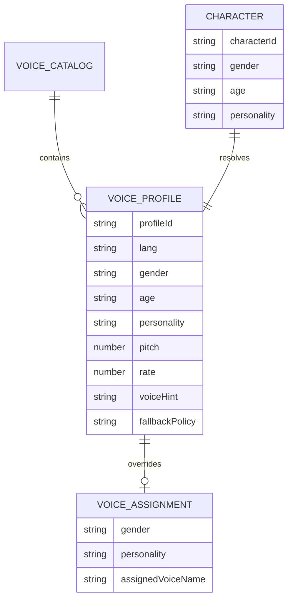

* [datIntf自訂語音診斷紀錄]：語音播放工程品質之診斷資料，供 [modScene模組] 記錄 Web Speech API 實際行為與平台限制。每筆紀錄至少包含播放來源、文字摘要、語言、要求 voice hint、實際 voice name/lang、pitch、rate、volume、queue 動作、是否呼叫 cancel、`start`／`end`／`error`／`boundary` 事件時間、錯誤代碼與 fallback 原因；此資料只判斷工程流程與降級狀態，不直接取代真人聽感驗證。

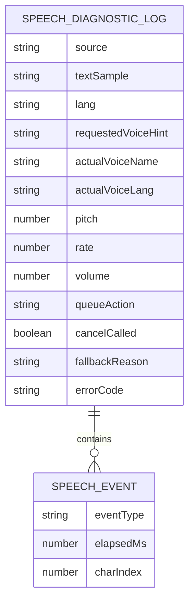

* [datIntf自訂版本沿革目錄]：作品版權宣告與歷次版本沿革。其**單一資料來源為根目錄 `VERSION`**（結構化 SSOT，見＜IV.A 版號與發佈＞）；`game-engine/build/version.js` 由 `VERSION` 投影生成（`node scripts/genVersion.mjs`），供 [modShell模組] 渲染 About 頁籤。含一筆版權宣告字串，與依時間新到舊排列的版本沿革清單（即 `VERSION.history` 中 `playerVisible:true` 之投影），每筆含版本標識、建置時間與中文短主旨；當前版號（版本卡）取 `VERSION.version`（SemVer），可能為 internal release，**不必等於沿革首筆**（internal／dev-only 改動不進玩家沿革）；About 頁籤至少呈現最近 10 筆玩家可見版本。

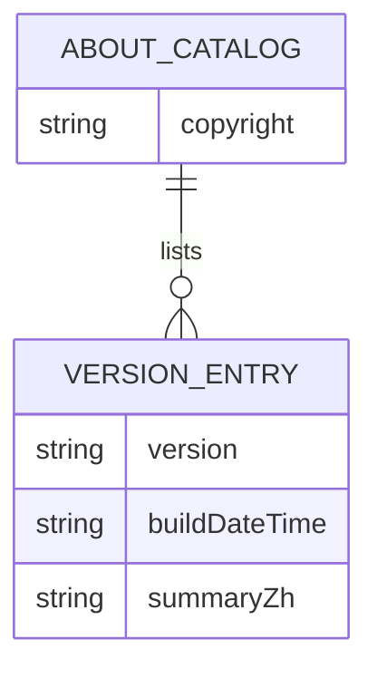

* [datIntf自訂玩家公主識別設定]：目前帳號的公主外觀、名字、識別色與背景花紋之單一狀態來源，供 [modShell模組] 渲染公主選單、帳號卡與人物資訊欄，並供 [modMap模組] 渲染地圖公主 token 半透明橢圓背版。profileColor 來自飽和度較低的粉彩色盤、初始化時一次性隨機抽得之色，或玩家以調色器自訂之色（以格式驗證、不限固定色盤白名單）；既有存檔之識別色相容保留、不被重置。backgroundPattern 來自背景花紋集，初始化時一次性隨機抽得或由玩家擇一；缺漏欄位只在新帳號／首次初始化時隨機補齊並保存，未知值才回退無花紋預設。

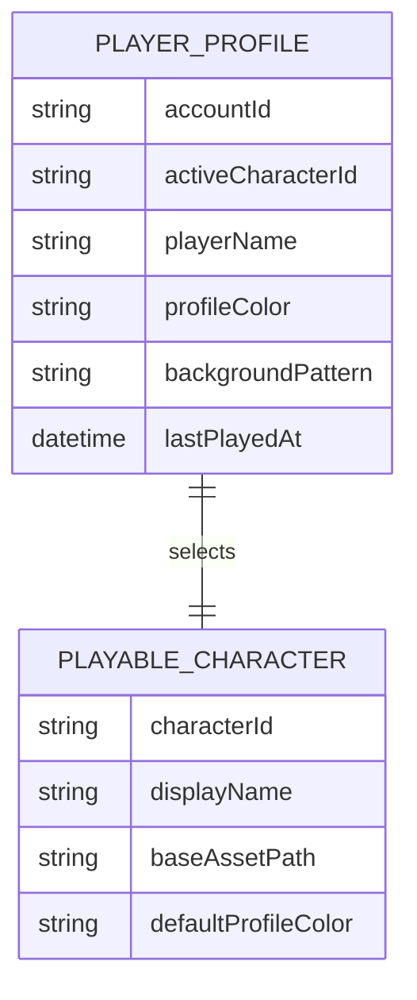

* [apiIntf自訂帳號存檔服務]：[sysGame系統]（[modState模組]）與 [sysApi系統] 之間之 HTTP JSON 介面（同源 `/api/*`，本 repo 自訂、不成檔，正式機器可驗契約 openapi.yaml 由 code 段隨 [sysApi系統] 交付）。端點高階表：
  * `POST /api/auth/register`：`{username, password}` → `201 {token, account}`；錯誤 `409 username-taken`／`422 invalid-username`／`422 password-too-short`／`403 registration-closed`（註冊開關關閉，spec#26）。
  * `POST /api/auth/login`：`{username, password}` → `200 {token, account}`（`account`＝`{id, username, role}`；時長政策不隨 login 搭載，由隨後之 `GET /api/save` 取得）；錯誤統一 `401 invalid-credentials`（不區分帳號不存在與密碼錯誤）。
  * `POST /api/auth/logout`：撤銷目前 session → `204`。
  * `GET /api/save`：一律 `200 {state, updatedAt, schemaVersion, serverTime, playLimitPolicy}`；無存檔時 `state`／`updatedAt`／`schemaVersion` 為 `null`（code 段落地修訂：原 204 無法附 body 攜 `serverTime`，收斂為單一 200 形態）；`playLimitPolicy` 為 `{locked, playMinutes, restMinutes, playMaxMinutes}`（spec#26 時長政策——未鎖定時 `locked:false` 且分鐘值為 `null`；政策與存檔資料分離，伺服器不改寫 `state.playLimit`，鎖定時由遊戲端以政策值為計時執行值）。
  * `PUT /api/save`：`{state, schemaVersion, baseUpdatedAt}` 整筆替換 upsert，`baseUpdatedAt` 與現存 `updatedAt` 樂觀比對——過期 `409 save-conflict`（不覆蓋較新進度）、成功 `200 {updatedAt, serverTime, playLimitPolicy}`（政策隨保存回應下發，使 admin 變更對遊玩中裝置即時生效）；`state` 非 JSON 物件或必要欄位型別非法時 `422 invalid-state`（#309 審查 B9，不落庫）。
  * `GET /api/config`：不受保護之公開設定最小子集 → `200 {registrationOpen, defaultPlayLimit}`（登入畫面之註冊開關＋新帳號初始時長之預設值來源，spec#26；不含任何帳號資料；code 段落地補列 `defaultPlayLimit`——新帳號初始進度由遊戲端建立、預設時長經此下發）。
  * 通則：除 register／login／config 外一律以 `Authorization: Bearer <token>` 驗 session（無效 `401`）；register／login 具速率限制／失敗退避（`429`，僅累計失敗嘗試、成功即清零）；請求體具大小上限（值 code 段定）；錯誤體統一 `{error:{code,message}}`；`/healthz` 不受保護供 liveness／readiness。
* [apiIntf自訂線上管理服務]：[etyCfg通用家長維護者]（`/admin/` 線上管理頁）與 [sysApi系統]（[modAdmin模組]）之間之 HTTP JSON 介面（同源 `/api/admin/*`，本 repo 自訂、不成檔）。管理登入沿用 `POST /api/auth/login`（僅 `role=admin` 帳號之 token 可通過下列端點），端點高階表：
  * `GET /api/admin/accounts`：全部帳號清單 → `200 {accounts:[{id, username, role, createdAt, lastLoginAt, saveUpdatedAt, playLimitPolicy, playStatus}]}`（`playStatus`＝目前可玩／休息狀態摘要，由存檔之遊玩／休息時戳推導）。
  * `POST /api/admin/accounts/:id/reset-password`：`{newPassword}`（沿 spec#23 密碼規則）→ `204`；重雜湊並撤銷該帳號全部 session（`:id` 為操作者自身時保留當前 session）。
  * `POST /api/admin/accounts/:id/revoke-sessions`：撤銷該帳號全部 session → `204`。
  * `DELETE /api/admin/accounts/:id`：刪除帳號連同存檔與全部 session（同一交易）→ `204`；`:id` 為 admin 自身時拒絕（`409 cannot-delete-self`，防自鎖）。
  * `PUT /api/admin/accounts/:id/play-limit`：`{locked, playMinutes, restMinutes, playMaxMinutes}` 設定該帳號時長覆寫與鎖定（分鐘值驗 spec#9 合法區間且 `playMinutes ≤ playMaxMinutes`，違者 `422`；`locked:false` 即解除）→ `200`。
  * `GET /api/admin/settings`／`PUT /api/admin/settings`：執行期設定讀寫 → `200 {registrationOpen, defaultPlayMinutes, defaultRestMinutes, defaultPlayMaxMinutes}`（明確欄位 schema；PUT 驗值域含 `playMinutes ≤ playMaxMinutes`、寫入即生效；單 admin、後寫勝）。
  * 通則：一律 `Authorization: Bearer <token>` 且 `role=admin`（未帶或無效 `401`、非 admin `403 admin-only`）；admin 登出沿用 `POST /api/auth/logout`；錯誤體統一 `{error:{code,message}}`；玩家資料以參數化查詢存取、回應不含 passwordHash 等敏感欄位。
* [datIntf自訂玩家帳號紀錄]：[sysApi系統] 之持久化資料模型（PostgreSQL，依 [techItem資料庫]；欄位型別與約束由 code 段 migration 落地）。帳號一對多 session、一對一存檔；密碼僅存 bcrypt 雜湊；存檔 state 為 JSONB 全量（遊戲端 normalized state 原樣），伺服器不拆欄位、不改寫語意。自增量 #310：帳號帶 `role`（`player`／`admin`）與時長政策欄位（維護者對該帳號之覆寫與鎖定，spec#26；未鎖定時為空值）、`lastLoginAt` 供管理頁清單；執行期設定為單列 SETTINGS（明確欄位 schema，缺列或缺值以程式預設遞補、部署升級零遷移）。

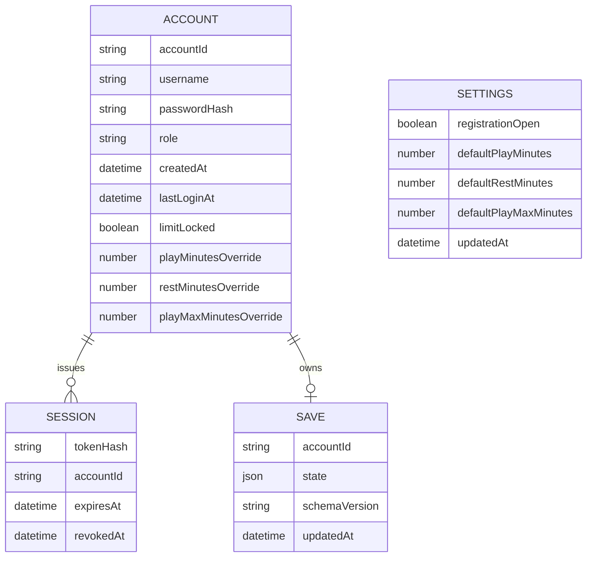

* [hmiIntf自訂登入註冊頁]（遊戲殼玩家端，本 repo 自訂、不成檔）：遊戲入口之登入／註冊畫面，沿用遊戲既有童話手繪粉彩視覺（非管理網站規範）；**手機直向為第一視口**——帳號卡單欄堆疊、點卡就地展開密碼欄，桌機寬視口卡片可並排（參考稿為桌機構圖、直向依本文字規格）。版面三塊——(a) 本裝置最近帳號卡列（沿用既有帳號卡：頭胸照、識別色半透明鋪底，主標 playerName、副標 `username` 以辨重名，最近遊玩、coins、可玩／休息狀態），點選展開該卡之密碼欄與「進入」鈕；本裝置無任何帳號卡時（全新裝置／全新伺服器）以空狀態呈現：預設聚焦「建立新帳號」表單並附一句兒童友善引導文案；(b)「其他帳號」與「建立新帳號」切換（帳號、密碼大欄位、密碼欄具顯示／隱藏切換、錯誤就地紅字提示、家長協助輸入情境）；(c) 本裝置偵測到舊版本機帳號時顯示「匯入本機舊進度」遷移入口（intTest#74）。**頁上所有可點入口（含帳號卡、切換鈕、遷移入口）觸控目標一律 ≥44px**。自增量 #310（spec#26）：註冊開關關閉時本頁不渲染「建立新帳號」入口（含空狀態之註冊表單），改顯示一句兒童友善說明；公開設定查詢失敗時以註冊開放為預設。參考稿見 [docs/design-visual/page-login.svg](design-visual/page-login.svg)（設計期參考、以文字規格為準）。

* [hmiIntf自訂線上管理頁]（維護者線上管理，本 repo 自訂、不成檔）：`/admin/` 線上管理介面（spec#25／spec#26），屬「管理網站／CRUD」介面、綁定 [hmiIntf通用視覺規範] 之 MD3 基座（沿用 [tool/theme-md3.css] 既有主題 token、不重生主題；支援深色模式；觸控目標 ≥44px，桌機與行動裝置皆可用）。外殼採 Top App Bar（左：站名「Luminara 管理」；右：目前 admin 帳號與登出鈕）＋雙分頁導覽（帳號／設定；頁少不設 Nav Drawer，窄視口以 top tabs 呈現）；**行動裝置（家長手機直向）為常用視口**——帳號頁表格降級為卡片列、dialog 於窄視口全寬呈現，全頁操作觸控目標 ≥44px。具名頁三張：
  * **[管理登入頁]**（`/admin/`，未帶有效 admin session 時）：置中單卡登入表單——帳號、密碼（具顯示／隱藏切換）、登入鈕；錯誤就地提示（統一「帳號或密碼不正確」）；非 admin 帳號登入成功但無管理權時明示「此帳號無管理權限」並不進入管理內容；卡下附一行指引「維護者忘記密碼之離線重設方式見產品手冊」。參考稿見 [docs/design-visual/page-admin-login.svg](design-visual/page-admin-login.svg)。
  * **[管理帳號頁]**（分頁「帳號」，登入後預設頁）：全部帳號之清單表格（帳號、role 徽章、建立時間、最近登入、存檔更新、目前可玩／休息狀態、時長政策摘要——格式定為 `鎖定 玩X/休Y/上限Z` 或 `玩家自調`），每列操作採**主操作＋溢出選單**收納（MD3 列操作慣例）：主操作「重設密碼」（dialog 輸入新密碼、沿 spec#23 規則就地驗證；自身列即變更自身密碼、明示其他裝置將登出）＋ `⋮` 選單收「時長覆寫與鎖定」（dialog：鎖定開關＋遊玩／休息／上限分鐘欄位，驗 1–120 且遊玩 ≤ 上限）、「撤銷 session」（輕量確認）、「刪除帳號」（error 色、二次確認 dialog 明示不可復原且連同存檔刪除）；admin 自身列僅主操作、不出現 `⋮` 選單。操作結果以 snackbar 回饋（成功自動消散、失敗持留說明）。窄視口卡片列：首行帳號＋role 徽章、次行摘要（最近登入／存檔更新／時長政策），卡右上 `⋮` 同選單。參考稿見 [docs/design-visual/page-admin-accounts.svg](design-visual/page-admin-accounts.svg)。
  * **[管理設定頁]**（分頁「設定」）：執行期設定表單——註冊開關（switch＋一句影響說明）、新帳號預設遊玩／休息／上限時長（數值欄位＋合法區間提示，遊玩 ≤ 上限）；**整頁表單統一「儲存設定」一鈕寫回**（switch 亦屬表單之一部分、非即切即存），任一未儲存變更時離頁／切分頁前警示（dirty guard，沿 spec#22 慣例）；儲存即生效、成功 snackbar；頁尾註記服務版本（About 資訊）、產品手冊（使用說明）連結與「內容編修請用管理設定工具（dev 環境）」之職能分界說明。參考稿見 [docs/design-visual/page-admin-settings.svg](design-visual/page-admin-settings.svg)。
  * 以上參考稿均為設計期參考（桌機構圖）、以文字規格為準（含窄視口規格；code 段以實際截圖替換 README 對應圖）。

* [hmiIntf通用視覺規範]（管理網站規範）：[管理設定工具]（`tool/wardrobe-tuner.html`，dev-only 內容編修）與 [hmiIntf自訂線上管理頁]（`/admin/`，線上營運管理，spec#25／spec#26）皆屬「管理網站／CRUD」介面，其元件與視覺通則綁定本契約之 `通用性規範` 與 `專用性規範-管理網站`（MD3 基座）；品牌主題 token 以遊戲識別色（低飽和粉彩色盤）為種子，記於 [docs/design-visual](design-visual/)、經 Material Theme Builder 生成定本後唯讀引用、不重生。工具頁面樹（sitemap）依內容資料包分兩層，各既有管理頁歸入其所屬資料包節點：
  * 公主：公主登記／外觀資產、公主起始
  * 衣物：衣物單品與投影對位、衣櫃分類
  * 地圖與場景：世界地圖 → 各地區（地圖座標）→ 地點/場景（背景、NPC）→ 對話（打工／聊天題庫）
  * 聲音：裝置語音指定、角色音色宣告
  * 遊戲規則：遊玩時間限制等
  * 視覺收斂範圍（本增量）：導覽、外殼與本次動到之頁依本規範收斂並過 GATE §5C 逐頁審查；其餘既有面板之全面 restyle 依 §5C 分級以 `後續辦理` 漸進。

# III. 測試規格

本章測試規格對應＜II. 設計分析＞的架構項目、運作個案與重點組態，驗證工程設計是否成立；[spec#N] 的部署後成效不在本章直接宣稱達成，改於＜IV. 部署成效＞回頭評估。方案層 productReadme 視為自然語言操作腳本，須可供自然人閱讀，也可供 AI Agent 依步驟執行、驗證與回報。

## A. 模組層級：測試建議

* **單元測試**
  * 所有自製[comp組件]必須進行函數單元測試。
  * 測試涵蓋度必須達到80%以上。
  * 測試案例必須聚焦於各組件內部邏輯的正確性與錯誤處理。
  * 測試案例不應涉及跨組件協作或整體流程驗證。

## B. 系統層級：測試建議

* **靜態介面測試**
  * comIntf
  * apiIntf
  * hmiIntf
  * datIntf
* **靜態組態測試**
  * etyCfg
* **遞增整合測試**
  * setAct
  * runAct

## C. 方案層級：組態測試(etyCfg)

| 代號 | 測試對象 | 通過判定 |
|---|---|---|
| cfgTest#01 | [etyCfg通用兒童玩家] | 玩家角色組態符合契約規範 |
| cfgTest#02 | [etyCfg通用家長維護者] | 維護者角色組態符合契約規範 |
| cfgTest#03 | [etyCfg通用自架主機平台] | 自架主機部署組態符合契約規範 |
| cfgTest#04 | [etyCfg自訂sysGame組態] | 系統部署與選型組態符合契約規範 |
| cfgTest#05 | [etyCfg自訂modContent組態] | 內容包預設與 registry 組態符合契約規範 |
| cfgTest#06 | [etyCfg自訂modState組態] | 儲存鍵與存檔標記組態符合契約規範 |
| cfgTest#07 | [etyCfg自訂modScene組態] | 英文練習、中文協助與獎勵組態符合契約規範 |
| cfgTest#08 | [etyCfg自訂modWardrobe組態] | wardrobe 類別級 layer bounds 與素材限制組態符合契約規範 |
| cfgTest#09 | [etyCfg自訂devServer組態] | dev server 監聽位址與端口組態符合契約規範 |
| cfgTest#10 | [etyCfg自訂sysApi組態] | 帳號規則、密碼雜湊、session 時效與資料庫連線組態符合契約規範 |
| cfgTest#11 | [etyCfg自訂sysApi組態] | admin 起始帳號（paramAdminBootstrap）與執行期設定程式預設（paramRegistrationOpenDefault、paramDefaultPlayLimit）組態符合契約規範 |

## D. 方案層級：整合測試(setAct/runAct)

### 初始部署設定相關 setAct

#### intTest#01-驗證 [setAct自訂維護者部署網站]

* 既有基底：無。
* 新增項目：[sysApi系統]自架服務（遊戲殼＋API＋資料庫）之本機／區網部署。
* 步驟：
  1. 以 docker compose（node 服務＋PostgreSQL）或等效方式啟動自架服務，供給 `DATABASE_URL` 與 `SESSION_SECRET`。
  2. 以瀏覽器開啟服務 URL。
  3. 請求 `/healthz`。
* 預期結果：
  1. 遊戲殼載入成功，index.html 與 game-engine ES module 無 404、入口為登入畫面。
  2. `/healthz` 回 200；`/api/*` 端點可回應（未帶 session 之受保護端點回 401）。

#### intTest#02-驗證 [setAct自訂維護者擴充內容]

* 既有基底：intTest#01。
* 新增項目：[sysGame系統]之新增內容包。
* 步驟：
  1. 新增一個 area、wardrobe 或 character 內容包並於對應 registry 匯入。
  2. 重新載入遊戲。
* 預期結果：
  1. 新內容出現於對應地圖、商店或選角，且既有內容不受影響。

#### intTest#03-驗證 [setAct自訂維護者移除部署]

* 既有基底：intTest#01。
* 新增項目：自架服務之停用與資料保全。
* 步驟：
  1. 停止自架服務與資料庫容器（保留資料卷）。
  2. 重新啟動自架服務。
* 預期結果：
  1. 停用後服務 URL 不再提供遊戲，且本機開發環境不受影響。
  2. 重新啟動後既有帳號與雲端存檔仍在（資料卷持久化）。

#### intTest#04-驗證 [setAct自訂玩家匯入存檔]

* 既有基底：intTest#01。
* 新增項目：[sysGame系統]之 Markdown 存檔匯入為登入帳號之雲端進度。
* 步驟：
  1. 登入一個帳號，於 Save/Load 介面貼入先前匯出的 Markdown 存檔並載入。
  2. 於另一瀏覽器（或清除本機狀態後）以同帳號重新登入。
* 預期結果：
  1. coins、outfit、diary、所在位置、角色與名字均還原正確。
  2. 匯入結果已成為該帳號之雲端存檔：他處登入同帳號所見進度一致。

### 加入[sysGame系統]相關 runAct

#### intTest#05-驗證 [runAct自訂玩家答英文題]

* 既有基底：intTest#01。
* 新增項目：[sysGame系統]之答題行為。
* 步驟：
  1. 進入具 lesson 的地點，選出正確英文選項。
* 預期結果：
  1. 顯示答對回饋並增加 coins 與學習紀錄。

#### intTest#06-驗證 [runAct自訂玩家地圖導航]

* 既有基底：intTest#05。
* 新增項目：[sysGame系統]之地圖導航行為。
* 步驟：
  1. 由地區地圖經 gate 回世界地圖，再進入另一地區 entry node。
* 預期結果：
  1. 場景切換至目標地區，玩家位置與 playerNode 一致。

#### intTest#07-驗證 [runAct自訂玩家購買衣物]

* 既有基底：intTest#05。
* 新增項目：[sysGame系統]之購買行為。
* 步驟：
  1. 於商店以足夠 coins 購買一件商品。
* 預期結果：
  1. coins 正確扣除，商品標記為 owned。

#### intTest#08-驗證 [runAct自訂玩家換裝]

* 既有基底：intTest#07。
* 新增項目：[sysGame系統]之換裝行為。
* 步驟：
  1. 於衣櫃穿戴已擁有商品。
* 預期結果：
  1. 紙娃娃 outfit 更新且互斥 slot 正確處理；公主立繪為共用 `body` ＋ per-character `head` 合成、不得出現黑底；更換衣物後舊衣層卸下、`body` 永久底著為 floor 不殘留，穿戴髮型 layer 須完全覆蓋 `head` 預設髮、卸下後復原。
  2. 已穿戴商品依其 item type／slot 套用 `wardrobeLayerBoundsByType` 類別級 layer bounds；`data-audit` 會檢查 layer type、render bounds、`safeBox` 與 PNG／WebP bitmap 限制，且未出現單件專用 CSS nudge 或未登記的一次性位移。
  3. 換裝模型維持單品單層：每件已穿戴 wardrobe item 至多產生一個外觀層、layer slot 不含 outerBack，且不存在 type 為 outfitSet 之整套綁定商品（無 outfit set、無 outer 前後雙層）。

#### intTest#09-驗證 [runAct自訂玩家退款]

* 既有基底：intTest#07。
* 新增項目：[sysGame系統]之退款行為。
* 步驟：
  1. 於退款介面退回一件已擁有商品。
* 預期結果：
  1. coins 回補，商品取消 owned 且不再可穿戴。

#### intTest#10-驗證 [runAct自訂玩家選角命名]

* 既有基底：intTest#01。
* 新增項目：[sysGame系統]之選角命名行為。
* 步驟：
  1. 於選角畫面選定外觀、輸入名字並選擇識別色後確認。
* 預期結果：
  1. activeCharacterId、playerName 與 profileColor 更新，遊戲內稱呼與人物資訊隨之改變，且 Lumi、Yumi、Rosa 三位可玩公主在選角畫面可辨識（sol／Mary 已於 spec#19 自 roster 移除，見 intTest#61）。

#### intTest#11-驗證 [runAct自訂系統保存進度]

* 既有基底：intTest#07。
* 新增項目：[sysGame系統]之自動雲端保存行為。
* 步驟：
  1. 登入後進行任一會改變狀態的操作（含答題結算、購買、換裝等關鍵事件），等待節流窗口後重新整理頁面。
* 預期結果：
  1. coins、outfit 與位置等狀態自伺服器雲端存檔還原（瀏覽器本機儲存不再為進度來源）；關鍵事件即時寫入、一般變更依 paramSaveDebounceMs 節流。

#### intTest#12-驗證 [runAct自訂系統還原進度]

* 既有基底：intTest#11。
* 新增項目：[sysGame系統]之缺漏正規化行為。
* 步驟：
  1. 載入缺少 activeCharacterId、profileColor 或含未知 item 的存檔。
* 預期結果：
  1. 缺漏欄位回退安全值；缺 profileColor 或 backgroundPattern 時補入合法集合中的初始化值並持久化，未知 item 被移除或回退，狀態不變量（coins 非負、裝備指向已擁有物）成立。

#### intTest#13-驗證 [runAct自訂玩家登入帳號]

* 既有基底：intTest#01。
* 新增項目：[sysGame系統]之進入時登入行為（裝置最近帳號卡＋密碼）。
* 步驟：
  1. 在本裝置曾登入過至少一個帳號的狀態下啟動遊戲，於登入畫面點選一張帳號卡並輸入正確密碼。
  2. 另以錯誤密碼嘗試登入同一帳號。
  3. 以「其他帳號」輸入一個未在本裝置登入過的既有帳號登入。
* 預期結果：
  1. 帳號卡顯示該帳號頭胸部大頭照、背景識別色、最近遊玩時間、coins 與可玩／休息狀態；登入後載入該帳號雲端進度並進入遊戲，coins、穿搭、所在位置與 profileColor 與該帳號一致。
  2. 錯誤密碼統一就地顯示「帳號或密碼不正確」，不進入遊戲、不洩漏帳號存在性。
  3. 未在本裝置出現過之帳號可經「其他帳號」登入，登入後其帳號卡加入本裝置最近帳號摘要。

#### intTest#14-驗證 [runAct自訂玩家註冊帳號]

* 既有基底：intTest#01。
* 新增項目：[sysGame系統]之註冊帳號行為與規則同源驗證。
* 步驟：
  1. 於登入畫面切換「建立新帳號」，分別嘗試：非法帳號格式（大寫、過短、特殊字元）、過短密碼（<6）、已存在帳號。
  2. 以合法帳號與密碼完成註冊。
* 預期結果：
  1. 非法輸入於前端就地擋下且提示友善；繞過前端直呼 API 亦被後端擋（422／409），錯誤碼可辨。
  2. 註冊成功即自動登入、建立乾淨初始進度（coins 為預設、無 owned、無穿搭）且不影響其他帳號；profileColor 與 backgroundPattern 於建立時自合法集合一次性隨機寫入，重新整理後不重抽。

#### intTest#15-驗證 [runAct自訂玩家登出帳號]

* 既有基底：intTest#14。
* 新增項目：[sysGame系統]之登出行為與玩家端無刪除入口。
* 步驟：
  1. 登入後改變任一狀態，隨即登出。
  2. 檢視登入畫面與遊戲內選單是否存在刪除帳號入口。
  3. 以登出前之 session token 直呼受保護 API。
* 預期結果：
  1. 登出前完成一次即時雲端保存，回到登入畫面；重新登入後狀態為登出前最新。
  2. 玩家端無刪除帳號入口（帳號刪除屬維護者作業、於增量 #310 提供）。
  3. 已登出之 token 一律 401（session 已撤銷）。

#### intTest#16-驗證 [runAct自訂玩家調整遊玩限制]

* 既有基底：intTest#13。
* 新增項目：[sysGame系統]之遊玩／休息時長設定與持久化。
* 步驟：
  1. 以一個帳號進入遊戲，確認每次遊玩與休息時長預設各為 15 分鐘。
  2. 於設定將每次遊玩與休息時長改為非預設值並儲存。
  3. 重新整理頁面並以同一帳號進入。
* 預期結果：
  1. 設定值套用且重整後仍保留，僅作用於該帳號，其他帳號維持各自設定。

#### intTest#17-驗證 [runAct自訂系統遊玩計時消耗]

* 既有基底：intTest#16。
* 新增項目：[sysGame系統]之遊玩時間預算隨真實時間遞減行為。
* 步驟：
  1. 將每次遊玩時長設為極短測試值後進入遊戲並停留於遊玩畫面。
  2. 等待設定時長經過。
* 預期結果：
  1. 該帳號的遊玩時間預算隨真實經過時間遞減至 0，人物資訊欄以本次可玩時間額度與剩餘可玩時間呈現，不以百分比作為主要資訊。

#### intTest#18-驗證 [runAct自訂系統時間到結算]

* 既有基底：intTest#17。
* 新增項目：[sysGame系統]之時間到自動結算行為。
* 步驟：
  1. 接續 intTest#17，待遊玩時間預算遞減至 0。
* 預期結果：
  1. 自動顯示本回合成果結算畫面，含本回合獲得金錢、答題數與答題正確度，並提供返回初始帳號／公主選單的按鈕。

#### intTest#19-驗證 [runAct自訂系統休息鎖定]

* 既有基底：intTest#18。
* 新增項目：[sysGame系統]之休息鎖定與屆滿解鎖行為。
* 步驟：
  1. 接續 intTest#18 結算後，於休息時長屆滿前嘗試續玩。
  2. 於休息時長屆滿前按返回初始選單，再選回同一帳號。
  3. 等待休息時長屆滿後再次嘗試續玩。
* 預期結果：
  1. 休息時長屆滿前遊玩入口被鎖定、不可續玩。
  2. 返回初始選單不會清除 restUntil；選回同一帳號仍維持休息鎖定。
  3. 休息時長屆滿後解鎖，可重新開始遊玩。

#### intTest#20-驗證 [runAct自訂玩家取用中文協助]

* 既有基底：intTest#05。
* 新增項目：[sysGame系統]之題目與選項中文撥放行為。
* 步驟：
  1. 進入具 lesson 的地點，於題目按下中文撥放，再於任一選項按下中文撥放。
  2. 載入一個缺中文欄位的 lesson 後重試。
* 預期結果：
  1. 題目與該選項以中文語音撥放；可用 voice 清單存在時優先採 `zh-TW`，其次 `zh`，最後 default voice。
  2. 缺中文欄位時降級為僅英文撥放，不報錯；若缺中文 voice，仍可發聲並在 [datIntf自訂語音診斷紀錄] 登記 `language-unavailable` 或 fallback reason。

#### intTest#21-驗證 [runAct自訂系統結算協助獎勵]

* 既有基底：intTest#20。
* 新增項目：[sysGame系統]之獎勵階梯結算行為。
* 步驟：
  1. 不按中文，第一次即選出正確選項。
  2. 另一題不按中文，先答錯一次、第二次選出正確選項。
  3. 另一題先按中文撥放再答對，或連續答錯兩次後第三次才答對。
* 預期結果：
  1. 第一次答對且未用中文：發全額 coins。
  2. 第二次答對且未用中文：發半額 coins（paramRewardSecondTryRatio）。
  3. 曾用中文或第三次起答對：不發 coins；旗標與次數於換題後重置。

#### intTest#22-驗證 [runAct自訂系統角色配音]

* 既有基底：intTest#01。
* 新增項目：[sysGame系統]之依角色音色配音行為。
* 步驟：
  1. 進入兩個角色特性宣告不同的場景，分別觸發其對白或場景開場語音。
* 預期結果：
  1. 各角色之語音以 [datIntf自訂角色音色目錄] 中其特性對應之音頻參數（pitch／rate／voice hint）建構，兩者 profile 參數不相同。
  2. [datIntf自訂語音診斷紀錄] 登記每次實際採用 voice name/lang、pitch、rate、queue action 與 fallback reason；未指定使用者語音且瀏覽器不支援差異 voice 時，測試仍須揭露「profile 不同但 actual voice 相同」的降級事實；若已為對應（性別×性格）類型指定語音，actual voice 應依指定而不同。

#### intTest#23-驗證 [runAct自訂系統公主朗讀作答]

* 既有基底：intTest#05。
* 新增項目：[sysGame系統]之公主朗讀所選選項行為。
* 步驟：
  1. 於答題畫面選定一個選項。
* 預期結果：
  1. 系統以目前玩家公主之音色朗讀所選選項，語音文字為該選項、音頻參數為該公主 profile；語音開關關閉時不發聲。

#### intTest#24-驗證 角色配音缺特性降級

* 既有基底：intTest#22。
* 新增項目：[sysGame系統]之缺特性降級行為。
* 步驟：
  1. 為一個未宣告特性或特性值不在目錄的角色觸發配音。
* 預期結果：
  1. 以 paramDefaultVoiceProfile 之預設嗓音發聲，不丟出例外、流程不中斷，並在 [datIntf自訂語音診斷紀錄] 登記 `voice-unavailable` 或 `profile-fallback` 原因。

#### intTest#25-驗證 全域朗讀語速倍率

* 既有基底：intTest#22。
* 新增項目：[sysGame系統]之全域朗讀語速倍率套用行為。
* 步驟：
  1. 取兩個 rate 不同的角色音色 profile，分別計算其最終發聲語速。
* 預期結果：
  1. 各 profile 之最終發聲語速＝其 rate × paramSpeechRateScale，且 paramSpeechRateScale 基準為 `0.8`；兩者相對快慢順序維持不變。

#### intTest#26-驗證 跨地圖公主頭像一致顯示

* 既有基底：intTest#06。
* 新增項目：[sysGame系統]之跨地圖玩家頭像一致渲染與定位行為（含放大後尺寸與移除識別色背板）。
* 步驟：
  1. 依序進入世界地圖、城堡地圖與各地區地圖（urban／rural／wild）。
* 預期結果：
  1. 每張地圖皆出現可見的公主頭像，定位於該地圖目前玩家位置（世界地圖定位於目前目的地）；頭像較原放大約一倍，且不再以識別色橢圓背板標示（不渲染背板、亦不於地圖 token 套用 profileColor），仍維持清楚定位與圖地分離。

#### intTest#27-驗證 世界地圖走到再進入與途中略過

* 既有基底：intTest#26。
* 新增項目：[sysGame系統]之世界地圖「移動至目的地後進入」與「移動途中略過」行為。
* 步驟：
  1. 於世界地圖點選一個啟用的目的地，觀察公主頭像移動至該目的地座標後進入該地區。
  2. 另一次於頭像移動途中再次點選目的地。
* 預期結果：
  1. 頭像先移動到目的地座標，到達後才切換進入該地區場景。
  2. 移動途中再次點選即略過剩餘位移、立即進入該地區；停用之目的地（如 ocean）於兩種路徑皆不進入。

#### intTest#28-驗證 [runAct自訂玩家檢視關於資訊]

* 既有基底：intTest#01。
* 新增項目：[sysGame系統]之 About 頁籤呈現版權宣告與版本沿革行為。
* 步驟：
  1. 開啟設定選單並切換至 About 頁籤。
  2. 讀取版本沿革資料源，比對其首筆版本與當前 buildInfo 版本，並檢查 Settings 頁籤是否仍有獨立版本卡。
* 預期結果：
  1. About 頁籤顯示版權宣告字串，並列出最近 10 個版本（或現有全部）的版本標識與中文短主旨。
  2. 版本沿革資料源非空且首筆版本與當前版本一致；Settings 頁籤不再出現獨立版本卡。

#### intTest#29-驗證 可玩公主 body＋head 分層合成與換裝不殘留

* 既有基底：intTest#08。
* 新增項目：[sysGame系統]之可玩紙娃娃共用 `body` ＋ per-character `head` 分層合成、頸部接縫對位、髮型完全覆蓋與舊存檔 starter 相容契約。
* 步驟：
  1. 載入 Lumi、Yumi、Rosa 三位可玩公主，各以共用 `body` ＋ 該角色 `head` 合成立繪。
  2. 對同一角色穿戴一件髮型 wardrobe item，再卸下，觀察 `head` 預設髮是否被完全覆蓋與復原。
  3. 對同一角色穿戴一件衣物 wardrobe item，再卸下，觀察 `body` 底著 floor 與舊衣殘留情形。
  4. 套用舊存檔之 `starterPajama`、`softBrownHair` 等相容項，檢查正規化後之預設外觀。
* 預期結果：
  1. 共用 `body` 與三張 per-character `head` 皆為 `512x768` 透明 WebP 並遵守 `shared-512x768-v1` 對位、無黑底；`head` 下緣與 `body` 頸部接縫連續對位（無縫隙、無重疊、膚色一致），腳底 baseline 與身高比例符合紙娃娃版型。
  2. 穿戴髮型 layer 時完全覆蓋 `head` 預設髮（含側／後髮、瀏海全輪廓、不露舊髮）、卸下後復原為預設髮；穿戴衣物時疊於 `body` 永久底著之上、卸下後不殘留舊衣，皆無雙重疊圖。
  3. `head` 承載各角色髮色與眼睛校準：Yumi 髮色呈深藍、[Yumi] 眼睛依使用者要求使用 Rosa 眼睛校準；`body` 底著、姿勢、比例、透明底與對位不變。
  4. 舊存檔 `starterPajama`／`softBrownHair` 等相容項正規化後得到正確預設外觀、不重複疊圖且不洗掉既有穿搭資料；`body`／`head` 來源為 GPT 產生或手工修圖之童話手繪風格 raster 素材，交付為 PNG／WebP，不得新增 SVG 角色素材、CSS 濾鏡改色或 renderer 特例。

#### intTest#30-驗證 三角色 roster 與舊存檔 sol→lumi 升級相容

* 既有基底：intTest#10、intTest#12、intTest#23。
* 新增項目：[sysGame系統]之三位可玩公主 roster、sol→lumi fallback 升級與可玩公主音色覆蓋。
* 步驟：
  1. 確認 `characterRegistry` 不含 `sol` 鍵；於選角畫面逐一選擇 `lumi`、`yumi`、`rosa`。
  2. 載入舊存檔中 activeCharacterId 為 `lumi`、`yumi`、`rosa` 的資料；再載入帶 `sol` id 之舊存檔。
  3. 對三位可玩公主各觸發一次公主朗讀作答。
* 預期結果：
  1. Lumi、Yumi、Rosa 依使用者指定角色方向對應，皆轉為透明 WebP，且不把黑底、禮服、皇冠或背景烘進 `body`／`head`；`characterRegistry` 中不含 `sol` 鍵。
  2. 舊存檔的 `lumi`、`yumi`、`rosa` 均正常載入；帶 `sol` id 之舊存檔讀取時 `normalizeState` fallback 為 `lumi`、不 crash 亦不殘留 sol 選項。
  3. `playableVoiceById` 對三個 id（`lumi`、`yumi`、`rosa`）皆能解析，`sol` 不再有對應 voice profile，缺瀏覽器 voice 時依既有規則降級。

#### intTest#31-驗證 公主識別色與大頭照一致渲染

* 既有基底：intTest#10、intTest#13、intTest#26。
* 新增項目：[sysGame系統]之 profileColor、粉彩色盤與調色器自訂、頭胸部大頭照共用渲染與卡片半透明底色，以及頭胸部大頭照與全身著裝同源同對位（即時穿搭衣物不錯位）。
* 步驟：
  1. 新增兩個帳號並記錄其初始化 profileColor 與 backgroundPattern。
  2. 重新整理後再次進入同兩個帳號，確認初始化主題是否重抽。
  3. 自粉彩色盤將其中一位公主改為另一識別色並確認，再以調色器自訂一個不在色盤內的色並確認。
  4. 為使用中帳號穿戴代表性 wardrobe item（含上衣／下身或洋裝、外套或配件類別）。
  5. 進入帳號選擇、遊戲人物資訊欄與世界地圖。
* 預期結果：
  1. 新帳號初始化 profileColor 來自約 8 種低飽和粉彩色合法集合，backgroundPattern 來自背景花紋合法集合；重整或再次載入同帳號時維持原值、不重抽。
  2. 公主選單、帳號卡與人物資訊欄皆以同一頭胸部裁切呈現大頭照（不顯示全身紙娃娃）；資訊欄與帳號卡之大頭照反映目前穿搭之即時衣著，公主選單呈現基本造型；且資訊欄／帳號卡之頭胸照大頭照與場景全身著裝同源同對位、所穿戴衣物不跑位（含著裝 bust 與空裝 bust 雙情境、四位可玩公主 body＋head 合成取景一致），不出現服裝錯位至臉部。
  3. 大頭照卡片底色為該帳號 profileColor 之半透明（約 paramCardBackgroundAlpha）鋪底；#161 後地圖公主 token 不再套用識別色背板，改由 intTest#26 驗證放大且無背板。
  4. 調色器自訂之色可被接受並保存（不被重置回色盤色）。

#### intTest#32-驗證 遊戲內返回初始選單

* 既有基底：intTest#13、intTest#16。
* 新增項目：[sysGame系統]之遊戲內回到初始帳號／公主選單行為。
* 步驟：
  1. 以一個帳號進入遊戲並改變 coins 或位置。
  2. 按遊戲內返回初始選單按鈕。
  3. 在初始選單改選另一帳號，再切回原帳號。
* 預期結果：
  1. 返回初始選單前會保存目前帳號進度與 lastPlayedAt。
  2. 可從初始選單切換帳號或調整公主設定。
  3. 切回原帳號時進度未重置，且休息鎖定狀態仍依該帳號獨立計算。

#### intTest#33-驗證 Web Speech voice 載入與語言 fallback

* 既有基底：intTest#20、intTest#22。
* 新增項目：[sysGame系統]之 Web Speech API voice 載入、`voiceschanged` 與語言 fallback 行為。
* 步驟：
  1. 模擬 `speechSynthesis.getVoices()` 初次回傳空陣列，之後觸發 `voiceschanged` 並提供 `zh-TW`、`zh`、`en-US`、`en` 與 default voice 清單。
  2. 分別觸發中文協助、英文題目撥放、NPC 配音與公主朗讀。
  3. 移除 `zh-TW` 或 `en-US` voice 後重試，並再模擬完全無相符語言 voice。
* 預期結果：
  1. voice 清單尚未載入時，系統不因空清單失敗；`voiceschanged` 後會更新可用 voice cache。
  2. 中文依 `zh-TW` → `zh` → default fallback；英文依 `en-US` → `en` → default fallback；角色 voice hint 僅作偏好，不硬綁單一 voice name。
  3. 每次發聲診斷均記錄 requestedLang、voiceHint、actualVoiceName、actualVoiceLang、voiceLoadState 與 fallback reason。

#### intTest#34-驗證 語音佇列與 cancel 策略

* 既有基底：intTest#20、intTest#23。
* 新增項目：[sysGame系統]之 `speechSynthesis.speak()` 佇列使用、replace-last 與 `cancel()` 使用邊界。
* 步驟：
  1. 快速連點題目英文、題目中文與選項英文撥放鈕。
  2. 對同一語音鈕連點以觸發重播，再關閉 Voice 開關。
  3. 以 spy 檢查 `speechSynthesis.cancel()` 呼叫時機，並收集 utterance `start`、`end`、`error`、`boundary` 事件。
* 預期結果：
  1. 一般連續撥放不會每次無條件先呼叫 `cancel()`；只在使用者明確停止、切換語音或同一語音重播時中斷既有 utterance。
  2. 快速連點採 paramSpeechDebounceMs 與 paramSpeechQueueMode=`replace-last` 收斂，避免上一段語音剛啟動即被下一段截斷。
  3. 診斷紀錄含 queue action、cancelCalled、event timings 與 callback completion；Voice 關閉時不發聲但流程完成。

#### intTest#35-驗證 語音診斷紀錄與錯誤降級

* 既有基底：intTest#33、intTest#34。
* 新增項目：[sysGame系統]之 Web Speech API 錯誤碼紀錄與不中斷降級。
* 步驟：
  1. 模擬 utterance error：`not-allowed`、`audio-busy`、`voice-unavailable`、`language-unavailable`、`interrupted`、`canceled`、`synthesis-failed`。
  2. 分別於中文協助、英文撥放與角色配音路徑觸發上述錯誤。
  3. 檢查畫面、答題狀態、獎勵旗標與語音診斷紀錄。
* 預期結果：
  1. 語音錯誤不造成遊戲崩潰、答題停住或獎勵旗標錯亂。
  2. `not-allowed`／autoplay 類錯誤會要求下一次使用者 click／tap 後再啟動語音，不依賴頁面載入自動發聲。
  3. 所有錯誤均記錄 error code、utterance source、requested text summary、language、actual voice、fallback action 與是否可重試。

#### intTest#36-驗證 [runAct自訂玩家生活聊天]

* 既有基底：intTest#05。
* 新增項目：[sysGame系統]之生活聊天答題與心情累加行為。
* 步驟：
  1. 進入有開啟生活聊天模組的場景（含商店場景），確認每題選項數後進行生活聊天並答對一題。
* 預期結果：
  1. 顯示答對回饋，心情值依 paramChatMoodReward 增加，且該題不發放 coins。
  2. 每題僅呈現 paramChatChoiceCount（2）個選項，且題幹為場景角色以第一人稱對公主發話、選項為公主可回應的話語（非 Pick／Tell 之 meta 指令）；公主回應為自然社交或情感回應，干擾選項屬同場景語域而非超現實荒謬句。

#### intTest#37-驗證 [runAct自訂系統心情延長遊玩]

* 既有基底：intTest#36、intTest#17。
* 新增項目：[sysGame系統]之心情換算延長當次遊玩時間且受護眼上限限制行為。
* 步驟：
  1. 以接近 paramPlayMaxMinutes 的遊玩時間預算進入有生活聊天的場景，連續聊天答對多題。
* 預期結果：
  1. 當次遊玩時間預算依心情值與 paramMoodMinutesPerPoint 延長，但不超過 paramPlayMaxMinutes 護眼上限；達上限後再答對不再延長。

#### intTest#38-驗證 [runAct自訂玩家打工任務]

* 既有基底：intTest#05。
* 新增項目：[sysGame系統]之打工任務答題與 coins 回饋行為。
* 步驟：
  1. 進入有開啟打工任務模組的場景，完成一題切合場景、含簡易數學或生活常識的任務並答對。
* 預期結果：
  1. 顯示答對回饋並依既有獎勵階梯發放 coins，且題目內容與該場景主體相符。
  2. 每題以 paramJobChoiceCount（3）個選項呈現；題幹為場景角色以第一人稱向公主提出之切合場景主體、且留予公主判斷或選擇空間之請求（求建議、做選擇、判斷或解法；排除純觀看、站位、寒暄或道別等不需公主決策之內容），不另設題組開場白旁白；三選項為公主對該請求之不同合理決策／建議／解法，彼此有別、皆屬同場景語域、非 Pick／Tell 之 meta 指令，無超現實或指涉英文字之 meta 敘述；正解須體現思考決策、不得為複述角色指令或其顯而易見動作／狀態之同義回覆（echo confirmation），可以自然語句開頭（合該地區英文分級，如「Sure thing」「OK, I can …」「Well, I think …」）；可由 selftest data-audit 以允收開頭清單、打工題請求性（題幹須留予公主決策、非純觀看／站位／寒暄／道別）與「正解非題幹複述」核對。

#### intTest#39-驗證 場景模組選擇性開啟

* 既有基底：intTest#02。
* 新增項目：[sysGame系統]之單一場景模板選擇性開啟生活聊天／逛店／打工任務模組。
* 步驟：
  1. 載入分別只開啟不同模組組合的場景設定（例如僅聊天、聊天＋打工、聊天＋逛店＋打工）。
  2. 進入各場景。
  3. 另載入商店場景與公主房／城門場景並進入。
* 預期結果：
  1. 各場景僅顯示其已開啟模組的互動入口，未開啟者不出現。
  2. 原商店場景的購買行為由 shop 模組旗標承接，無 kind:"shop" 特例殘留。
  3. 商店場景同時提供逛店與生活聊天入口；公主房（換裝）與城門（傳送）不提供生活聊天。

#### intTest#40-驗證 公主背景花紋設定與識別色相容

* 既有基底：intTest#31、intTest#11、intTest#12。
* 新增項目：[sysGame系統]之 backgroundPattern per-account 設定持久化與既有識別色相容。
* 步驟：
  1. 為目前帳號自背景花紋集擇一並確認，重新整理頁面後再以同一帳號進入。
  2. 另開一帳號設定不同背景花紋與識別色。
  3. 載入一筆 profileColor 為舊預設色盤色值（不在新粉彩色盤內）且無 backgroundPattern 的舊存檔。
* 預期結果：
  1. 所選背景花紋隨帳號持久化、重整後還原，且各帳號之背景花紋與識別色互不混用。
  2. 舊存檔之既有 profileColor 相容保留，不因改用粉彩色盤而被重置為角色預設色。
  3. 舊存檔缺 backgroundPattern 時補入合法初始化值並保存，未知 backgroundPattern 才回退無花紋預設，流程不報錯。

#### intTest#41-驗證 角色語音指定、繼承與缺 voice 降級

* 既有基底：intTest#22。
* 新增項目：[sysGame系統]之維護者語音指定（經 [管理設定工具] 聲音管理頁籤設定、device-wide）、性別繼承、未指定時依性別候選清單自動挑同性別 voice（#209）與指定 voice 缺失降級行為。
* 步驟：
  1. 以 mock 之 `getVoices()` 提供多個具名 voice（如 `David`、`Zira`、`Mark`），經 [管理設定工具] 聲音管理頁籤（或其同源持久化 API）為某（性別×性格）類型指定其一並儲存。
  2. 對同性別但未指定的另一性格類型觸發配音。
  3. 重新整理頁面後再觸發步驟 1 之類型配音。
  4. 將步驟 1 指定之 voice 自 `getVoices()` 移除後再觸發其配音。
  5. 清除所有語音指定後，分別對女性與男性角色觸發配音（mock voice 清單之語言清單第一個為男聲 `David`，預設項為 `Zira`）。
* 預期結果：
  1. 指定之類型以指定的 voice 發聲（actual voice name 與指定一致）。
  2. 同性別未指定之類型繼承該性別之指定 voice。
  3. 指定經 paramVoiceAssignmentKey 持久化，重整後仍生效。
  4. 指定 voice 於本機不存在時，依繼承（性別類型）、性別候選清單或語言優先 fallback 降級發聲，不丟例外，並於 [datIntf自訂語音診斷紀錄] 登記 fallback reason。
  5. 無任何語音指定時，女性角色挑到同性別女聲（`Zira`，非語言清單第一個的男聲 `David`）、男性角色挑到男聲（`David`／`Mark`），fallbackReason 為 `gender-default`；驗證系統不再以性別字串子字串比對 voice 名稱（#209 杜絕女角配到平台男聲）。

#### intTest#42-驗證 語音首字前置留白

* 既有基底：intTest#34。
* 新增項目：[sysGame系統]之送入 `SpeechSynthesisUtterance` 文字開頭固定前置留白行為。
* 步驟：
  1. 對英文題目、中文協助與角色配音各觸發一次發聲，攔截實際送入 utterance 的文字。
* 預期結果：
  1. 送入 utterance 之文字開頭含 paramSpeechLeadingPad 之固定前置留白；顯示於畫面之原文不受影響。
  2. 前置留白套用於所有經 speechManager 之發聲路徑，不改變後續字元與語意。

#### intTest#43-驗證 場景互動兩層導覽一致性

* 既有基底：intTest#39。
* 新增項目：[sysGame系統]之場景互動兩層動線（第二層返回回到第一層、第一層離開關閉冒險視窗回地圖）。
* 步驟：
  1. 進入同時開啟生活聊天與逛店的場景，於第一層場景選單進入生活聊天，答完一題或按返回。
  2. 自第一層場景選單分別進入逛店、退款、換裝（公主房）與提示等其餘第二層畫面後按返回。
  3. 回到第一層場景選單後按離開。
* 預期結果：
  1. 每個第二層畫面（含答題完成畫面）之返回都回到第一層場景選單、冒險視窗維持開啟，可於同次造訪續選同場景其他互動（如聊天後接著逛店）。
  2. 僅第一層場景選單之離開關閉冒險視窗、回到地圖。

#### intTest#44-驗證 離場語音收束

* 既有基底：intTest#06、intTest#34。
* 新增項目：[sysGame系統]之離開場景（關閉場景對話、切換場景或返回地圖）時對正在播放語音之收束與不跨場景殘留。
* 步驟：
  1. 進入場景觸發較長之角色配音或公主朗讀，於語音仍在播放（`speechSynthesis.speaking` 為 true）時離開場景（關閉場景對話、切換場景或返回地圖）。
  2. 以 spy 檢查 `speechSynthesis.cancel()` 呼叫時機與離場後 `speechSynthesis.speaking` 狀態，並收集語音診斷紀錄之 stop 來源。
  3. 離場後於另一場景或地圖等待，確認無上一場景語音續播。
* 預期結果：
  1. 離開場景時即時收束正在播放之語音，收束後 `speechSynthesis.speaking` 為 false，無跨場景殘留發聲。
  2. 語音診斷紀錄記錄該次 stop 來源為離場收束（cancelCalled 為 true），符合「Web Speech API 不支援進行中語句音量淡出時降級為即時停止」之設計。
  3. 收束不影響後續場景語音正常播放與既有語音開關行為。

#### intTest#45-驗證 場景內層級切換語音收束

* 既有基底：intTest#43、intTest#44。
* 新增項目：[sysGame系統]之場景內第一↔二層切換（自場景選單進入第二層子互動，或自第二層返回第一層場景選單）時對前段語音之即時收束與不跨層級殘留。
* 步驟：
  1. 進入場景於第一層觸發較長之角色配音或歡迎詞，於語音仍在播放（`speechSynthesis.speaking` 為 true）時進入第二層子互動（如生活聊天或逛店）。
  2. 於第二層觸發語音（如作答朗讀或 shop 招呼）後、語音仍在播放時，以一致返回操作回到第一層場景選單。
  3. 以 spy 檢查各切換點 `speechSynthesis.cancel()` 呼叫時機與切換後 `speechSynthesis.speaking` 狀態，並收集語音診斷紀錄之 stop 來源。
* 預期結果：
  1. 進入第二層與返回第一層之切換點，前段語音即時收束，切換後 `speechSynthesis.speaking` 為 false，無跨層級殘留發聲。
  2. 語音診斷紀錄記錄該次 stop 來源為場景內層級切換（cancelCalled 為 true）。
  3. 收束於當下情境語音 `speak()` 之前完成、未誤殺當下話題該播之語音；不影響既有語音開關與離場收束（intTest#44）行為。

#### intTest#46-驗證 場景歡迎詞每次造訪只播一次

* 既有基底：intTest#43、intTest#45。
* 新增項目：[sysGame系統]之同一場景歡迎詞依造訪態旗標僅於每次造訪播放一次。
* 步驟：
  1. 自地圖進入某場景（第一層），以 spy 記錄歡迎詞語音（場景開場之 NPC 語音）之 `speak` 呼叫次數。
  2. 進入第二層子互動後再返回第一層場景選單，重複數次。
  3. 自第一層場景選單離開回地圖，再次進入同一場景。
* 預期結果：
  1. 首次進入場景時歡迎詞 `speak` 呼叫一次。
  2. 造訪內進入第二層再返回第一層，歡迎詞 `speak` 不再被呼叫（仍正常渲染第一層選單與 `advLine` 文字）。
  3. 離場後再次進入同一場景，歡迎詞 `speak` 重新被呼叫一次（造訪態旗標於離場已重置）；公主房等本無歡迎詞之場景不受影響。

#### intTest#47-驗證 場景背景資產完整繪製

* 既有基底：intTest#02、intTest#06。
* 新增項目：[sysGame系統]之 ADV 場景背景資產完整性與 renderer 無補版特例。
* 步驟：
  1. 列出 [content-package/areas/*/assets/scenes/*-1024.webp] 全部 runtime 場景背景，讀取每張圖實際尺寸。
  2. 依 manifest 逐一進入對應場景，以手機直向與桌機視口各截圖一次，並輸出全場景 contact sheet。
  3. 檢查 sceneArt renderer 與場景 CSS 沒有針對個別場景新增 blur、frosted cover、上下延展或 fallback 背景圖規則。
  4. 將每張場景標記為「完整繪製」「合理景深」「需重繪」，其中「需重繪」只適用於上下區域以模糊或延展替代原本應繪製內容者。
* 預期結果：
  1. 全部 runtime 場景背景皆為 `1024x1024` WebP 且由 `sceneArt.src` 載入。
  2. 無 renderer 或 CSS 個別場景補版特例。
  3. 確認需重繪者已替換為完整繪製內容，或於測試輸出列明尚待重繪清單；合理景深不被誤列為缺陷。

#### intTest#48-驗證 角色立繪輪廓描邊與自然陰影

* 既有基底：intTest#08、intTest#10、intTest#14、intTest#26、intTest#47。
* 新增項目：[sysGame系統]之角色立繪透明輪廓描邊、自然陰影與互動狀態光暈分離。
* 步驟：
  1. 進入含 [NPC角色立繪] 的 ADV 場景，以手機直向與桌機視口各截圖一次。
  2. 進入可顯示 [公主紙娃娃]、[地圖token] 與 [頭胸照] 的畫面，以手機直向與桌機視口各截圖一次。
  3. 啟用試穿狀態，再截圖一次 [公主紙娃娃]。
  4. 檢查角色輪廓規則只使用透明素材 alpha 形成描邊與陰影，沒有新增場景背景式大範圍發光或個別角色 CSS 特例。
  5. 檢查試穿提示光暈只在試穿狀態出現，且不取代常態輪廓描邊。
* 預期結果：
  1. ADV NPC、公主紙娃娃、地圖 token 與頭胸照在複雜背景上皆可辨識人物外框。
  2. 常態效果包含貼合角色輪廓的深色描邊與簡潔深灰立體投影，沒有糊成不分輪廓的大範圍亮色光暈，且 ADV 公主立繪不呈現多層柔邊疊加而被讀為角色光暈或糊化腳底陰影。
  3. 試穿狀態光暈仍可辨識為互動提示，關閉試穿後不殘留。
  4. 多層 wardrobe layer 沒有因逐層陰影疊加造成過重髒邊；若瀏覽器對 background-image 的 `drop-shadow()` 表現不一致，測試輸出須列明受影響 surface 與降級方式。

#### intTest#49-驗證 圖像資產標準尺寸與檔重預算

* 既有基底：intTest#02、intTest#47。
* 新增項目：[sysGame系統]之全圖像資產標準尺寸與檔重預算 lint（檔案系統掃描全部 shipped 圖像檔，不只 registry／CSS 引用者）。
* 步驟：
  1. 以檔案系統 gate（scripts/assetLint.mjs）掃描 content-base/ 與 content-package/ 下全部圖像檔（含未被 registry／CSS 引用之 orphan 與裝飾資產），依 paramAssetStandards 類別歸類（角色／NPC base、wardrobe 單品 layer、ADV 場景、地區／世界地圖、地圖裝飾層、UI 等）；瀏覽器 data-audit 另對 registry 引用資產做 runtime 載入＋尺寸／檔重檢查。
  2. 對每張資產讀取實際像素尺寸與檔案位元組大小。
  3. 比對該類別標準：固定畫布類（地圖／場景／角色 base／UI）像素尺寸須等於標準值、長邊貼滿類（wardrobe 單品 512×512）像素尺寸須等於標準且 alpha 內容邊界長邊貼滿至少一對對邊、容於畫布類（地圖裝飾層）寬高須容於標準畫布；檔案位元組須不超出該類別檔重預算（maxKB）；並驗 wardrobe 單品之商店預覽 `image` 即其 `layers[0].src`（單一素材、無分離 `thumbs/` 縮圖殘留）。
  4. 將不符者標記為違規（尺寸不符、長邊未貼滿或檔重超標），未分類者報為漏網類別，具名豁免項另列。
* 預期結果：
  1. 每張資產之像素尺寸符合 paramAssetStandards 宣告之類別標準（固定畫布類等於、wardrobe fill 類等於且長邊貼滿、容於畫布類容於畫布）。
  2. 每張資產之檔案位元組不超出 paramAssetStandards 宣告之類別檔重預算；現存超標之過大圖檔已重壓縮至預算內，或列入具名豁免清單。
  3. content-base／content-package 下每個 shipped 圖像檔均歸入已登記類別、受尺寸與檔重把關（未分類即報漏網），無 orphan／CSS-only／裝飾資產逃逸 gate。
  4. wardrobe 單品之商店預覽 `image` 即其 `layers[0].src`（單一 `512×512` 素材），content-package/wardrobe 下無分離 `thumbs/` 縮圖殘留。

#### intTest#50-驗證 視口留白模糊鋪底

* 既有基底：intTest#06、intTest#26、intTest#47。
* 新增項目：[sysGame系統]之固定比例內容於桌機／寬視口之 letterbox 留白模糊鋪底，且不遮蔽內容區、不攔截互動。
* 步驟：
  1. 以桌機寬視口（容器比例與內容比例明顯不一致）依序載入城堡地圖、世界地圖與一個 ADV 場景，各截圖一次。
  2. 取每張畫面內容區外之 letterbox 留白取樣，比對其是否為該畫面背景圖之模糊放大版（而非純色／漸層空白）。
  3. 檢查內容區（地圖圖／場景藝術）本身未被模糊或遮蔽、仍完整清楚。
  4. 於地圖 letterbox 區域與內容邊界點擊 hotspot／marker 並拖曳地圖，檢查鋪底層 `pointer-events: none`、不攔截互動。
  5. 以手機直向視口載入同畫面，檢查內容填滿、無明顯留白且無鋪底殘影或破版。
  6. 檢查地圖與 ADV 共用同一鋪底機制與樣式常數，無逐畫面各自硬寫之鋪底特例。
* 預期結果：
  1. 桌機／寬視口下，內容區外 letterbox 留白以該畫面背景圖之模糊放大版鋪滿，無純色空白邊。
  2. 內容區本身維持完整、清楚、未被模糊或遮蔽（與 intTest#47 場景背景補版禁制不衝突）。
  3. 鋪底層位於內容層之下且不攔截事件，地圖 hotspot／marker 點擊與拖曳正常。
  4. 手機直向視口內容填滿、無明顯留白與鋪底破版。
  5. 地圖與 ADV 場景共用單一鋪底機制與樣式常數，無逐畫面硬寫特例。

#### intTest#51-驗證 公主房單一換裝入口與穿脫切換

* 既有基底：intTest#07、intTest#08。
* 新增項目：[sysGame系統]之公主房第一層單一「換裝」入口（一般場景樣式）、衣櫃沿用商店同一多欄貨架面板之 wear-only 穿脫切換（深粉紅動作鈕），及商店逛店不受影響。
* 步驟：
  1. 進入公主房場景，檢視第一層場景選單按鈕集合與「換裝」入口鈕外觀。
  2. 點擊「換裝」入口，檢查開啟之右側衣櫃面板版型（mode `wardrobe`）。
  3. 於衣櫃面板對一件已擁有衣物按動作鈕穿上，再按一次同一鈕。
  4. 於衣櫃面板按返回回到第一層場景選單，再按 Leave。
  5. 另進入一個商店場景，開啟逛店面板並試穿、購買一件商品。
* 預期結果：
  1. 公主房第一層僅出現單一「換裝」入口與 Leave，且「換裝」入口鈕沿用一般場景選單樣式（**不**為深粉紅），無昔日逐分類（Hair／Tops／…）攤平之專用表單。
  2. 「換裝」開啟之衣櫃面板與商店逛店面板為**同一套多欄貨架機制**（同一 `renderAdvShop`、依類別分欄、無上方類別分頁），且**版面情境一致**——衣櫃與商店共用 `data-mode="shop"` 之貨架版面（貨架容器 `display:flex`、各類別欄水平並排，非單欄垂直堆疊），公主房以 `.adv-closet` 標記僅承載 wear-only 差異；公主房面板列已擁有衣物且不含試穿與購買鈕。
  3. 已擁有衣物之動作鈕為穿脫切換且為**深粉紅**：穿上後鈕字為「脫下」、紙娃娃穿上該件；再按即脫下、紙娃娃卸下且不殘留。
  4. 衣櫃面板返回回到第一層場景選單、Leave 回到城堡地圖，冒險視窗開闔一致。
  5. 商店逛店之多欄貨架、試穿、購買與退款行為不受公主房 closet 變更影響、照常運作，且商店購買鈕非深粉紅。

#### intTest#52-驗證 服裝類型精簡與既有存檔遷移

* 既有基底：intTest#08、intTest#11、intTest#51。
* 新增項目：[sysGame系統]之服裝類型精簡——衣櫃顯示分類僅髮型／整件 `outfit`／鞋／配件、移除分件 `top`／`bottom` 型別與 slot、`dress`→`outfit` 改名、`headTop` 併入配件分類，及舊存檔（曾穿 top／bottom／dress）之載入正規化遷移。
* 步驟：
  1. 載入內容包與衣櫃分類組態，列舉衣櫃顯示分類與其對應 item type。
  2. 掃描全部 wardrobe 內容包之 item `type`，檢查是否存在 `top`／`bottom` 型別之衣物。
  3. 檢視 outfit slot 集合（`outfitSlots`）、紙娃娃疊圖順序（`paperDollLayerOrder`）與類別級對位框（`wardrobeLayerBoundsByType`）之鍵集合。
  4. 以一筆舊存檔（outfit 含 `top`／`bottom`／`dress` 鍵）經 [modState模組] 載入正規化，再讀出 outfit 狀態。
  5. 穿戴一件整件 `outfit` 與一件配件（含原帽子 `headTop`）並重繪紙娃娃。
* 預期結果：
  1. 衣櫃顯示分類為 `hair`／`outfit`／`shoes`／`accessories` 四類（無 `tops`／`bottoms`／`hats`／`dresses` 分類），`accessories` 之 type 清單含 `headTop`。
  2. 無任何 wardrobe 內容包含 `type` 為 `top` 或 `bottom` 之衣物（既有分件衣物已退場移除）。
  3. `outfitSlots`／`paperDollLayerOrder`／`wardrobeLayerBoundsByType` 均不含 `top`／`bottom` 鍵、且以 `outfit` 取代 `dress`（無 `dress` 殘留）。
  4. 舊存檔載入後 `top`／`bottom` 已清除、原 `dress` 值改置於 `outfit`，狀態無懸空 slot 或殘影。
  5. 整件 `outfit` 與配件正確穿上、紙娃娃疊圖與類別級對位合格，卸下不殘留。

#### intTest#53-驗證 [setAct自訂維護者依資料包管理組態]

* 既有基底：intTest#01。
* 新增項目：[管理設定工具]之依資料包兩層導覽（頂層內容資料包＋包內子頁）。
* 步驟：
  1. 於本機開發環境開啟 [管理設定工具]。
  2. 列舉頂層導覽節點與各節點下之子頁，並逐一進入。
  3. 於地圖與場景節點下逐層展開世界→地區→地點/場景→對話。
* 預期結果：
  1. 頂層導覽為各內容資料包（公主、衣物、地圖與場景、聲音、遊戲規則），各既有管理頁歸入其所屬資料包節點且皆可正確進入、編輯與寫回不退化。
  2. 地圖與場景節點下依世界→地區→地點/場景→對話分層，導覽結構與內容資料包結構一致。

#### intTest#54-驗證 衣物 registry 衍生一致性與預設裝扣守門

* 既有基底：intTest#01。
* 新增項目：衣物 registry 自素材旁 sidecar 衍生（paramWardrobeRegistry）＋開發期一致性守門。
* 步驟：
  1. 執行 `node scripts/genWardrobeIndex.mjs --check`，比對生成 index 與各包 layers 之 webp／sidecar 配對。
  2. 載入 registry 後，逐一檢核 `princessStart.owned` 各 id、`princessStart.outfit` 各非 `none` slot 與 starter 相容 id 是否皆能於 registry 解析。
  3. 以 headless selftest data-audit 跑前述守門並讀回結果。
* 預期結果：
  1. 每件 `.webp` 恰有一同名 `.metadata.json` sidecar、反之亦然（無孤兒），`id` 全域唯一、`type` 為合法 slot；違反即非零退出、擋 build。
  2. 預設 owned／outfit 與 starter fixture 皆解析命中 registry，任一失聯即 selftest 紅（開發期出聲告警）；執行期 `normalizeState` safe-fallback 不受影響、玩家端不崩潰。

#### intTest#55-驗證 [runAct自訂玩家調整衣物對位] overlay 即時預覽與邊界保護

* 既有基底：intTest#08、intTest#51。
* 新增項目：[sysGame系統]之衣物對位調整 overlay 開啟、五組滑桿即時預覽、邊界保護與取消行為。
* 步驟：
  1. 以一件已穿戴之衣物進入公主衣櫃，確認其右側出現「調整」按鈕且僅衣櫃 mode 出現（商店與退款 mode 不出現）。
  2. 點擊「調整」按鈕，確認 overlay 以 `<dialog>` 開啟、不破壞遊戲既有表單 DOM；overlay 含固定 512:768 比例預覽區與五組 range input（中心 X、中心 Y、寬、高、旋轉）。
  3. 拖動各滑桿，確認預覽區 paper-doll 之目標 layer 即時更新（不呼叫 server）；以最大值確認邊界換算正確（left < right、top < bottom、不超出 512×768）。
  4. 點擊「取消」，確認 overlay 關閉、遊戲回到原位、itemMap 未被修改。
* 預期結果：
  1. 「調整」按鈕僅出現於衣櫃 mode（advMode=`wardrobe`），商店、退款等其他 mode 無此按鈕。
  2. overlay 以獨立 `<dialog>` 全螢幕覆蓋，不嵌入遊戲表單 DOM、不共享 `[data-doll]` 選取器；五組滑桿之 input type、min/max/step 符合設計（中心 X/Y 對應 canvas 範圍、旋轉 -180～180）。
  3. 滑桿拖動後預覽 paper-doll 之目標 layer 位移、縮放或旋轉即時反映，期間無 server 呼叫；邊界換算後 left < right、top < bottom 不觸犯，不超出 512×768 canvas。
  4. 取消後 overlay 關閉、gameOverlay 無殘留、itemMap 與 sidecar 未被更改。

#### intTest#56-驗證 [runAct自訂玩家調整衣物對位] 儲存回 sidecar、itemMap 動態更新與無 server 降級

* 既有基底：intTest#55。
* 新增項目：[sysGame系統]之 overlay 儲存 POST `/tool/apply-wardrobe`、itemMap 動態更新與無 server 降級行為。
* 步驟：
  1. 接續 intTest#55 步驟 3，拖動滑桿至非預設值後點擊「儲存」，以 spy 攔截 POST `/tool/apply-wardrobe`，確認 payload 含正確 key（`pack/slug`）與換算後之 `{left, top, right, bottom, rotation}` 值。
  2. server 回傳成功後確認 overlay 關閉，itemMap 中目標單品之 targetBox 與 rotation 已動態更新（不整頁重整）。
  3. 於遊戲衣櫃脫下再穿上同一單品，確認紙娃娃套用新對位。
  4. 模擬 POST 失敗（無 server 或 network error），確認 overlay 顯示明確提示訊息、不 crash 遊戲、itemMap 未被改動。
* 預期結果：
  1. 「儲存」POST payload 之 key 為 `<pack>/<slug>`、value 含換算後合法 targetBox 四邊值與 rotation（與 sidecar 及 server 端 `handleApplyWardrobe` 格式一致）。
  2. server 成功後 overlay 關閉，itemMap（wardrobeItems 或其運行期快取）以新 targetBox 與 rotation 動態 patch，無整頁重整。
  3. 脫下再穿上後，紙娃娃該 layer 之位置、尺寸與旋轉反映新對位，不需重整頁面。
  4. POST 失敗時 overlay 保持開啟（或提示後關閉），顯示使用者可讀之錯誤提示，遊戲流程不中斷。

#### intTest#57-驗證 衣物旋轉欄位讀寫回合

* 既有基底：intTest#54。
* 新增項目：sidecar rotation 欄位讀寫（paramWardrobeRotation）。
* 步驟：
  1. 以 [wardrobe-tuner] 對一件衣物單品設定非零旋轉角度（如 15°），按「套用」呼叫 `/tool/apply-wardrobe`。
  2. 讀取對應 `<slug>.metadata.json` sidecar，確認 `rotation` 欄位值與設定值一致。
  3. 執行 `node scripts/genWardrobeIndex.mjs`，確認 `index.generated.js` 中該件單品含正確 `rotation`。
  4. 載入遊戲頁面，開啟換裝後確認對應 wardrobe layer element 之 `style.transform` 含 `rotate(15deg)`。
  5. 在 [wardrobe-tuner] 中將同一件旋轉歸零並套用，確認 sidecar `rotation` 欄位清除。
* 預期結果：
  1. sidecar 寫入正確 `rotation` 值；box=null 時同步清除。
  2. index.generated.js 反映 rotation；缺省 0 時不輸出欄位（runtime 補 0）。
  3. 遊戲引擎渲染時 CSS transform 正確套用；rotation=0 或缺省時不套用 transform（或 rotate(0deg)）。

#### intTest#58-驗證 [wardrobe-tuner] 區網存取

* 既有基底：intTest#01。
* 新增項目：dev server 監聽位址（paramServerHost）。
* 步驟：
  1. 以無 `HOST` 環境變數方式啟動 `node server.mjs`，確認啟動 log 輸出 LAN IP（格式：`http://<LAN-IP>:4174/`）。
  2. 以同一區網另一裝置（手機或平板）直接瀏覽 log 所示 URL，確認 [wardrobe-tuner] 頁面可正常載入。
  3. 以 `HOST=127.0.0.1 node server.mjs` 啟動，確認啟動 log 綁定 `127.0.0.1` 且非 LAN 裝置無法連線。
* 預期結果：
  1. 預設啟動時 log 顯示 LAN IP，區網裝置可存取工具頁面。
  2. `HOST` 環境變數可限縮監聽位址（向下相容）。

#### intTest#59-驗證 調整介面英化、版面放大與半透明（issue #282）

* 既有基底：intTest#55。
* 新增項目：`#advAdjustBtn` 文字、`.adjust-overlay-content` 版面尺寸與背景透明度。
* 步驟：
  1. 開啟衣櫃並選取已擁有且有 pack/asset 的衣物，確認浮動按鈕顯示文字為 `Adjust`（英文，非「調整」）。
  2. 點擊 `Adjust` 開啟 overlay，量測 `.adjust-overlay-content` 寬度：桌機版 preview 欄應約為 `min(50vw,325px)`、控制欄 `min-width 238px`；手機直向（viewport ≤ 460px）preview 應約為 `min(75vw,263px)`。
  3. 以瀏覽器 DevTools 確認 `.adjust-overlay-content` 的 `background` alpha 為 `0.75`（計算值），overlay 半透明、後方場景可透視。
  4. overlay 在各 viewport 下維持置中（flex 中心對齊），不偏移。
* 預期結果：
  1. 按鈕文字為英文 `Adjust`。
  2. overlay content 尺寸較舊版放大約 25%，手機版同步。
  3. overlay content 背景呈半透明，後方內容隱約可見。
  4. overlay 維持正確置中。

#### intTest#60-驗證 adjust overlay 儲存後維持原環境（spec#18）

* 既有基底：intTest#55、intTest#56。
* 新增項目：[sysGame系統]之 adjust overlay 在不同 `advMode` 下儲存後維持原環境。
* 步驟：
  1. 進入公主房衣櫃（advMode=`wardrobe`），穿上一件已擁有衣物，點擊「Adjust」開啟 overlay，拖動滑桿至非預設值後點擊「Save」，待 overlay 關閉，確認面板仍停留於公主房衣櫃視圖（onBack 指向 backToRoomScene）。
  2. 進入商店場景（advMode=`shop`），試穿一件商品，點擊「Adjust」開啟 overlay，拖動滑桿後點擊「Save」，待 overlay 關閉，確認面板仍停留於商店逛店視圖（onBack 指向 backToStoreScene），而非跳至公主房衣櫃。
* 預期結果：
  1. advMode=`wardrobe` 時儲存後呼叫 `renderWardrobeDetail(true)`，面板維持公主房衣櫃狀態，onBack 仍為 backToRoomScene。
  2. advMode=`shop` 時儲存後呼叫 `renderAdvShop(true)`，面板維持商店逛店狀態，onBack 仍為 backToStoreScene；不因儲存後重繪而誤切至公主房環境。

#### intTest#61-驗證 sol 角色已移除且舊存檔 sol→lumi fallback 生效（spec#19）

* 既有基底：intTest#30。
* 新增項目：[sysGame系統]之 sol 角色完整移除與舊存檔升級 fallback 契約。
* 步驟：
  1. 確認 `characterRegistry` 不含 `sol` 鍵、`playableVoiceById` 對 `sol` 回傳 `undefined`、starter wardrobe 不含 `solStarterHair`。
  2. 以 `normalizeState({ activeCharacterId: "sol", playerName: "Legacy Mary" })` 呼叫狀態正規化，觀察回傳之 `activeCharacterId`。
  3. 確認角色選擇介面不顯示 sol（Mary）選項；選角畫面顯示且僅顯示 Lumi、Yumi、Rosa 三位。
* 預期結果：
  1. `characterRegistry.sol` 為 `undefined`；`playableVoiceById("sol")` 回傳 `undefined` 或 fallback；`solStarterHair` 不存在於 wardrobe index。
  2. `normalizeState` 回傳之 `activeCharacterId` 為 `"lumi"`（預設角色），不 crash 亦不保留 `"sol"`。
  3. 選角畫面僅呈現 Lumi、Yumi、Rosa；不出現 Mary、sol 或任何殘留 UI。

#### intTest#62-驗證 對話場景金錢即時顯示與換裝面板版面圖層（spec#20）

* 既有基底：intTest#30。
* 新增項目：[sysGame系統]之對話場景 coins 指示同步、換裝面板寬版全展與面板置於公主立繪圖層之後。
* 步驟：
  1. 開啟任一對話場景（advMode 非 `closed`），讀取場景內 coins 指示元素之文字。
  2. 以已知值設定 `state.coins` 並觸發既有 coins 渲染流程，重讀場景內 coins 指示文字。
  3. 開啟衣櫃換裝面板（advMode=`wardrobe`），於模擬桌機寬視口量測貨架欄數與是否所有品項皆可見（不因面板高度上限而需捲動藏起）。
  4. 量測公主立繪層與衣櫃面板層之堆疊次序。
* 預期結果：
  1. 對話場景開啟時存在 coins 指示元素，其文字等於 `state.coins`。
  2. 更新 `state.coins` 後場景內 coins 指示文字同步更新為新值（單一資料來源、無第二份狀態）。
  3. 桌機寬視口下衣櫃面板欄數較窄屏增加、所有品項一次完整呈現（不需捲動藏起）。
  4. 公主立繪層之堆疊高於衣櫃面板層，面板不遮擋公主。

#### intTest#63-驗證 新局起始造型得體且僅擁有所穿品項（spec#21）

* 既有基底：intTest#30。
* 新增項目：[sysGame系統]之新局 `princessStart` 初始造型與精簡 owned 契約。
* 步驟：
  1. 自 `princessStart`（新局起始狀態）讀取 `outfit` 之 hairstyle／outfit／shoes 與 `owned` 清單。
  2. 比對 `owned` 集合與 `outfit` 所穿三件之集合。
  3. 確認 `owned` 不含已移除角色之 `solStarterHair`。
* 預期結果：
  1. 新局預設穿著之 `outfit` 為 `castlePearlWhiteBallGown`；hairstyle／shoes 維持既有（`countrysideLowPonytail`／`countrysideWoodenClogs`）。
  2. `owned` 恰等於所穿三件（hairstyle、outfit、shoes），無其他預先擁有品項。
  3. `owned` 不含 `solStarterHair` 或任何已移除角色殘留。

#### intTest#64-驗證 英文會話文本語感品質 QA（spec#1）

* 既有基底：intTest#05、intTest#36、intTest#38。
* 新增項目：[etyCfg自訂modScene組態]之 paramDialogueQualityBar 全題逐題人工語感查核。
* 步驟：
  1. 彙整全部場景題庫（打工任務與生活聊天，含題幹、正解、干擾選項與歡迎詞）為逐題清單。
  2. 逐題依 paramDialogueQualityBar 查核清單判定：(a) 自然口語貼齡、(b) 情境貼合場景與角色、(c) 選項同語域有語意辨析價值、(d) 打工正解應允語開頭且體現決策、(e) 無 meta 敘述與考試式 prompt。
  3. 任一題任一項不合格即列入重寫清單，重寫後重新過檢，直至全題全項通過。
* 預期結果：
  1. 全題庫逐題查核紀錄存在（含各題各項判定結果），非抽樣。
  2. 全題全項通過率 100%；重寫清單清空。
  3. 查核紀錄納入 test-summary 供釋出審查引用。

#### intTest#65-驗證 版型視覺品質 QA（spec#2、spec#20）

* 既有基底：intTest#62、場景背景 visual QA（`?selftest=visual-qa`）。
* 新增項目：[etyCfg自訂sysGame組態]之 paramLayoutQualityBar 逐畫面雙視口走查。
* 步驟：
  1. 以手機直向（390×844 級）與桌機寬視口（1280×800 以上）兩視口，逐一走查主要畫面：帳號選單、選角命名、世界／城堡／地區地圖、ADV 場景（打工、聊天、逛店、衣櫃換裝，含實穿代表性衣物）、結算與休息、設定與 About。
  2. 逐畫面依 paramLayoutQualityBar 判定：無溢位／裁切／錯位／擠壓、8px 間距節奏、一致型階、觸控目標 ≥44px、對比 WCAG AA、同類元件樣式一致。
  3. 任一畫面不合格即列入修正清單，修正後重走該畫面，直至全數通過。
* 預期結果：
  1. 兩視口逐畫面走查截圖與判定紀錄存在。
  2. 全畫面全項通過率 100%；修正清單清空。
  3. 走查紀錄納入 test-summary 供釋出審查引用。

#### intTest#66-驗證 結構守門與重構等價性（spec#7）

* 既有基底：全部既有 selftest 課目、＜IV.A＞測試指令之機械守門（tsc／assetLint／genVersion --check／docLint／repoLint）。
* 新增項目：[etyCfg自訂sysGame組態]之 paramStructureQualityBar 結構守門 `node scripts/structureLint.mjs`。
* 步驟：
  1. 執行 `node scripts/structureLint.mjs`：逐檔檢查 JS／CSS 單檔行數上限（≤800 行、main.js ≤500 行，lint 內具名豁免清單除外），並解析各 CSS 檔，檢出同一檔內同一 media 範圍之同一選擇器重複規則塊。
  2. 確認 styles/mobile.css 已依畫面歸位解體（含 #295 append-only 品質總修段之歸位），樣式常數收斂為 base.css :root design token 與依畫面分層樣式檔。
  3. 重構等價性：執行全部既有 selftest 課目與機械守門，並以重構前版本產生之既有存檔匯入，驗證載入相容、行為零變更。
* 預期結果：
  1. structureLint 0 違規（行數上限與重複規則塊歸零；豁免清單僅含具名登記項）。
  2. 全部既有守門綠、0 console error；既有存檔載入相容、玩家無感。
  3. structureLint 納入 ＜IV.A＞ 測試指令清單，成為後續每個增量之常備結構守門。

#### intTest#67-驗證 管理設定工具回饋基礎與工作保護（spec#22）

* 既有基底：intTest#53。
* 新增項目：[tool/ui-helpers] 共用 dialog／snackbar／dirty-guard 與寫回不整頁重載（paramToolUxQualityBar A5、B6–B9）。
* 步驟：
  1. 靜態掃描 [tool/] 各分頁模組，確認 `window.alert`／`window.confirm` 呼叫殘留為 0（皆改共用 dialog）、成功寫回路徑無 `window.location.reload()`。
  2. 於本機開發環境開啟 [管理設定工具]，調整任一單品框位（不套用）後觸發頁面卸載，確認 `beforeunload` 攔截警示；套用或還原後攔截解除。
  3. 儲存單品 metadata 後，確認左欄選取與捲動位置保留、名稱原地更新、其他分頁未儲存工作不受影響。
  4. 觸發刪除單品與「清除所有指定」，確認出現 error 色確認對話框、取消不執行。
  5. 觸發任一寫回成功與失敗，確認 snackbar 成功自動消散、失敗持留並顯示原因。
* 預期結果：
  1. alert／confirm 與成功路徑整頁重載殘留均為 0；危險操作均有確認且取消安全。
  2. dirty 攔截與解除行為正確；寫回後工作點與其他分頁工作保留。
  3. 回饋統一經 dialog／snackbar 呈現、樣式引 [tool/theme-md3.css] token。

#### intTest#68-驗證 管理設定工具編輯效率（spec#22）

* 既有基底：intTest#40、intTest#53。
* 新增項目：框數值輸入／鍵盤微調／單件還原／套用前變更清單／AI 生成三步（paramToolUxQualityBar C13–C18）。
* 步驟：
  1. 於衣物分頁選一單品，以數值欄輸入框位、再以方向鍵微調（1px、Shift＝10px），確認數值欄、拖曳框與預覽三向同步。
  2. 按「還原此件」確認回 seed；改動多件後開「套用到檔案」，確認變更清單列出將寫回之單品框／旋轉件數與 `rules.js` 是否變動，且與實際寫回一致。
  3. 於場景分頁執行 AI 生成（或貼回解析），確認呈現生成前後對照、按「採納」才覆寫工作副本、未採納原題庫不變。
* 預期結果：
  1. 數值欄、鍵盤微調與預覽三向同步；單件／全部還原正確。
  2. 套用前變更清單與實際寫回內容一致，寫回後回報實際寫入檔案。
  3. 生成三步流程成立、未採納不覆寫。

#### intTest#69-驗證 管理設定工具導覽與小螢幕（spec#22）

* 既有基底：intTest#53、intTest#65。
* 新增項目：deep link 含頁內工作點、收合導覽可辨識、窄視口 drawer overlay 與觸控可用（paramToolUxQualityBar A1–A4、D19–D20）。
* 步驟：
  1. 於地圖分頁選定子地圖、場景分頁選定地區與場景、衣物分頁選定單品後分別重新整理，確認 hash deep link 還原至原工作點。
  2. 收合抽屜確認各資料包鈕具 tooltip 可辨識；點麵包屑資料包段可跳回該包首頁。
  3. 以手機直向視口（390×844 級）開啟，確認抽屜為 overlay 模式（不常駐佔寬、選定後自動收合）、觸控目標 ≥44px、預覽可 pinch 縮放。
  4. 依 paramLayoutQualityBar 於雙視口走查工具五分頁，並逐項核對 paramToolUxQualityBar 20 項清單。
* 預期結果：
  1. deep link 還原工作點正確；收合導覽可辨識、麵包屑可點。
  2. 窄視口 overlay 模式生效、觸控走查全項通過。
  3. paramToolUxQualityBar 20 項全數修正，查核紀錄納入 test-summary。

#### intTest#70-驗證 session 持續、逾期與撤銷（spec#23）

* 既有基底：intTest#13、intTest#15。
* 新增項目：[sysApi系統]之 session token 生命週期與 [sysGame系統] 裝置端快取行為。
* 步驟：
  1. 登入後關閉瀏覽器（或清除頁面）再重新開啟遊戲。
  2. 以偽造之隨機 token 直呼受保護 API。
  3. 將 session 設為已逾期（測試鉤或時間模擬）後操作遊戲。
* 預期結果：
  1. 裝置快取之有效 session 僅對**最後登入帳號**免重新輸入密碼直接續玩（paramSessionCacheKey）；點選其他帳號卡一律要求密碼，切換登入成功即覆蓋並撤銷前一快取 session。
  2. 偽造 token 一律 401；token 為 opaque 隨機值、伺服器端僅存 tokenHash、可撤銷。
  3. session 逾期時遊戲不 crash，先嘗試完成一次保存再引導回登入畫面；重新登入後進度為最後保存值。

#### intTest#71-驗證 雲端存檔跨裝置還原（spec#24）

* 既有基底：intTest#11、intTest#13。
* 新增項目：[sysApi系統]之每帳號單一存檔 upsert 與跨裝置一致性。
* 步驟：
  1. 於裝置（或瀏覽器 profile）A 登入帳號並改變狀態（答題得幣、購買、換裝、移動位置），等待保存完成。
  2. 於裝置 B 登入同帳號。
  3. 於 A、B 交錯改變狀態並保存。
* 預期結果：
  1. B 所見 coins、穿搭、位置、識別色等與 A 最後保存一致（normalized state 全項）。
  2. 交錯寫入以 `baseUpdatedAt` 樂觀比對：基準過期之寫入被拒（409 save-conflict）且遊戲端提示重新載入，較新進度不被靜默覆蓋；無跨帳號污染、他帳號存檔不受影響。

#### intTest#72-驗證 密碼雜湊與 API 安全（spec#23）

* 既有基底：intTest#14。
* 新增項目：[sysApi系統]之密碼儲存、錯誤語意與注入防護。
* 步驟：
  1. 註冊帳號後直查資料庫 ACCOUNT 資料列與服務日誌。
  2. 分別以不存在帳號與錯誤密碼登入，比對兩者回應。
  3. 以含 SQL 注入字串（如 `' OR 1=1--`）之帳號名嘗試註冊與登入。
  4. 未帶 token 逐一請求受保護端點。
  5. 對登入端點連續高頻失敗嘗試。
* 預期結果：
  1. 資料庫僅存 bcrypt 雜湊（`$2` 前綴、cost ≥10）、日誌無明文密碼。
  2. 兩種登入失敗回應一致（401 invalid-credentials），不洩漏帳號存在性。
  3. 注入字串被參數化查詢安全處理：格式驗證擋下或按一般字串處理、無 SQL 錯誤外洩。
  4. 受保護端點未帶 session 一律 401。
  5. 連續失敗觸發速率限制／退避（429），暫停後可恢復正常登入。

#### intTest#73-驗證 伺服器不可達降級與重試（spec#24）

* 既有基底：intTest#11。
* 新增項目：[sysGame系統]之保存失敗降級（記憶體續玩、背景重試、提示）。
* 步驟：
  1. 登入遊玩中，模擬 API 不可達（斷開服務或攔截請求回 network error）。
  2. 繼續遊玩並觸發保存（含關鍵事件）。
  3. 恢復 API 後等待背景重試。
* 預期結果：
  1. 遊戲不 crash、畫面不清空，玩家可繼續遊玩；畫面出現明確之同步狀態提示。
  2. 恢復後背景重試將最新狀態成功寫回雲端，資料不丟失；提示回復正常。

#### intTest#74-驗證 本機舊帳號一鍵遷移（spec#24）

* 既有基底：intTest#13、intTest#04。
* 新增項目：[sysGame系統]之舊版 localStorage 本機帳號遷移為伺服器帳號進度。
* 步驟：
  1. 於 localStorage 注入舊版本機帳號資料（paramStorageKey／paramAccountIndexKey 格式，含一筆帶 `sol` 角色 id 之存檔）。
  2. 開啟登入畫面，確認出現「匯入本機舊進度」遷移入口。
  3. 選擇一個本機舊帳號，登入（或註冊）一個伺服器帳號承接，完成遷移；另以一個**已有雲端進度**之帳號承接重試一次。
  4. 模擬上傳失敗（API 不可達）後重試遷移。
  5. 重整後檢視登入畫面與該帳號進度。
* 預期結果：
  1. 遷移入口僅於偵測到舊本機帳號時顯示。
  2. 遷移後該伺服器帳號之雲端存檔等於舊本機進度經 `normalizeState` 正規化之結果（含 `sol`→`lumi` fallback）；承接帳號已有雲端進度時先明確警示覆蓋方向、經確認才覆蓋。
  3. 上傳失敗時不標記已遷移、可重試不重複；成功上傳後才標記。
  4. 已遷移之本機帳號標記為已遷移、不重複列出；未遷移者保留可再遷移。

#### intTest#75-驗證 [setAct自訂維護者線上管理帳號]（spec#25）

* 既有基底：intTest#13、intTest#72。
* 新增項目：[sysApi系統]之 admin 鑑權、帳號管理操作與權限負向防護。
* 步驟：
  1. 以 `ADMIN_USERNAME`／`ADMIN_PASSWORD` 啟動服務，於 `/admin/` 以 admin 帳密登入。
  2. 檢視帳號清單；為一個玩家帳號重設密碼；撤銷另一帳號全部 session；刪除一個測試帳號（經二次確認）；admin 重設自身密碼。
  3. 嘗試刪除 admin 自身帳號；重啟服務（env 之 `ADMIN_PASSWORD` 為舊值）後以線上改過之新密碼登入。
  4. 負向：未帶 token、帶玩家 session token、帶偽造 token 逐一請求各管理端點；以玩家帳密登入 `/admin/`。
* 預期結果：
  1. admin 登入成功進入管理頁；清單含全部帳號之帳號、role、建立時間、最近登入與存檔更新時間。
  2. 重設密碼後舊密碼失效、新密碼可登入且該帳號全部既有 session 被撤銷；admin 重設自身密碼時當前管理 session 保留、不被踢出；撤銷 session 後該帳號裝置端需重新登入；刪除帳號後其帳號、存檔與 session 一併消失（同一交易）、他帳號不受影響。
  3. admin 自身不可刪除（409 cannot-delete-self）；服務重啟不以 env 回滾線上改過之 admin 密碼（paramAdminBootstrap 僅於帳號不存在時建立）。
  4. 未帶／偽造 token 一律 401、玩家 session 一律 403 admin-only、回應不含管理資訊；玩家帳號於管理頁明示無管理權限、不進入管理內容。

#### intTest#76-驗證 [setAct自訂維護者線上調整執行期設定]（spec#26）

* 既有基底：intTest#14、intTest#75。
* 新增項目：[sysApi系統]之執行期設定讀寫、個別帳號時長政策與即時生效。
* 步驟：
  1. admin 於 [管理設定頁] 修改新帳號預設時長並儲存，隨即註冊一個新帳號。
  2. 關閉註冊開關，再嘗試註冊另一帳號。
  3. 對一個玩家帳號設定時長覆寫並鎖定（如 play 10／rest 20）；之後解除鎖定。
  4. 對設定與時長政策寫入非法值（0、121、非數值、遊玩時長大於單回合上限）。
  5. 直接重啟服務後讀取設定。
* 預期結果：
  1. 新帳號初始遊玩／休息時長等於新預設值（不需重啟服務）。
  2. 註冊被拒（403 registration-closed）；`GET /api/config` 回 `registrationOpen:false`。
  3. 鎖定期間該帳號登入／存檔回應之 `playLimitPolicy.locked` 為 true、state 之時長為強制值；解除後回復玩家自調值域。
  4. 非法值一律 422 拒絕、不落庫。
  5. 設定持久化於資料庫、重啟後不變；資料庫缺列時以程式預設遞補（paramRegistrationOpenDefault、paramDefaultPlayLimit）。

#### intTest#77-驗證 執行期設定於遊戲端生效（spec#26、spec#9）

* 既有基底：intTest#16、intTest#13。
* 新增項目：[sysGame系統]之時長鎖定唯讀與註冊開關呈現。
* 步驟：
  1. admin 對帳號 A 鎖定時長後，以帳號 A 登入遊戲並開啟設定選單；嘗試修改時長欄位。另於帳號 A **遊玩中**（不重載）時由 admin 變更政策、等待下一次雲端保存。
  2. admin 解除鎖定後，帳號 A 重新載入並再調整時長；確認玩家先前自調之時長值未被強制值洗掉（政策與存檔分離）。
  3. 關閉註冊開關後開啟登入畫面（含全新裝置之空狀態）；再開啟註冊開關重整。
  4. 模擬 `GET /api/config` 失敗（網路錯誤）開啟登入畫面。
* 預期結果：
  1. 時長欄位唯讀並顯示「由維護者管理」提示；遊玩／休息計時依強制值執行、重整與跨裝置一致；遊玩中之政策變更隨下一次保存回應（PUT 搭載）當場套用、不需重載。
  2. 解除後欄位回復可編輯、玩家原自調值保留並回復生效（`state.playLimit` 未被強制值改寫）。
  3. 註冊關閉時登入畫面無「建立新帳號」入口（含空狀態）且顯示友善說明；重新開放後入口回復。
  4. 查詢失敗時登入動線不受阻、以註冊開放為預設呈現。

#### intTest#78-驗證 伺服器防護收斂（spec#23、spec#24；#309 審查 A5／A7／B9）

* 既有基底：intTest#72、intTest#70。
* 新增項目：[sysApi系統]之失敗計數速率限制、session 資料列清理與存檔形狀校驗。
* 步驟：
  1. 對帳號 A 以錯誤密碼連續高頻嘗試至觸發 429；隨後以正確密碼登入帳號 A。
  2. 正常成功登入多次，觀察是否觸發限制。
  3. 製造多筆已逾期／已撤銷 session 後執行登入，直查資料庫 SESSION 資料列。
  4. `PUT /api/save` 送非物件 state（字串、陣列、null）與超大請求體。
* 預期結果：
  1. 失敗嘗試觸發 429；正確密碼於退避窗過後可登入——速率限制僅累計失敗、成功即清零，第三者無法以連續錯誤密碼令他人帳號永久鎖死。
  2. 連續成功登入不觸發限制。
  3. 逾期／已撤銷之 session 資料列被惰性清理、不無限累積；有效 session 不受影響。
  4. 非法形狀一律 422 invalid-state、不落庫；超大請求體被大小上限拒絕；既有存檔不被破壞。

## E. 方案層級：文件程式化測試

#### docProgTest#01-productReadme 承接 [solStory#1-短回合英文練習]

* productReadme 要求：
  1. 說明如何進入場景、聽情境句、選英文與看回饋。
* 通過判定：
  1. 自然人或 AI Agent 可依 productReadme 完成一次答題。

#### docProgTest#02-productReadme 承接 [solStory#2-地圖探索與角色陪伴]

* productReadme 要求：
  1. 說明世界地圖、城堡地圖與地區地圖皆以可見公主頭像移動（鍵盤走動／點選地點走到再進入、移動途中再點即略過）並進入地點的導覽方式。
  2. 說明場景背景以完整 `1024x1024` 童話手繪圖呈現，若維護者發現上下區域是模糊補版，應列為美術資產重繪而非操作問題。
  3. 說明桌機／寬視口下，固定比例內容（地圖與場景）於內容區外露出的左右（或上下）留白會以該畫面背景之模糊放大版鋪底以維持沉浸，此鋪底僅在內容區外、不模糊內容本身。
* 通過判定：
  1. 讀者可依 productReadme 於世界地圖移動公主並進入任一地區地點。
  2. 讀者可依 productReadme 理解場景背景品質期待，並能把模糊補版回報為場景資產問題。
  3. 讀者可依 productReadme 理解桌機留白之模糊鋪底為內容區外之沉浸延伸，並能區分其與場景內容補版（後者仍須重繪）之差異。

#### docProgTest#03-productReadme 承接 [solStory#3-換裝獎勵]

* productReadme 要求：
  1. 說明如何用 coins 購買並換裝；公主立繪為共用 `body`（永久肌膚安全底著）＋ per-character `head`（預設髮型）之分層合成，wardrobe layer 依類別級對位範圍穿到角色身上，衣物疊於底著之上、髮型 layer 完全覆蓋預設髮，使更換衣物或髮型時舊層不殘留。
* 通過判定：
  1. 讀者可依 productReadme 完成一次購買與換裝。

#### docProgTest#04-productReadme 承接 [solStory#4-學習換裝閉環]

* productReadme 要求：
  1. 說明退款與回到練習循環的方式。
* 通過判定：
  1. 讀者可依 productReadme 完成一次退款並回到循環。

#### docProgTest#05-productReadme 承接 [solStory#5-進度保存與還原]

* productReadme 要求：
  1. 說明進度以登入帳號為單位自動保存於伺服器（雲端存檔）、跨裝置登入即還原，以及匯出 Markdown 備份與匯入（含舊存檔遷移）的方式。
* 通過判定：
  1. 讀者可依 productReadme 理解進度存於伺服器並跨裝置還原，且能完成匯出備份與匯入遷移。

#### docProgTest#06-productReadme 承接 [solStory#6-選角與命名]

* productReadme 要求：
  1. 說明首次選角、命名與識別色設定（新帳號會隨機取得初始識別色與背景花紋，之後可自粉彩色盤選擇、以調色器自訂或改選背景花紋組成公主視覺主題）、Lumi／Yumi／Rosa 三位可玩公主方向，以及之後重選、改名、改色與改背景花紋的方式；並說明帶舊 `sol` 存檔 id 之帳號將自動升級為 `lumi`。
* 通過判定：
  1. 讀者可依 productReadme 完成三角色選角、命名、改色（含調色器自訂色）與設定背景花紋，並理解新帳號初始主題會一次性隨機保存，且既有 `lumi`／`yumi`／`rosa` 存檔相容；帶 `sol` id 之舊存檔升級為 `lumi`。

#### docProgTest#07-productReadme 承接 [solStory#7-部署擴充與移除]

* productReadme 要求：
  1. 說明以自架伺服器（docker compose 或等效啟動之 node 服務＋PostgreSQL）部署、擴充內容包與移除部署的方式（含 GitHub Pages 舊版不保留、待 #311 關閉之過渡說明），並指向可玩公主 `shared-512x768-v1` rig 與共用 `body`／per-character `head`／wardrobe layer 分層契約；維護者須知道角色 `body`／`head`、wardrobe layer、商品縮圖與場景背景應使用 GPT 產生或手工修圖之童話手繪風格 raster 素材，不可用 SVG、CSS 濾鏡、模糊補版或 renderer 特例代替，新增衣物須繼承類別級 layer bounds，新增或替換場景背景須為完整繪製之 `1024x1024` WebP。
* 通過判定：
  1. 維護者可依 productReadme 完成一次自架部署（服務啟動、`/healthz` 綠、遊戲殼可開）。
  2. 維護者可依 productReadme 判斷新增或替換場景背景時的正式素材門檻。

#### docProgTest#08-productReadme 承接 [solStory#8-初始化與異常復原]

* productReadme 要求：
  1. 說明首次進入初始化與存檔損壞時的復原表現。
* 通過判定：
  1. 讀者可依 productReadme 預期缺漏存檔會回退預設並可繼續遊玩。

#### docProgTest#09-productReadme 承接 [solStory#9-帳號登入與管理]

* productReadme 要求：
  1. 說明進入遊戲時如何依帳號卡資訊點選帳號並輸入密碼登入、如何註冊新帳號（小寫英文帳號、至少 6 位密碼）與登出，以及遊戲內如何返回初始選單切換帳號或調整公主設定；並說明玩家端不提供刪除帳號（屬維護者管理）。
* 通過判定：
  1. 讀者可依 productReadme 註冊、登入、登出與切換帳號，且不同帳號進度、識別色與休息狀態互不混用。

#### docProgTest#10-productReadme 承接 [solStory#10-遊玩時間限制與護眼休息]

* productReadme 要求：
  1. 說明連續遊玩會逐步用盡遊玩時間、預設遊玩與休息各 15 分鐘、人物資訊欄顯示本次開始時間與剩餘可玩時間、時間到的本回合結算、休息等待後才可續玩，以及如何於設定調整每次遊玩與休息時長（各帳號各自）。
* 通過判定：
  1. 讀者可依 productReadme 預期玩到時間上限後進入休息，知道返回初始選單不會繞過休息鎖定，並能於設定調整時長。

#### docProgTest#11-productReadme 承接 [solStory#11-中文雙語協助與獎勵階梯]

* productReadme 要求：
  1. 說明題目與各選項可撥放中文以理解，以及獎勵階梯（未用中文越早答對獎勵越高、用中文或多次才對則無）。
  2. 說明中文／英文語音使用瀏覽器內建語音，會以較慢速度播放，並在瀏覽器缺中文 voice 時自動降級不中斷遊戲。
* 通過判定：
  1. 讀者可依 productReadme 取用中文協助並理解不同情況下的獎勵差異。
  2. 讀者可預期不同裝置 voice 可能不同，且缺對應 voice 時遊戲仍可繼續。

#### docProgTest#12-productReadme 承接 [solStory#12-角色差異化配音]

* productReadme 要求：
  1. 說明不同場景人物會以各自的聲音說話、玩家公主會以其聲音唸出所選的答案，以及這些語音受既有 Voice 開關控制。
  2. 說明 #109 語音品質規劃：語速基準約 80%、首字清楚度、voice fallback、佇列／重播策略，以及維護者可用診斷紀錄判斷實際採用 voice 與錯誤。
  3. 說明公開遊玩端不再於設定指定語音、未指定之角色類型一律由系統自動依性別與語言選用並可繼承同性別之指定；角色語音指定改由維護者於 [管理設定工具] 之聲音管理頁籤設定（device-wide、僅本機 dev 環境，公開 GitHub Pages 不提供此入口），以及語音開頭以前置留白改善清楚度。
* 通過判定：
  1. 讀者可依 productReadme 預期不同角色的聲音差異與公主朗讀作答，並知道如何開關語音。
  2. 維護者可依 productReadme 理解 Web Speech API 限制與本案採用的降級、診斷與 QA 重點。
  3. 讀者可依 productReadme 理解公開遊玩端語音為系統自動選用（無玩家指定入口）、角色語音指定屬維護者於 [管理設定工具] 的設定，並理解未指定時的自動選用與裝置缺 voice 時的降級。

#### docProgTest#13-productReadme 承接 [solStory#13-關於與版本沿革]

* productReadme 要求：
  1. 說明如何於設定選單開啟 About 頁籤，檢視作品版權宣告與歷次版本的中文短主旨。
* 通過判定：
  1. 讀者可依 productReadme 開啟 About 頁籤並讀到版權宣告與版本沿革。

#### docProgTest#14-productReadme 承接 [solStory#14-場景互動分流與雙回饋]

* productReadme 要求：
  1. 說明場景可提供生活聊天、逛店與打工任務三種互動；生活聊天答對可提升心情並在護眼上限內延長可玩時間（社交為滿足自我需求），打工任務則完成切合場景的任務賺取 coins。
  2. 說明場景互動採兩層動線：進入場景後於場景選單選擇互動，於互動畫面以返回回到場景選單續選其他互動，於場景選單按離開才退出場景回到地圖。
* 通過判定：
  1. 讀者可依 productReadme 區分三種互動，並理解聊天延長時間與打工賺 coins 的回饋差異。
  2. 讀者可依 productReadme 於同一次進場內完成「聊天→返回場景選單→逛店」，並理解僅於場景選單按離開才回到地圖。

#### docProgTest#15-productReadme 承接 [solStory#15-角色立繪輪廓辨識]

* productReadme 要求：
  1. 說明角色立繪在 ADV 場景、紙娃娃、地圖 token 與頭胸照中以透明輪廓描邊和自然陰影保持可辨識，且試穿提示光暈屬互動狀態效果。
  2. 說明維護者新增角色、衣物或背景時，須以手機直向與桌機視口檢查角色輪廓清楚度，不得以大範圍糊化發光替代角色本體描邊。
* 通過判定：
  1. 讀者可依 productReadme 理解角色常態輪廓、自然陰影與試穿光暈三者的差異。
  2. 維護者可依 productReadme 判斷新增美術素材後是否需要調整角色輪廓規則或回報素材問題。

#### docProgTest#16-productReadme 承接 [solStory#16-依資料包集中維護組態]

* productReadme 要求：
  1. 說明維護者可於本機開發環境開啟 [管理設定工具]，其導覽依內容資料包（公主、衣物、地圖與場景、聲音、遊戲規則）組織、地圖與場景再依世界→地區→地點/場景→對話分層，並指出此入口僅本機 dev 環境提供、公開 GitHub Pages 不出現。
* 通過判定：
  1. 維護者可依 productReadme 依資料包結構找到並進入欲維護之組態管理頁。

#### docProgTest#17-productReadme 承接 [solStory#17-衣物對位即時調整]

* productReadme 要求：
  1. 說明家庭使用者可於公主衣櫃每件已擁有單品旁按「調整」按鈕，以 overlay 利用五組滑桿（中心 X、中心 Y、寬、高、旋轉）即時預覽並調整對位，確認後儲存；說明此功能需 `node server.mjs` 在執行（家庭 LAN），公開 GitHub Pages 上可預覽但儲存會失敗並顯示提示。
  2. 說明 overlay 不干擾遊戲流程，取消可回到原位；本功能不提供四角任意變形。
* 通過判定：
  1. 家庭使用者可依 productReadme 開啟 overlay 並完成一次衣物對位調整儲存。
  2. 讀者可依 productReadme 理解儲存功能的 server 前提，以及取消的無損語意。

#### docProgTest#18-productReadme 承接 [solStory#18-衣物旋轉調整與區網維護]

* productReadme 要求：
  1. 說明維護者可於 [wardrobe-tuner] 以旋轉角度滑桿調整衣物 layer 旋轉並即時預覽，儲存後自動更新遊戲中的衣物渲染。
  2. 說明 `node server.mjs` 預設以 `0.0.0.0` 監聽、啟動 log 顯示 LAN IP，可由區網內任一裝置（手機、平板）開啟工具頁。
* 通過判定：
  1. 維護者可依 productReadme 找到 [wardrobe-tuner] 並完成一次旋轉調整與儲存。
  2. 維護者可依 productReadme 在區網裝置上開啟 [wardrobe-tuner] 並驗證可連線。

#### docProgTest#19-productReadme 承接 [solStory#19-調整儲存後環境不跳轉]

* productReadme 要求：
  1. 說明於商店模式使用「Adjust」overlay 後，儲存後仍維持商店環境、不跳回公主衣櫃。
* 通過判定：
  1. 讀者可依 productReadme 預期調整 overlay 儲存後維持原環境。

#### docProgTest#20-productReadme 承接 [solStory#20-角色 roster 精簡並平滑升級舊存檔]

* productReadme 要求：
  1. 說明可玩公主 roster 精簡為 Lumi、Yumi、Rosa 三位；說明既有帶 `sol` 角色 id 之舊存檔，於下次讀取時自動升級為預設角色 `lumi`，不 crash 亦不須手動遷移。
* 通過判定：
  1. 讀者可依 productReadme 了解三角色 roster 選角方式，且理解帶 `sol` id 之舊帳號在重新進入時無縫升級至 Lumi；讀者確認選角介面不顯示 Mary/sol 選項。

#### docProgTest#21-productReadme 承接 [solStory#21-對話場景金錢可見與換裝面板瀏覽]

* productReadme 要求：
  1. 說明對話場景畫面內可即時看見目前 coins 數量，答對得幣或消費時於場景內同步可見。
  2. 說明衣櫃（換裝與商店）面板於桌機寬視口可一次完整瀏覽所有品項，且選衣時公主立繪維持完整可見。
* 通過判定：
  1. 讀者可依 productReadme 預期在對話場景看到金錢數量並隨遊玩變動。
  2. 讀者可依 productReadme 預期寬視口下衣櫃面板完整展示品項且公主不被遮擋。

#### docProgTest#22-productReadme 承接 [solStory#22-新局得體入門造型與精簡起始擁有]

* productReadme 要求：
  1. 說明新建帳號之公主以一套得體入門造型起步（不華麗但不寒酸），且新局僅擁有身上所穿之品項。
  2. 說明其餘外觀須以答題所得 coins 於各地商店購買，換裝成長空間自第一次遊玩即成立。
* 通過判定：
  1. 讀者可依 productReadme 預期新局造型得體、且一開始只擁有所穿。
  2. 讀者可依 productReadme 理解其餘外觀需賺 coins 購得。

#### docProgTest#23-productReadme 承接 [solStory#23-管理工具高效安全使用體驗]

* productReadme 要求：
  1. 說明管理設定工具之未儲存變更防護（離開前警示）、統一回饋（dialog／snackbar）與危險操作確認行為。
  2. 說明 deep link 可回到分頁內工作點，以及區網手機／平板之 overlay 導覽與 pinch 縮放操作方式。
* 通過判定：
  1. 讀者可依 productReadme 預期未儲存工作不會無警示丟失、寫回成功後不整頁重載。
  2. 讀者可依 productReadme 於行動裝置操作工具並回到中斷前的工作點。

#### docProgTest#24-productReadme 承接 [solStory#24-帳號安全與跨裝置同步]

* productReadme 要求：
  1. 說明密碼以業界標準雜湊保存（伺服器不存明文）、登入失敗提示不洩漏帳號存在性，以及進度以帳號為單位存於伺服器、跨裝置登入一致。
  2. 說明伺服器暫時連不上時遊戲不中斷、恢復後自動補存。
* 通過判定：
  1. 家長可依 productReadme 理解帳密保存方式與跨裝置同步行為。
  2. 讀者可依 productReadme 預期離線降級與自動補存表現。

#### docProgTest#25-productReadme 承接 [solStory#25-維護者線上帳號管理]

* productReadme 要求：
  1. 說明如何以 admin 帳號登入 `/admin/` 線上管理頁（含第一個 admin 帳號之部署期建立方式）。
  2. 說明帳號清單、線上重設密碼、撤銷 session 與刪除帳號（不可復原、連同存檔）之操作與注意事項。
  3. 說明伺服器端指令重設密碼已降級為「admin 自己忘記密碼」之離線後門。
* 通過判定：
  1. 維護者可依 productReadme 不看程式碼完成 admin 登入與玩家忘記密碼之線上重設。
  2. 讀者可依 productReadme 理解刪除帳號之後果與 admin 忘記密碼之自救路徑。

#### docProgTest#26-productReadme 承接 [solStory#26-執行期設定線上管理與生效]

* productReadme 要求：
  1. 說明可線上調整之執行期設定範圍（新帳號預設時長、個別帳號時長覆寫與鎖定、註冊開關）與「儲存即生效、不需改版重佈」。
  2. 說明時長鎖定後孩子端設定畫面之表現（唯讀、標示由維護者管理）與註冊關閉後登入畫面之表現。
  3. 說明職能分界：內容編修（題庫、衣物對位等）仍用管理設定工具（dev 環境）、隨版本發行。
* 通過判定：
  1. 家長可依 productReadme 完成「限制孩子每次遊玩時長」與「關閉陌生註冊」兩項管控。
  2. 讀者可依 productReadme 分辨線上管理與內容編修工具之用途、不誤用。

## F. 方案層級：文件端對端測試

#### e2eTest#01-依 productReadme 驗測主循環

* 依據：docProgTest#01、docProgTest#03、[solCase#1.1]、[solCase#3.1]。
* 步驟：
  1. 依 productReadme 進入場景答對一題取得 coins。
  2. 依 productReadme 至商店購買並換裝。
* 預期結果：
  1. 完成「練英文→獲獎勵→換裝」一輪，外觀可見改變。

#### e2eTest#02-依 productReadme 驗測雲端存檔與備份還原

* 依據：docProgTest#05、[solCase#5.1]、[solCase#5.2]。
* 步驟：
  1. 依 productReadme 登入遊玩改變狀態，於另一瀏覽器（或清除本機狀態後）以同帳號重新登入。
  2. 依 productReadme 匯出 Markdown 備份，再匯入該備份。
* 預期結果：
  1. 重新登入後 coins、outfit、位置、角色與名字自雲端還原一致。
  2. 匯入備份後進度還原一致並成為該帳號雲端存檔。

#### e2eTest#03-依 productReadme 驗測自架部署與首次進入

* 依據：docProgTest#07、docProgTest#06、docProgTest#09、[solCase#7.1]、[solCase#9.2]、[solCase#6.1]、[solCase#6.2]。
* 步驟：
  1. 依 productReadme 啟動自架服務（node 服務＋PostgreSQL）。
  2. 以全新瀏覽器開啟服務 URL，註冊一個新帳號，完成選角、命名與識別色設定。
* 預期結果：
  1. 首次進入顯示登入畫面，註冊成功即自動登入並進入選角命名畫面，命名與改色後進入遊戲且 ES module 無 404。

#### e2eTest#04-依 productReadme 驗測多帳號隔離、辨識與登入切換

* 依據：docProgTest#09、[solCase#9.1]、[solCase#9.2]、[solCase#9.3]、[solCase#9.4]。
* 步驟：
  1. 依 productReadme 註冊兩個帳號，分別設定不同公主、名字與識別色，並遊玩產生不同 coins 與穿搭。
  2. 依 productReadme 從遊戲內返回初始選單，於登入畫面點選另一帳號之帳號卡並輸入密碼切換。
  3. 依 productReadme 登出，並確認玩家端無刪除帳號入口。
* 預期結果：
  1. 兩帳號進度互不混用，帳號卡各自顯示頭胸部大頭照、背景識別色、最近遊玩時間、coins 與可玩／休息狀態。
  2. 切換後顯示對應帳號進度，人物資訊欄使用同一大頭照裁切與 profileColor；錯誤密碼被統一提示擋下。
  3. 登出回到登入畫面且 session 撤銷；玩家端無刪除帳號入口（屬維護者管理，增量 #310）。

#### e2eTest#05-依 productReadme 驗測遊玩時間限制與休息

* 依據：docProgTest#10、[solCase#10.1]、[solCase#10.2]、[solCase#10.3]。
* 步驟：
  1. 依 productReadme 於設定將每次遊玩時長設為極短測試值並開始遊玩至用盡。
  2. 觀察人物資訊欄的本次可玩時間額度與剩餘可玩時間，以及時間到的結算與其後的休息鎖定。
  3. 於休息期間返回初始帳號／公主選單再選回同一帳號。
  4. 等待休息時長屆滿後依 productReadme 續玩。
* 預期結果：
  1. 時間到顯示本回合成果結算（金錢、答題數、答題正確度）。
  2. 休息期間遊玩入口被鎖定、不可續玩；返回初始選單不會繞過同一帳號的休息鎖定。
  3. 休息屆滿後可續玩；切換至另一帳號時其遊玩時間與休息獨立計算。

#### e2eTest#06-依 productReadme 驗測中文協助與獎勵階梯

* 依據：docProgTest#11、[solCase#11.1]、[solCase#11.2]。
* 步驟：
  1. 依 productReadme 進入答題，不按中文且第一次答對，記錄所得 coins。
  2. 另一題不按中文、第二次才答對，記錄所得 coins。
  3. 另一題先按中文協助再答對，記錄所得 coins。
* 預期結果：
  1. 第一次答對所得為全額。
  2. 第二次才答對所得約為全額之半。
  3. 用過中文者該題無 coins。

#### e2eTest#07-依 productReadme 驗測角色配音與公主朗讀

* 依據：docProgTest#12、[solCase#12.1]、[solCase#12.2]、[solCase#12.3]、[solCase#12.4]。
* 步驟：
  1. 依 productReadme 進入不同場景人物的地點，聽其對白或場景開場。
  2. 依 productReadme 答題並聽公主朗讀所選選項，再關閉 Voice 後重試。
  3. 依語音診斷紀錄檢查實際採用 voice、pitch、rate、queue action 與 fallback reason。
* 預期結果：
  1. 不同角色聲音可辨；公主以其聲音朗讀所選作答；若瀏覽器 voice 能力不足，診斷紀錄明確揭露降級。
  2. 關閉 Voice 後角色配音與公主朗讀皆靜音，答題流程仍可繼續。

#### e2eTest#08-依 productReadme 驗測世界地圖公主探索

* 依據：docProgTest#02、[solCase#2.1]。
* 步驟：
  1. 依 productReadme 於世界地圖以鍵盤方向鍵移動公主頭像。
  2. 依 productReadme 點選一個目的地，觀察公主走到該地點後進入該地區。
  3. 依 productReadme 再次點選目的地並於移動途中再點一次以略過直接進入。
* 預期結果：
  1. 公主頭像於世界地圖可見並隨鍵盤移動。
  2. 點選目的地後公主先走到該座標再進入該地區。
  3. 移動途中再次點選即略過位移、立即進入該地區。

#### e2eTest#09-依 productReadme 驗測 About 版權與版本沿革

* 依據：docProgTest#13、[solCase#13.1]。
* 步驟：
  1. 依 productReadme 於設定選單開啟 About 頁籤。
  2. 檢視版權宣告與版本沿革清單。
* 預期結果：
  1. About 頁籤顯示版權宣告，並以中文短主旨列出歷次版本（至少最近 10 版或現有全部）。

#### e2eTest#10-依 productReadme 驗測三角色選角、識別色與換裝分層

* 依據：docProgTest#03、docProgTest#06、docProgTest#07、[solCase#3.2]、[solCase#6.1]、[solCase#6.2]、[solCase#7.2]。
* 步驟：
  1. 依 productReadme 建立新帳號，於選角畫面逐一檢視 Lumi、Yumi、Rosa 的頭胸部大頭照與初始主題；確認不顯示 Mary/sol 選項。
  2. 選擇一位公主並自粉彩色盤或調色器自訂改其識別色、再選一背景花紋後進入遊戲，確認共用 `body`＋per-character `head` 合成立繪顯示正常（頸部接縫對位、無黑底），並於衣櫃切換代表性 wardrobe layer（至少含上衣／下身／洋裝／鞋帽或配件類別）。
  3. 載入 activeCharacterId 為 `lumi`、`yumi`、`rosa` 且缺 profileColor 的舊存檔；另載入帶 `sol` 之舊存檔。
* 預期結果：
  1. 三位公主在選角畫面可辨識，Rosa 以棕髮甜美系呈現，Yumi 為深藍髮；選角畫面不出現 Mary/sol；新帳號初始識別色與背景花紋自合法集合一次性隨機取得並保存，所選識別色（含調色器自訂色）以半透明底色套用於大頭照卡片、所選背景花紋於視覺主題生效。
  2. 三張 base 無黑底且對位正確，預設與舊存檔 starter 外觀不會重複疊圖；代表性 wardrobe layer 穿上後符合其類別級 layer bounds，衣物位置、比例、接縫與跨角色共用 layer 對位合格；Yumi 與 wardrobe 素材為 GPT 產生或修圖之童話手繪風格 raster 圖，不存在 SVG 角色／服裝素材、CSS 濾鏡改色或 renderer 特例。
  3. 舊存檔的 `lumi`、`yumi`、`rosa` 仍載入對應公主；帶 `sol` 之舊存檔讀取時 fallback 為 `lumi`，不 crash；缺 profileColor 或 backgroundPattern 時會補入合法初始化值並保存。

#### e2eTest#11-依 productReadme 驗測語音清楚度與 Web Speech 降級

* 依據：docProgTest#11、docProgTest#12、[solCase#12.3]、[solCase#12.4]。
* 步驟：
  1. 以手機尺寸與桌機瀏覽器各進行一次答題，依序撥放題目英文、題目中文、選項英文與選項中文。
  2. 連續快速點擊兩個不同語音鈕，再對同一語音鈕重播一次。
  3. 聽測 NPC 開場、國王／王后／孩童或其他差異角色對白，以及玩家公主作答朗讀。
  4. 於 [管理設定工具] 之聲音管理頁籤為某角色類型（性別×性格）指定一個不同的瀏覽器 voice 後，再聽測該類型角色的配音。
  5. 檢查語音診斷紀錄中的 actualVoiceName、actualVoiceLang、rate、queue action、cancelCalled、start/end/error 事件與 fallback reason。
* 預期結果：
  1. 中英文語音首字可聽見且不明顯悶掉（含開頭前置留白生效），語速約為基準 80%，兒童可理解。
  2. 快速連點不造成後一段或前一段語音首字靜默截斷；需要替換時診斷紀錄顯示 replace-last 或 stop 原因。
  3. 經由 [管理設定工具] 為角色類型指定不同瀏覽器 voice 後，該類型角色聲線可真正被區分；未指定且平台 voice 限制造成差異不足時，診斷紀錄與 QA 結果明確標示，不視為未揭露成功。

#### e2eTest#12-依 productReadme 驗測聊天延長時間與打工賺幣

* 依據：docProgTest#14、[solCase#14.1]、[solCase#14.2]。
* 步驟：
  1. 依 productReadme 進入有生活聊天的場景，聊天答對數題，觀察心情與剩餘可玩時間。
  2. 依 productReadme 進入有打工任務的場景，完成任務並答對，觀察 coins。
* 預期結果：
  1. 聊天答對提升心情並延長當次可玩時間，但不超過護眼上限。
  2. 打工答對獲得 coins；兩種互動的回饋型別不同（心情 vs coins）。

#### e2eTest#13-依 productReadme 驗測場景內互動往返不被迫離場

* 依據：docProgTest#14、[solCase#14.1]、[solCase#14.4]、[solCase#3.1]。
* 步驟：
  1. 依 productReadme 進入同時開啟生活聊天與逛店的場景，於場景選單進行生活聊天並答完一題。
  2. 依 productReadme 自互動畫面按返回回到場景選單，再於場景選單選擇逛店並購買一件商品。
  3. 依 productReadme 於場景選單按離開。
* 預期結果：
  1. 聊天結束後返回場景選單、未被迫退出場景，可於同次造訪接著進入逛店完成購買。
  2. 僅於場景選單按離開才退出場景回到地圖。

#### e2eTest#14-依 productReadme 驗測場景背景完整繪製

* 依據：docProgTest#02、docProgTest#07、[solCase#2.2]、[solCase#7.2]。
* 步驟：
  1. 依 productReadme 與維護者擴充規則列出全部場景背景資產，確認每張為 `1024x1024` WebP。
  2. 依 productReadme 進入代表性場景，於手機直向與桌機視口各截圖一次，並檢視上下區域、對話框後方可見區域與主體構圖。
  3. 依 productReadme 對新增或替換場景背景進行同樣檢查。
* 預期結果：
  1. 場景背景以完整童話手繪內容呈現，沒有以上下模糊、延展、frosted cover 或 runtime 特例撐滿尺寸。
  2. 合理景深、霧氣或光暈可保留；被判定為補版的資產須列入重繪清單並於完成後重新截圖比對。

#### e2eTest#15-依 productReadme 驗測角色立繪輪廓辨識

* 依據：docProgTest#15、[solCase#15.1]。
* 步驟：
  1. 依 productReadme 進入代表性 ADV 場景，檢視 NPC 與公主立繪。
  2. 依 productReadme 進入地圖、帳號卡或人物資訊欄，檢視地圖 token 與頭胸照。
  3. 依 productReadme 進入可試穿衣物的畫面，切換試穿狀態並截圖比較。
* 預期結果：
  1. 角色在手機直向與桌機視口皆有清楚輪廓，人物與背景不混在一起。
  2. 常態輪廓描邊與自然陰影不呈現大範圍糊化發光。
  3. 試穿提示光暈只在試穿狀態出現，且不影響常態角色輪廓辨識。

#### e2eTest#16-依 productReadme 驗測維護者依資料包管理組態

* 依據：docProgTest#16、[solCase#16.1]。
* 步驟：
  1. 依 productReadme 於本機開發環境開啟 [管理設定工具]。
  2. 依 productReadme 自頂層資料包導覽進入一個既有管理頁（如地圖與場景→某地區→某場景→對話）並做一次編輯與寫回。
* 預期結果：
  1. 導覽依資料包兩層組織、目標管理頁可由資料包結構定位進入，編輯寫回成功且不影響其他資料包。

#### e2eTest#17-依 productReadme 驗測衣物 overlay 即時調整與儲存

* 依據：docProgTest#17、[solCase#17.1]。
* 步驟：
  1. 依 productReadme 確認 `node server.mjs` 在執行（家庭 LAN 環境），進入公主房衣櫃，選取一件已穿戴衣物。
  2. 依 productReadme 點擊「調整」按鈕，在 overlay 中拖動中心 X 與旋轉滑桿至非預設值，確認預覽 paper-doll 即時更新。
  3. 依 productReadme 點擊「儲存」，待 overlay 關閉後脫下再穿上同一單品。
  4. 依 productReadme 點擊「調整」後按「取消」，確認遊戲回到原位且對位未被更改。
* 預期結果：
  1. overlay 以全螢幕 dialog 呈現，不蓋掉已開啟的遊戲對話框外的背後 DOM；預覽隨滑桿即時更新，無 server 呼叫延遲。
  2. 儲存後脫下再穿上同一單品，紙娃娃呈現新對位（位移與旋轉）而不需整頁重整。
  3. 取消後 overlay 關閉、itemMap 與 sidecar 未被更改，遊戲繼續正常執行。

#### e2eTest#18-依 productReadme 驗測衣物旋轉調整與區網存取

* 依據：docProgTest#18、[solCase#18.1]。
* 步驟：
  1. 依 productReadme 啟動 `node server.mjs`，確認啟動 log 顯示 LAN IP（非 127.0.0.1）。
  2. 依 productReadme 於 [wardrobe-tuner] 找到一件衣物，以旋轉滑桿調整角度並即時觀察預覽變化，確認後儲存。
  3. 於區網內另一裝置（手機或平板）以 LAN IP 開啟 [wardrobe-tuner]，確認可連線並操作。
* 預期結果：
  1. 啟動 log 正確顯示 LAN IP（非 127.0.0.1）。
  2. 旋轉調整即時反映於 [wardrobe-tuner] 預覽，儲存後衣物 sidecar 之 `rotation` 欄位更新，遊戲重整後渲染套用旋轉。
  3. 區網裝置可成功開啟工具頁並完成一次旋轉調整。

#### e2eTest#19-依 productReadme 驗測 adjust overlay 儲存後維持原環境

* 依據：docProgTest#19、[solCase#19.1]。
* 步驟：
  1. 依 productReadme 進入商店場景，試穿一件商品，點擊「Adjust」，拖動滑桿後點擊「Save」。
* 預期結果：
  1. overlay 關閉後面板仍為商店逛店視圖，不跳回公主房衣櫃；onBack 指向 backToStoreScene。

#### e2eTest#20-依 productReadme 驗測三角色 roster 與 sol 舊存檔升級（spec#19）

* 依據：docProgTest#20、[solCase#20.1]。
* 步驟：
  1. 依 productReadme 進入選角畫面，確認僅顯示 Lumi、Yumi、Rosa 三位可玩公主，不出現 Mary/sol 選項。
  2. 注入帶 `activeCharacterId: "sol"` 之模擬舊存檔至 localStorage，重整後確認遊戲讀取不 crash，且當前角色 fallback 為 Lumi。
* 預期結果：
  1. 選角畫面恰好呈現三位可辨識公主（Lumi、Yumi、Rosa），無殘留 sol/Mary 選項。
  2. 帶 `sol` 之舊存檔讀取後 `activeCharacterId` 正規化為 `"lumi"`，遊戲正常進入、不顯示錯誤。

#### e2eTest#21-依 productReadme 驗測對話場景金錢顯示與換裝面板瀏覽（spec#20）

* 依據：docProgTest#21、[solCase#21.1]、[solCase#21.2]。
* 步驟：
  1. 依 productReadme 進入任一打工場景，答對一題取得 coins，於對話場景畫面內確認金錢數量即時顯示並反映增加。
  2. 依 productReadme 於桌機寬視口開啟公主衣櫃換裝面板，確認所有品項一次完整呈現、且公主立繪維持完整可見不被面板遮擋。
* 預期結果：
  1. 對話場景內可見 coins 數量，答對後該數量同步增加，無需離開場景查看側欄。
  2. 桌機寬視口下衣櫃面板完整展示所有可選品項（不需捲動藏起），公主立繪完整可見、未被面板遮擋。

#### e2eTest#22-依 productReadme 驗測新局得體造型與精簡起始擁有（spec#21）

* 依據：docProgTest#22、[solCase#22.1]。
* 步驟：
  1. 依 productReadme 新建帳號並完成選角，進入遊戲後檢視公主身上造型與衣櫃已擁有品項。
  2. 開啟衣櫃，確認已擁有者僅身上所穿三件，其餘品項顯示為未擁有（需購買）。
* 預期結果：
  1. 新局公主穿著得體（珍珠白舞會裙），髮型與鞋為既有簡約款。
  2. 衣櫃已擁有僅所穿三件；其餘品項為未購買狀態，須以 coins 購得。

#### e2eTest#23-依 productReadme 驗測管理設定工具使用體驗（spec#22）

* 依據：docProgTest#23、[solCase#23.1]～[solCase#23.5]。
* 步驟：
  1. 依 productReadme 啟動 `node server.mjs` 並開啟 [管理設定工具]，以數值欄＋拖曳調整一件衣物框位後嘗試重新整理，確認未儲存警示；套用時確認變更清單，寫回成功且不整頁重載、工作點保留。
  2. 編修一場景對話並以 AI 生成三步（生成→對照→採納）後儲存，重新整理遊戲確認生效。
  3. 以區網手機開啟工具，於 overlay 導覽切換分頁、完成一次語音指定與試聽，並確認觸控目標與 pinch 縮放可用。
* 預期結果：
  1. 工作保護、變更清單與寫回行為如 productReadme 所述。
  2. 生成三步與儲存生效；行動裝置可完成完整維護動線。

#### e2eTest#24-依 productReadme 驗測註冊登入、雲端保存與舊存檔遷移全流程（spec#23、spec#24）

* 依據：docProgTest#05、docProgTest#09、docProgTest#24、[solCase#9.1]、[solCase#9.2]、[solCase#5.1]、[solCase#5.2]、[solCase#24.1]、[solCase#24.2]。
* 步驟：
  1. 依 productReadme 於全新瀏覽器註冊帳號（驗證帳號格式與密碼長度之就地提示），登入後遊玩取得 coins 並換裝。
  2. 關閉瀏覽器重開，確認 session 快取免重輸密碼續玩；登出後確認需重新輸入密碼。
  3. 於另一裝置（或瀏覽器 profile）登入同帳號，確認進度一致。
  4. 於存有舊版本機帳號之裝置開啟登入畫面，依 productReadme 完成「匯入本機舊進度」一鍵遷移。
* 預期結果：
  1. 註冊、登入、遊玩、保存全流程順暢，錯誤提示友善。
  2. session 快取與登出行為符合 spec#23；跨裝置還原符合 spec#24。
  3. 舊本機帳號（含帶 `sol` id 者）遷移後於伺服器帳號正確呈現（`sol`→`lumi` fallback 生效）。

#### e2eTest#25-依 productReadme 驗測維護者線上帳號管理（spec#25）

* 依據：docProgTest#25、[solCase#25.1]、[solCase#25.2]。
* 步驟：
  1. 依 productReadme 以部署期環境變數建立 admin，於 `/admin/` 登入管理頁。
  2. 檢視帳號清單；依 productReadme 為一個「忘記密碼」之玩家帳號線上重設密碼，該玩家以新密碼登入遊戲。
  3. 刪除一個不再使用之帳號（走二次確認），確認其登入與存檔均已失效。
  4. 以玩家帳號嘗試進入管理頁。
* 預期結果：
  1. admin 登入、清單、重設密碼、刪除全流程可依手冊完成、回饋明確。
  2. 重設後新密碼可玩、舊 session 失效；刪除後帳號不可登入、存檔不可回復。
  3. 玩家帳號無法進入管理內容（明示無管理權限）。

#### e2eTest#26-依 productReadme 驗測執行期設定線上管理與生效（spec#26、spec#9）

* 依據：docProgTest#26、[solCase#26.1]、[solCase#26.2]。
* 步驟：
  1. admin 依 productReadme 調整新帳號預設時長並儲存，註冊新帳號驗證初始時長。
  2. 對孩子帳號設定時長覆寫並鎖定；以該帳號登入遊戲檢視設定選單並遊玩至時間到。
  3. 關閉註冊開關，於另一裝置開啟登入畫面。
* 預期結果：
  1. 新帳號初始時長等於新預設值、不需重啟服務。
  2. 孩子端時長欄位唯讀且標示由維護者管理，計時依強制值執行、休息鎖定正常。
  3. 登入畫面無註冊入口並顯示友善說明；既有帳號登入不受影響。

# IV. 部署成效

## A. 部署組態

* **開發 REPO**：`git remote origin`
* **產品 REPO**：`待定`（自增量 #309 起以自架伺服器整包為交付形態；正式對外散佈通道──image＋helm chart──於增量 #311 接軌發佈列車）
* **productReadme 來源**：`README.md`（本 repo 根目錄產品手冊；尚未採 buildStage 目錄慣例）
* **部署方式**：自架伺服器整包──[sysApi系統]（依 [techStackNodeSvr]：Node.js LTS＋TypeScript）同站服務遊戲殼靜態檔（[techStackStaticWeb] 產物，無打包）與 `/api/*` 帳號存檔端點；資料庫 PostgreSQL（依 [techItem資料庫]，經 [apiIntf標準Postgres連線]）。本增量（#309）驗收環境為本機／區網：docker compose（node 服務＋PostgreSQL）或等效啟動；正式 helm 整包（單一 release）於增量 #311 編制。**傳輸層（明文接受之過渡風險）**：本增量之區網部署為 HTTP（架構圖之 [comIntf通用HTTPS連線] 為目標形態）——密碼與 session token（含 admin 憑證與管理 session，#310）於家庭內網明文傳輸，威脅模型評估為可接受、惟明文提醒**不得將服務 port 轉發至公網**（README 維護者段記載）；TLS 終結（reverse proxy／K8s gateway）於增量 #311 隨正式整包交代。**資料保全**：資料庫備份屬維護者例行作業（`pg_dump` 級，指令由 code 段校準並記入 README）；玩家層另有 Markdown 匯出備份。**密碼重設**：玩家忘記密碼時由維護者於 `/admin/` 線上管理頁重設（spec#25，自增量 #310）；伺服器端維護指令保留為 admin 自身忘記密碼之離線後門。**admin 起始帳號**：以 `ADMIN_USERNAME`／`ADMIN_PASSWORD` 環境變數於服務啟動時建立——僅於帳號不存在時；admin 於管理頁改過的密碼不被服務重啟回滾，撞名既有玩家帳號則啟動失敗報錯（paramAdminBootstrap）。**GitHub Pages（舊公開站）**：USR 裁決不保留舊版——Pages 設定未變（仍指 main），自本增量起其內容需後端、公開網址不再可玩；Pages 之正式關閉退場於增量 #311 辦理。
* **建置指令**：遊戲殼無打包（no-op，直接收集靜態檔）；[sysApi系統] `cd sysApi && npm ci && npm run build`（TypeScript → `dist/`；正式 image `docker build` 於 #311 定案）。本機預覽：自架服務啟動後直接開服務 URL（預設 `http://0.0.0.0:4180/`）；`node server.mjs` 維持 dev 工具用途（管理設定工具寫回，預設 `http://0.0.0.0:4174/`，可設 `HOST` 環境變數覆寫監聽位址；啟動 log 顯示 LAN IP 供區網存取）。
* **本機開發工具入口**：本機開發環境（前端偵測 `location.hostname` 為 `127.0.0.1`／`localhost`／`[::1]`）下，起始選單之選角對話框 `Start` 鈕下方顯示［衣物調整工具］dev 入口，點擊以相對路徑導向 `tool/wardrobe-tuner.html`；以前端環境偵測為閘門，正式發佈站（GitHub Pages 公開網域）一律不顯示此入口。屬 dev-only 作者工具便利性、非玩家功能（不進產品手冊主流程與 e2e），其完整套用／管理功能仍需 `node server.mjs`。
* **測試指令**：[sysApi系統] 單元測試 `cd sysApi && npm test`（vitest，涵蓋率門檻 ≥80%）、整合測試 `npm run integration`（對 compose 之真 PostgreSQL＋運行中服務，涵蓋註冊／登入／session／存檔樂觀鎖／速率限制／密碼重設 CLI，自 #310 併入 admin 鑑權與帳號管理、執行期設定生效與權限負向案例）與依賴安全 `npm audit`（0 已知漏洞或列名豁免）；方案層真堆疊端對端 `node tests/e2e-account-cloud.mjs`（註冊→選角→遊玩→雲端保存→跨裝置還原→免密續玩，含證據截圖）與 `node tests/e2e-admin-console.mjs`（自 #310：admin 登入→線上重設密碼→時長鎖定→孩子端唯讀→註冊開關→刪除帳號→行動視口，22 檢核含證據截圖）；整合與 e2e 測試預設使用同容器之 `luminara_test` 專用測試資料庫（自 #310，不污染營運庫 `luminara`）；型別契約檢查 `npx --yes -p typescript tsc --noEmit --project jsconfig.json`；瀏覽器 selftest `?selftest=auth`（注入 fake fetch 驗雲端帳號／存檔路徑）／`?selftest=data-audit`／`?selftest=save-load`／`?selftest=accounts`／`?selftest=playtimer`／`?selftest=profile-color`／`?selftest=map-avatar`／`?selftest=character-silhouette`／`?selftest=monkey`／`?selftest=chinese-reward`／`?selftest=scene-nav`／`?selftest=dev-tools`／`?selftest=visual-qa&surface=<id>`；場景背景資產 visual QA 需輸出全場景 contact sheet 與手機直向／桌機截圖；圖像資產標準尺寸與檔重預算之檔案系統 gate `node scripts/assetLint.mjs`（掃描 content-base／content-package 全部 shipped 圖像檔、不只 registry 引用，對照 paramAssetStandards），瀏覽器 `?selftest=data-audit` 另對 registry 引用資產做 runtime 尺寸／檔重檢查；版號投影防漂移 gate `node scripts/genVersion.mjs --check`（斷言 `game-engine/build/version.js`／`CHANGELOG.md` 與根目錄 `VERSION` SSOT 一致）；結構守門 `node scripts/structureLint.mjs`（JS／CSS 單檔行數上限、main.js 組裝上限與 CSS 同檔同 media 重複規則塊歸零，對照 paramStructureQualityBar，lint 內具名豁免清單除外）；結構檢查 `pwsh scripts/docLint.ps1 -Path docs/design.md` 與 `pwsh scripts/repoLint.ps1 -Path .`；**體驗品質雙人工查核（paramExperienceQualityGate，機械守門綠 ≠ 可收）**——會話語感 QA 逐題查核紀錄（intTest#64，落 `docs/qa/`）與版型視覺 QA 雙視口逐畫面走查紀錄（intTest#65，落 `docs/qa/`）齊備且全數通過、並納入 test-summary，方可宣稱完成。
* **部署指令**（code 段落地實況）：資料庫 `docker compose -f deploy/compose.yaml up -d`（PostgreSQL 16，named volume `luminara-db` 持久化，port `5433`）；服務 `cd sysApi && npm ci && npm run build && npm start`（環境變數 `DATABASE_URL`／`SESSION_SECRET`／`ADMIN_USERNAME`／`ADMIN_PASSWORD` 經 `sysApi/.env`，樣板見 `sysApi/.env.example`）；線上管理頁 `http://<主機>:4180/admin/`（admin 帳密登入；玩家忘記密碼於此重設）；admin 自身忘記密碼之離線後門 `cd sysApi && npm run reset-password -- <username> <new-password>`；資料庫備份 `docker exec deploy-db-1 pg_dump -U luminara luminara > backup.sql`。正式 helm 整包部署指令於增量 #311 編制。GitHub Pages 舊版不保留（USR 裁決）——無凍結作業，Pages 之關閉退場於增量 #311 辦理。
* **版號與發佈（單一 VERSION SSOT、版號釘選於 merge、release 解耦）**：
  * **單一 SSOT＝根目錄 `VERSION`**：版號之唯一事實來源為根目錄 `VERSION`（**結構化 JSON**，持有 `version`（SemVer，現行 `0.1.0`）＋`date`＋`copyright`＋`history[]`，後者即版本沿革/about；`history[0]` 須等於頂層 `version`／`date`）。其餘所有版號面皆自 `VERSION` **投影、不另存第二份**：`game-engine/build/version.js`（遊戲 runtime）與 `CHANGELOG.md` 由 `node scripts/genVersion.mjs` 生成，git tag 為 `v{version}`，遊戲 About 與 buildInfo 由 `version.js` 導出。
  * **版號釘選於 merge**：每張 PR 於 merge 當下，嚴格依該 PR 的 Conventional Commits 變更型別 bump `VERSION` 之 `version`（`feat→minor`／`fix→patch`／breaking→`major`）並補一筆 `history`，維持 1 PR＝1 增量＝1 版號；「版本時間」即該 PR 入庫之 `date`，不另由日曆或 release 決定。
  * **buildInfo（與版號獨立）**：buildInfo ＝ `VERSION` 之 `version`＋`date` ＋ build 當下由 `git` 取得之 commit SHA（回答「線上這顆是哪個 commit」）；**SHA 不入 `VERSION`**（commit 後才產生、寫入會循環依賴），故僅 `version`／`date` 投影進 `version.js`，SHA 由部署點之 git tag／commit 追溯。
  * **CHANGELOG／About 皆為 VERSION 投影**：`CHANGELOG.md` 投影 `history` 全量（含 internal）；[datIntf自訂版本沿革目錄] 之 `versionHistory`（遊戲 About）只投影 `history` 中 `playerVisible:true` 之 feat／fix。dev-only 類改動（如本機開發工具入口、版號工具本身）標 `playerVisible:false`、歸 internal——進 `CHANGELOG.md` 但不進玩家 About 沿革。當前版號（版本卡）為 SemVer、可能為 internal release，故不必等於玩家沿革首筆（與舊「首筆＝當前」雙軌規則脫鉤）。
  * **防漂移**：`version.js`／`CHANGELOG.md` 為生成投影，禁止手改；`node scripts/genVersion.mjs --check` 斷言其與 `VERSION` 一致（列入＜測試指令＞與 repoLint gate），杜絕投影與 SSOT 漂移。
  * **release 與版號解耦**：本 repo 為自架部署型 app、無下游 consumer——release 純部署＋公告，不再計算或遞增版號（版號 merge 時已定，release 只挑一顆已版號的 build 去 ship）；發佈可跳號、節奏自選，僅需「已對外發布過的版本之間單調不倒退」（對無 consumer 之部署 app 屬衛生建議、非硬契約）。

## B. 成效追蹤

* **spec#1-可用短回合低挫折方式練習英文**
  * 評估方式：觀察兒童完成單題所需時間、重試次數與中文協助使用情形，並抽查題庫的句型分級、場景相符性與對話自然口語感（含打工正解之自然應允語句開頭）。
  * 觀察項目：單回合時長、答對率、提示與中文協助使用比例、全額／半額／無獎勵各層級分佈、中英文語音首字清楚度、語音錯誤與 fallback 發生率、各地區句型分級涵蓋度、題目（含題組外框與干擾選項）與所屬場景主體相符率、生活化對話（非描述句／超現實選項、無指涉英文字之 meta 旁白）比例、對話以場景角色第一人稱發話（非第三人稱旁白）且題幹為角色台詞（非 Pick／Tell 之 meta 指令）之涵蓋率、玩家公主回應之自然口語感（非教科書式孤立直述句）抽查通過率、打工正解以自然應允語句開頭之涵蓋率、打工正解體現思考決策（非複述題幹指令或顯而易見動作）之涵蓋率、各選項皆情境內合理有別（無超現實干擾）之比例。
* **spec#2-可用角色陪伴與場景探索維持遊玩意願**
  * 評估方式：觀察單次遊玩探索的地點數與回訪次數、地圖各地點配置對應背景之空間一致性、ADV 場景背景完整繪製與風格一致性、桌機／寬視口下固定比例內容之 letterbox 留白是否以模糊背景鋪底維持沉浸且內容區仍完整清楚，以及角色配音的覆蓋、維護者語音指定採用與降級情形，並觀察離開場景時語音是否即時收束、不殘留跨場景，以及場景內第一↔二層切換時前段語音是否即時收束、同場景歡迎詞是否每次造訪只播一次。
  * 觀察項目：到訪地點數、連續遊玩回合數、已宣告音色特性的角色比例、缺特性降級發生率、actual voice 差異覆蓋率、維護者語音指定（性別×性格）設定採用率、指定後角色聲線真人可辨識率、指定 voice 於裝置缺失之降級率、語音首字清楚度、離場語音收束生效率、跨場景語音殘留發生率、場景內層級切換語音收束生效率、層級切換語音殘留發生率、同場景每次造訪歡迎詞播放次數正確率、地圖各地點落在對應背景藝術元素之正確率與相互不過度群聚情形、場景背景 `1024x1024` 尺寸合格率、場景背景上下模糊補版檢出率、需重繪場景完成替換率、合理景深與補版誤判率、桌機／寬視口 letterbox 留白模糊鋪底生效率、內容區未被鋪底遮蔽或模糊之合格率、地圖鋪底層未攔截 hotspot／marker 與拖曳之合格率。
* **spec#3-可把學習成果轉為看得見的外觀獎勵**
  * 評估方式：觀察 coins 兌換為外觀的比例，並以素材 QA 確認 `body`＋`head` 合成無黑底、頸部接縫與對位正確、更換衣物／髮型不殘留（髮型完全覆蓋 `head` 預設髮）、舊存檔 starter 相容項不重複疊圖，且 Yumi／Mary 髮色修訂與 wardrobe layer 素材遵守 GPT 童話手繪 raster 素材與禁止 SVG／濾鏡代替之限制；另以實際穿搭視覺 QA 檢查代表性 wardrobe 類別是否依類別級 layer bounds 正確對位；並確認公主房換裝以單一「換裝」入口、wear-only 穿脫切換並與商店共用同一面板機制，無逐分類專用表單殘留、不干擾商店逛店；並確認服裝類型已精簡為髮型、整件 `outfit`、鞋與配件四類（移除分件 `top`／`bottom`、`dress` 改名 `outfit`、帽子併入配件），既有存檔曾穿之 `top`／`bottom`／`dress` 經載入正規化遷移無殘留。
  * 觀察項目：購買件數、換裝次數、coins 留存、body＋head 頸部接縫對位錯誤率、wardrobe 類別級 layer bounds 覆蓋率、代表性衣物實穿對位 QA 通過率、跨角色共用 layer 對位錯誤率、換裝殘留檢出率（髮型未完全覆蓋 `head` 預設髮／舊衣殘留）、starter 相容項重疊率、Yumi 深藍髮視覺 QA 通過率、非髮色外觀變動率、SVG／濾鏡／單件 nudge 替代檢出率、頭胸照大頭照與全身著裝衣物對位一致性 QA 通過率（含著裝 bust 服裝錯位至臉部檢出率）、outfit set／outer 雙層殘留檢出率（單品單層不變式，應為 0）、公主房換裝入口簡併合格率（第一層單一換裝入口、無逐分類專用表單殘留）、公主房衣櫃 wear-only 穿脫切換正確率（穿上↔脫下）、換裝面板與商店逛店共用同一機制互不干擾合格率、服裝類型精簡後衣櫃顯示分類僅髮型／整件 `outfit`／鞋／配件之合格率、`top`／`bottom` 型別與內容退場不殘留檢出率（應為 0）、`dress`→`outfit` 改名無殘留率、帽子（`headTop`）併入配件分類顯示正確率、既有存檔（曾穿 `top`／`bottom`／`dress`）載入遷移正規化正確率。
* **spec#4-可形成練英文獲獎勵換裝的正向閉環**
  * 評估方式：觀察「答題→購買→換裝」是否在單次遊玩內成環。
  * 觀察項目：單次遊玩完成閉環的比例。
* **spec#5-可保存並還原玩家進度**
  * 評估方式：以匯出再匯入比對狀態一致性，並驗證舊存檔缺識別色時可正規化。
  * 觀察項目：還原欄位完整度、profileColor 補齊正確率、重整後狀態保留率。
* **spec#6-可選擇與命名自己的公主**
  * 評估方式：觀察選角命名與識別色設定完成率、改名後稱呼一致性、三位公主辨識度，以及識別色（初始化隨機、粉彩與調色器自訂）與背景花紋設定情形與舊存檔相容。
  * 觀察項目：選角完成率、profileColor 設定成功率、初始 profileColor 與 backgroundPattern 合法集合命中率、初始主題重整後不重抽成功率、調色器自訂色保存（不被重置）成功率、背景花紋設定與套用率、粉彩色盤各色辨識度、稱呼動態化正確率、Lumi／Yumi／Rosa 辨識正確率、舊 `lumi`／`yumi`／`rosa` 存檔（含既有識別色）載入成功率、帶 `sol` id 之舊存檔升級為 `lumi` 正確率。
* **spec#7-可以自架伺服器形態部署並模組化擴充內容**
  * 評估方式：以全新環境依 productReadme 完成自架部署（服務啟動、`/healthz` 綠、遊戲殼可開）與內容擴充，並驗證可玩公主、衣物 layer 與場景背景可獨立擴充，且角色、wardrobe 與 sceneArt 素材擴充流程維持 raster 內容包交付、類別級對位組態與 `1024x1024` 場景背景契約可重用；並以資產 lint 驗證各類圖像資產之像素尺寸與檔重預算合規、過大圖檔已收斂，使靜態遊戲殼載入不被過大圖檔拖慢；另確認 GitHub Pages 舊公開站已明文不保留（關閉退場於 #311）。
  * 觀察項目：自架部署成功率、新增內容包後既有功能未回歸、可玩公主新增／替換成功率、新增 wardrobe item 繼承類別級 layer bounds 成功率、同一衣物 layer 跨角色對位成功率、角色與 wardrobe 素材 raster 交付率、場景背景 raster 交付率、場景背景完整繪製通過率、SVG／濾鏡／模糊補版／renderer 特例替代檢出率、資產標準尺寸合規率、資產檔重預算合規率、過大圖檔（超預算）檢出率、現存超標資產重壓縮完成率、地區地圖與場景背景載入時間、wardrobe 單品單一素材（`image`＝`layers[0].src`、無分離縮圖殘留）合規率、wardrobe `512×512` 長邊貼滿合規率、影像模型生成素材留痕（metadata）完整率、衣物資源包為單位與每地區一家衣物商店收斂後既有存檔（已購 itemId）載入相容率、被合併商店殘留引用（storeId／NPC／場景／題庫／地圖節點）清除率。
* **spec#8-可用伺服器帳號分離不同玩家進度**
  * 評估方式：以多個伺服器帳號分別登入遊玩後比對各自進度、識別色、最近遊玩時間與休息狀態是否互不混用，並觀察是否能於遊戲內返回初始選單切換帳號（點卡輸入密碼）。
  * 觀察項目：帳號間進度隔離正確率、帳號卡摘要正確率、帳號卡識別色半透明底色辨識清晰度、帳號卡／資訊欄頭胸照即時穿搭衣物對位錯誤率、返回初始選單成功率、切換帳號後狀態一致性、玩家端無刪除入口之合格率。
* **spec#9-可限制每次遊玩時長並強制休息以護眼**
  * 評估方式：觀察單次連續遊玩是否於設定時長後進入結算與休息，休息屆滿前是否無法續玩，以及返回初始選單是否不會繞過同帳號鎖定。
  * 觀察項目：達上限後休息遵守率、本回合結算呈現正確率、剩餘可玩時間呈現正確率、地圖公主 token 放大後醒目度與清楚辨識度（已移除識別色背板）、返回初始選單後鎖定維持率、時長設定調整生效率、維護者鎖定時玩家端時長欄位唯讀與強制值生效率（spec#26）。
* **spec#10-可查看作品版權與版本沿革**
  * 評估方式：觀察玩家／家長是否能於 About 頁籤找到版權宣告與版本沿革。
  * 觀察項目：About 頁籤開啟率、版本沿革顯示完整度（中文短主旨涵蓋版本數）、版權宣告呈現正確率。
* **spec#11-可依場景情境分流生活聊天與打工任務並給予不同回饋**
  * 評估方式：觀察各場景啟用模組的分布，以及生活聊天延長時間、打工任務 coins 回饋是否如設計分流；並抽查打工題幹是否確為角色交派之勞務差事（非純觀看／站位／寒暄／道別）、正解是否為公主應允並完成該工作之回應；並觀察場景內各互動間往返的動線一致性；並觀察打工報酬與商店定價是否呈平緩地區級距、各地區商品於數題勞動內可負擔（無單一地區報酬畸高或定價懸殊）。
  * 觀察項目：開啟各模組（聊天／逛店／打工）的場景比例、生活聊天覆蓋可互動場景（含商店）比例、聊天答對後心情累加與當次可玩時間延長正確率（不逾護眼上限）、打工任務 coins 發放正確率、聊天 2 選項／打工 3 選項符合率、聊天與打工回饋型別未混用率、無 kind:"shop" 特例殘留、第二層互動返回回到第一層場景選單（冒險視窗不關閉）正確率、單次造訪內聊天後續選逛店成功率、僅第一層場景選單離開才退出場景之動線一致率、各地區打工報酬呈平緩等差（無單一地區畸高）符合率、商店定價隨地區平緩遞增且各地區典型商品於 1–9 題勞動內可負擔之比率。
* **spec#12-可依透明角色輪廓強化角色立繪圖地分離**
  * 評估方式：以手機直向與桌機視口截圖檢查 ADV NPC、公主紙娃娃、地圖 token、頭胸照與試穿狀態，確認角色常態描邊、自然陰影與互動光暈分離。
  * 觀察項目：角色輪廓清楚度、複雜背景下人物外框辨識通過率、常態大範圍糊化光暈檢出率、試穿狀態光暈正確出現與移除率、多層 wardrobe layer 陰影過重檢出率、手機直向與桌機視口角色輪廓 QA 通過率。
* **spec#13-可由維護者依內容資料包結構維護與擴充各項組態**
  * 評估方式：於本機開發環境開啟 [管理設定工具]，檢視頂層導覽是否依內容資料包組織、各既有管理頁是否歸入所屬資料包節點且編輯寫回不退化，並確認地圖與場景依世界→地區→地點/場景→對話分層、公開遊玩端不出現此入口。
  * 觀察項目：頂層導覽節點對齊內容資料包之正確率、各既有管理頁歸入正確資料包節點之正確率、地圖與場景包內分層正確率、既有各管理頁編輯與寫回未退化率、hash 深連結相容率、公開 GitHub Pages 無此維護者入口之合格率。
* **spec#14-公主衣櫃可開啟單品 overlay 即時調整對位**
  * 評估方式：以家庭 LAN 環境（`node server.mjs` 在執行）實際穿上一件衣物後點擊「調整」，拖動五組滑桿並確認預覽即時更新，儲存後脫下再穿上確認新對位已反映，不需整頁重整；並以 spy 確認儲存路徑 POST `/tool/apply-wardrobe` 與 itemMap 動態更新。
  * 觀察項目：「調整」按鈕出現於衣櫃 mode 正確率（商店與退款 mode 應為 0）、overlay 開啟不破壞遊戲 DOM 正確率、五組滑桿即時預覽更新正確率（無 server 呼叫）、邊界換算合法率（left < right、top < bottom、不超出 canvas）、儲存 POST payload 格式正確率、itemMap 動態更新生效率（無整頁重整）、脫下再穿後新對位反映正確率、取消後 itemMap 未被改動正確率、overlay 取消/關閉後遊戲回復原位正確率。
* **spec#15-overlay 調整不中斷遊戲流程且不引入四角變形**
  * 評估方式：確認 overlay 使用獨立 `<dialog>` 元素、不嵌入既有遊戲表單 DOM、不共享 `[data-doll]` 選取器；模擬 POST 失敗確認不 crash 且顯示提示；確認無 warp/corners 四角任意變形相關 UI 或後端路徑；於公開 GitHub Pages 環境（無 server）確認 overlay 可開啟並預覽，儲存失敗時顯示明確提示、遊戲不中斷。
  * 觀察項目：overlay 使用獨立 `<dialog>` 且不污染遊戲表單 DOM 之合格率、無 warp/corners UI 及後端路徑之確認率、POST 失敗時明確提示且不 crash 之通過率、公開 Pages 無 server 環境下預覽可用率、取消操作無損遊戲狀態之正確率。
* **spec#16-可由維護者在瀏覽器端調整衣物旋轉角度並儲存**
  * 評估方式：於 [wardrobe-tuner] 為任一衣物以旋轉滑桿調整並儲存，確認 sidecar `rotation` 欄位寫回正確值，且遊戲引擎渲染後 layer 以正確角度呈現；另確認缺省（無 rotation 欄位）舊 sidecar 正常渲染不出現 NaN 或旋轉失效。
  * 觀察項目：旋轉滑桿可用範圍（-180°～180°）正確性、即時預覽更新精準度、儲存後 sidecar 值與遊戲渲染吻合度、缺省 rotation=0 後向相容率。
* **spec#17-可從區網任何家庭裝置存取 wardrobe-tuner**
  * 評估方式：啟動 `node server.mjs`，以區網內另一裝置（手機）使用啟動 log 顯示之 LAN IP 存取工具頁，確認可正常開啟並儲存旋轉設定；另確認正式靜態部署（GitHub Pages）無此路徑暴露。
  * 觀察項目：server 啟動 log 正確顯示非迴環 LAN IP 之合格率、區網裝置連線工具頁成功率、儲存成功（POST 200）率、靜態部署不受影響之合格率。
* **spec#18-調整儲存後維持原環境不跳轉**
  * 評估方式：在商店模式（advMode=`shop`）對已試穿商品點擊「Adjust」並儲存，確認面板仍停留於商店逛店視圖、onBack 仍指向 backToStoreScene；同樣於衣櫃模式（advMode=`wardrobe`）確認儲存後維持衣櫃視圖。
  * 觀察項目：商店模式儲存後維持商店環境比率（應 100%）、衣櫃模式儲存後維持衣櫃環境比率（應 100%）、誤跳至公主衣櫃環境檢出率（應 0%）。
* **spec#19-可玩角色 roster 精簡為三位（Lumi、Yumi、Rosa）**
  * 評估方式：確認 `characterRegistry` 不含 `sol` 鍵、`playableVoiceById("sol")` 無有效回傳、選角介面僅顯示三位公主、starter wardrobe 不含 `solStarterHair`；並以帶 `activeCharacterId: "sol"` 之模擬舊存檔呼叫 `normalizeState`，確認 fallback 為 `"lumi"` 且不 crash。
  * 觀察項目：`characterRegistry.sol` 為 `undefined` 合格率（應 100%）、選角介面僅呈現三位公主合格率（應 100%）、帶 `sol` id 舊存檔升級為 `lumi` 正確率（應 100%）、`sol` 相關 UI 殘留檢出率（應 0%）、舊存檔讀取不 crash 率（應 100%）。
* **spec#20-可於對話場景即時看見金錢並順暢瀏覽換裝面板**
  * 評估方式：以手機直向與桌機寬視口進入打工、聊天、逛店與衣櫃換裝等對話場景，確認場景畫面內即時顯示 coins 且隨答對得幣／消費同步更新；於桌機寬視口開啟衣櫃面板確認所有品項一次完整呈現、公主立繪維持完整可見不被面板遮擋；並以實際穿上代表性衣物後之視覺 QA 檢查面板加寬與圖層次序。
  * 觀察項目：對話場景 coins 指示存在且與 `state.coins` 同步之正確率（應 100%）、coins 變動後場景內即時反映率、第二份 coins 狀態殘留檢出率（應 0%）、桌機寬視口衣櫃面板所有品項完整呈現（無捲動藏起）合格率、公主立繪未被換裝面板遮擋之 QA 通過率、手機直向窄屏衣櫃面板可用性（精簡欄數不擠爆）合格率。
* **spec#21-可讓新局公主以得體入門造型起步並保留換裝成長空間**
  * 評估方式：以全新帳號新局進入，檢視公主初始造型是否得體（非寒酸亦非過度華麗）、起始 `owned` 是否僅含所穿品項，並觀察玩家是否需透過答題賺 coins 才能擴充外觀（spec#4 閉環有效）。
  * 觀察項目：新局預設穿著為指定得體造型之正確率（應 100%）、新局 `owned` 等於所穿三件之正確率（應 100%）、`owned` 殘留已移除角色品項（如 `solStarterHair`）檢出率（應 0%）、新局可購買外觀品項數（應遠多於 0、保留成長空間）、既有帳號 owned 不受新局組態影響之正確率。
* **spec#22-可高效且不誤失工作地使用管理設定工具**
  * 評估方式：於桌機與區網行動裝置實際完成一輪維護（衣物對位、場景對話、語音指定、公主預設），觀察未儲存防護、寫回後工作點保留、回饋一致性、編輯效率與觸控可用性；並依 paramToolUxQualityBar 之 20 項問題清單逐項查核（intTest#67–#69），查核紀錄納入 test-summary。
  * 觀察項目：未儲存變更攔截生效率（應 100%）、成功寫回整頁重載發生率（應 0%）、原生 alert／confirm 殘留數（應 0）、危險操作確認覆蓋率（應 100%）、成功訊息自動消散率、deep link 回到工作點正確率、收合導覽可辨識率、麵包屑可點跳轉正確率、框數值輸入與鍵盤微調三向同步正確率、單件／全部還原正確率、套用前變更清單與實際寫回一致率、AI 生成未採納不覆寫正確率、窄視口 drawer overlay 生效率、觸控目標 ≥44px 合格率、pinch 縮放可用率、工具樣式檔行數上限與硬寫色歸零合格率（structureLint 豁免移除後 0 違規）、20 項問題清單修正完成率（應 100%）。
* **spec#23-可建立帳密帳號並登入遊玩**
  * 評估方式：以全新環境完成註冊、登入、登出與重啟續玩，觀察規則同源驗證、錯誤訊息友善性與 session 行為；並直查資料庫與日誌確認密碼僅存雜湊、以偽造／逾期 token 驗證受保護端點一律拒絕（intTest#13–#15、#70、#72）。
  * 觀察項目：註冊成功率、非法帳號／短密碼前後端雙層擋下率（應 100%）、重複帳號友善提示率、登入失敗統一訊息（不洩漏帳號存在性）合格率（應 100%）、資料庫明文密碼檢出率（應 0%）、日誌明文密碼檢出率（應 0%）、session 快取免重輸密碼續玩成功率、登出後 token 失效率（應 100%）、偽造／逾期 token 拒絕率（應 100%）、家長協助輸入動線（大欄位、就地錯誤提示、觸控 ≥44px）走查通過率。
* **spec#24-可雲端保存進度並跨裝置還原**
  * 評估方式：跨兩個裝置（或瀏覽器 profile）交錯遊玩同一帳號比對狀態一致性；模擬伺服器不可達觀察降級與恢復重試；以舊版 Markdown 匯出檔與本機舊帳號分別完成遷移（intTest#04、#11、#71、#73、#74）。
  * 觀察項目：跨裝置還原欄位完整度（normalized state 全項）、關鍵事件即時寫入成功率、節流保存資料丟失率（應 0%）、伺服器不可達時遊戲不 crash 率（應 100%）、同步狀態提示呈現正確率、恢復後背景重試成功率、Markdown 匯入遷移成功率、本機舊帳號一鍵遷移成功率（含 `sol`→`lumi` fallback 正確率）、跨帳號存取檢出率（應 0%）。
* **spec#25-可由維護者線上管理玩家帳號**
  * 評估方式：以維護者身分依 productReadme 完成 admin 登入、檢視清單、線上重設密碼、撤銷 session 與刪除帳號各一輪；並以未登入、玩家 session 與偽造憑證逐一請求管理端點驗證權限邊界（intTest#75、e2eTest#25）。
  * 觀察項目：admin 登入成功率、帳號清單欄位（帳號／role／建立／最近登入／存檔更新）正確率、線上重設密碼後新密碼可登入且舊 session 失效率（應 100%）、刪除帳號後帳號／存檔／session 一併消失率（應 100%）、admin 自刪擋下率（應 100%）、非 admin 存取管理端點拒絕率（應 100%）、管理回應含敏感欄位（passwordHash 等）檢出率（應 0%）、行動裝置管理頁可用性走查通過率。
* **spec#26-可由維護者線上管理執行期遊戲設定**
  * 評估方式：調整各執行期設定後不重啟服務直接於遊戲端驗證生效（新帳號預設時長、個別帳號鎖定、註冊開關）；重啟服務與資料庫缺列情境驗證持久化與程式預設遞補；並確認內容編修職能仍在 dev 工具、未混入線上管理（intTest#76、intTest#77、e2eTest#26）。
  * 觀察項目：設定儲存後即時生效率（不需重啟，應 100%）、新帳號預設時長套用正確率、鎖定帳號時長強制值與唯讀呈現正確率（跨裝置一致）、解除鎖定回復自調率、註冊關閉時 API 拒絕率與登入畫面入口隱藏率（應 100%）、設定重啟後持久率、DB 缺值程式預設遞補正確率、非法值拒絕率（應 100%）、線上管理誤含內容編修功能檢出率（應 0%）。
